<!-- markdownlint-capture -->
<!-- markdownlint-disable -->

# Code Metrics

This file is dynamically maintained by a bot, *please do not* edit this by hand. It represents various [code metrics](https://aka.ms/dotnet/code-metrics), such as cyclomatic complexity, maintainability index, and so on.

<div id='myjetwallet-clearjunction-client'></div>

## MyJetWallet.Clearjunction.Client :heavy_check_mark:

The *MyJetWallet.Clearjunction.Client.csproj* project file contains:

- 8 namespaces.
- 50 named types.
- 1,325 total lines of source code.
- Approximately 871 lines of executable code.
- The highest cyclomatic complexity is 6 :heavy_check_mark:.

<details>
<summary>
  <strong id="myjetwallet-clearjunction-auth">
    MyJetWallet.ClearJunction.Auth :heavy_check_mark:
  </strong>
</summary>
<br>

The `MyJetWallet.ClearJunction.Auth` namespace contains 1 named types.

- 1 named types.
- 77 total lines of source code.
- Approximately 20 lines of executable code.
- The highest cyclomatic complexity is 4 :heavy_check_mark:.

<details>
<summary>
  <strong id="authchecker">
    AuthChecker :heavy_check_mark:
  </strong>
</summary>
<br>

- The `AuthChecker` contains 8 members.
- 74 total lines of source code.
- Approximately 20 lines of executable code.
- The highest cyclomatic complexity is 4 :heavy_check_mark:.

| Member kind | Line number | Maintainability index | Cyclomatic complexity | Depth of inheritance | Class coupling | Lines of source / executable code |
| :-: | :-: | :-: | :-: | :-: | :-: | :-: |
| Method | <a href='https://github.com/MyJetWallet/MyJetWallet.Clearjunction.Client/blob/master/src/MyJetWallet.Clearjunction.Client/Auth/AuthChecker.cs#L14' title='AuthChecker.AuthChecker(string apiKey, string apiPassword)'>14</a> | 97 | 1 :heavy_check_mark: | 0 | 0 | 4 / 1 |
| Property | <a href='https://github.com/MyJetWallet/MyJetWallet.Clearjunction.Client/blob/master/src/MyJetWallet.Clearjunction.Client/Auth/AuthChecker.cs#L34' title='SecureString AuthChecker.ApiKey'>34</a> | 100 | 2 :heavy_check_mark: | 0 | 1 | 1 / 0 |
| Property | <a href='https://github.com/MyJetWallet/MyJetWallet.Clearjunction.Client/blob/master/src/MyJetWallet.Clearjunction.Client/Auth/AuthChecker.cs#L32' title='SecureString AuthChecker.ApiPassword'>32</a> | 100 | 2 :heavy_check_mark: | 0 | 1 | 1 / 0 |
| Method | <a href='https://github.com/MyJetWallet/MyJetWallet.Clearjunction.Client/blob/master/src/MyJetWallet.Clearjunction.Client/Auth/AuthChecker.cs#L80' title='void AuthChecker.Dispose()'>80</a> | 88 | 3 :heavy_check_mark: | 0 | 2 | 5 / 2 |
| Method | <a href='https://github.com/MyJetWallet/MyJetWallet.Clearjunction.Client/blob/master/src/MyJetWallet.Clearjunction.Client/Auth/AuthChecker.cs#L54' title='string AuthChecker.GetCurrentDate()'>54</a> | 94 | 1 :heavy_check_mark: | 0 | 1 | 7 / 1 |
| Method | <a href='https://github.com/MyJetWallet/MyJetWallet.Clearjunction.Client/blob/master/src/MyJetWallet.Clearjunction.Client/Auth/AuthChecker.cs#L38' title='string AuthChecker.GetSignature(string date, string content)'>38</a> | 71 | 1 :heavy_check_mark: | 0 | 3 | 15 / 5 |
| Method | <a href='https://github.com/MyJetWallet/MyJetWallet.Clearjunction.Client/blob/master/src/MyJetWallet.Clearjunction.Client/Auth/AuthChecker.cs#L19' title='void AuthChecker.SetAccessToken(string apiKey, string apiPassword)'>19</a> | 75 | 3 :heavy_check_mark: | 0 | 3 | 12 / 4 |
| Method | <a href='https://github.com/MyJetWallet/MyJetWallet.Clearjunction.Client/blob/master/src/MyJetWallet.Clearjunction.Client/Auth/AuthChecker.cs#L62' title='string AuthChecker.ToHex(byte[] bytes)'>62</a> | 63 | 4 :heavy_check_mark: | 0 | 1 | 17 / 7 |

<a href="#AuthChecker-class-diagram">:link: to `AuthChecker` class diagram</a>

<a href="#myjetwallet-clearjunction-auth">:top: back to MyJetWallet.ClearJunction.Auth</a>

</details>

</details>

<details>
<summary>
  <strong id="myjetwallet-clearjunction-base">
    MyJetWallet.ClearJunction.Base :heavy_check_mark:
  </strong>
</summary>
<br>

The `MyJetWallet.ClearJunction.Base` namespace contains 1 named types.

- 1 named types.
- 67 total lines of source code.
- Approximately 20 lines of executable code.
- The highest cyclomatic complexity is 3 :heavy_check_mark:.

<details>
<summary>
  <strong id="baseconvertert">
    BaseConverter&lt;T&gt; :heavy_check_mark:
  </strong>
</summary>
<br>

- The `BaseConverter<T>` contains 9 members.
- 64 total lines of source code.
- Approximately 20 lines of executable code.
- The highest cyclomatic complexity is 3 :heavy_check_mark:.

| Member kind | Line number | Maintainability index | Cyclomatic complexity | Depth of inheritance | Class coupling | Lines of source / executable code |
| :-: | :-: | :-: | :-: | :-: | :-: | :-: |
| Field | <a href='https://github.com/MyJetWallet/MyJetWallet.Clearjunction.Client/blob/master/src/MyJetWallet.Clearjunction.Client/Base/BaseConverter.cs#L12' title='bool BaseConverter<T>._quotes'>12</a> | 100 | 0 :heavy_check_mark: | 0 | 0 | 1 / 0 |
| Method | <a href='https://github.com/MyJetWallet/MyJetWallet.Clearjunction.Client/blob/master/src/MyJetWallet.Clearjunction.Client/Base/BaseConverter.cs#L14' title='BaseConverter<T>.BaseConverter(bool useQuotes)'>14</a> | 96 | 1 :heavy_check_mark: | 0 | 0 | 4 / 1 |
| Method | <a href='https://github.com/MyJetWallet/MyJetWallet.Clearjunction.Client/blob/master/src/MyJetWallet.Clearjunction.Client/Base/BaseConverter.cs#L48' title='bool BaseConverter<T>.CanConvert(Type objectType)'>48</a> | 91 | 2 :heavy_check_mark: | 0 | 3 | 5 / 1 |
| Method | <a href='https://github.com/MyJetWallet/MyJetWallet.Clearjunction.Client/blob/master/src/MyJetWallet.Clearjunction.Client/Base/BaseConverter.cs#L54' title='bool BaseConverter<T>.GetValue(string value, out T result)'>54</a> | 70 | 2 :heavy_check_mark: | 0 | 3 | 13 / 7 |
| Method | <a href='https://github.com/MyJetWallet/MyJetWallet.Clearjunction.Client/blob/master/src/MyJetWallet.Clearjunction.Client/Base/BaseConverter.cs#L68' title='string BaseConverter<T>.GetValue(T value)'>68</a> | 87 | 1 :heavy_check_mark: | 0 | 3 | 4 / 2 |
| Property | <a href='https://github.com/MyJetWallet/MyJetWallet.Clearjunction.Client/blob/master/src/MyJetWallet.Clearjunction.Client/Base/BaseConverter.cs#L11' title='List<KeyValuePair<T, string>> BaseConverter<T>.Mapping'>11</a> | 100 | 1 :heavy_check_mark: | 0 | 2 | 1 / 0 |
| Method | <a href='https://github.com/MyJetWallet/MyJetWallet.Clearjunction.Client/blob/master/src/MyJetWallet.Clearjunction.Client/Base/BaseConverter.cs#L28' title='object BaseConverter<T>.ReadJson(JsonReader reader, Type objectType, object existingValue, JsonSerializer serializer)'>28</a> | 74 | 3 :heavy_check_mark: | 0 | 5 | 14 / 5 |
| Method | <a href='https://github.com/MyJetWallet/MyJetWallet.Clearjunction.Client/blob/master/src/MyJetWallet.Clearjunction.Client/Base/BaseConverter.cs#L43' title='T BaseConverter<T>.ReadString(string data)'>43</a> | 86 | 1 :heavy_check_mark: | 0 | 3 | 4 / 2 |
| Method | <a href='https://github.com/MyJetWallet/MyJetWallet.Clearjunction.Client/blob/master/src/MyJetWallet.Clearjunction.Client/Base/BaseConverter.cs#L19' title='void BaseConverter<T>.WriteJson(JsonWriter writer, object value, JsonSerializer serializer)'>19</a> | 83 | 2 :heavy_check_mark: | 0 | 3 | 8 / 2 |

<a href="#BaseConverter&lt;T&gt;-class-diagram">:link: to `BaseConverter&lt;T&gt;` class diagram</a>

<a href="#myjetwallet-clearjunction-base">:top: back to MyJetWallet.ClearJunction.Base</a>

</details>

</details>

<details>
<summary>
  <strong id="myjetwallet-clearjunction">
    MyJetWallet.ClearJunction :heavy_check_mark:
  </strong>
</summary>
<br>

The `MyJetWallet.ClearJunction` namespace contains 4 named types.

- 4 named types.
- 341 total lines of source code.
- Approximately 86 lines of executable code.
- The highest cyclomatic complexity is 6 :heavy_check_mark:.

<details>
<summary>
  <strong id="clearjunctionclient">
    ClearJunctionClient :heavy_check_mark:
  </strong>
</summary>
<br>

- The `ClearJunctionClient` contains 27 members.
- 264 total lines of source code.
- Approximately 74 lines of executable code.
- The highest cyclomatic complexity is 4 :heavy_check_mark:.

| Member kind | Line number | Maintainability index | Cyclomatic complexity | Depth of inheritance | Class coupling | Lines of source / executable code |
| :-: | :-: | :-: | :-: | :-: | :-: | :-: |
| Field | <a href='https://github.com/MyJetWallet/MyJetWallet.Clearjunction.Client/blob/master/src/MyJetWallet.Clearjunction.Client/ClearJunctionClient.cs#L37' title='AuthChecker ClearJunctionClient._authChecker'>37</a> | 100 | 0 :heavy_check_mark: | 0 | 1 | 1 / 0 |
| Field | <a href='https://github.com/MyJetWallet/MyJetWallet.Clearjunction.Client/blob/master/src/MyJetWallet.Clearjunction.Client/ClearJunctionClient.cs#L36' title='object ClearJunctionClient._gate'>36</a> | 93 | 0 :heavy_check_mark: | 0 | 0 | 1 / 1 |
| Field | <a href='https://github.com/MyJetWallet/MyJetWallet.Clearjunction.Client/blob/master/src/MyJetWallet.Clearjunction.Client/ClearJunctionClient.cs#L33' title='RestClient ClearJunctionClient._httpClient'>33</a> | 100 | 0 :heavy_check_mark: | 0 | 1 | 1 / 0 |
| Field | <a href='https://github.com/MyJetWallet/MyJetWallet.Clearjunction.Client/blob/master/src/MyJetWallet.Clearjunction.Client/ClearJunctionClient.cs#L35' title='RestClient ClearJunctionClient._lastHttpClient'>35</a> | 100 | 0 :heavy_check_mark: | 0 | 1 | 1 / 0 |
| Field | <a href='https://github.com/MyJetWallet/MyJetWallet.Clearjunction.Client/blob/master/src/MyJetWallet.Clearjunction.Client/ClearJunctionClient.cs#L34' title='DateTime ClearJunctionClient._lastHttpSetupTime'>34</a> | 100 | 0 :heavy_check_mark: | 0 | 1 | 1 / 0 |
| Method | <a href='https://github.com/MyJetWallet/MyJetWallet.Clearjunction.Client/blob/master/src/MyJetWallet.Clearjunction.Client/ClearJunctionClient.cs#L43' title='ClearJunctionClient.ClearJunctionClient(string apiKey, string apiPassword, string apiRootUrl)'>43</a> | 73 | 3 :heavy_check_mark: | 0 | 4 | 15 / 4 |
| Method | <a href='https://github.com/MyJetWallet/MyJetWallet.Clearjunction.Client/blob/master/src/MyJetWallet.Clearjunction.Client/ClearJunctionClient.cs#L153' title='void ClearJunctionClient.AddAuthToHeader(RestRequest request, string content)'>153</a> | 74 | 1 :heavy_check_mark: | 0 | 3 | 8 / 4 |
| Method | <a href='https://github.com/MyJetWallet/MyJetWallet.Clearjunction.Client/blob/master/src/MyJetWallet.Clearjunction.Client/ClearJunctionClient.cs#L85' title='string ClearJunctionClient.ConvertToQueryString(Dictionary<string, object> nvc)'>85</a> | 72 | 2 :heavy_check_mark: | 0 | 3 | 10 / 5 |
| Method | <a href='https://github.com/MyJetWallet/MyJetWallet.Clearjunction.Client/blob/master/src/MyJetWallet.Clearjunction.Client/ClearJunctionClient.RequestAlocation.cs#L14' title='Task<WebCallResult<RequestAllocationResponse>> ClearJunctionClient.CreateIbanAsync(RequestAllocation requestAllocation, CancellationToken cancellationToken = null)'>14</a> | 81 | 1 :heavy_check_mark: | 0 | 6 | 10 / 2 |
| Method | <a href='https://github.com/MyJetWallet/MyJetWallet.Clearjunction.Client/blob/master/src/MyJetWallet.Clearjunction.Client/ClearJunctionClient.cs#L212' title='void ClearJunctionClient.Dispose()'>212</a> | 81 | 4 :heavy_check_mark: | 0 | 3 | 8 / 3 |
| Property | <a href='https://github.com/MyJetWallet/MyJetWallet.Clearjunction.Client/blob/master/src/MyJetWallet.Clearjunction.Client/ClearJunctionClient.cs#L29' title='string ClearJunctionClient.EndpointUrl'>29</a> | 100 | 2 :heavy_check_mark: | 0 | 0 | 3 / 0 |
| Method | <a href='https://github.com/MyJetWallet/MyJetWallet.Clearjunction.Client/blob/master/src/MyJetWallet.Clearjunction.Client/ClearJunctionClient.cs#L181' title='WebCallResult<T> ClearJunctionClient.EvaluateErrorResponse<T>(RestResponse response, string content)'>181</a> | 73 | 2 :heavy_check_mark: | 0 | 5 | 18 / 4 |
| Method | <a href='https://github.com/MyJetWallet/MyJetWallet.Clearjunction.Client/blob/master/src/MyJetWallet.Clearjunction.Client/ClearJunctionClient.cs#L162' title='WebCallResult<T> ClearJunctionClient.EvaluateResponse<T>(RestResponse response, string content)'>162</a> | 73 | 2 :heavy_check_mark: | 0 | 5 | 18 / 4 |
| Method | <a href='https://github.com/MyJetWallet/MyJetWallet.Clearjunction.Client/blob/master/src/MyJetWallet.Clearjunction.Client/ClearJunctionClient.cs#L96' title='Task<WebCallResult<T>> ClearJunctionClient.GetAsync<T>(string url, CancellationToken cancellationToken = null)'>96</a> | 63 | 3 :heavy_check_mark: | 0 | 7 | 27 / 9 |
| Method | <a href='https://github.com/MyJetWallet/MyJetWallet.Clearjunction.Client/blob/master/src/MyJetWallet.Clearjunction.Client/ClearJunctionClient.cs#L59' title='RestClient ClearJunctionClient.GetHttpClient()'>59</a> | 74 | 3 :heavy_check_mark: | 0 | 3 | 16 / 4 |
| Method | <a href='https://github.com/MyJetWallet/MyJetWallet.Clearjunction.Client/blob/master/src/MyJetWallet.Clearjunction.Client/ClearJunctionClient.RequestAlocation.cs#L31' title='Task<WebCallResult<IbanAllocation>> ClearJunctionClient.GetIbanByClientOrderAsync(string clientOrder, CancellationToken cancellationToken = null)'>31</a> | 82 | 1 :heavy_check_mark: | 0 | 5 | 7 / 2 |
| Method | <a href='https://github.com/MyJetWallet/MyJetWallet.Clearjunction.Client/blob/master/src/MyJetWallet.Clearjunction.Client/ClearJunctionClient.RequestAlocation.cs#L23' title='Task<WebCallResult<IbanAllocation>> ClearJunctionClient.GetIbanByOrderReferenceAsync(string orderReference, CancellationToken cancellationToken = null)'>23</a> | 82 | 1 :heavy_check_mark: | 0 | 5 | 7 / 2 |
| Method | <a href='https://github.com/MyJetWallet/MyJetWallet.Clearjunction.Client/blob/master/src/MyJetWallet.Clearjunction.Client/ClearJunctionClient.RequestAlocation.cs#L39' title='Task<WebCallResult<IbanInformation>> ClearJunctionClient.GetIbanInfoAsync(string iban, CancellationToken cancellationToken = null)'>39</a> | 82 | 1 :heavy_check_mark: | 0 | 5 | 7 / 2 |
| Method | <a href='https://github.com/MyJetWallet/MyJetWallet.Clearjunction.Client/blob/master/src/MyJetWallet.Clearjunction.Client/ClearJunctionClient.RequestAlocation.cs#L47' title='Task<WebCallResult<CustomerIbanList>> ClearJunctionClient.GetIbanListByClientCustomerIdAsync(string clientCustomerId, CancellationToken cancellationToken = null)'>47</a> | 82 | 1 :heavy_check_mark: | 0 | 5 | 7 / 2 |
| Method | <a href='https://github.com/MyJetWallet/MyJetWallet.Clearjunction.Client/blob/master/src/MyJetWallet.Clearjunction.Client/ClearJunctionClient.Statement.cs#L13' title='Task<WebCallResult<Statement>> ClearJunctionClient.GetStatementAsync(string walletUuid, DateTime from, DateTime to, CancellationToken cancellationToken = null)'>13</a> | 77 | 1 :heavy_check_mark: | 0 | 7 | 13 / 2 |
| Method | <a href='https://github.com/MyJetWallet/MyJetWallet.Clearjunction.Client/blob/master/src/MyJetWallet.Clearjunction.Client/ClearJunctionClient.cs#L124' title='Task<WebCallResult<T>> ClearJunctionClient.PostAsync<T>(string url, object data, CancellationToken cancellationToken = null)'>124</a> | 61 | 3 :heavy_check_mark: | 0 | 7 | 28 / 11 |
| Property | <a href='https://github.com/MyJetWallet/MyJetWallet.Clearjunction.Client/blob/master/src/MyJetWallet.Clearjunction.Client/ClearJunctionClient.cs#L23' title='bool ClearJunctionClient.PrintGetApiCalls'>23</a> | 100 | 2 :heavy_check_mark: | 0 | 0 | 1 / 1 |
| Property | <a href='https://github.com/MyJetWallet/MyJetWallet.Clearjunction.Client/blob/master/src/MyJetWallet.Clearjunction.Client/ClearJunctionClient.cs#L24' title='bool ClearJunctionClient.PrintPostApiCalls'>24</a> | 100 | 2 :heavy_check_mark: | 0 | 0 | 1 / 1 |
| Property | <a href='https://github.com/MyJetWallet/MyJetWallet.Clearjunction.Client/blob/master/src/MyJetWallet.Clearjunction.Client/ClearJunctionClient.cs#L25' title='bool ClearJunctionClient.PrintPutApiCalls'>25</a> | 100 | 2 :heavy_check_mark: | 0 | 0 | 1 / 1 |
| Method | <a href='https://github.com/MyJetWallet/MyJetWallet.Clearjunction.Client/blob/master/src/MyJetWallet.Clearjunction.Client/ClearJunctionClient.cs#L72' title='void ClearJunctionClient.SetupHttpClient()'>72</a> | 67 | 2 :heavy_check_mark: | 0 | 6 | 12 / 7 |
| Method | <a href='https://github.com/MyJetWallet/MyJetWallet.Clearjunction.Client/blob/master/src/MyJetWallet.Clearjunction.Client/ClearJunctionClient.cs#L200' title='void ClearJunctionClient.ThrowErrorExceptionIfEnabled(HttpStatusCode code, string message)'>200</a> | 85 | 2 :heavy_check_mark: | 0 | 3 | 7 / 2 |
| Property | <a href='https://github.com/MyJetWallet/MyJetWallet.Clearjunction.Client/blob/master/src/MyJetWallet.Clearjunction.Client/ClearJunctionClient.cs#L31' title='bool ClearJunctionClient.ThrowThenErrorResponse'>31</a> | 100 | 2 :heavy_check_mark: | 0 | 0 | 1 / 1 |

<a href="#ClearJunctionClient-class-diagram">:link: to `ClearJunctionClient` class diagram</a>

<a href="#myjetwallet-clearjunction">:top: back to MyJetWallet.ClearJunction</a>

</details>

<details>
<summary>
  <strong id="clearjunctionexception">
    ClearJunctionException :heavy_check_mark:
  </strong>
</summary>
<br>

- The `ClearJunctionException` contains 3 members.
- 12 total lines of source code.
- Approximately 2 lines of executable code.
- The highest cyclomatic complexity is 2 :heavy_check_mark:.

| Member kind | Line number | Maintainability index | Cyclomatic complexity | Depth of inheritance | Class coupling | Lines of source / executable code |
| :-: | :-: | :-: | :-: | :-: | :-: | :-: |
| Method | <a href='https://github.com/MyJetWallet/MyJetWallet.Clearjunction.Client/blob/master/src/MyJetWallet.Clearjunction.Client/ClearJunctionException.cs#L11' title='ClearJunctionException.ClearJunctionException(HttpStatusCode code, string errorMessage)'>11</a> | 84 | 1 :heavy_check_mark: | 0 | 2 | 6 / 2 |
| Property | <a href='https://github.com/MyJetWallet/MyJetWallet.Clearjunction.Client/blob/master/src/MyJetWallet.Clearjunction.Client/ClearJunctionException.cs#L8' title='HttpStatusCode ClearJunctionException.Code'>8</a> | 100 | 2 :heavy_check_mark: | 0 | 1 | 1 / 0 |
| Property | <a href='https://github.com/MyJetWallet/MyJetWallet.Clearjunction.Client/blob/master/src/MyJetWallet.Clearjunction.Client/ClearJunctionException.cs#L9' title='string ClearJunctionException.ErrorMessage'>9</a> | 100 | 2 :heavy_check_mark: | 0 | 0 | 1 / 0 |

<a href="#ClearJunctionException-class-diagram">:link: to `ClearJunctionException` class diagram</a>

<a href="#myjetwallet-clearjunction">:top: back to MyJetWallet.ClearJunction</a>

</details>

<details>
<summary>
  <strong id="extensions">
    Extensions :heavy_check_mark:
  </strong>
</summary>
<br>

- The `Extensions` contains 3 members.
- 42 total lines of source code.
- Approximately 10 lines of executable code.
- The highest cyclomatic complexity is 6 :heavy_check_mark:.

| Member kind | Line number | Maintainability index | Cyclomatic complexity | Depth of inheritance | Class coupling | Lines of source / executable code |
| :-: | :-: | :-: | :-: | :-: | :-: | :-: |
| Method | <a href='https://github.com/MyJetWallet/MyJetWallet.Clearjunction.Client/blob/master/src/MyJetWallet.Clearjunction.Client/ClearJunctionHelpers.cs#L9' title='string Extensions.ConvertValueToString(object value)'>9</a> | 89 | 6 :heavy_check_mark: | 0 | 1 | 14 / 1 |
| Method | <a href='https://github.com/MyJetWallet/MyJetWallet.Clearjunction.Client/blob/master/src/MyJetWallet.Clearjunction.Client/ClearJunctionHelpers.cs#L24' title='string Extensions.SecureStringToString(SecureString secureString)'>24</a> | 78 | 1 :heavy_check_mark: | 0 | 3 | 13 / 5 |
| Method | <a href='https://github.com/MyJetWallet/MyJetWallet.Clearjunction.Client/blob/master/src/MyJetWallet.Clearjunction.Client/ClearJunctionHelpers.cs#L38' title='SecureString Extensions.StringToSecureString(string str)'>38</a> | 77 | 3 :heavy_check_mark: | 0 | 3 | 10 / 4 |

<a href="#Extensions-class-diagram">:link: to `Extensions` class diagram</a>

<a href="#myjetwallet-clearjunction">:top: back to MyJetWallet.ClearJunction</a>

</details>

<details>
<summary>
  <strong id="iclearjunctionclient">
    IClearJunctionClient :question:
  </strong>
</summary>
<br>

- The `IClearJunctionClient` contains 0 members.
- 4 total lines of source code.
- Approximately 0 lines of executable code.
- The highest cyclomatic complexity is 0 :question:.

| Member kind | Line number | Maintainability index | Cyclomatic complexity | Depth of inheritance | Class coupling | Lines of source / executable code |
| :-: | :-: | :-: | :-: | :-: | :-: | :-: |

<a href="#IClearJunctionClient-class-diagram">:link: to `IClearJunctionClient` class diagram</a>

<a href="#myjetwallet-clearjunction">:top: back to MyJetWallet.ClearJunction</a>

</details>

</details>

<details>
<summary>
  <strong id="myjetwallet-clearjunction-converters">
    MyJetWallet.ClearJunction.Converters :heavy_check_mark:
  </strong>
</summary>
<br>

The `MyJetWallet.ClearJunction.Converters` namespace contains 2 named types.

- 2 named types.
- 31 total lines of source code.
- Approximately 3 lines of executable code.
- The highest cyclomatic complexity is 2 :heavy_check_mark:.

<details>
<summary>
  <strong id="allocationstatusconverter">
    AllocationStatusConverter :heavy_check_mark:
  </strong>
</summary>
<br>

- The `AllocationStatusConverter` contains 3 members.
- 18 total lines of source code.
- Approximately 2 lines of executable code.
- The highest cyclomatic complexity is 2 :heavy_check_mark:.

| Member kind | Line number | Maintainability index | Cyclomatic complexity | Depth of inheritance | Class coupling | Lines of source / executable code |
| :-: | :-: | :-: | :-: | :-: | :-: | :-: |
| Method | <a href='https://github.com/MyJetWallet/MyJetWallet.Clearjunction.Client/blob/master/src/MyJetWallet.Clearjunction.Client/Converters/AllocationStatusConverter.cs#L9' title='AllocationStatusConverter.AllocationStatusConverter()'>9</a> | 100 | 1 :heavy_check_mark: | 0 | 0 | 3 / 0 |
| Method | <a href='https://github.com/MyJetWallet/MyJetWallet.Clearjunction.Client/blob/master/src/MyJetWallet.Clearjunction.Client/Converters/AllocationStatusConverter.cs#L13' title='AllocationStatusConverter.AllocationStatusConverter(bool quotes)'>13</a> | 100 | 1 :heavy_check_mark: | 0 | 2 | 3 / 0 |
| Property | <a href='https://github.com/MyJetWallet/MyJetWallet.Clearjunction.Client/blob/master/src/MyJetWallet.Clearjunction.Client/Converters/AllocationStatusConverter.cs#L17' title='List<KeyValuePair<AllocationStatus, string>> AllocationStatusConverter.Mapping'>17</a> | 90 | 2 :heavy_check_mark: | 0 | 4 | 7 / 2 |

<a href="#AllocationStatusConverter-class-diagram">:link: to `AllocationStatusConverter` class diagram</a>

<a href="#myjetwallet-clearjunction-converters">:top: back to MyJetWallet.ClearJunction.Converters</a>

</details>

<details>
<summary>
  <strong id="customdatetimeconverter">
    CustomDateTimeConverter :heavy_check_mark:
  </strong>
</summary>
<br>

- The `CustomDateTimeConverter` contains 1 members.
- 7 total lines of source code.
- Approximately 1 lines of executable code.
- The highest cyclomatic complexity is 1 :heavy_check_mark:.

| Member kind | Line number | Maintainability index | Cyclomatic complexity | Depth of inheritance | Class coupling | Lines of source / executable code |
| :-: | :-: | :-: | :-: | :-: | :-: | :-: |
| Method | <a href='https://github.com/MyJetWallet/MyJetWallet.Clearjunction.Client/blob/master/src/MyJetWallet.Clearjunction.Client/Converters/CustomDateTimeConverter.cs#L7' title='CustomDateTimeConverter.CustomDateTimeConverter()'>7</a> | 100 | 1 :heavy_check_mark: | 0 | 2 | 4 / 1 |

<a href="#CustomDateTimeConverter-class-diagram">:link: to `CustomDateTimeConverter` class diagram</a>

<a href="#myjetwallet-clearjunction-converters">:top: back to MyJetWallet.ClearJunction.Converters</a>

</details>

</details>

<details>
<summary>
  <strong id="myjetwallet-clearjunction-models">
    MyJetWallet.ClearJunction.Models :heavy_check_mark:
  </strong>
</summary>
<br>

The `MyJetWallet.ClearJunction.Models` namespace contains 4 named types.

- 4 named types.
- 87 total lines of source code.
- Approximately 22 lines of executable code.
- The highest cyclomatic complexity is 6 :heavy_check_mark:.

<details>
<summary>
  <strong id="callresultt">
    CallResult&lt;T&gt; :heavy_check_mark:
  </strong>
</summary>
<br>

- The `CallResult<T>` contains 5 members.
- 27 total lines of source code.
- Approximately 5 lines of executable code.
- The highest cyclomatic complexity is 2 :heavy_check_mark:.

| Member kind | Line number | Maintainability index | Cyclomatic complexity | Depth of inheritance | Class coupling | Lines of source / executable code |
| :-: | :-: | :-: | :-: | :-: | :-: | :-: |
| Method | <a href='https://github.com/MyJetWallet/MyJetWallet.Clearjunction.Client/blob/master/src/MyJetWallet.Clearjunction.Client/Models/CallResult.cs#L28' title='CallResult<T>.CallResult(T data, int code, ClearJunctionError? error)'>28</a> | 79 | 1 :heavy_check_mark: | 0 | 1 | 6 / 3 |
| Property | <a href='https://github.com/MyJetWallet/MyJetWallet.Clearjunction.Client/blob/master/src/MyJetWallet.Clearjunction.Client/Models/CallResult.cs#L18' title='int CallResult<T>.Code'>18</a> | 100 | 2 :heavy_check_mark: | 0 | 0 | 4 / 0 |
| Property | <a href='https://github.com/MyJetWallet/MyJetWallet.Clearjunction.Client/blob/master/src/MyJetWallet.Clearjunction.Client/Models/CallResult.cs#L13' title='T CallResult<T>.Data'>13</a> | 100 | 2 :heavy_check_mark: | 0 | 0 | 4 / 0 |
| Property | <a href='https://github.com/MyJetWallet/MyJetWallet.Clearjunction.Client/blob/master/src/MyJetWallet.Clearjunction.Client/Models/CallResult.cs#L26' title='ClearJunctionError CallResult<T>.Error'>26</a> | 100 | 2 :heavy_check_mark: | 0 | 1 | 1 / 0 |
| Property | <a href='https://github.com/MyJetWallet/MyJetWallet.Clearjunction.Client/blob/master/src/MyJetWallet.Clearjunction.Client/Models/CallResult.cs#L23' title='bool CallResult<T>.Success'>23</a> | 100 | 2 :heavy_check_mark: | 0 | 1 | 5 / 2 |

<a href="#CallResult&lt;T&gt;-class-diagram">:link: to `CallResult&lt;T&gt;` class diagram</a>

<a href="#myjetwallet-clearjunction-models">:top: back to MyJetWallet.ClearJunction.Models</a>

</details>

<details>
<summary>
  <strong id="clearjunctionerror">
    ClearJunctionError :heavy_check_mark:
  </strong>
</summary>
<br>

- The `ClearJunctionError` contains 1 members.
- 5 total lines of source code.
- Approximately 2 lines of executable code.
- The highest cyclomatic complexity is 2 :heavy_check_mark:.

| Member kind | Line number | Maintainability index | Cyclomatic complexity | Depth of inheritance | Class coupling | Lines of source / executable code |
| :-: | :-: | :-: | :-: | :-: | :-: | :-: |
| Property | <a href='https://github.com/MyJetWallet/MyJetWallet.Clearjunction.Client/blob/master/src/MyJetWallet.Clearjunction.Client/Models/ClearJunctionError.cs#L8' title='ClearJunctionErrorItem[] ClearJunctionError.Errors'>8</a> | 100 | 2 :heavy_check_mark: | 0 | 2 | 2 / 2 |

<a href="#ClearJunctionError-class-diagram">:link: to `ClearJunctionError` class diagram</a>

<a href="#myjetwallet-clearjunction-models">:top: back to MyJetWallet.ClearJunction.Models</a>

</details>

<details>
<summary>
  <strong id="clearjunctionerroritem">
    ClearJunctionErrorItem :heavy_check_mark:
  </strong>
</summary>
<br>

- The `ClearJunctionErrorItem` contains 3 members.
- 12 total lines of source code.
- Approximately 6 lines of executable code.
- The highest cyclomatic complexity is 2 :heavy_check_mark:.

| Member kind | Line number | Maintainability index | Cyclomatic complexity | Depth of inheritance | Class coupling | Lines of source / executable code |
| :-: | :-: | :-: | :-: | :-: | :-: | :-: |
| Property | <a href='https://github.com/MyJetWallet/MyJetWallet.Clearjunction.Client/blob/master/src/MyJetWallet.Clearjunction.Client/Models/ClearJunctionErrorItem.cs#L8' title='int ClearJunctionErrorItem.Code'>8</a> | 100 | 2 :heavy_check_mark: | 0 | 1 | 2 / 2 |
| Property | <a href='https://github.com/MyJetWallet/MyJetWallet.Clearjunction.Client/blob/master/src/MyJetWallet.Clearjunction.Client/Models/ClearJunctionErrorItem.cs#L14' title='string ClearJunctionErrorItem.Details'>14</a> | 100 | 2 :heavy_check_mark: | 0 | 1 | 2 / 2 |
| Property | <a href='https://github.com/MyJetWallet/MyJetWallet.Clearjunction.Client/blob/master/src/MyJetWallet.Clearjunction.Client/Models/ClearJunctionErrorItem.cs#L11' title='string ClearJunctionErrorItem.Message'>11</a> | 100 | 2 :heavy_check_mark: | 0 | 1 | 2 / 2 |

<a href="#ClearJunctionErrorItem-class-diagram">:link: to `ClearJunctionErrorItem` class diagram</a>

<a href="#myjetwallet-clearjunction-models">:top: back to MyJetWallet.ClearJunction.Models</a>

</details>

<details>
<summary>
  <strong id="webcallresultt">
    WebCallResult&lt;T&gt; :heavy_check_mark:
  </strong>
</summary>
<br>

- The `WebCallResult<T>` contains 4 members.
- 35 total lines of source code.
- Approximately 9 lines of executable code.
- The highest cyclomatic complexity is 6 :heavy_check_mark:.

| Member kind | Line number | Maintainability index | Cyclomatic complexity | Depth of inheritance | Class coupling | Lines of source / executable code |
| :-: | :-: | :-: | :-: | :-: | :-: | :-: |
| Method | <a href='https://github.com/MyJetWallet/MyJetWallet.Clearjunction.Client/blob/master/src/MyJetWallet.Clearjunction.Client/Models/CallResult.cs#L45' title='WebCallResult<T>.WebCallResult(RestResponse response, T data, HttpStatusCode code, ClearJunctionError? error)'>45</a> | 70 | 6 :heavy_check_mark: | 0 | 8 | 12 / 5 |
| Method | <a href='https://github.com/MyJetWallet/MyJetWallet.Clearjunction.Client/blob/master/src/MyJetWallet.Clearjunction.Client/Models/CallResult.cs#L58' title='WebCallResult<T>.WebCallResult(RestResponse response, T result)'>58</a> | 74 | 3 :heavy_check_mark: | 0 | 8 | 12 / 4 |
| Property | <a href='https://github.com/MyJetWallet/MyJetWallet.Clearjunction.Client/blob/master/src/MyJetWallet.Clearjunction.Client/Models/CallResult.cs#L43' title='Dictionary<string, string> WebCallResult<T>.ResponseHeaders'>43</a> | 100 | 2 :heavy_check_mark: | 0 | 1 | 1 / 0 |
| Property | <a href='https://github.com/MyJetWallet/MyJetWallet.Clearjunction.Client/blob/master/src/MyJetWallet.Clearjunction.Client/Models/CallResult.cs#L41' title='HttpStatusCode? WebCallResult<T>.ResponseStatusCode'>41</a> | 100 | 2 :heavy_check_mark: | 0 | 2 | 4 / 0 |

<a href="#WebCallResult&lt;T&gt;-class-diagram">:link: to `WebCallResult&lt;T&gt;` class diagram</a>

<a href="#myjetwallet-clearjunction-models">:top: back to MyJetWallet.ClearJunction.Models</a>

</details>

</details>

<details>
<summary>
  <strong id="myjetwallet-clearjunction-models-payins">
    MyJetWallet.ClearJunction.Models.Payins :heavy_check_mark:
  </strong>
</summary>
<br>

The `MyJetWallet.ClearJunction.Models.Payins` namespace contains 13 named types.

- 13 named types.
- 237 total lines of source code.
- Approximately 236 lines of executable code.
- The highest cyclomatic complexity is 2 :heavy_check_mark:.

<details>
<summary>
  <strong id="address">
    Address :heavy_check_mark:
  </strong>
</summary>
<br>

- The `Address` contains 2 members.
- 9 total lines of source code.
- Approximately 8 lines of executable code.
- The highest cyclomatic complexity is 2 :heavy_check_mark:.

| Member kind | Line number | Maintainability index | Cyclomatic complexity | Depth of inheritance | Class coupling | Lines of source / executable code |
| :-: | :-: | :-: | :-: | :-: | :-: | :-: |
| Property | <a href='https://github.com/MyJetWallet/MyJetWallet.Clearjunction.Client/blob/master/src/MyJetWallet.Clearjunction.Client/Models/Payins/PayinNotification.cs#L15' title='string Address.AddressOneString'>15</a> | 100 | 2 :heavy_check_mark: | 0 | 3 | 2 / 4 |
| Property | <a href='https://github.com/MyJetWallet/MyJetWallet.Clearjunction.Client/blob/master/src/MyJetWallet.Clearjunction.Client/Models/Payins/PayinNotification.cs#L18' title='string Address.Country'>18</a> | 100 | 2 :heavy_check_mark: | 0 | 3 | 2 / 4 |

<a href="#Address-class-diagram">:link: to `Address` class diagram</a>

<a href="#myjetwallet-clearjunction-models-payins">:top: back to MyJetWallet.ClearJunction.Models.Payins</a>

</details>

<details>
<summary>
  <strong id="customformat">
    CustomFormat :heavy_check_mark:
  </strong>
</summary>
<br>

- The `CustomFormat` contains 1 members.
- 6 total lines of source code.
- Approximately 4 lines of executable code.
- The highest cyclomatic complexity is 2 :heavy_check_mark:.

| Member kind | Line number | Maintainability index | Cyclomatic complexity | Depth of inheritance | Class coupling | Lines of source / executable code |
| :-: | :-: | :-: | :-: | :-: | :-: | :-: |
| Property | <a href='https://github.com/MyJetWallet/MyJetWallet.Clearjunction.Client/blob/master/src/MyJetWallet.Clearjunction.Client/Models/Payins/PayinNotification.cs#L25' title='string CustomFormat.ClientCustomAttributeExample'>25</a> | 100 | 2 :heavy_check_mark: | 0 | 3 | 2 / 4 |

<a href="#CustomFormat-class-diagram">:link: to `CustomFormat` class diagram</a>

<a href="#myjetwallet-clearjunction-models-payins">:top: back to MyJetWallet.ClearJunction.Models.Payins</a>

</details>

<details>
<summary>
  <strong id="custominfo">
    CustomInfo :heavy_check_mark:
  </strong>
</summary>
<br>

- The `CustomInfo` contains 2 members.
- 9 total lines of source code.
- Approximately 8 lines of executable code.
- The highest cyclomatic complexity is 2 :heavy_check_mark:.

| Member kind | Line number | Maintainability index | Cyclomatic complexity | Depth of inheritance | Class coupling | Lines of source / executable code |
| :-: | :-: | :-: | :-: | :-: | :-: | :-: |
| Property | <a href='https://github.com/MyJetWallet/MyJetWallet.Clearjunction.Client/blob/master/src/MyJetWallet.Clearjunction.Client/Models/Payins/PayinNotification.cs#L35' title='MyExampleObject1 CustomInfo.MyExampleObject1'>35</a> | 100 | 2 :heavy_check_mark: | 0 | 4 | 2 / 4 |
| Property | <a href='https://github.com/MyJetWallet/MyJetWallet.Clearjunction.Client/blob/master/src/MyJetWallet.Clearjunction.Client/Models/Payins/PayinNotification.cs#L32' title='string CustomInfo.MyExampleParam1'>32</a> | 100 | 2 :heavy_check_mark: | 0 | 3 | 2 / 4 |

<a href="#CustomInfo-class-diagram">:link: to `CustomInfo` class diagram</a>

<a href="#myjetwallet-clearjunction-models-payins">:top: back to MyJetWallet.ClearJunction.Models.Payins</a>

</details>

<details>
<summary>
  <strong id="intermediaryinstitution">
    IntermediaryInstitution :heavy_check_mark:
  </strong>
</summary>
<br>

- The `IntermediaryInstitution` contains 4 members.
- 15 total lines of source code.
- Approximately 16 lines of executable code.
- The highest cyclomatic complexity is 2 :heavy_check_mark:.

| Member kind | Line number | Maintainability index | Cyclomatic complexity | Depth of inheritance | Class coupling | Lines of source / executable code |
| :-: | :-: | :-: | :-: | :-: | :-: | :-: |
| Property | <a href='https://github.com/MyJetWallet/MyJetWallet.Clearjunction.Client/blob/master/src/MyJetWallet.Clearjunction.Client/Models/Payins/SwiftPaymentDetails.cs#L16' title='string IntermediaryInstitution.BankCode'>16</a> | 100 | 2 :heavy_check_mark: | 0 | 3 | 2 / 4 |
| Property | <a href='https://github.com/MyJetWallet/MyJetWallet.Clearjunction.Client/blob/master/src/MyJetWallet.Clearjunction.Client/Models/Payins/SwiftPaymentDetails.cs#L22' title='string IntermediaryInstitution.BankCountry'>22</a> | 100 | 2 :heavy_check_mark: | 0 | 3 | 2 / 4 |
| Property | <a href='https://github.com/MyJetWallet/MyJetWallet.Clearjunction.Client/blob/master/src/MyJetWallet.Clearjunction.Client/Models/Payins/SwiftPaymentDetails.cs#L19' title='string IntermediaryInstitution.BankName'>19</a> | 100 | 2 :heavy_check_mark: | 0 | 3 | 2 / 4 |
| Property | <a href='https://github.com/MyJetWallet/MyJetWallet.Clearjunction.Client/blob/master/src/MyJetWallet.Clearjunction.Client/Models/Payins/SwiftPaymentDetails.cs#L25' title='string IntermediaryInstitution.BankOneStringAddress'>25</a> | 100 | 2 :heavy_check_mark: | 0 | 3 | 2 / 4 |

<a href="#IntermediaryInstitution-class-diagram">:link: to `IntermediaryInstitution` class diagram</a>

<a href="#myjetwallet-clearjunction-models-payins">:top: back to MyJetWallet.ClearJunction.Models.Payins</a>

</details>

<details>
<summary>
  <strong id="message">
    Message :heavy_check_mark:
  </strong>
</summary>
<br>

- The `Message` contains 3 members.
- 12 total lines of source code.
- Approximately 12 lines of executable code.
- The highest cyclomatic complexity is 2 :heavy_check_mark:.

| Member kind | Line number | Maintainability index | Cyclomatic complexity | Depth of inheritance | Class coupling | Lines of source / executable code |
| :-: | :-: | :-: | :-: | :-: | :-: | :-: |
| Property | <a href='https://github.com/MyJetWallet/MyJetWallet.Clearjunction.Client/blob/master/src/MyJetWallet.Clearjunction.Client/Models/Payins/PayinNotification.cs#L42' title='string Message.Code'>42</a> | 100 | 2 :heavy_check_mark: | 0 | 3 | 2 / 4 |
| Property | <a href='https://github.com/MyJetWallet/MyJetWallet.Clearjunction.Client/blob/master/src/MyJetWallet.Clearjunction.Client/Models/Payins/PayinNotification.cs#L48' title='string Message.Details'>48</a> | 100 | 2 :heavy_check_mark: | 0 | 3 | 2 / 4 |
| Property | <a href='https://github.com/MyJetWallet/MyJetWallet.Clearjunction.Client/blob/master/src/MyJetWallet.Clearjunction.Client/Models/Payins/PayinNotification.cs#L45' title='string Message.MessageItem'>45</a> | 100 | 2 :heavy_check_mark: | 0 | 3 | 2 / 4 |

<a href="#Message-class-diagram">:link: to `Message` class diagram</a>

<a href="#myjetwallet-clearjunction-models-payins">:top: back to MyJetWallet.ClearJunction.Models.Payins</a>

</details>

<details>
<summary>
  <strong id="myexampleobject1">
    MyExampleObject1 :heavy_check_mark:
  </strong>
</summary>
<br>

- The `MyExampleObject1` contains 2 members.
- 9 total lines of source code.
- Approximately 8 lines of executable code.
- The highest cyclomatic complexity is 2 :heavy_check_mark:.

| Member kind | Line number | Maintainability index | Cyclomatic complexity | Depth of inheritance | Class coupling | Lines of source / executable code |
| :-: | :-: | :-: | :-: | :-: | :-: | :-: |
| Property | <a href='https://github.com/MyJetWallet/MyJetWallet.Clearjunction.Client/blob/master/src/MyJetWallet.Clearjunction.Client/Models/Payins/PayinNotification.cs#L55' title='string MyExampleObject1.MyExampleParam2'>55</a> | 100 | 2 :heavy_check_mark: | 0 | 3 | 2 / 4 |
| Property | <a href='https://github.com/MyJetWallet/MyJetWallet.Clearjunction.Client/blob/master/src/MyJetWallet.Clearjunction.Client/Models/Payins/PayinNotification.cs#L58' title='string MyExampleObject1.MyExampleParam3'>58</a> | 100 | 2 :heavy_check_mark: | 0 | 3 | 2 / 4 |

<a href="#MyExampleObject1-class-diagram">:link: to `MyExampleObject1` class diagram</a>

<a href="#myjetwallet-clearjunction-models-payins">:top: back to MyJetWallet.ClearJunction.Models.Payins</a>

</details>

<details>
<summary>
  <strong id="payee">
    Payee :heavy_check_mark:
  </strong>
</summary>
<br>

- The `Payee` contains 2 members.
- 9 total lines of source code.
- Approximately 8 lines of executable code.
- The highest cyclomatic complexity is 2 :heavy_check_mark:.

| Member kind | Line number | Maintainability index | Cyclomatic complexity | Depth of inheritance | Class coupling | Lines of source / executable code |
| :-: | :-: | :-: | :-: | :-: | :-: | :-: |
| Property | <a href='https://github.com/MyJetWallet/MyJetWallet.Clearjunction.Client/blob/master/src/MyJetWallet.Clearjunction.Client/Models/Payins/PayinNotification.cs#L68' title='string Payee.ClientCustomerId'>68</a> | 100 | 2 :heavy_check_mark: | 0 | 3 | 2 / 4 |
| Property | <a href='https://github.com/MyJetWallet/MyJetWallet.Clearjunction.Client/blob/master/src/MyJetWallet.Clearjunction.Client/Models/Payins/PayinNotification.cs#L65' title='string Payee.WalletUuid'>65</a> | 100 | 2 :heavy_check_mark: | 0 | 3 | 2 / 4 |

<a href="#Payee-class-diagram">:link: to `Payee` class diagram</a>

<a href="#myjetwallet-clearjunction-models-payins">:top: back to MyJetWallet.ClearJunction.Models.Payins</a>

</details>

<details>
<summary>
  <strong id="payeerequisite">
    PayeeRequisite :heavy_check_mark:
  </strong>
</summary>
<br>

- The `PayeeRequisite` contains 7 members.
- 24 total lines of source code.
- Approximately 28 lines of executable code.
- The highest cyclomatic complexity is 2 :heavy_check_mark:.

| Member kind | Line number | Maintainability index | Cyclomatic complexity | Depth of inheritance | Class coupling | Lines of source / executable code |
| :-: | :-: | :-: | :-: | :-: | :-: | :-: |
| Property | <a href='https://github.com/MyJetWallet/MyJetWallet.Clearjunction.Client/blob/master/src/MyJetWallet.Clearjunction.Client/Models/Payins/SwiftPaymentDetails.cs#L32' title='string PayeeRequisite.BankAccountNumber'>32</a> | 100 | 2 :heavy_check_mark: | 0 | 3 | 2 / 4 |
| Property | <a href='https://github.com/MyJetWallet/MyJetWallet.Clearjunction.Client/blob/master/src/MyJetWallet.Clearjunction.Client/Models/Payins/SwiftPaymentDetails.cs#L41' title='string PayeeRequisite.BankCountry'>41</a> | 100 | 2 :heavy_check_mark: | 0 | 3 | 2 / 4 |
| Property | <a href='https://github.com/MyJetWallet/MyJetWallet.Clearjunction.Client/blob/master/src/MyJetWallet.Clearjunction.Client/Models/Payins/SwiftPaymentDetails.cs#L35' title='string PayeeRequisite.BankName'>35</a> | 100 | 2 :heavy_check_mark: | 0 | 3 | 2 / 4 |
| Property | <a href='https://github.com/MyJetWallet/MyJetWallet.Clearjunction.Client/blob/master/src/MyJetWallet.Clearjunction.Client/Models/Payins/SwiftPaymentDetails.cs#L44' title='string PayeeRequisite.BankOneStringAddress'>44</a> | 100 | 2 :heavy_check_mark: | 0 | 3 | 2 / 4 |
| Property | <a href='https://github.com/MyJetWallet/MyJetWallet.Clearjunction.Client/blob/master/src/MyJetWallet.Clearjunction.Client/Models/Payins/SwiftPaymentDetails.cs#L38' title='string PayeeRequisite.BankSwiftCode'>38</a> | 100 | 2 :heavy_check_mark: | 0 | 3 | 2 / 4 |
| Property | <a href='https://github.com/MyJetWallet/MyJetWallet.Clearjunction.Client/blob/master/src/MyJetWallet.Clearjunction.Client/Models/Payins/SwiftPaymentDetails.cs#L47' title='IntermediaryInstitution PayeeRequisite.IntermediaryInstitution'>47</a> | 100 | 2 :heavy_check_mark: | 0 | 4 | 2 / 4 |
| Property | <a href='https://github.com/MyJetWallet/MyJetWallet.Clearjunction.Client/blob/master/src/MyJetWallet.Clearjunction.Client/Models/Payins/SwiftPaymentDetails.cs#L50' title='string PayeeRequisite.Name'>50</a> | 100 | 2 :heavy_check_mark: | 0 | 3 | 2 / 4 |

<a href="#PayeeRequisite-class-diagram">:link: to `PayeeRequisite` class diagram</a>

<a href="#myjetwallet-clearjunction-models-payins">:top: back to MyJetWallet.ClearJunction.Models.Payins</a>

</details>

<details>
<summary>
  <strong id="payer">
    Payer :heavy_check_mark:
  </strong>
</summary>
<br>

- The `Payer` contains 1 members.
- 6 total lines of source code.
- Approximately 4 lines of executable code.
- The highest cyclomatic complexity is 2 :heavy_check_mark:.

| Member kind | Line number | Maintainability index | Cyclomatic complexity | Depth of inheritance | Class coupling | Lines of source / executable code |
| :-: | :-: | :-: | :-: | :-: | :-: | :-: |
| Property | <a href='https://github.com/MyJetWallet/MyJetWallet.Clearjunction.Client/blob/master/src/MyJetWallet.Clearjunction.Client/Models/Payins/PayinNotification.cs#L75' title='Address Payer.Address'>75</a> | 100 | 2 :heavy_check_mark: | 0 | 4 | 2 / 4 |

<a href="#Payer-class-diagram">:link: to `Payer` class diagram</a>

<a href="#myjetwallet-clearjunction-models-payins">:top: back to MyJetWallet.ClearJunction.Models.Payins</a>

</details>

<details>
<summary>
  <strong id="payerrequisite">
    PayerRequisite :heavy_check_mark:
  </strong>
</summary>
<br>

- The `PayerRequisite` contains 7 members.
- 24 total lines of source code.
- Approximately 28 lines of executable code.
- The highest cyclomatic complexity is 2 :heavy_check_mark:.

| Member kind | Line number | Maintainability index | Cyclomatic complexity | Depth of inheritance | Class coupling | Lines of source / executable code |
| :-: | :-: | :-: | :-: | :-: | :-: | :-: |
| Property | <a href='https://github.com/MyJetWallet/MyJetWallet.Clearjunction.Client/blob/master/src/MyJetWallet.Clearjunction.Client/Models/Payins/SwiftPaymentDetails.cs#L57' title='string PayerRequisite.BankAccountNumber'>57</a> | 100 | 2 :heavy_check_mark: | 0 | 3 | 2 / 4 |
| Property | <a href='https://github.com/MyJetWallet/MyJetWallet.Clearjunction.Client/blob/master/src/MyJetWallet.Clearjunction.Client/Models/Payins/SwiftPaymentDetails.cs#L66' title='string PayerRequisite.BankCountry'>66</a> | 100 | 2 :heavy_check_mark: | 0 | 3 | 2 / 4 |
| Property | <a href='https://github.com/MyJetWallet/MyJetWallet.Clearjunction.Client/blob/master/src/MyJetWallet.Clearjunction.Client/Models/Payins/SwiftPaymentDetails.cs#L60' title='string PayerRequisite.BankName'>60</a> | 100 | 2 :heavy_check_mark: | 0 | 3 | 2 / 4 |
| Property | <a href='https://github.com/MyJetWallet/MyJetWallet.Clearjunction.Client/blob/master/src/MyJetWallet.Clearjunction.Client/Models/Payins/SwiftPaymentDetails.cs#L69' title='string PayerRequisite.BankOneStringAddress'>69</a> | 100 | 2 :heavy_check_mark: | 0 | 3 | 2 / 4 |
| Property | <a href='https://github.com/MyJetWallet/MyJetWallet.Clearjunction.Client/blob/master/src/MyJetWallet.Clearjunction.Client/Models/Payins/SwiftPaymentDetails.cs#L63' title='string PayerRequisite.BankSwiftCode'>63</a> | 100 | 2 :heavy_check_mark: | 0 | 3 | 2 / 4 |
| Property | <a href='https://github.com/MyJetWallet/MyJetWallet.Clearjunction.Client/blob/master/src/MyJetWallet.Clearjunction.Client/Models/Payins/SwiftPaymentDetails.cs#L72' title='IntermediaryInstitution PayerRequisite.IntermediaryInstitution'>72</a> | 100 | 2 :heavy_check_mark: | 0 | 4 | 2 / 4 |
| Property | <a href='https://github.com/MyJetWallet/MyJetWallet.Clearjunction.Client/blob/master/src/MyJetWallet.Clearjunction.Client/Models/Payins/SwiftPaymentDetails.cs#L75' title='string PayerRequisite.Name'>75</a> | 100 | 2 :heavy_check_mark: | 0 | 3 | 2 / 4 |

<a href="#PayerRequisite-class-diagram">:link: to `PayerRequisite` class diagram</a>

<a href="#myjetwallet-clearjunction-models-payins">:top: back to MyJetWallet.ClearJunction.Models.Payins</a>

</details>

<details>
<summary>
  <strong id="payinnotification">
    PayinNotification :heavy_check_mark:
  </strong>
</summary>
<br>

- The `PayinNotification` contains 22 members.
- 69 total lines of source code.
- Approximately 88 lines of executable code.
- The highest cyclomatic complexity is 2 :heavy_check_mark:.

| Member kind | Line number | Maintainability index | Cyclomatic complexity | Depth of inheritance | Class coupling | Lines of source / executable code |
| :-: | :-: | :-: | :-: | :-: | :-: | :-: |
| Property | <a href='https://github.com/MyJetWallet/MyJetWallet.Clearjunction.Client/blob/master/src/MyJetWallet.Clearjunction.Client/Models/Payins/PayinNotification.cs#L97' title='double PayinNotification.Amount'>97</a> | 100 | 2 :heavy_check_mark: | 0 | 3 | 2 / 4 |
| Property | <a href='https://github.com/MyJetWallet/MyJetWallet.Clearjunction.Client/blob/master/src/MyJetWallet.Clearjunction.Client/Models/Payins/PayinNotification.cs#L82' title='string PayinNotification.ClientOrder'>82</a> | 100 | 2 :heavy_check_mark: | 0 | 3 | 2 / 4 |
| Property | <a href='https://github.com/MyJetWallet/MyJetWallet.Clearjunction.Client/blob/master/src/MyJetWallet.Clearjunction.Client/Models/Payins/PayinNotification.cs#L94' title='string PayinNotification.Currency'>94</a> | 100 | 2 :heavy_check_mark: | 0 | 3 | 2 / 4 |
| Property | <a href='https://github.com/MyJetWallet/MyJetWallet.Clearjunction.Client/blob/master/src/MyJetWallet.Clearjunction.Client/Models/Payins/PayinNotification.cs#L118' title='CustomFormat PayinNotification.CustomFormat'>118</a> | 100 | 2 :heavy_check_mark: | 0 | 4 | 2 / 4 |
| Property | <a href='https://github.com/MyJetWallet/MyJetWallet.Clearjunction.Client/blob/master/src/MyJetWallet.Clearjunction.Client/Models/Payins/PayinNotification.cs#L115' title='CustomInfo PayinNotification.CustomInfo'>115</a> | 100 | 2 :heavy_check_mark: | 0 | 4 | 2 / 4 |
| Property | <a href='https://github.com/MyJetWallet/MyJetWallet.Clearjunction.Client/blob/master/src/MyJetWallet.Clearjunction.Client/Models/Payins/PayinNotification.cs#L112' title='string PayinNotification.Label'>112</a> | 100 | 2 :heavy_check_mark: | 0 | 3 | 2 / 4 |
| Property | <a href='https://github.com/MyJetWallet/MyJetWallet.Clearjunction.Client/blob/master/src/MyJetWallet.Clearjunction.Client/Models/Payins/PayinNotification.cs#L91' title='List<Message> PayinNotification.Messages'>91</a> | 100 | 2 :heavy_check_mark: | 0 | 5 | 2 / 4 |
| Property | <a href='https://github.com/MyJetWallet/MyJetWallet.Clearjunction.Client/blob/master/src/MyJetWallet.Clearjunction.Client/Models/Payins/PayinNotification.cs#L142' title='string PayinNotification.MessageUuid'>142</a> | 100 | 2 :heavy_check_mark: | 0 | 3 | 2 / 4 |
| Property | <a href='https://github.com/MyJetWallet/MyJetWallet.Clearjunction.Client/blob/master/src/MyJetWallet.Clearjunction.Client/Models/Payins/PayinNotification.cs#L103' title='double PayinNotification.OperationAmount'>103</a> | 100 | 2 :heavy_check_mark: | 0 | 3 | 2 / 4 |
| Property | <a href='https://github.com/MyJetWallet/MyJetWallet.Clearjunction.Client/blob/master/src/MyJetWallet.Clearjunction.Client/Models/Payins/PayinNotification.cs#L100' title='string PayinNotification.OperationCurrency'>100</a> | 100 | 2 :heavy_check_mark: | 0 | 3 | 2 / 4 |
| Property | <a href='https://github.com/MyJetWallet/MyJetWallet.Clearjunction.Client/blob/master/src/MyJetWallet.Clearjunction.Client/Models/Payins/PayinNotification.cs#L88' title='DateTime PayinNotification.OperTimestamp'>88</a> | 100 | 2 :heavy_check_mark: | 0 | 4 | 2 / 4 |
| Property | <a href='https://github.com/MyJetWallet/MyJetWallet.Clearjunction.Client/blob/master/src/MyJetWallet.Clearjunction.Client/Models/Payins/PayinNotification.cs#L85' title='string PayinNotification.OrderReference'>85</a> | 100 | 2 :heavy_check_mark: | 0 | 3 | 2 / 4 |
| Property | <a href='https://github.com/MyJetWallet/MyJetWallet.Clearjunction.Client/blob/master/src/MyJetWallet.Clearjunction.Client/Models/Payins/PayinNotification.cs#L136' title='Payee PayinNotification.Payee'>136</a> | 100 | 2 :heavy_check_mark: | 0 | 4 | 2 / 4 |
| Property | <a href='https://github.com/MyJetWallet/MyJetWallet.Clearjunction.Client/blob/master/src/MyJetWallet.Clearjunction.Client/Models/Payins/PayinNotification.cs#L133' title='Payer PayinNotification.Payer'>133</a> | 100 | 2 :heavy_check_mark: | 0 | 4 | 2 / 4 |
| Property | <a href='https://github.com/MyJetWallet/MyJetWallet.Clearjunction.Client/blob/master/src/MyJetWallet.Clearjunction.Client/Models/Payins/PayinNotification.cs#L139' title='SwiftPaymentDetails PayinNotification.PaymentDetails'>139</a> | 100 | 2 :heavy_check_mark: | 0 | 4 | 2 / 4 |
| Property | <a href='https://github.com/MyJetWallet/MyJetWallet.Clearjunction.Client/blob/master/src/MyJetWallet.Clearjunction.Client/Models/Payins/PayinNotification.cs#L106' title='string PayinNotification.ProductName'>106</a> | 100 | 2 :heavy_check_mark: | 0 | 3 | 2 / 4 |
| Property | <a href='https://github.com/MyJetWallet/MyJetWallet.Clearjunction.Client/blob/master/src/MyJetWallet.Clearjunction.Client/Models/Payins/PayinNotification.cs#L109' title='string PayinNotification.SiteAddress'>109</a> | 100 | 2 :heavy_check_mark: | 0 | 3 | 2 / 4 |
| Property | <a href='https://github.com/MyJetWallet/MyJetWallet.Clearjunction.Client/blob/master/src/MyJetWallet.Clearjunction.Client/Models/Payins/PayinNotification.cs#L124' title='string PayinNotification.Status'>124</a> | 100 | 2 :heavy_check_mark: | 0 | 3 | 2 / 4 |
| Property | <a href='https://github.com/MyJetWallet/MyJetWallet.Clearjunction.Client/blob/master/src/MyJetWallet.Clearjunction.Client/Models/Payins/PayinNotification.cs#L130' title='SubStatuses PayinNotification.SubStatuses'>130</a> | 100 | 2 :heavy_check_mark: | 0 | 4 | 2 / 4 |
| Property | <a href='https://github.com/MyJetWallet/MyJetWallet.Clearjunction.Client/blob/master/src/MyJetWallet.Clearjunction.Client/Models/Payins/PayinNotification.cs#L127' title='string PayinNotification.TransactionType'>127</a> | 100 | 2 :heavy_check_mark: | 0 | 3 | 2 / 4 |
| Property | <a href='https://github.com/MyJetWallet/MyJetWallet.Clearjunction.Client/blob/master/src/MyJetWallet.Clearjunction.Client/Models/Payins/PayinNotification.cs#L145' title='string PayinNotification.Type'>145</a> | 100 | 2 :heavy_check_mark: | 0 | 3 | 2 / 4 |
| Property | <a href='https://github.com/MyJetWallet/MyJetWallet.Clearjunction.Client/blob/master/src/MyJetWallet.Clearjunction.Client/Models/Payins/PayinNotification.cs#L121' title='object PayinNotification.ValuedAt'>121</a> | 100 | 2 :heavy_check_mark: | 0 | 3 | 2 / 4 |

<a href="#PayinNotification-class-diagram">:link: to `PayinNotification` class diagram</a>

<a href="#myjetwallet-clearjunction-models-payins">:top: back to MyJetWallet.ClearJunction.Models.Payins</a>

</details>

<details>
<summary>
  <strong id="substatuses">
    SubStatuses :heavy_check_mark:
  </strong>
</summary>
<br>

- The `SubStatuses` contains 2 members.
- 9 total lines of source code.
- Approximately 8 lines of executable code.
- The highest cyclomatic complexity is 2 :heavy_check_mark:.

| Member kind | Line number | Maintainability index | Cyclomatic complexity | Depth of inheritance | Class coupling | Lines of source / executable code |
| :-: | :-: | :-: | :-: | :-: | :-: | :-: |
| Property | <a href='https://github.com/MyJetWallet/MyJetWallet.Clearjunction.Client/blob/master/src/MyJetWallet.Clearjunction.Client/Models/Payins/PayinNotification.cs#L155' title='string SubStatuses.ComplianceStatus'>155</a> | 100 | 2 :heavy_check_mark: | 0 | 3 | 2 / 4 |
| Property | <a href='https://github.com/MyJetWallet/MyJetWallet.Clearjunction.Client/blob/master/src/MyJetWallet.Clearjunction.Client/Models/Payins/PayinNotification.cs#L152' title='string SubStatuses.OperStatus'>152</a> | 100 | 2 :heavy_check_mark: | 0 | 3 | 2 / 4 |

<a href="#SubStatuses-class-diagram">:link: to `SubStatuses` class diagram</a>

<a href="#myjetwallet-clearjunction-models-payins">:top: back to MyJetWallet.ClearJunction.Models.Payins</a>

</details>

<details>
<summary>
  <strong id="swiftpaymentdetails">
    SwiftPaymentDetails :heavy_check_mark:
  </strong>
</summary>
<br>

- The `SwiftPaymentDetails` contains 4 members.
- 15 total lines of source code.
- Approximately 16 lines of executable code.
- The highest cyclomatic complexity is 2 :heavy_check_mark:.

| Member kind | Line number | Maintainability index | Cyclomatic complexity | Depth of inheritance | Class coupling | Lines of source / executable code |
| :-: | :-: | :-: | :-: | :-: | :-: | :-: |
| Property | <a href='https://github.com/MyJetWallet/MyJetWallet.Clearjunction.Client/blob/master/src/MyJetWallet.Clearjunction.Client/Models/Payins/SwiftPaymentDetails.cs#L85' title='string SwiftPaymentDetails.Description'>85</a> | 100 | 2 :heavy_check_mark: | 0 | 3 | 2 / 4 |
| Property | <a href='https://github.com/MyJetWallet/MyJetWallet.Clearjunction.Client/blob/master/src/MyJetWallet.Clearjunction.Client/Models/Payins/SwiftPaymentDetails.cs#L88' title='PayeeRequisite SwiftPaymentDetails.PayeeRequisite'>88</a> | 100 | 2 :heavy_check_mark: | 0 | 4 | 2 / 4 |
| Property | <a href='https://github.com/MyJetWallet/MyJetWallet.Clearjunction.Client/blob/master/src/MyJetWallet.Clearjunction.Client/Models/Payins/SwiftPaymentDetails.cs#L91' title='PayerRequisite SwiftPaymentDetails.PayerRequisite'>91</a> | 100 | 2 :heavy_check_mark: | 0 | 4 | 2 / 4 |
| Property | <a href='https://github.com/MyJetWallet/MyJetWallet.Clearjunction.Client/blob/master/src/MyJetWallet.Clearjunction.Client/Models/Payins/SwiftPaymentDetails.cs#L82' title='string SwiftPaymentDetails.PaymentMethod'>82</a> | 100 | 2 :heavy_check_mark: | 0 | 3 | 2 / 4 |

<a href="#SwiftPaymentDetails-class-diagram">:link: to `SwiftPaymentDetails` class diagram</a>

<a href="#myjetwallet-clearjunction-models-payins">:top: back to MyJetWallet.ClearJunction.Models.Payins</a>

</details>

</details>

<details>
<summary>
  <strong id="myjetwallet-clearjunction-models-requisitesallocation">
    MyJetWallet.ClearJunction.Models.RequisitesAllocation :heavy_check_mark:
  </strong>
</summary>
<br>

The `MyJetWallet.ClearJunction.Models.RequisitesAllocation` namespace contains 21 named types.

- 21 named types.
- 403 total lines of source code.
- Approximately 412 lines of executable code.
- The highest cyclomatic complexity is 2 :heavy_check_mark:.

<details>
<summary>
  <strong id="address">
    Address :heavy_check_mark:
  </strong>
</summary>
<br>

- The `Address` contains 4 members.
- 17 total lines of source code.
- Approximately 16 lines of executable code.
- The highest cyclomatic complexity is 2 :heavy_check_mark:.

| Member kind | Line number | Maintainability index | Cyclomatic complexity | Depth of inheritance | Class coupling | Lines of source / executable code |
| :-: | :-: | :-: | :-: | :-: | :-: | :-: |
| Property | <a href='https://github.com/MyJetWallet/MyJetWallet.Clearjunction.Client/blob/master/src/MyJetWallet.Clearjunction.Client/Models/RequisitesAllocation/RequestAllocation.cs#L21' title='string Address.City'>21</a> | 100 | 2 :heavy_check_mark: | 0 | 3 | 2 / 4 |
| Property | <a href='https://github.com/MyJetWallet/MyJetWallet.Clearjunction.Client/blob/master/src/MyJetWallet.Clearjunction.Client/Models/RequisitesAllocation/RequestAllocation.cs#L15' title='string Address.Country'>15</a> | 100 | 2 :heavy_check_mark: | 0 | 3 | 2 / 4 |
| Property | <a href='https://github.com/MyJetWallet/MyJetWallet.Clearjunction.Client/blob/master/src/MyJetWallet.Clearjunction.Client/Models/RequisitesAllocation/RequestAllocation.cs#L24' title='string Address.Street'>24</a> | 100 | 2 :heavy_check_mark: | 0 | 3 | 2 / 4 |
| Property | <a href='https://github.com/MyJetWallet/MyJetWallet.Clearjunction.Client/blob/master/src/MyJetWallet.Clearjunction.Client/Models/RequisitesAllocation/RequestAllocation.cs#L18' title='string Address.Zip'>18</a> | 100 | 2 :heavy_check_mark: | 0 | 3 | 2 / 4 |

<a href="#Address-class-diagram">:link: to `Address` class diagram</a>

<a href="#myjetwallet-clearjunction-models-requisitesallocation">:top: back to MyJetWallet.ClearJunction.Models.RequisitesAllocation</a>

</details>

<details>
<summary>
  <strong id="allocationstatus">
    AllocationStatus :heavy_check_mark:
  </strong>
</summary>
<br>

- The `AllocationStatus` contains 4 members.
- 10 total lines of source code.
- Approximately 0 lines of executable code.
- The highest cyclomatic complexity is 0 :heavy_check_mark:.

| Member kind | Line number | Maintainability index | Cyclomatic complexity | Depth of inheritance | Class coupling | Lines of source / executable code |
| :-: | :-: | :-: | :-: | :-: | :-: | :-: |
| Field | <a href='https://github.com/MyJetWallet/MyJetWallet.Clearjunction.Client/blob/master/src/MyJetWallet.Clearjunction.Client/Models/RequisitesAllocation/AllocationStatus.cs#L5' title='AllocationStatus.Accepted'>5</a> | 100 | 0 :heavy_check_mark: | 0 | 0 | 1 / 0 |
| Field | <a href='https://github.com/MyJetWallet/MyJetWallet.Clearjunction.Client/blob/master/src/MyJetWallet.Clearjunction.Client/Models/RequisitesAllocation/AllocationStatus.cs#L9' title='AllocationStatus.Allocated'>9</a> | 100 | 0 :heavy_check_mark: | 0 | 0 | 1 / 0 |
| Field | <a href='https://github.com/MyJetWallet/MyJetWallet.Clearjunction.Client/blob/master/src/MyJetWallet.Clearjunction.Client/Models/RequisitesAllocation/AllocationStatus.cs#L11' title='AllocationStatus.Declined'>11</a> | 100 | 0 :heavy_check_mark: | 0 | 0 | 1 / 0 |
| Field | <a href='https://github.com/MyJetWallet/MyJetWallet.Clearjunction.Client/blob/master/src/MyJetWallet.Clearjunction.Client/Models/RequisitesAllocation/AllocationStatus.cs#L7' title='AllocationStatus.Pending'>7</a> | 100 | 0 :heavy_check_mark: | 0 | 0 | 1 / 0 |

<a href="#AllocationStatus-class-diagram">:link: to `AllocationStatus` class diagram</a>

<a href="#myjetwallet-clearjunction-models-requisitesallocation">:top: back to MyJetWallet.ClearJunction.Models.RequisitesAllocation</a>

</details>

<details>
<summary>
  <strong id="businesspartner">
    BusinessPartner :heavy_check_mark:
  </strong>
</summary>
<br>

- The `BusinessPartner` contains 5 members.
- 18 total lines of source code.
- Approximately 20 lines of executable code.
- The highest cyclomatic complexity is 2 :heavy_check_mark:.

| Member kind | Line number | Maintainability index | Cyclomatic complexity | Depth of inheritance | Class coupling | Lines of source / executable code |
| :-: | :-: | :-: | :-: | :-: | :-: | :-: |
| Property | <a href='https://github.com/MyJetWallet/MyJetWallet.Clearjunction.Client/blob/master/src/MyJetWallet.Clearjunction.Client/Models/RequisitesAllocation/RequestAllocation.cs#L154' title='string BusinessPartner.BasisPartnership'>154</a> | 100 | 2 :heavy_check_mark: | 0 | 3 | 2 / 4 |
| Property | <a href='https://github.com/MyJetWallet/MyJetWallet.Clearjunction.Client/blob/master/src/MyJetWallet.Clearjunction.Client/Models/RequisitesAllocation/RequestAllocation.cs#L145' title='string BusinessPartner.IncorporationCountryCode'>145</a> | 100 | 2 :heavy_check_mark: | 0 | 3 | 2 / 4 |
| Property | <a href='https://github.com/MyJetWallet/MyJetWallet.Clearjunction.Client/blob/master/src/MyJetWallet.Clearjunction.Client/Models/RequisitesAllocation/RequestAllocation.cs#L142' title='string BusinessPartner.Name'>142</a> | 100 | 2 :heavy_check_mark: | 0 | 3 | 2 / 4 |
| Property | <a href='https://github.com/MyJetWallet/MyJetWallet.Clearjunction.Client/blob/master/src/MyJetWallet.Clearjunction.Client/Models/RequisitesAllocation/RequestAllocation.cs#L151' title='int BusinessPartner.PlannedTransfersEurVolumeMonth'>151</a> | 100 | 2 :heavy_check_mark: | 0 | 3 | 2 / 4 |
| Property | <a href='https://github.com/MyJetWallet/MyJetWallet.Clearjunction.Client/blob/master/src/MyJetWallet.Clearjunction.Client/Models/RequisitesAllocation/RequestAllocation.cs#L148' title='int BusinessPartner.PlannedTransfersQuantityMonth'>148</a> | 100 | 2 :heavy_check_mark: | 0 | 3 | 2 / 4 |

<a href="#BusinessPartner-class-diagram">:link: to `BusinessPartner` class diagram</a>

<a href="#myjetwallet-clearjunction-models-requisitesallocation">:top: back to MyJetWallet.ClearJunction.Models.RequisitesAllocation</a>

</details>

<details>
<summary>
  <strong id="complianceevaluation">
    ComplianceEvaluation :heavy_check_mark:
  </strong>
</summary>
<br>

- The `ComplianceEvaluation` contains 3 members.
- 12 total lines of source code.
- Approximately 12 lines of executable code.
- The highest cyclomatic complexity is 2 :heavy_check_mark:.

| Member kind | Line number | Maintainability index | Cyclomatic complexity | Depth of inheritance | Class coupling | Lines of source / executable code |
| :-: | :-: | :-: | :-: | :-: | :-: | :-: |
| Property | <a href='https://github.com/MyJetWallet/MyJetWallet.Clearjunction.Client/blob/master/src/MyJetWallet.Clearjunction.Client/Models/RequisitesAllocation/RequestAllocation.cs#L161' title='string ComplianceEvaluation.AmlRiskLevel'>161</a> | 100 | 2 :heavy_check_mark: | 0 | 3 | 2 / 4 |
| Property | <a href='https://github.com/MyJetWallet/MyJetWallet.Clearjunction.Client/blob/master/src/MyJetWallet.Clearjunction.Client/Models/RequisitesAllocation/RequestAllocation.cs#L167' title='string ComplianceEvaluation.AppliedLimits'>167</a> | 100 | 2 :heavy_check_mark: | 0 | 3 | 2 / 4 |
| Property | <a href='https://github.com/MyJetWallet/MyJetWallet.Clearjunction.Client/blob/master/src/MyJetWallet.Clearjunction.Client/Models/RequisitesAllocation/RequestAllocation.cs#L164' title='string ComplianceEvaluation.ReviewPeriodicity'>164</a> | 100 | 2 :heavy_check_mark: | 0 | 3 | 2 / 4 |

<a href="#ComplianceEvaluation-class-diagram">:link: to `ComplianceEvaluation` class diagram</a>

<a href="#myjetwallet-clearjunction-models-requisitesallocation">:top: back to MyJetWallet.ClearJunction.Models.RequisitesAllocation</a>

</details>

<details>
<summary>
  <strong id="corporate">
    Corporate :heavy_check_mark:
  </strong>
</summary>
<br>

- The `Corporate` contains 14 members.
- 46 total lines of source code.
- Approximately 58 lines of executable code.
- The highest cyclomatic complexity is 2 :heavy_check_mark:.

| Member kind | Line number | Maintainability index | Cyclomatic complexity | Depth of inheritance | Class coupling | Lines of source / executable code |
| :-: | :-: | :-: | :-: | :-: | :-: | :-: |
| Property | <a href='https://github.com/MyJetWallet/MyJetWallet.Clearjunction.Client/blob/master/src/MyJetWallet.Clearjunction.Client/Models/RequisitesAllocation/RequestAllocation.cs#L215' title='Address Corporate.Address'>215</a> | 100 | 2 :heavy_check_mark: | 0 | 4 | 2 / 4 |
| Property | <a href='https://github.com/MyJetWallet/MyJetWallet.Clearjunction.Client/blob/master/src/MyJetWallet.Clearjunction.Client/Models/RequisitesAllocation/RequestAllocation.cs#L230' title='string Corporate.BeneficialLegalEntity'>230</a> | 100 | 2 :heavy_check_mark: | 0 | 3 | 2 / 4 |
| Property | <a href='https://github.com/MyJetWallet/MyJetWallet.Clearjunction.Client/blob/master/src/MyJetWallet.Clearjunction.Client/Models/RequisitesAllocation/RequestAllocation.cs#L236' title='List<BusinessPartner> Corporate.BusinessPartners'>236</a> | 100 | 2 :heavy_check_mark: | 0 | 5 | 2 / 4 |
| Property | <a href='https://github.com/MyJetWallet/MyJetWallet.Clearjunction.Client/blob/master/src/MyJetWallet.Clearjunction.Client/Models/RequisitesAllocation/RequestAllocation.cs#L242' title='ComplianceEvaluation Corporate.ComplianceEvaluation'>242</a> | 100 | 2 :heavy_check_mark: | 0 | 4 | 2 / 4 |
| Property | <a href='https://github.com/MyJetWallet/MyJetWallet.Clearjunction.Client/blob/master/src/MyJetWallet.Clearjunction.Client/Models/RequisitesAllocation/RequestAllocation.cs#L203' title='string Corporate.Email'>203</a> | 100 | 2 :heavy_check_mark: | 0 | 3 | 2 / 4 |
| Property | <a href='https://github.com/MyJetWallet/MyJetWallet.Clearjunction.Client/blob/master/src/MyJetWallet.Clearjunction.Client/Models/RequisitesAllocation/RequestAllocation.cs#L227' title='int Corporate.ExpectedTurnover'>227</a> | 100 | 2 :heavy_check_mark: | 0 | 3 | 2 / 4 |
| Property | <a href='https://github.com/MyJetWallet/MyJetWallet.Clearjunction.Client/blob/master/src/MyJetWallet.Clearjunction.Client/Models/RequisitesAllocation/RequestAllocation.cs#L239' title='FundFlows Corporate.FundFlows'>239</a> | 100 | 2 :heavy_check_mark: | 0 | 4 | 2 / 4 |
| Property | <a href='https://github.com/MyJetWallet/MyJetWallet.Clearjunction.Client/blob/master/src/MyJetWallet.Clearjunction.Client/Models/RequisitesAllocation/RequestAllocation.cs#L212' title='string Corporate.IncorporationCountry'>212</a> | 100 | 2 :heavy_check_mark: | 0 | 3 | 2 / 4 |
| Property | <a href='https://github.com/MyJetWallet/MyJetWallet.Clearjunction.Client/blob/master/src/MyJetWallet.Clearjunction.Client/Models/RequisitesAllocation/RequestAllocation.cs#L218' title='DateTime Corporate.IncorporationDate'>218</a> | 100 | 2 :heavy_check_mark: | 0 | 6 | 2 / 6 |
| Property | <a href='https://github.com/MyJetWallet/MyJetWallet.Clearjunction.Client/blob/master/src/MyJetWallet.Clearjunction.Client/Models/RequisitesAllocation/RequestAllocation.cs#L206' title='string Corporate.Name'>206</a> | 100 | 2 :heavy_check_mark: | 0 | 3 | 2 / 4 |
| Property | <a href='https://github.com/MyJetWallet/MyJetWallet.Clearjunction.Client/blob/master/src/MyJetWallet.Clearjunction.Client/Models/RequisitesAllocation/RequestAllocation.cs#L233' title='OtherDetails Corporate.OtherDetails'>233</a> | 100 | 2 :heavy_check_mark: | 0 | 4 | 2 / 4 |
| Property | <a href='https://github.com/MyJetWallet/MyJetWallet.Clearjunction.Client/blob/master/src/MyJetWallet.Clearjunction.Client/Models/RequisitesAllocation/RequestAllocation.cs#L209' title='string Corporate.RegistrationNumber'>209</a> | 100 | 2 :heavy_check_mark: | 0 | 3 | 2 / 4 |
| Property | <a href='https://github.com/MyJetWallet/MyJetWallet.Clearjunction.Client/blob/master/src/MyJetWallet.Clearjunction.Client/Models/RequisitesAllocation/RequestAllocation.cs#L224' title='string Corporate.TradingWebsite'>224</a> | 100 | 2 :heavy_check_mark: | 0 | 3 | 2 / 4 |
| Property | <a href='https://github.com/MyJetWallet/MyJetWallet.Clearjunction.Client/blob/master/src/MyJetWallet.Clearjunction.Client/Models/RequisitesAllocation/RequestAllocation.cs#L221' title='List<UltimateBeneficialOwner> Corporate.UltimateBeneficialOwner'>221</a> | 100 | 2 :heavy_check_mark: | 0 | 5 | 2 / 4 |

<a href="#Corporate-class-diagram">:link: to `Corporate` class diagram</a>

<a href="#myjetwallet-clearjunction-models-requisitesallocation">:top: back to MyJetWallet.ClearJunction.Models.RequisitesAllocation</a>

</details>

<details>
<summary>
  <strong id="customeribanlist">
    CustomerIbanList :heavy_check_mark:
  </strong>
</summary>
<br>

- The `CustomerIbanList` contains 3 members.
- 12 total lines of source code.
- Approximately 12 lines of executable code.
- The highest cyclomatic complexity is 2 :heavy_check_mark:.

| Member kind | Line number | Maintainability index | Cyclomatic complexity | Depth of inheritance | Class coupling | Lines of source / executable code |
| :-: | :-: | :-: | :-: | :-: | :-: | :-: |
| Property | <a href='https://github.com/MyJetWallet/MyJetWallet.Clearjunction.Client/blob/master/src/MyJetWallet.Clearjunction.Client/Models/RequisitesAllocation/CustomerIbanList.cs#L14' title='string CustomerIbanList.ClientCustomerId'>14</a> | 100 | 2 :heavy_check_mark: | 0 | 3 | 2 / 4 |
| Property | <a href='https://github.com/MyJetWallet/MyJetWallet.Clearjunction.Client/blob/master/src/MyJetWallet.Clearjunction.Client/Models/RequisitesAllocation/CustomerIbanList.cs#L17' title='List<string> CustomerIbanList.Ibans'>17</a> | 100 | 2 :heavy_check_mark: | 0 | 4 | 2 / 4 |
| Property | <a href='https://github.com/MyJetWallet/MyJetWallet.Clearjunction.Client/blob/master/src/MyJetWallet.Clearjunction.Client/Models/RequisitesAllocation/CustomerIbanList.cs#L11' title='string CustomerIbanList.RequestReference'>11</a> | 100 | 2 :heavy_check_mark: | 0 | 3 | 2 / 4 |

<a href="#CustomerIbanList-class-diagram">:link: to `CustomerIbanList` class diagram</a>

<a href="#myjetwallet-clearjunction-models-requisitesallocation">:top: back to MyJetWallet.ClearJunction.Models.RequisitesAllocation</a>

</details>

<details>
<summary>
  <strong id="custominfo">
    CustomInfo :heavy_check_mark:
  </strong>
</summary>
<br>

- The `CustomInfo` contains 2 members.
- 9 total lines of source code.
- Approximately 8 lines of executable code.
- The highest cyclomatic complexity is 2 :heavy_check_mark:.

| Member kind | Line number | Maintainability index | Cyclomatic complexity | Depth of inheritance | Class coupling | Lines of source / executable code |
| :-: | :-: | :-: | :-: | :-: | :-: | :-: |
| Property | <a href='https://github.com/MyJetWallet/MyJetWallet.Clearjunction.Client/blob/master/src/MyJetWallet.Clearjunction.Client/Models/RequisitesAllocation/RequestAllocation.cs#L34' title='MyExampleObject1 CustomInfo.MyExampleObject1'>34</a> | 100 | 2 :heavy_check_mark: | 0 | 4 | 2 / 4 |
| Property | <a href='https://github.com/MyJetWallet/MyJetWallet.Clearjunction.Client/blob/master/src/MyJetWallet.Clearjunction.Client/Models/RequisitesAllocation/RequestAllocation.cs#L31' title='string CustomInfo.MyExampleParam1'>31</a> | 100 | 2 :heavy_check_mark: | 0 | 3 | 2 / 4 |

<a href="#CustomInfo-class-diagram">:link: to `CustomInfo` class diagram</a>

<a href="#myjetwallet-clearjunction-models-requisitesallocation">:top: back to MyJetWallet.ClearJunction.Models.RequisitesAllocation</a>

</details>

<details>
<summary>
  <strong id="document">
    Document :heavy_check_mark:
  </strong>
</summary>
<br>

- The `Document` contains 6 members.
- 21 total lines of source code.
- Approximately 28 lines of executable code.
- The highest cyclomatic complexity is 2 :heavy_check_mark:.

| Member kind | Line number | Maintainability index | Cyclomatic complexity | Depth of inheritance | Class coupling | Lines of source / executable code |
| :-: | :-: | :-: | :-: | :-: | :-: | :-: |
| Property | <a href='https://github.com/MyJetWallet/MyJetWallet.Clearjunction.Client/blob/master/src/MyJetWallet.Clearjunction.Client/Models/RequisitesAllocation/RequestAllocation.cs#L56' title='DateTime Document.ExpirationDate'>56</a> | 100 | 2 :heavy_check_mark: | 0 | 6 | 2 / 6 |
| Property | <a href='https://github.com/MyJetWallet/MyJetWallet.Clearjunction.Client/blob/master/src/MyJetWallet.Clearjunction.Client/Models/RequisitesAllocation/RequestAllocation.cs#L50' title='string Document.IssuedBy'>50</a> | 100 | 2 :heavy_check_mark: | 0 | 3 | 2 / 4 |
| Property | <a href='https://github.com/MyJetWallet/MyJetWallet.Clearjunction.Client/blob/master/src/MyJetWallet.Clearjunction.Client/Models/RequisitesAllocation/RequestAllocation.cs#L47' title='string Document.IssuedCountryCode'>47</a> | 100 | 2 :heavy_check_mark: | 0 | 3 | 2 / 4 |
| Property | <a href='https://github.com/MyJetWallet/MyJetWallet.Clearjunction.Client/blob/master/src/MyJetWallet.Clearjunction.Client/Models/RequisitesAllocation/RequestAllocation.cs#L53' title='DateTime Document.IssuedDate'>53</a> | 100 | 2 :heavy_check_mark: | 0 | 6 | 2 / 6 |
| Property | <a href='https://github.com/MyJetWallet/MyJetWallet.Clearjunction.Client/blob/master/src/MyJetWallet.Clearjunction.Client/Models/RequisitesAllocation/RequestAllocation.cs#L44' title='string Document.Number'>44</a> | 100 | 2 :heavy_check_mark: | 0 | 3 | 2 / 4 |
| Property | <a href='https://github.com/MyJetWallet/MyJetWallet.Clearjunction.Client/blob/master/src/MyJetWallet.Clearjunction.Client/Models/RequisitesAllocation/RequestAllocation.cs#L41' title='string Document.Type'>41</a> | 100 | 2 :heavy_check_mark: | 0 | 3 | 2 / 4 |

<a href="#Document-class-diagram">:link: to `Document` class diagram</a>

<a href="#myjetwallet-clearjunction-models-requisitesallocation">:top: back to MyJetWallet.ClearJunction.Models.RequisitesAllocation</a>

</details>

<details>
<summary>
  <strong id="fundflows">
    FundFlows :heavy_check_mark:
  </strong>
</summary>
<br>

- The `FundFlows` contains 4 members.
- 15 total lines of source code.
- Approximately 16 lines of executable code.
- The highest cyclomatic complexity is 2 :heavy_check_mark:.

| Member kind | Line number | Maintainability index | Cyclomatic complexity | Depth of inheritance | Class coupling | Lines of source / executable code |
| :-: | :-: | :-: | :-: | :-: | :-: | :-: |
| Property | <a href='https://github.com/MyJetWallet/MyJetWallet.Clearjunction.Client/blob/master/src/MyJetWallet.Clearjunction.Client/Models/RequisitesAllocation/RequestAllocation.cs#L177' title='int FundFlows.PlannedIncTransfersEurVolume'>177</a> | 100 | 2 :heavy_check_mark: | 0 | 3 | 2 / 4 |
| Property | <a href='https://github.com/MyJetWallet/MyJetWallet.Clearjunction.Client/blob/master/src/MyJetWallet.Clearjunction.Client/Models/RequisitesAllocation/RequestAllocation.cs#L174' title='int FundFlows.PlannedIncTransfersQuantity'>174</a> | 100 | 2 :heavy_check_mark: | 0 | 3 | 2 / 4 |
| Property | <a href='https://github.com/MyJetWallet/MyJetWallet.Clearjunction.Client/blob/master/src/MyJetWallet.Clearjunction.Client/Models/RequisitesAllocation/RequestAllocation.cs#L183' title='int FundFlows.PlannedOutTransfersEurVolume'>183</a> | 100 | 2 :heavy_check_mark: | 0 | 3 | 2 / 4 |
| Property | <a href='https://github.com/MyJetWallet/MyJetWallet.Clearjunction.Client/blob/master/src/MyJetWallet.Clearjunction.Client/Models/RequisitesAllocation/RequestAllocation.cs#L180' title='int FundFlows.PlannedOutTransfersQuantity'>180</a> | 100 | 2 :heavy_check_mark: | 0 | 3 | 2 / 4 |

<a href="#FundFlows-class-diagram">:link: to `FundFlows` class diagram</a>

<a href="#myjetwallet-clearjunction-models-requisitesallocation">:top: back to MyJetWallet.ClearJunction.Models.RequisitesAllocation</a>

</details>

<details>
<summary>
  <strong id="ibanallocation">
    IbanAllocation :heavy_check_mark:
  </strong>
</summary>
<br>

- The `IbanAllocation` contains 6 members.
- 22 total lines of source code.
- Approximately 26 lines of executable code.
- The highest cyclomatic complexity is 2 :heavy_check_mark:.

| Member kind | Line number | Maintainability index | Cyclomatic complexity | Depth of inheritance | Class coupling | Lines of source / executable code |
| :-: | :-: | :-: | :-: | :-: | :-: | :-: |
| Property | <a href='https://github.com/MyJetWallet/MyJetWallet.Clearjunction.Client/blob/master/src/MyJetWallet.Clearjunction.Client/Models/RequisitesAllocation/IbanAllocation.cs#L16' title='string IbanAllocation.ClientOrder'>16</a> | 100 | 2 :heavy_check_mark: | 0 | 3 | 2 / 4 |
| Property | <a href='https://github.com/MyJetWallet/MyJetWallet.Clearjunction.Client/blob/master/src/MyJetWallet.Clearjunction.Client/Models/RequisitesAllocation/IbanAllocation.cs#L29' title='string IbanAllocation.Iban'>29</a> | 100 | 2 :heavy_check_mark: | 0 | 3 | 2 / 4 |
| Property | <a href='https://github.com/MyJetWallet/MyJetWallet.Clearjunction.Client/blob/master/src/MyJetWallet.Clearjunction.Client/Models/RequisitesAllocation/IbanAllocation.cs#L26' title='List<Message> IbanAllocation.Messages'>26</a> | 100 | 2 :heavy_check_mark: | 0 | 5 | 2 / 4 |
| Property | <a href='https://github.com/MyJetWallet/MyJetWallet.Clearjunction.Client/blob/master/src/MyJetWallet.Clearjunction.Client/Models/RequisitesAllocation/IbanAllocation.cs#L19' title='string IbanAllocation.OrderReference'>19</a> | 100 | 2 :heavy_check_mark: | 0 | 3 | 2 / 4 |
| Property | <a href='https://github.com/MyJetWallet/MyJetWallet.Clearjunction.Client/blob/master/src/MyJetWallet.Clearjunction.Client/Models/RequisitesAllocation/IbanAllocation.cs#L32' title='string IbanAllocation.RequestReference'>32</a> | 100 | 2 :heavy_check_mark: | 0 | 3 | 2 / 4 |
| Property | <a href='https://github.com/MyJetWallet/MyJetWallet.Clearjunction.Client/blob/master/src/MyJetWallet.Clearjunction.Client/Models/RequisitesAllocation/IbanAllocation.cs#L23' title='AllocationStatus IbanAllocation.Status'>23</a> | 100 | 2 :heavy_check_mark: | 0 | 6 | 3 / 6 |

<a href="#IbanAllocation-class-diagram">:link: to `IbanAllocation` class diagram</a>

<a href="#myjetwallet-clearjunction-models-requisitesallocation">:top: back to MyJetWallet.ClearJunction.Models.RequisitesAllocation</a>

</details>

<details>
<summary>
  <strong id="ibanallocationnotification">
    IbanAllocationNotification :heavy_check_mark:
  </strong>
</summary>
<br>

- The `IbanAllocationNotification` contains 6 members.
- 22 total lines of source code.
- Approximately 26 lines of executable code.
- The highest cyclomatic complexity is 2 :heavy_check_mark:.

| Member kind | Line number | Maintainability index | Cyclomatic complexity | Depth of inheritance | Class coupling | Lines of source / executable code |
| :-: | :-: | :-: | :-: | :-: | :-: | :-: |
| Property | <a href='https://github.com/MyJetWallet/MyJetWallet.Clearjunction.Client/blob/master/src/MyJetWallet.Clearjunction.Client/Models/RequisitesAllocation/IbanAllocationNotification.cs#L11' title='string IbanAllocationNotification.ClientOrder'>11</a> | 100 | 2 :heavy_check_mark: | 0 | 3 | 2 / 4 |
| Property | <a href='https://github.com/MyJetWallet/MyJetWallet.Clearjunction.Client/blob/master/src/MyJetWallet.Clearjunction.Client/Models/RequisitesAllocation/IbanAllocationNotification.cs#L21' title='string IbanAllocationNotification.Iban'>21</a> | 100 | 2 :heavy_check_mark: | 0 | 3 | 2 / 4 |
| Property | <a href='https://github.com/MyJetWallet/MyJetWallet.Clearjunction.Client/blob/master/src/MyJetWallet.Clearjunction.Client/Models/RequisitesAllocation/IbanAllocationNotification.cs#L24' title='string IbanAllocationNotification.MessageUuid'>24</a> | 100 | 2 :heavy_check_mark: | 0 | 3 | 2 / 4 |
| Property | <a href='https://github.com/MyJetWallet/MyJetWallet.Clearjunction.Client/blob/master/src/MyJetWallet.Clearjunction.Client/Models/RequisitesAllocation/IbanAllocationNotification.cs#L14' title='string IbanAllocationNotification.OrderReference'>14</a> | 100 | 2 :heavy_check_mark: | 0 | 3 | 2 / 4 |
| Property | <a href='https://github.com/MyJetWallet/MyJetWallet.Clearjunction.Client/blob/master/src/MyJetWallet.Clearjunction.Client/Models/RequisitesAllocation/IbanAllocationNotification.cs#L18' title='AllocationStatus IbanAllocationNotification.Status'>18</a> | 100 | 2 :heavy_check_mark: | 0 | 6 | 3 / 6 |
| Property | <a href='https://github.com/MyJetWallet/MyJetWallet.Clearjunction.Client/blob/master/src/MyJetWallet.Clearjunction.Client/Models/RequisitesAllocation/IbanAllocationNotification.cs#L27' title='string IbanAllocationNotification.Type'>27</a> | 100 | 2 :heavy_check_mark: | 0 | 3 | 2 / 4 |

<a href="#IbanAllocationNotification-class-diagram">:link: to `IbanAllocationNotification` class diagram</a>

<a href="#myjetwallet-clearjunction-models-requisitesallocation">:top: back to MyJetWallet.ClearJunction.Models.RequisitesAllocation</a>

</details>

<details>
<summary>
  <strong id="ibaninformation">
    IbanInformation :heavy_check_mark:
  </strong>
</summary>
<br>

- The `IbanInformation` contains 4 members.
- 15 total lines of source code.
- Approximately 16 lines of executable code.
- The highest cyclomatic complexity is 2 :heavy_check_mark:.

| Member kind | Line number | Maintainability index | Cyclomatic complexity | Depth of inheritance | Class coupling | Lines of source / executable code |
| :-: | :-: | :-: | :-: | :-: | :-: | :-: |
| Property | <a href='https://github.com/MyJetWallet/MyJetWallet.Clearjunction.Client/blob/master/src/MyJetWallet.Clearjunction.Client/Models/RequisitesAllocation/IbanInformation.cs#L20' title='DateTime IbanInformation.IbanCreatedAt'>20</a> | 100 | 2 :heavy_check_mark: | 0 | 4 | 2 / 4 |
| Property | <a href='https://github.com/MyJetWallet/MyJetWallet.Clearjunction.Client/blob/master/src/MyJetWallet.Clearjunction.Client/Models/RequisitesAllocation/IbanInformation.cs#L17' title='Registrant IbanInformation.Registrant'>17</a> | 100 | 2 :heavy_check_mark: | 0 | 4 | 2 / 4 |
| Property | <a href='https://github.com/MyJetWallet/MyJetWallet.Clearjunction.Client/blob/master/src/MyJetWallet.Clearjunction.Client/Models/RequisitesAllocation/IbanInformation.cs#L11' title='string IbanInformation.RequestReference'>11</a> | 100 | 2 :heavy_check_mark: | 0 | 3 | 2 / 4 |
| Property | <a href='https://github.com/MyJetWallet/MyJetWallet.Clearjunction.Client/blob/master/src/MyJetWallet.Clearjunction.Client/Models/RequisitesAllocation/IbanInformation.cs#L14' title='string IbanInformation.WalletUuid'>14</a> | 100 | 2 :heavy_check_mark: | 0 | 3 | 2 / 4 |

<a href="#IbanInformation-class-diagram">:link: to `IbanInformation` class diagram</a>

<a href="#myjetwallet-clearjunction-models-requisitesallocation">:top: back to MyJetWallet.ClearJunction.Models.RequisitesAllocation</a>

</details>

<details>
<summary>
  <strong id="ibanregistrant">
    IbanRegistrant :heavy_check_mark:
  </strong>
</summary>
<br>

- The `IbanRegistrant` contains 2 members.
- 9 total lines of source code.
- Approximately 8 lines of executable code.
- The highest cyclomatic complexity is 2 :heavy_check_mark:.

| Member kind | Line number | Maintainability index | Cyclomatic complexity | Depth of inheritance | Class coupling | Lines of source / executable code |
| :-: | :-: | :-: | :-: | :-: | :-: | :-: |
| Property | <a href='https://github.com/MyJetWallet/MyJetWallet.Clearjunction.Client/blob/master/src/MyJetWallet.Clearjunction.Client/Models/RequisitesAllocation/IbanRegistrant.cs#L10' title='string IbanRegistrant.ClientCustomerId'>10</a> | 100 | 2 :heavy_check_mark: | 0 | 3 | 2 / 4 |
| Property | <a href='https://github.com/MyJetWallet/MyJetWallet.Clearjunction.Client/blob/master/src/MyJetWallet.Clearjunction.Client/Models/RequisitesAllocation/IbanRegistrant.cs#L13' title='string IbanRegistrant.Name'>13</a> | 100 | 2 :heavy_check_mark: | 0 | 3 | 2 / 4 |

<a href="#IbanRegistrant-class-diagram">:link: to `IbanRegistrant` class diagram</a>

<a href="#myjetwallet-clearjunction-models-requisitesallocation">:top: back to MyJetWallet.ClearJunction.Models.RequisitesAllocation</a>

</details>

<details>
<summary>
  <strong id="individual">
    Individual :heavy_check_mark:
  </strong>
</summary>
<br>

- The `Individual` contains 9 members.
- 30 total lines of source code.
- Approximately 38 lines of executable code.
- The highest cyclomatic complexity is 2 :heavy_check_mark:.

| Member kind | Line number | Maintainability index | Cyclomatic complexity | Depth of inheritance | Class coupling | Lines of source / executable code |
| :-: | :-: | :-: | :-: | :-: | :-: | :-: |
| Property | <a href='https://github.com/MyJetWallet/MyJetWallet.Clearjunction.Client/blob/master/src/MyJetWallet.Clearjunction.Client/Models/RequisitesAllocation/RequestAllocation.cs#L75' title='Address Individual.Address'>75</a> | 100 | 2 :heavy_check_mark: | 0 | 4 | 2 / 4 |
| Property | <a href='https://github.com/MyJetWallet/MyJetWallet.Clearjunction.Client/blob/master/src/MyJetWallet.Clearjunction.Client/Models/RequisitesAllocation/RequestAllocation.cs#L69' title='DateTime Individual.BirthDate'>69</a> | 100 | 2 :heavy_check_mark: | 0 | 6 | 2 / 6 |
| Property | <a href='https://github.com/MyJetWallet/MyJetWallet.Clearjunction.Client/blob/master/src/MyJetWallet.Clearjunction.Client/Models/RequisitesAllocation/RequestAllocation.cs#L72' title='string Individual.BirthPlace'>72</a> | 100 | 2 :heavy_check_mark: | 0 | 3 | 2 / 4 |
| Property | <a href='https://github.com/MyJetWallet/MyJetWallet.Clearjunction.Client/blob/master/src/MyJetWallet.Clearjunction.Client/Models/RequisitesAllocation/RequestAllocation.cs#L78' title='Document Individual.Document'>78</a> | 100 | 2 :heavy_check_mark: | 0 | 4 | 2 / 4 |
| Property | <a href='https://github.com/MyJetWallet/MyJetWallet.Clearjunction.Client/blob/master/src/MyJetWallet.Clearjunction.Client/Models/RequisitesAllocation/RequestAllocation.cs#L66' title='string Individual.Email'>66</a> | 100 | 2 :heavy_check_mark: | 0 | 3 | 2 / 4 |
| Property | <a href='https://github.com/MyJetWallet/MyJetWallet.Clearjunction.Client/blob/master/src/MyJetWallet.Clearjunction.Client/Models/RequisitesAllocation/RequestAllocation.cs#L84' title='string Individual.FirstName'>84</a> | 100 | 2 :heavy_check_mark: | 0 | 3 | 2 / 4 |
| Property | <a href='https://github.com/MyJetWallet/MyJetWallet.Clearjunction.Client/blob/master/src/MyJetWallet.Clearjunction.Client/Models/RequisitesAllocation/RequestAllocation.cs#L81' title='string Individual.LastName'>81</a> | 100 | 2 :heavy_check_mark: | 0 | 3 | 2 / 4 |
| Property | <a href='https://github.com/MyJetWallet/MyJetWallet.Clearjunction.Client/blob/master/src/MyJetWallet.Clearjunction.Client/Models/RequisitesAllocation/RequestAllocation.cs#L87' title='string Individual.MiddleName'>87</a> | 100 | 2 :heavy_check_mark: | 0 | 3 | 2 / 4 |
| Property | <a href='https://github.com/MyJetWallet/MyJetWallet.Clearjunction.Client/blob/master/src/MyJetWallet.Clearjunction.Client/Models/RequisitesAllocation/RequestAllocation.cs#L63' title='string Individual.Phone'>63</a> | 100 | 2 :heavy_check_mark: | 0 | 3 | 2 / 4 |

<a href="#Individual-class-diagram">:link: to `Individual` class diagram</a>

<a href="#myjetwallet-clearjunction-models-requisitesallocation">:top: back to MyJetWallet.ClearJunction.Models.RequisitesAllocation</a>

</details>

<details>
<summary>
  <strong id="message">
    Message :heavy_check_mark:
  </strong>
</summary>
<br>

- The `Message` contains 3 members.
- 12 total lines of source code.
- Approximately 12 lines of executable code.
- The highest cyclomatic complexity is 2 :heavy_check_mark:.

| Member kind | Line number | Maintainability index | Cyclomatic complexity | Depth of inheritance | Class coupling | Lines of source / executable code |
| :-: | :-: | :-: | :-: | :-: | :-: | :-: |
| Property | <a href='https://github.com/MyJetWallet/MyJetWallet.Clearjunction.Client/blob/master/src/MyJetWallet.Clearjunction.Client/Models/RequisitesAllocation/Message.cs#L10' title='string Message.Code'>10</a> | 100 | 2 :heavy_check_mark: | 0 | 3 | 2 / 4 |
| Property | <a href='https://github.com/MyJetWallet/MyJetWallet.Clearjunction.Client/blob/master/src/MyJetWallet.Clearjunction.Client/Models/RequisitesAllocation/Message.cs#L16' title='string Message.Details'>16</a> | 100 | 2 :heavy_check_mark: | 0 | 3 | 2 / 4 |
| Property | <a href='https://github.com/MyJetWallet/MyJetWallet.Clearjunction.Client/blob/master/src/MyJetWallet.Clearjunction.Client/Models/RequisitesAllocation/Message.cs#L13' title='string Message.MessageItem'>13</a> | 100 | 2 :heavy_check_mark: | 0 | 3 | 2 / 4 |

<a href="#Message-class-diagram">:link: to `Message` class diagram</a>

<a href="#myjetwallet-clearjunction-models-requisitesallocation">:top: back to MyJetWallet.ClearJunction.Models.RequisitesAllocation</a>

</details>

<details>
<summary>
  <strong id="myexampleobject1">
    MyExampleObject1 :heavy_check_mark:
  </strong>
</summary>
<br>

- The `MyExampleObject1` contains 2 members.
- 9 total lines of source code.
- Approximately 8 lines of executable code.
- The highest cyclomatic complexity is 2 :heavy_check_mark:.

| Member kind | Line number | Maintainability index | Cyclomatic complexity | Depth of inheritance | Class coupling | Lines of source / executable code |
| :-: | :-: | :-: | :-: | :-: | :-: | :-: |
| Property | <a href='https://github.com/MyJetWallet/MyJetWallet.Clearjunction.Client/blob/master/src/MyJetWallet.Clearjunction.Client/Models/RequisitesAllocation/RequestAllocation.cs#L94' title='string MyExampleObject1.MyExampleParam2'>94</a> | 100 | 2 :heavy_check_mark: | 0 | 3 | 2 / 4 |
| Property | <a href='https://github.com/MyJetWallet/MyJetWallet.Clearjunction.Client/blob/master/src/MyJetWallet.Clearjunction.Client/Models/RequisitesAllocation/RequestAllocation.cs#L97' title='string MyExampleObject1.MyExampleParam3'>97</a> | 100 | 2 :heavy_check_mark: | 0 | 3 | 2 / 4 |

<a href="#MyExampleObject1-class-diagram">:link: to `MyExampleObject1` class diagram</a>

<a href="#myjetwallet-clearjunction-models-requisitesallocation">:top: back to MyJetWallet.ClearJunction.Models.RequisitesAllocation</a>

</details>

<details>
<summary>
  <strong id="otherdetails">
    OtherDetails :heavy_check_mark:
  </strong>
</summary>
<br>

- The `OtherDetails` contains 3 members.
- 12 total lines of source code.
- Approximately 12 lines of executable code.
- The highest cyclomatic complexity is 2 :heavy_check_mark:.

| Member kind | Line number | Maintainability index | Cyclomatic complexity | Depth of inheritance | Class coupling | Lines of source / executable code |
| :-: | :-: | :-: | :-: | :-: | :-: | :-: |
| Property | <a href='https://github.com/MyJetWallet/MyJetWallet.Clearjunction.Client/blob/master/src/MyJetWallet.Clearjunction.Client/Models/RequisitesAllocation/RequestAllocation.cs#L190' title='string OtherDetails.BusinessActivity'>190</a> | 100 | 2 :heavy_check_mark: | 0 | 3 | 2 / 4 |
| Property | <a href='https://github.com/MyJetWallet/MyJetWallet.Clearjunction.Client/blob/master/src/MyJetWallet.Clearjunction.Client/Models/RequisitesAllocation/RequestAllocation.cs#L196' title='string OtherDetails.NegativeInformation'>196</a> | 100 | 2 :heavy_check_mark: | 0 | 3 | 2 / 4 |
| Property | <a href='https://github.com/MyJetWallet/MyJetWallet.Clearjunction.Client/blob/master/src/MyJetWallet.Clearjunction.Client/Models/RequisitesAllocation/RequestAllocation.cs#L193' title='string OtherDetails.RelevantInformation'>193</a> | 100 | 2 :heavy_check_mark: | 0 | 3 | 2 / 4 |

<a href="#OtherDetails-class-diagram">:link: to `OtherDetails` class diagram</a>

<a href="#myjetwallet-clearjunction-models-requisitesallocation">:top: back to MyJetWallet.ClearJunction.Models.RequisitesAllocation</a>

</details>

<details>
<summary>
  <strong id="registrant">
    Registrant :heavy_check_mark:
  </strong>
</summary>
<br>

- The `Registrant` contains 3 members.
- 12 total lines of source code.
- Approximately 12 lines of executable code.
- The highest cyclomatic complexity is 2 :heavy_check_mark:.

| Member kind | Line number | Maintainability index | Cyclomatic complexity | Depth of inheritance | Class coupling | Lines of source / executable code |
| :-: | :-: | :-: | :-: | :-: | :-: | :-: |
| Property | <a href='https://github.com/MyJetWallet/MyJetWallet.Clearjunction.Client/blob/master/src/MyJetWallet.Clearjunction.Client/Models/RequisitesAllocation/RequestAllocation.cs#L104' title='string Registrant.ClientCustomerId'>104</a> | 100 | 2 :heavy_check_mark: | 0 | 3 | 2 / 4 |
| Property | <a href='https://github.com/MyJetWallet/MyJetWallet.Clearjunction.Client/blob/master/src/MyJetWallet.Clearjunction.Client/Models/RequisitesAllocation/RequestAllocation.cs#L110' title='Corporate Registrant.Corporate'>110</a> | 100 | 2 :heavy_check_mark: | 0 | 4 | 2 / 4 |
| Property | <a href='https://github.com/MyJetWallet/MyJetWallet.Clearjunction.Client/blob/master/src/MyJetWallet.Clearjunction.Client/Models/RequisitesAllocation/RequestAllocation.cs#L107' title='Individual Registrant.Individual'>107</a> | 100 | 2 :heavy_check_mark: | 0 | 4 | 2 / 4 |

<a href="#Registrant-class-diagram">:link: to `Registrant` class diagram</a>

<a href="#myjetwallet-clearjunction-models-requisitesallocation">:top: back to MyJetWallet.ClearJunction.Models.RequisitesAllocation</a>

</details>

<details>
<summary>
  <strong id="requestallocation">
    RequestAllocation :heavy_check_mark:
  </strong>
</summary>
<br>

- The `RequestAllocation` contains 7 members.
- 24 total lines of source code.
- Approximately 28 lines of executable code.
- The highest cyclomatic complexity is 2 :heavy_check_mark:.

| Member kind | Line number | Maintainability index | Cyclomatic complexity | Depth of inheritance | Class coupling | Lines of source / executable code |
| :-: | :-: | :-: | :-: | :-: | :-: | :-: |
| Property | <a href='https://github.com/MyJetWallet/MyJetWallet.Clearjunction.Client/blob/master/src/MyJetWallet.Clearjunction.Client/Models/RequisitesAllocation/RequestAllocation.cs#L117' title='string RequestAllocation.ClientOrder'>117</a> | 100 | 2 :heavy_check_mark: | 0 | 3 | 2 / 4 |
| Property | <a href='https://github.com/MyJetWallet/MyJetWallet.Clearjunction.Client/blob/master/src/MyJetWallet.Clearjunction.Client/Models/RequisitesAllocation/RequestAllocation.cs#L135' title='CustomInfo RequestAllocation.CustomInfo'>135</a> | 100 | 2 :heavy_check_mark: | 0 | 4 | 2 / 4 |
| Property | <a href='https://github.com/MyJetWallet/MyJetWallet.Clearjunction.Client/blob/master/src/MyJetWallet.Clearjunction.Client/Models/RequisitesAllocation/RequestAllocation.cs#L129' title='string RequestAllocation.IbanCountry'>129</a> | 100 | 2 :heavy_check_mark: | 0 | 3 | 2 / 4 |
| Property | <a href='https://github.com/MyJetWallet/MyJetWallet.Clearjunction.Client/blob/master/src/MyJetWallet.Clearjunction.Client/Models/RequisitesAllocation/RequestAllocation.cs#L126' title='string RequestAllocation.IbansGroup'>126</a> | 100 | 2 :heavy_check_mark: | 0 | 3 | 2 / 4 |
| Property | <a href='https://github.com/MyJetWallet/MyJetWallet.Clearjunction.Client/blob/master/src/MyJetWallet.Clearjunction.Client/Models/RequisitesAllocation/RequestAllocation.cs#L120' title='string RequestAllocation.PostbackUrl'>120</a> | 100 | 2 :heavy_check_mark: | 0 | 3 | 2 / 4 |
| Property | <a href='https://github.com/MyJetWallet/MyJetWallet.Clearjunction.Client/blob/master/src/MyJetWallet.Clearjunction.Client/Models/RequisitesAllocation/RequestAllocation.cs#L132' title='Registrant RequestAllocation.Registrant'>132</a> | 100 | 2 :heavy_check_mark: | 0 | 4 | 2 / 4 |
| Property | <a href='https://github.com/MyJetWallet/MyJetWallet.Clearjunction.Client/blob/master/src/MyJetWallet.Clearjunction.Client/Models/RequisitesAllocation/RequestAllocation.cs#L123' title='string RequestAllocation.WalletUuid'>123</a> | 100 | 2 :heavy_check_mark: | 0 | 3 | 2 / 4 |

<a href="#RequestAllocation-class-diagram">:link: to `RequestAllocation` class diagram</a>

<a href="#myjetwallet-clearjunction-models-requisitesallocation">:top: back to MyJetWallet.ClearJunction.Models.RequisitesAllocation</a>

</details>

<details>
<summary>
  <strong id="requestallocationresponse">
    RequestAllocationResponse :heavy_check_mark:
  </strong>
</summary>
<br>

- The `RequestAllocationResponse` contains 4 members.
- 15 total lines of source code.
- Approximately 18 lines of executable code.
- The highest cyclomatic complexity is 2 :heavy_check_mark:.

| Member kind | Line number | Maintainability index | Cyclomatic complexity | Depth of inheritance | Class coupling | Lines of source / executable code |
| :-: | :-: | :-: | :-: | :-: | :-: | :-: |
| Property | <a href='https://github.com/MyJetWallet/MyJetWallet.Clearjunction.Client/blob/master/src/MyJetWallet.Clearjunction.Client/Models/RequisitesAllocation/RequestAllocationResponse.cs#L14' title='string RequestAllocationResponse.ClientOrder'>14</a> | 100 | 2 :heavy_check_mark: | 0 | 3 | 2 / 4 |
| Property | <a href='https://github.com/MyJetWallet/MyJetWallet.Clearjunction.Client/blob/master/src/MyJetWallet.Clearjunction.Client/Models/RequisitesAllocation/RequestAllocationResponse.cs#L17' title='string RequestAllocationResponse.OrderReference'>17</a> | 100 | 2 :heavy_check_mark: | 0 | 3 | 2 / 4 |
| Property | <a href='https://github.com/MyJetWallet/MyJetWallet.Clearjunction.Client/blob/master/src/MyJetWallet.Clearjunction.Client/Models/RequisitesAllocation/RequestAllocationResponse.cs#L11' title='string RequestAllocationResponse.RequestReference'>11</a> | 100 | 2 :heavy_check_mark: | 0 | 3 | 2 / 4 |
| Property | <a href='https://github.com/MyJetWallet/MyJetWallet.Clearjunction.Client/blob/master/src/MyJetWallet.Clearjunction.Client/Models/RequisitesAllocation/RequestAllocationResponse.cs#L20' title='AllocationStatus RequestAllocationResponse.Status'>20</a> | 100 | 2 :heavy_check_mark: | 0 | 6 | 2 / 6 |

<a href="#RequestAllocationResponse-class-diagram">:link: to `RequestAllocationResponse` class diagram</a>

<a href="#myjetwallet-clearjunction-models-requisitesallocation">:top: back to MyJetWallet.ClearJunction.Models.RequisitesAllocation</a>

</details>

<details>
<summary>
  <strong id="ultimatebeneficialowner">
    UltimateBeneficialOwner :heavy_check_mark:
  </strong>
</summary>
<br>

- The `UltimateBeneficialOwner` contains 9 members.
- 30 total lines of source code.
- Approximately 38 lines of executable code.
- The highest cyclomatic complexity is 2 :heavy_check_mark:.

| Member kind | Line number | Maintainability index | Cyclomatic complexity | Depth of inheritance | Class coupling | Lines of source / executable code |
| :-: | :-: | :-: | :-: | :-: | :-: | :-: |
| Property | <a href='https://github.com/MyJetWallet/MyJetWallet.Clearjunction.Client/blob/master/src/MyJetWallet.Clearjunction.Client/Models/RequisitesAllocation/RequestAllocation.cs#L265' title='bool UltimateBeneficialOwner.BeneficialOwnerPep'>265</a> | 100 | 2 :heavy_check_mark: | 0 | 3 | 2 / 4 |
| Property | <a href='https://github.com/MyJetWallet/MyJetWallet.Clearjunction.Client/blob/master/src/MyJetWallet.Clearjunction.Client/Models/RequisitesAllocation/RequestAllocation.cs#L268' title='string UltimateBeneficialOwner.BeneficialOwnerPepDetails'>268</a> | 100 | 2 :heavy_check_mark: | 0 | 3 | 2 / 4 |
| Property | <a href='https://github.com/MyJetWallet/MyJetWallet.Clearjunction.Client/blob/master/src/MyJetWallet.Clearjunction.Client/Models/RequisitesAllocation/RequestAllocation.cs#L256' title='DateTime UltimateBeneficialOwner.BirthDate'>256</a> | 100 | 2 :heavy_check_mark: | 0 | 6 | 2 / 6 |
| Property | <a href='https://github.com/MyJetWallet/MyJetWallet.Clearjunction.Client/blob/master/src/MyJetWallet.Clearjunction.Client/Models/RequisitesAllocation/RequestAllocation.cs#L262' title='Document UltimateBeneficialOwner.Document'>262</a> | 100 | 2 :heavy_check_mark: | 0 | 4 | 2 / 4 |
| Property | <a href='https://github.com/MyJetWallet/MyJetWallet.Clearjunction.Client/blob/master/src/MyJetWallet.Clearjunction.Client/Models/RequisitesAllocation/RequestAllocation.cs#L253' title='string UltimateBeneficialOwner.FirstName'>253</a> | 100 | 2 :heavy_check_mark: | 0 | 3 | 2 / 4 |
| Property | <a href='https://github.com/MyJetWallet/MyJetWallet.Clearjunction.Client/blob/master/src/MyJetWallet.Clearjunction.Client/Models/RequisitesAllocation/RequestAllocation.cs#L274' title='string UltimateBeneficialOwner.GiinNumber'>274</a> | 100 | 2 :heavy_check_mark: | 0 | 3 | 2 / 4 |
| Property | <a href='https://github.com/MyJetWallet/MyJetWallet.Clearjunction.Client/blob/master/src/MyJetWallet.Clearjunction.Client/Models/RequisitesAllocation/RequestAllocation.cs#L250' title='string UltimateBeneficialOwner.LastName'>250</a> | 100 | 2 :heavy_check_mark: | 0 | 3 | 2 / 4 |
| Property | <a href='https://github.com/MyJetWallet/MyJetWallet.Clearjunction.Client/blob/master/src/MyJetWallet.Clearjunction.Client/Models/RequisitesAllocation/RequestAllocation.cs#L259' title='int UltimateBeneficialOwner.Ownership'>259</a> | 100 | 2 :heavy_check_mark: | 0 | 3 | 2 / 4 |
| Property | <a href='https://github.com/MyJetWallet/MyJetWallet.Clearjunction.Client/blob/master/src/MyJetWallet.Clearjunction.Client/Models/RequisitesAllocation/RequestAllocation.cs#L271' title='bool UltimateBeneficialOwner.UsaTaxResidency'>271</a> | 100 | 2 :heavy_check_mark: | 0 | 3 | 2 / 4 |

<a href="#UltimateBeneficialOwner-class-diagram">:link: to `UltimateBeneficialOwner` class diagram</a>

<a href="#myjetwallet-clearjunction-models-requisitesallocation">:top: back to MyJetWallet.ClearJunction.Models.RequisitesAllocation</a>

</details>

</details>

<details>
<summary>
  <strong id="myjetwallet-clearjunction-models-statements">
    MyJetWallet.ClearJunction.Models.Statements :heavy_check_mark:
  </strong>
</summary>
<br>

The `MyJetWallet.ClearJunction.Models.Statements` namespace contains 4 named types.

- 4 named types.
- 82 total lines of source code.
- Approximately 72 lines of executable code.
- The highest cyclomatic complexity is 2 :heavy_check_mark:.

<details>
<summary>
  <strong id="getstatementrequest">
    GetStatementRequest :heavy_check_mark:
  </strong>
</summary>
<br>

- The `GetStatementRequest` contains 3 members.
- 12 total lines of source code.
- Approximately 12 lines of executable code.
- The highest cyclomatic complexity is 2 :heavy_check_mark:.

| Member kind | Line number | Maintainability index | Cyclomatic complexity | Depth of inheritance | Class coupling | Lines of source / executable code |
| :-: | :-: | :-: | :-: | :-: | :-: | :-: |
| Property | <a href='https://github.com/MyJetWallet/MyJetWallet.Clearjunction.Client/blob/master/src/MyJetWallet.Clearjunction.Client/Models/Statements/GetStatementRequest.cs#L13' title='string GetStatementRequest.DateFrom'>13</a> | 100 | 2 :heavy_check_mark: | 0 | 3 | 2 / 4 |
| Property | <a href='https://github.com/MyJetWallet/MyJetWallet.Clearjunction.Client/blob/master/src/MyJetWallet.Clearjunction.Client/Models/Statements/GetStatementRequest.cs#L16' title='string GetStatementRequest.DateTo'>16</a> | 100 | 2 :heavy_check_mark: | 0 | 3 | 2 / 4 |
| Property | <a href='https://github.com/MyJetWallet/MyJetWallet.Clearjunction.Client/blob/master/src/MyJetWallet.Clearjunction.Client/Models/Statements/GetStatementRequest.cs#L10' title='string GetStatementRequest.WalletUuid'>10</a> | 100 | 2 :heavy_check_mark: | 0 | 3 | 2 / 4 |

<a href="#GetStatementRequest-class-diagram">:link: to `GetStatementRequest` class diagram</a>

<a href="#myjetwallet-clearjunction-models-statements">:top: back to MyJetWallet.ClearJunction.Models.Statements</a>

</details>

<details>
<summary>
  <strong id="statement">
    Statement :heavy_check_mark:
  </strong>
</summary>
<br>

- The `Statement` contains 2 members.
- 10 total lines of source code.
- Approximately 8 lines of executable code.
- The highest cyclomatic complexity is 2 :heavy_check_mark:.

| Member kind | Line number | Maintainability index | Cyclomatic complexity | Depth of inheritance | Class coupling | Lines of source / executable code |
| :-: | :-: | :-: | :-: | :-: | :-: | :-: |
| Property | <a href='https://github.com/MyJetWallet/MyJetWallet.Clearjunction.Client/blob/master/src/MyJetWallet.Clearjunction.Client/Models/Statements/Statement.cs#L11' title='string Statement.RequestReference'>11</a> | 100 | 2 :heavy_check_mark: | 0 | 3 | 2 / 4 |
| Property | <a href='https://github.com/MyJetWallet/MyJetWallet.Clearjunction.Client/blob/master/src/MyJetWallet.Clearjunction.Client/Models/Statements/Statement.cs#L14' title='IReadOnlyCollection<StatementItem> Statement.Statements'>14</a> | 100 | 2 :heavy_check_mark: | 0 | 5 | 2 / 4 |

<a href="#Statement-class-diagram">:link: to `Statement` class diagram</a>

<a href="#myjetwallet-clearjunction-models-statements">:top: back to MyJetWallet.ClearJunction.Models.Statements</a>

</details>

<details>
<summary>
  <strong id="statementitem">
    StatementItem :heavy_check_mark:
  </strong>
</summary>
<br>

- The `StatementItem` contains 8 members.
- 28 total lines of source code.
- Approximately 32 lines of executable code.
- The highest cyclomatic complexity is 2 :heavy_check_mark:.

| Member kind | Line number | Maintainability index | Cyclomatic complexity | Depth of inheritance | Class coupling | Lines of source / executable code |
| :-: | :-: | :-: | :-: | :-: | :-: | :-: |
| Property | <a href='https://github.com/MyJetWallet/MyJetWallet.Clearjunction.Client/blob/master/src/MyJetWallet.Clearjunction.Client/Models/Statements/StatementItem.cs#L14' title='decimal StatementItem.BalanceIn'>14</a> | 100 | 2 :heavy_check_mark: | 0 | 4 | 2 / 4 |
| Property | <a href='https://github.com/MyJetWallet/MyJetWallet.Clearjunction.Client/blob/master/src/MyJetWallet.Clearjunction.Client/Models/Statements/StatementItem.cs#L29' title='decimal StatementItem.BalanceOut'>29</a> | 100 | 2 :heavy_check_mark: | 0 | 4 | 2 / 4 |
| Property | <a href='https://github.com/MyJetWallet/MyJetWallet.Clearjunction.Client/blob/master/src/MyJetWallet.Clearjunction.Client/Models/Statements/StatementItem.cs#L17' title='decimal StatementItem.CountIn'>17</a> | 100 | 2 :heavy_check_mark: | 0 | 4 | 2 / 4 |
| Property | <a href='https://github.com/MyJetWallet/MyJetWallet.Clearjunction.Client/blob/master/src/MyJetWallet.Clearjunction.Client/Models/Statements/StatementItem.cs#L23' title='decimal StatementItem.CountOut'>23</a> | 100 | 2 :heavy_check_mark: | 0 | 4 | 2 / 4 |
| Property | <a href='https://github.com/MyJetWallet/MyJetWallet.Clearjunction.Client/blob/master/src/MyJetWallet.Clearjunction.Client/Models/Statements/StatementItem.cs#L11' title='string StatementItem.Currency'>11</a> | 100 | 2 :heavy_check_mark: | 0 | 3 | 2 / 4 |
| Property | <a href='https://github.com/MyJetWallet/MyJetWallet.Clearjunction.Client/blob/master/src/MyJetWallet.Clearjunction.Client/Models/Statements/StatementItem.cs#L32' title='IReadOnlyCollection<StatementTransaction> StatementItem.Transactions'>32</a> | 100 | 2 :heavy_check_mark: | 0 | 5 | 2 / 4 |
| Property | <a href='https://github.com/MyJetWallet/MyJetWallet.Clearjunction.Client/blob/master/src/MyJetWallet.Clearjunction.Client/Models/Statements/StatementItem.cs#L20' title='decimal StatementItem.TurnIn'>20</a> | 100 | 2 :heavy_check_mark: | 0 | 4 | 2 / 4 |
| Property | <a href='https://github.com/MyJetWallet/MyJetWallet.Clearjunction.Client/blob/master/src/MyJetWallet.Clearjunction.Client/Models/Statements/StatementItem.cs#L26' title='decimal StatementItem.TurnOut'>26</a> | 100 | 2 :heavy_check_mark: | 0 | 4 | 2 / 4 |

<a href="#StatementItem-class-diagram">:link: to `StatementItem` class diagram</a>

<a href="#myjetwallet-clearjunction-models-statements">:top: back to MyJetWallet.ClearJunction.Models.Statements</a>

</details>

<details>
<summary>
  <strong id="statementtransaction">
    StatementTransaction :heavy_check_mark:
  </strong>
</summary>
<br>

- The `StatementTransaction` contains 5 members.
- 23 total lines of source code.
- Approximately 20 lines of executable code.
- The highest cyclomatic complexity is 2 :heavy_check_mark:.

| Member kind | Line number | Maintainability index | Cyclomatic complexity | Depth of inheritance | Class coupling | Lines of source / executable code |
| :-: | :-: | :-: | :-: | :-: | :-: | :-: |
| Property | <a href='https://github.com/MyJetWallet/MyJetWallet.Clearjunction.Client/blob/master/src/MyJetWallet.Clearjunction.Client/Models/Statements/StatementTransaction.cs#L20' title='decimal StatementTransaction.Amount'>20</a> | 100 | 2 :heavy_check_mark: | 0 | 4 | 2 / 4 |
| Property | <a href='https://github.com/MyJetWallet/MyJetWallet.Clearjunction.Client/blob/master/src/MyJetWallet.Clearjunction.Client/Models/Statements/StatementTransaction.cs#L11' title='string StatementTransaction.ClientOrder'>11</a> | 100 | 2 :heavy_check_mark: | 0 | 3 | 2 / 4 |
| Property | <a href='https://github.com/MyJetWallet/MyJetWallet.Clearjunction.Client/blob/master/src/MyJetWallet.Clearjunction.Client/Models/Statements/StatementTransaction.cs#L23' title='decimal StatementTransaction.FeeAmount'>23</a> | 100 | 2 :heavy_check_mark: | 0 | 4 | 2 / 4 |
| Property | <a href='https://github.com/MyJetWallet/MyJetWallet.Clearjunction.Client/blob/master/src/MyJetWallet.Clearjunction.Client/Models/Statements/StatementTransaction.cs#L14' title='string StatementTransaction.OrderReference'>14</a> | 100 | 2 :heavy_check_mark: | 0 | 3 | 2 / 4 |
| Property | <a href='https://github.com/MyJetWallet/MyJetWallet.Clearjunction.Client/blob/master/src/MyJetWallet.Clearjunction.Client/Models/Statements/StatementTransaction.cs#L17' title='DateTime? StatementTransaction.ValuedAt'>17</a> | 100 | 2 :heavy_check_mark: | 0 | 5 | 2 / 4 |

<a href="#StatementTransaction-class-diagram">:link: to `StatementTransaction` class diagram</a>

<a href="#myjetwallet-clearjunction-models-statements">:top: back to MyJetWallet.ClearJunction.Models.Statements</a>

</details>

</details>

<a href="#myjetwallet-clearjunction-client">:top: back to MyJetWallet.Clearjunction.Client</a>

<div id='testapp'></div>

## TestApp :heavy_check_mark:

The *TestApp.csproj* project file contains:

- 1 namespaces.
- 2 named types.
- 47 total lines of source code.
- Approximately 7 lines of executable code.
- The highest cyclomatic complexity is 2 :heavy_check_mark:.

<details>
<summary>
  <strong id="testapp">
    TestApp :heavy_check_mark:
  </strong>
</summary>
<br>

The `TestApp` namespace contains 2 named types.

- 2 named types.
- 47 total lines of source code.
- Approximately 7 lines of executable code.
- The highest cyclomatic complexity is 2 :heavy_check_mark:.

<details>
<summary>
  <strong id="program">
    Program :heavy_check_mark:
  </strong>
</summary>
<br>

- The `Program` contains 1 members.
- 35 total lines of source code.
- Approximately 7 lines of executable code.
- The highest cyclomatic complexity is 1 :heavy_check_mark:.

| Member kind | Line number | Maintainability index | Cyclomatic complexity | Depth of inheritance | Class coupling | Lines of source / executable code |
| :-: | :-: | :-: | :-: | :-: | :-: | :-: |
| Method | <a href='https://github.com/MyJetWallet/MyJetWallet.Clearjunction.Client/blob/master/src/TestApp/Program.cs#L13' title='Task Program.Main(string[] args)'>13</a> | 68 | 1 :heavy_check_mark: | 0 | 3 | 32 / 7 |

<a href="#Program-class-diagram">:link: to `Program` class diagram</a>

<a href="#testapp">:top: back to TestApp</a>

</details>

<details>
<summary>
  <strong id="requestx">
    RequestX :heavy_check_mark:
  </strong>
</summary>
<br>

- The `RequestX` contains 3 members.
- 8 total lines of source code.
- Approximately 0 lines of executable code.
- The highest cyclomatic complexity is 2 :heavy_check_mark:.

| Member kind | Line number | Maintainability index | Cyclomatic complexity | Depth of inheritance | Class coupling | Lines of source / executable code |
| :-: | :-: | :-: | :-: | :-: | :-: | :-: |
| Property | <a href='https://github.com/MyJetWallet/MyJetWallet.Clearjunction.Client/blob/master/src/TestApp/Program.cs#L51' title='string RequestX.dateFrom'>51</a> | 100 | 2 :heavy_check_mark: | 0 | 0 | 1 / 0 |
| Property | <a href='https://github.com/MyJetWallet/MyJetWallet.Clearjunction.Client/blob/master/src/TestApp/Program.cs#L53' title='string RequestX.dateTo'>53</a> | 100 | 2 :heavy_check_mark: | 0 | 0 | 1 / 0 |
| Property | <a href='https://github.com/MyJetWallet/MyJetWallet.Clearjunction.Client/blob/master/src/TestApp/Program.cs#L49' title='string RequestX.walletUuid'>49</a> | 100 | 2 :heavy_check_mark: | 0 | 0 | 1 / 0 |

<a href="#RequestX-class-diagram">:link: to `RequestX` class diagram</a>

<a href="#testapp">:top: back to TestApp</a>

</details>

</details>

<a href="#testapp">:top: back to TestApp</a>

## Metric definitions

  - **Maintainability index**: Measures ease of code maintenance. Higher values are better.
  - **Cyclomatic complexity**: Measures the number of branches. Lower values are better.
  - **Depth of inheritance**: Measures length of object inheritance hierarchy. Lower values are better.
  - **Class coupling**: Measures the number of classes that are referenced. Lower values are better.
  - **Lines of source code**: Exact number of lines of source code. Lower values are better.
  - **Lines of executable code**: Approximates the lines of executable code. Lower values are better.

## Mermaid class diagrams

<div id="AuthChecker-class-diagram"></div>

##### `AuthChecker` class diagram

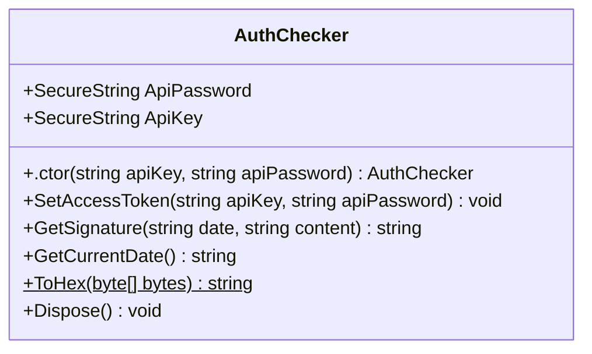

<div id="BaseConverter&lt;T&gt;-class-diagram"></div>

##### `BaseConverter<T>` class diagram

```mermaid
classDiagram
class BaseConverter<T>{
    -bool _quotes
    +List<KeyValuePair<T, string>> Mapping*
    +onverter(bool useQuotes) void
    +WriteJson(JsonWriter writer, object value, JsonSerializer serializer) void
    +ReadJson(JsonReader reader, Type objectType, object existingValue, JsonSerializer serializer) object
    +ReadString(string data) T
    +CanConvert(Type objectType) bool
    +GetValue(string value, out T result) bool
    +GetValue(T value) string
}

```

<div id="ClearJunctionClient-class-diagram"></div>

##### `ClearJunctionClient` class diagram

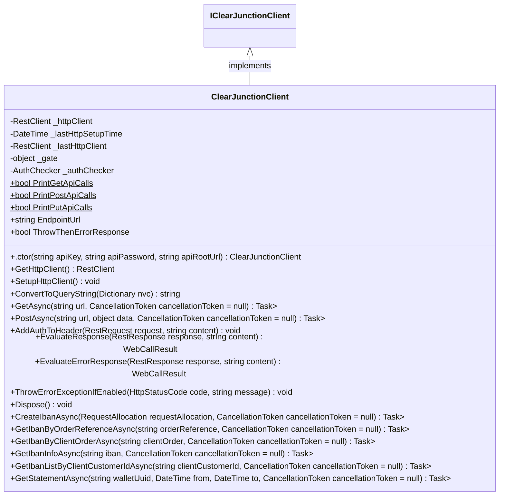

<div id="ClearJunctionException-class-diagram"></div>

##### `ClearJunctionException` class diagram

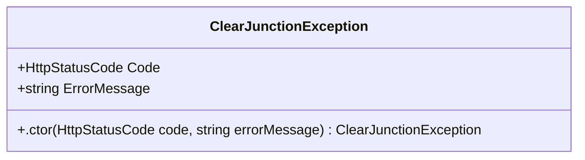

<div id="Extensions-class-diagram"></div>

##### `Extensions` class diagram

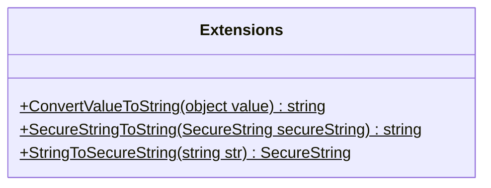

<div id="IClearJunctionClient-class-diagram"></div>

##### `IClearJunctionClient` class diagram

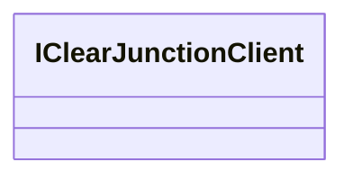

<div id="AllocationStatusConverter-class-diagram"></div>

##### `AllocationStatusConverter` class diagram

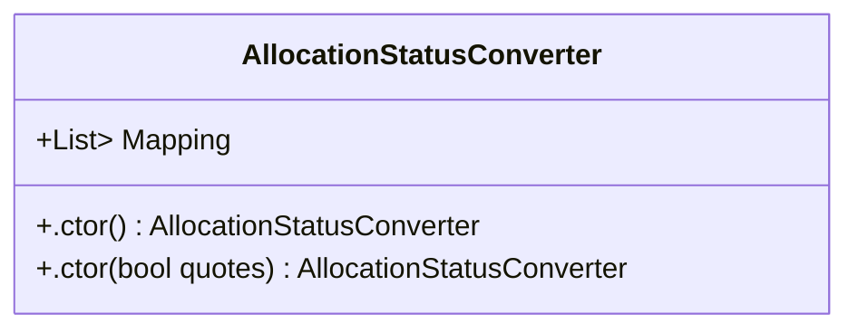

<div id="CustomDateTimeConverter-class-diagram"></div>

##### `CustomDateTimeConverter` class diagram

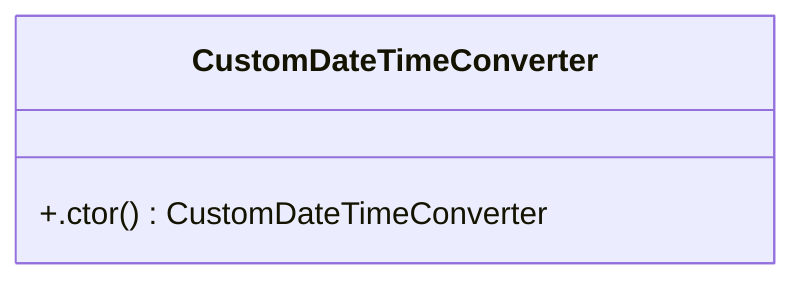

<div id="CallResult&lt;T&gt;-class-diagram"></div>

##### `CallResult<T>` class diagram

```mermaid
classDiagram
class CallResult<T>{
    +T Data
    +int Code
    +bool Success
    +ClearJunctionError Error
    +esult(T data, int code, ClearJunctionError? error) void
}

```

<div id="ClearJunctionError-class-diagram"></div>

##### `ClearJunctionError` class diagram

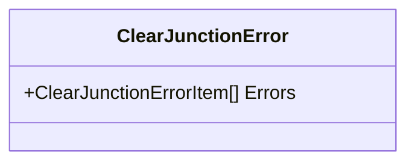

<div id="ClearJunctionErrorItem-class-diagram"></div>

##### `ClearJunctionErrorItem` class diagram

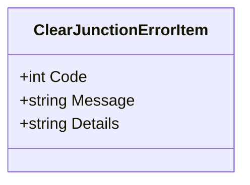

<div id="WebCallResult&lt;T&gt;-class-diagram"></div>

##### `WebCallResult<T>` class diagram

```mermaid
classDiagram
class WebCallResult<T>{
    +HttpStatusCode? ResponseStatusCode
    +Dictionary<string, string> ResponseHeaders
    +llResult(RestResponse response, T data, HttpStatusCode code, ClearJunctionError? error) void
    +llResult(RestResponse response, T result) void
}

```

<div id="Address-class-diagram"></div>

##### `Address` class diagram

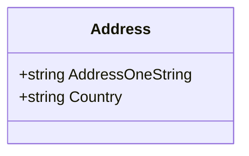

<div id="CustomFormat-class-diagram"></div>

##### `CustomFormat` class diagram

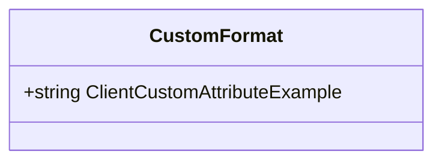

<div id="CustomInfo-class-diagram"></div>

##### `CustomInfo` class diagram

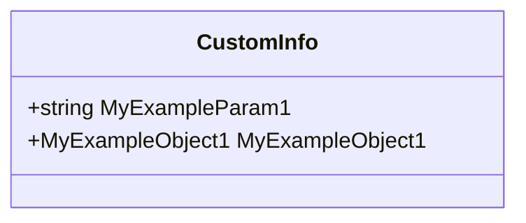

<div id="IntermediaryInstitution-class-diagram"></div>

##### `IntermediaryInstitution` class diagram

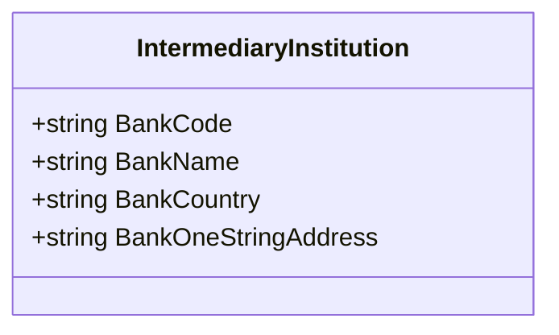

<div id="Message-class-diagram"></div>

##### `Message` class diagram

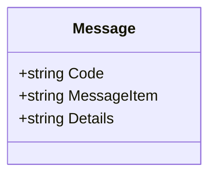

<div id="MyExampleObject1-class-diagram"></div>

##### `MyExampleObject1` class diagram

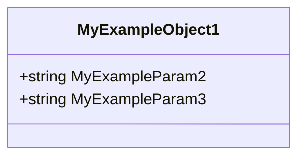

<div id="Payee-class-diagram"></div>

##### `Payee` class diagram

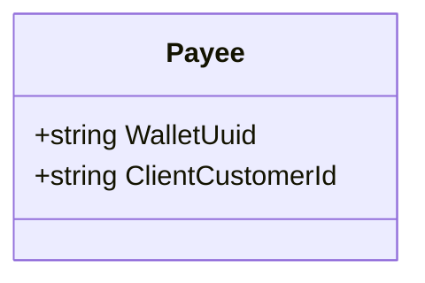

<div id="PayeeRequisite-class-diagram"></div>

##### `PayeeRequisite` class diagram

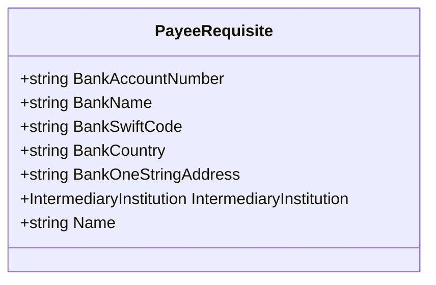

<div id="Payer-class-diagram"></div>

##### `Payer` class diagram

```mermaid
classDiagram
class Payer{
    +Address Address
}

```

<div id="PayerRequisite-class-diagram"></div>

##### `PayerRequisite` class diagram

```mermaid
classDiagram
class PayerRequisite{
    +string BankAccountNumber
    +string BankName
    +string BankSwiftCode
    +string BankCountry
    +string BankOneStringAddress
    +IntermediaryInstitution IntermediaryInstitution
    +string Name
}

```

<div id="PayinNotification-class-diagram"></div>

##### `PayinNotification` class diagram

```mermaid
classDiagram
class PayinNotification{
    +string ClientOrder
    +string OrderReference
    +DateTime OperTimestamp
    +List<Message> Messages
    +string Currency
    +double Amount
    +string OperationCurrency
    +double OperationAmount
    +string ProductName
    +string SiteAddress
    +string Label
    +CustomInfo CustomInfo
    +CustomFormat CustomFormat
    +object ValuedAt
    +string Status
    +string TransactionType
    +SubStatuses SubStatuses
    +Payer Payer
    +Payee Payee
    +SwiftPaymentDetails PaymentDetails
    +string MessageUuid
    +string Type
}

```

<div id="SubStatuses-class-diagram"></div>

##### `SubStatuses` class diagram

```mermaid
classDiagram
class SubStatuses{
    +string OperStatus
    +string ComplianceStatus
}

```

<div id="SwiftPaymentDetails-class-diagram"></div>

##### `SwiftPaymentDetails` class diagram

```mermaid
classDiagram
class SwiftPaymentDetails{
    +string PaymentMethod
    +string Description
    +PayeeRequisite PayeeRequisite
    +PayerRequisite PayerRequisite
}

```

<div id="Address-class-diagram"></div>

##### `Address` class diagram

```mermaid
classDiagram
class Address{
    +string Country
    +string Zip
    +string City
    +string Street
}

```

<div id="AllocationStatus-class-diagram"></div>

##### `AllocationStatus` class diagram

```mermaid
classDiagram
class AllocationStatus{
    -Accepted$
    -Pending$
    -Allocated$
    -Declined$
}

```

<div id="BusinessPartner-class-diagram"></div>

##### `BusinessPartner` class diagram

```mermaid
classDiagram
class BusinessPartner{
    +string Name
    +string IncorporationCountryCode
    +int PlannedTransfersQuantityMonth
    +int PlannedTransfersEurVolumeMonth
    +string BasisPartnership
}

```

<div id="ComplianceEvaluation-class-diagram"></div>

##### `ComplianceEvaluation` class diagram

```mermaid
classDiagram
class ComplianceEvaluation{
    +string AmlRiskLevel
    +string ReviewPeriodicity
    +string AppliedLimits
}

```

<div id="Corporate-class-diagram"></div>

##### `Corporate` class diagram

```mermaid
classDiagram
class Corporate{
    +string Email
    +string Name
    +string RegistrationNumber
    +string IncorporationCountry
    +Address Address
    +DateTime IncorporationDate
    +List<UltimateBeneficialOwner> UltimateBeneficialOwner
    +string TradingWebsite
    +int ExpectedTurnover
    +string BeneficialLegalEntity
    +OtherDetails OtherDetails
    +List<BusinessPartner> BusinessPartners
    +FundFlows FundFlows
    +ComplianceEvaluation ComplianceEvaluation
}

```

<div id="CustomerIbanList-class-diagram"></div>

##### `CustomerIbanList` class diagram

```mermaid
classDiagram
class CustomerIbanList{
    +string RequestReference
    +string ClientCustomerId
    +List<string> Ibans
}

```

<div id="CustomInfo-class-diagram"></div>

##### `CustomInfo` class diagram

```mermaid
classDiagram
class CustomInfo{
    +string MyExampleParam1
    +MyExampleObject1 MyExampleObject1
}

```

<div id="Document-class-diagram"></div>

##### `Document` class diagram

```mermaid
classDiagram
class Document{
    +string Type
    +string Number
    +string IssuedCountryCode
    +string IssuedBy
    +DateTime IssuedDate
    +DateTime ExpirationDate
}

```

<div id="FundFlows-class-diagram"></div>

##### `FundFlows` class diagram

```mermaid
classDiagram
class FundFlows{
    +int PlannedIncTransfersQuantity
    +int PlannedIncTransfersEurVolume
    +int PlannedOutTransfersQuantity
    +int PlannedOutTransfersEurVolume
}

```

<div id="IbanAllocation-class-diagram"></div>

##### `IbanAllocation` class diagram

```mermaid
classDiagram
class IbanAllocation{
    +string ClientOrder
    +string OrderReference
    +AllocationStatus Status
    +List<Message> Messages
    +string Iban
    +string RequestReference
}

```

<div id="IbanAllocationNotification-class-diagram"></div>

##### `IbanAllocationNotification` class diagram

```mermaid
classDiagram
class IbanAllocationNotification{
    +string ClientOrder
    +string OrderReference
    +AllocationStatus Status
    +string Iban
    +string MessageUuid
    +string Type
}

```

<div id="IbanInformation-class-diagram"></div>

##### `IbanInformation` class diagram

```mermaid
classDiagram
class IbanInformation{
    +string RequestReference
    +string WalletUuid
    +Registrant Registrant
    +DateTime IbanCreatedAt
}

```

<div id="IbanRegistrant-class-diagram"></div>

##### `IbanRegistrant` class diagram

```mermaid
classDiagram
class IbanRegistrant{
    +string ClientCustomerId
    +string Name
}

```

<div id="Individual-class-diagram"></div>

##### `Individual` class diagram

```mermaid
classDiagram
class Individual{
    +string Phone
    +string Email
    +DateTime BirthDate
    +string BirthPlace
    +Address Address
    +Document Document
    +string LastName
    +string FirstName
    +string MiddleName
}

```

<div id="Message-class-diagram"></div>

##### `Message` class diagram

```mermaid
classDiagram
class Message{
    +string Code
    +string MessageItem
    +string Details
}

```

<div id="MyExampleObject1-class-diagram"></div>

##### `MyExampleObject1` class diagram

```mermaid
classDiagram
class MyExampleObject1{
    +string MyExampleParam2
    +string MyExampleParam3
}

```

<div id="OtherDetails-class-diagram"></div>

##### `OtherDetails` class diagram

```mermaid
classDiagram
class OtherDetails{
    +string BusinessActivity
    +string RelevantInformation
    +string NegativeInformation
}

```

<div id="Registrant-class-diagram"></div>

##### `Registrant` class diagram

```mermaid
classDiagram
class Registrant{
    +string ClientCustomerId
    +Individual Individual
    +Corporate Corporate
}

```

<div id="RequestAllocation-class-diagram"></div>

##### `RequestAllocation` class diagram

```mermaid
classDiagram
class RequestAllocation{
    +string ClientOrder
    +string PostbackUrl
    +string WalletUuid
    +string IbansGroup
    +string IbanCountry
    +Registrant Registrant
    +CustomInfo CustomInfo
}

```

<div id="RequestAllocationResponse-class-diagram"></div>

##### `RequestAllocationResponse` class diagram

```mermaid
classDiagram
class RequestAllocationResponse{
    +string RequestReference
    +string ClientOrder
    +string OrderReference
    +AllocationStatus Status
}

```

<div id="UltimateBeneficialOwner-class-diagram"></div>

##### `UltimateBeneficialOwner` class diagram

```mermaid
classDiagram
class UltimateBeneficialOwner{
    +string LastName
    +string FirstName
    +DateTime BirthDate
    +int Ownership
    +Document Document
    +bool BeneficialOwnerPep
    +string BeneficialOwnerPepDetails
    +bool UsaTaxResidency
    +string GiinNumber
}

```

<div id="GetStatementRequest-class-diagram"></div>

##### `GetStatementRequest` class diagram

```mermaid
classDiagram
class GetStatementRequest{
    +string WalletUuid
    +string DateFrom
    +string DateTo
}

```

<div id="Statement-class-diagram"></div>

##### `Statement` class diagram

```mermaid
classDiagram
class Statement{
    +string RequestReference
    +IReadOnlyCollection<StatementItem> Statements
}

```

<div id="StatementItem-class-diagram"></div>

##### `StatementItem` class diagram

```mermaid
classDiagram
class StatementItem{
    +string Currency
    +decimal BalanceIn
    +decimal CountIn
    +decimal TurnIn
    +decimal CountOut
    +decimal TurnOut
    +decimal BalanceOut
    +IReadOnlyCollection<StatementTransaction> Transactions
}

```

<div id="StatementTransaction-class-diagram"></div>

##### `StatementTransaction` class diagram

```mermaid
classDiagram
class StatementTransaction{
    +string ClientOrder
    +string OrderReference
    +DateTime? ValuedAt
    +decimal Amount
    +decimal FeeAmount
}

```

<div id="Program-class-diagram"></div>

##### `Program` class diagram

```mermaid
classDiagram
class Program{
    +Main(string[] args)$ Task
}

```

<div id="RequestX-class-diagram"></div>

##### `RequestX` class diagram

```mermaid
classDiagram
class RequestX{
    +string walletUuid
    +string dateFrom
    +string dateTo
}

```

*This file is maintained by a bot.*

<!-- markdownlint-restore -->
