<!-- markdownlint-capture -->
<!-- markdownlint-disable -->

# Code Metrics

This file is dynamically maintained by a bot, *please do not* edit this by hand. It represents various [code metrics](https://aka.ms/dotnet/code-metrics), such as cyclomatic complexity, maintainability index, and so on.

<div id='bitgo'></div>

## BitGo :question:

The *BitGo.csproj* project file contains:

- 0 namespaces.
- 0 named types.
- 0 total lines of source code.
- Approximately 0 lines of executable code.
- The highest cyclomatic complexity is 0 :question:.

<a href="#bitgo">:top: back to BitGo</a>

<div id='myjetwallet-circle'></div>

## MyJetWallet.Circle :heavy_check_mark:

The *MyJetWallet.Circle.csproj* project file contains:

- 14 namespaces.
- 92 named types.
- 3,333 total lines of source code.
- Approximately 1,413 lines of executable code.
- The highest cyclomatic complexity is 6 :heavy_check_mark:.

<details>
<summary>
  <strong id="myjetwallet-circle-base">
    MyJetWallet.Circle.Base :heavy_check_mark:
  </strong>
</summary>
<br>

The `MyJetWallet.Circle.Base` namespace contains 1 named types.

- 1 named types.
- 67 total lines of source code.
- Approximately 20 lines of executable code.
- The highest cyclomatic complexity is 3 :heavy_check_mark:.

<details>
<summary>
  <strong id="baseconvertert">
    BaseConverter&lt;T&gt; :heavy_check_mark:
  </strong>
</summary>
<br>

- The `BaseConverter<T>` contains 9 members.
- 64 total lines of source code.
- Approximately 20 lines of executable code.
- The highest cyclomatic complexity is 3 :heavy_check_mark:.

| Member kind | Line number | Maintainability index | Cyclomatic complexity | Depth of inheritance | Class coupling | Lines of source / executable code |
| :-: | :-: | :-: | :-: | :-: | :-: | :-: |
| Field | <a href='https://github.com/MyJetWallet/MyJetWallet.Circle/blob/master/src/Circle/Base/BaseConverter.cs#L12' title='bool BaseConverter<T>._quotes'>12</a> | 100 | 0 :heavy_check_mark: | 0 | 0 | 1 / 0 |
| Method | <a href='https://github.com/MyJetWallet/MyJetWallet.Circle/blob/master/src/Circle/Base/BaseConverter.cs#L14' title='BaseConverter<T>.BaseConverter(bool useQuotes)'>14</a> | 96 | 1 :heavy_check_mark: | 0 | 0 | 4 / 1 |
| Method | <a href='https://github.com/MyJetWallet/MyJetWallet.Circle/blob/master/src/Circle/Base/BaseConverter.cs#L48' title='bool BaseConverter<T>.CanConvert(Type objectType)'>48</a> | 91 | 2 :heavy_check_mark: | 0 | 3 | 5 / 1 |
| Method | <a href='https://github.com/MyJetWallet/MyJetWallet.Circle/blob/master/src/Circle/Base/BaseConverter.cs#L54' title='bool BaseConverter<T>.GetValue(string value, out T result)'>54</a> | 70 | 2 :heavy_check_mark: | 0 | 3 | 13 / 7 |
| Method | <a href='https://github.com/MyJetWallet/MyJetWallet.Circle/blob/master/src/Circle/Base/BaseConverter.cs#L68' title='string BaseConverter<T>.GetValue(T value)'>68</a> | 87 | 1 :heavy_check_mark: | 0 | 3 | 4 / 2 |
| Property | <a href='https://github.com/MyJetWallet/MyJetWallet.Circle/blob/master/src/Circle/Base/BaseConverter.cs#L11' title='List<KeyValuePair<T, string>> BaseConverter<T>.Mapping'>11</a> | 100 | 1 :heavy_check_mark: | 0 | 2 | 1 / 0 |
| Method | <a href='https://github.com/MyJetWallet/MyJetWallet.Circle/blob/master/src/Circle/Base/BaseConverter.cs#L28' title='object BaseConverter<T>.ReadJson(JsonReader reader, Type objectType, object existingValue, JsonSerializer serializer)'>28</a> | 74 | 3 :heavy_check_mark: | 0 | 5 | 14 / 5 |
| Method | <a href='https://github.com/MyJetWallet/MyJetWallet.Circle/blob/master/src/Circle/Base/BaseConverter.cs#L43' title='T BaseConverter<T>.ReadString(string data)'>43</a> | 86 | 1 :heavy_check_mark: | 0 | 3 | 4 / 2 |
| Method | <a href='https://github.com/MyJetWallet/MyJetWallet.Circle/blob/master/src/Circle/Base/BaseConverter.cs#L19' title='void BaseConverter<T>.WriteJson(JsonWriter writer, object value, JsonSerializer serializer)'>19</a> | 83 | 2 :heavy_check_mark: | 0 | 3 | 8 / 2 |

<a href="#BaseConverter&lt;T&gt;-class-diagram">:link: to `BaseConverter&lt;T&gt;` class diagram</a>

<a href="#myjetwallet-circle-base">:top: back to MyJetWallet.Circle.Base</a>

</details>

</details>

<details>
<summary>
  <strong id="myjetwallet-circle-models-businessaccounts">
    MyJetWallet.Circle.Models.BusinessAccounts :heavy_check_mark:
  </strong>
</summary>
<br>

The `MyJetWallet.Circle.Models.BusinessAccounts` namespace contains 11 named types.

- 11 named types.
- 195 total lines of source code.
- Approximately 166 lines of executable code.
- The highest cyclomatic complexity is 2 :heavy_check_mark:.

<details>
<summary>
  <strong id="balanceinfo">
    BalanceInfo :heavy_check_mark:
  </strong>
</summary>
<br>

- The `BalanceInfo` contains 2 members.
- 9 total lines of source code.
- Approximately 8 lines of executable code.
- The highest cyclomatic complexity is 2 :heavy_check_mark:.

| Member kind | Line number | Maintainability index | Cyclomatic complexity | Depth of inheritance | Class coupling | Lines of source / executable code |
| :-: | :-: | :-: | :-: | :-: | :-: | :-: |
| Property | <a href='https://github.com/MyJetWallet/MyJetWallet.Circle/blob/master/src/Circle/Models/BusinessAccounts/BalanceInfo.cs#L12' title='CircleAmount[] BalanceInfo.Available'>12</a> | 100 | 2 :heavy_check_mark: | 0 | 4 | 2 / 4 |
| Property | <a href='https://github.com/MyJetWallet/MyJetWallet.Circle/blob/master/src/Circle/Models/BusinessAccounts/BalanceInfo.cs#L15' title='CircleAmount[] BalanceInfo.Unsettled'>15</a> | 100 | 2 :heavy_check_mark: | 0 | 4 | 2 / 4 |

<a href="#BalanceInfo-class-diagram">:link: to `BalanceInfo` class diagram</a>

<a href="#myjetwallet-circle-models-businessaccounts">:top: back to MyJetWallet.Circle.Models.BusinessAccounts</a>

</details>

<details>
<summary>
  <strong id="configurationinfo">
    ConfigurationInfo :heavy_check_mark:
  </strong>
</summary>
<br>

- The `ConfigurationInfo` contains 1 members.
- 6 total lines of source code.
- Approximately 4 lines of executable code.
- The highest cyclomatic complexity is 2 :heavy_check_mark:.

| Member kind | Line number | Maintainability index | Cyclomatic complexity | Depth of inheritance | Class coupling | Lines of source / executable code |
| :-: | :-: | :-: | :-: | :-: | :-: | :-: |
| Property | <a href='https://github.com/MyJetWallet/MyJetWallet.Circle/blob/master/src/Circle/Models/BusinessAccounts/ConfigurationInfo.cs#L12' title='ConfigurationPaymentsInfo ConfigurationInfo.Payments'>12</a> | 100 | 2 :heavy_check_mark: | 0 | 4 | 2 / 4 |

<a href="#ConfigurationInfo-class-diagram">:link: to `ConfigurationInfo` class diagram</a>

<a href="#myjetwallet-circle-models-businessaccounts">:top: back to MyJetWallet.Circle.Models.BusinessAccounts</a>

</details>

<details>
<summary>
  <strong id="configurationpaymentsinfo">
    ConfigurationPaymentsInfo :heavy_check_mark:
  </strong>
</summary>
<br>

- The `ConfigurationPaymentsInfo` contains 1 members.
- 6 total lines of source code.
- Approximately 4 lines of executable code.
- The highest cyclomatic complexity is 2 :heavy_check_mark:.

| Member kind | Line number | Maintainability index | Cyclomatic complexity | Depth of inheritance | Class coupling | Lines of source / executable code |
| :-: | :-: | :-: | :-: | :-: | :-: | :-: |
| Property | <a href='https://github.com/MyJetWallet/MyJetWallet.Circle/blob/master/src/Circle/Models/BusinessAccounts/ConfigurationPaymentsInfo.cs#L11' title='string ConfigurationPaymentsInfo.MasterWalletId'>11</a> | 100 | 2 :heavy_check_mark: | 0 | 3 | 2 / 4 |

<a href="#ConfigurationPaymentsInfo-class-diagram">:link: to `ConfigurationPaymentsInfo` class diagram</a>

<a href="#myjetwallet-circle-models-businessaccounts">:top: back to MyJetWallet.Circle.Models.BusinessAccounts</a>

</details>

<details>
<summary>
  <strong id="depositaddressinfo">
    DepositAddressInfo :heavy_check_mark:
  </strong>
</summary>
<br>

- The `DepositAddressInfo` contains 4 members.
- 15 total lines of source code.
- Approximately 16 lines of executable code.
- The highest cyclomatic complexity is 2 :heavy_check_mark:.

| Member kind | Line number | Maintainability index | Cyclomatic complexity | Depth of inheritance | Class coupling | Lines of source / executable code |
| :-: | :-: | :-: | :-: | :-: | :-: | :-: |
| Property | <a href='https://github.com/MyJetWallet/MyJetWallet.Circle/blob/master/src/Circle/Models/BusinessAccounts/DepositAddressInfo.cs#L10' title='string DepositAddressInfo.Address'>10</a> | 100 | 2 :heavy_check_mark: | 0 | 3 | 2 / 4 |
| Property | <a href='https://github.com/MyJetWallet/MyJetWallet.Circle/blob/master/src/Circle/Models/BusinessAccounts/DepositAddressInfo.cs#L13' title='string DepositAddressInfo.AddressTag'>13</a> | 100 | 2 :heavy_check_mark: | 0 | 3 | 2 / 4 |
| Property | <a href='https://github.com/MyJetWallet/MyJetWallet.Circle/blob/master/src/Circle/Models/BusinessAccounts/DepositAddressInfo.cs#L19' title='string DepositAddressInfo.Chain'>19</a> | 100 | 2 :heavy_check_mark: | 0 | 3 | 2 / 4 |
| Property | <a href='https://github.com/MyJetWallet/MyJetWallet.Circle/blob/master/src/Circle/Models/BusinessAccounts/DepositAddressInfo.cs#L16' title='string DepositAddressInfo.Currency'>16</a> | 100 | 2 :heavy_check_mark: | 0 | 3 | 2 / 4 |

<a href="#DepositAddressInfo-class-diagram">:link: to `DepositAddressInfo` class diagram</a>

<a href="#myjetwallet-circle-models-businessaccounts">:top: back to MyJetWallet.Circle.Models.BusinessAccounts</a>

</details>

<details>
<summary>
  <strong id="depositdestination">
    DepositDestination :heavy_check_mark:
  </strong>
</summary>
<br>

- The `DepositDestination` contains 2 members.
- 9 total lines of source code.
- Approximately 8 lines of executable code.
- The highest cyclomatic complexity is 2 :heavy_check_mark:.

| Member kind | Line number | Maintainability index | Cyclomatic complexity | Depth of inheritance | Class coupling | Lines of source / executable code |
| :-: | :-: | :-: | :-: | :-: | :-: | :-: |
| Property | <a href='https://github.com/MyJetWallet/MyJetWallet.Circle/blob/master/src/Circle/Models/BusinessAccounts/DepositDestination.cs#L10' title='string DepositDestination.Id'>10</a> | 100 | 2 :heavy_check_mark: | 0 | 3 | 2 / 4 |
| Property | <a href='https://github.com/MyJetWallet/MyJetWallet.Circle/blob/master/src/Circle/Models/BusinessAccounts/DepositDestination.cs#L13' title='string DepositDestination.Type'>13</a> | 100 | 2 :heavy_check_mark: | 0 | 3 | 2 / 4 |

<a href="#DepositDestination-class-diagram">:link: to `DepositDestination` class diagram</a>

<a href="#myjetwallet-circle-models-businessaccounts">:top: back to MyJetWallet.Circle.Models.BusinessAccounts</a>

</details>

<details>
<summary>
  <strong id="depositinfo">
    DepositInfo :heavy_check_mark:
  </strong>
</summary>
<br>

- The `DepositInfo` contains 8 members.
- 29 total lines of source code.
- Approximately 34 lines of executable code.
- The highest cyclomatic complexity is 2 :heavy_check_mark:.

| Member kind | Line number | Maintainability index | Cyclomatic complexity | Depth of inheritance | Class coupling | Lines of source / executable code |
| :-: | :-: | :-: | :-: | :-: | :-: | :-: |
| Property | <a href='https://github.com/MyJetWallet/MyJetWallet.Circle/blob/master/src/Circle/Models/BusinessAccounts/DepositInfo.cs#L21' title='CircleAmount DepositInfo.Amount'>21</a> | 100 | 2 :heavy_check_mark: | 0 | 4 | 2 / 4 |
| Property | <a href='https://github.com/MyJetWallet/MyJetWallet.Circle/blob/master/src/Circle/Models/BusinessAccounts/DepositInfo.cs#L31' title='DateTime DepositInfo.CreateDate'>31</a> | 100 | 2 :heavy_check_mark: | 0 | 4 | 2 / 4 |
| Property | <a href='https://github.com/MyJetWallet/MyJetWallet.Circle/blob/master/src/Circle/Models/BusinessAccounts/DepositInfo.cs#L18' title='DepositDestination DepositInfo.Destination'>18</a> | 100 | 2 :heavy_check_mark: | 0 | 4 | 2 / 4 |
| Property | <a href='https://github.com/MyJetWallet/MyJetWallet.Circle/blob/master/src/Circle/Models/BusinessAccounts/DepositInfo.cs#L24' title='CircleAmount DepositInfo.Fee'>24</a> | 100 | 2 :heavy_check_mark: | 0 | 4 | 2 / 4 |
| Property | <a href='https://github.com/MyJetWallet/MyJetWallet.Circle/blob/master/src/Circle/Models/BusinessAccounts/DepositInfo.cs#L12' title='string DepositInfo.Id'>12</a> | 100 | 2 :heavy_check_mark: | 0 | 3 | 2 / 4 |
| Property | <a href='https://github.com/MyJetWallet/MyJetWallet.Circle/blob/master/src/Circle/Models/BusinessAccounts/DepositInfo.cs#L15' title='RiskEvaluation DepositInfo.RiskEvaluation'>15</a> | 100 | 2 :heavy_check_mark: | 0 | 4 | 2 / 4 |
| Property | <a href='https://github.com/MyJetWallet/MyJetWallet.Circle/blob/master/src/Circle/Models/BusinessAccounts/DepositInfo.cs#L28' title='DepositStatus DepositInfo.Status'>28</a> | 100 | 2 :heavy_check_mark: | 0 | 6 | 3 / 6 |
| Property | <a href='https://github.com/MyJetWallet/MyJetWallet.Circle/blob/master/src/Circle/Models/BusinessAccounts/DepositInfo.cs#L34' title='DateTime DepositInfo.UpdateDate'>34</a> | 100 | 2 :heavy_check_mark: | 0 | 4 | 2 / 4 |

<a href="#DepositInfo-class-diagram">:link: to `DepositInfo` class diagram</a>

<a href="#myjetwallet-circle-models-businessaccounts">:top: back to MyJetWallet.Circle.Models.BusinessAccounts</a>

</details>

<details>
<summary>
  <strong id="depositstatus">
    DepositStatus :heavy_check_mark:
  </strong>
</summary>
<br>

- The `DepositStatus` contains 3 members.
- 6 total lines of source code.
- Approximately 0 lines of executable code.
- The highest cyclomatic complexity is 0 :heavy_check_mark:.

| Member kind | Line number | Maintainability index | Cyclomatic complexity | Depth of inheritance | Class coupling | Lines of source / executable code |
| :-: | :-: | :-: | :-: | :-: | :-: | :-: |
| Field | <a href='https://github.com/MyJetWallet/MyJetWallet.Circle/blob/master/src/Circle/Models/BusinessAccounts/DepositStatus.cs#L6' title='DepositStatus.Complete'>6</a> | 100 | 0 :heavy_check_mark: | 0 | 0 | 1 / 0 |
| Field | <a href='https://github.com/MyJetWallet/MyJetWallet.Circle/blob/master/src/Circle/Models/BusinessAccounts/DepositStatus.cs#L7' title='DepositStatus.Failed'>7</a> | 100 | 0 :heavy_check_mark: | 0 | 0 | 1 / 0 |
| Field | <a href='https://github.com/MyJetWallet/MyJetWallet.Circle/blob/master/src/Circle/Models/BusinessAccounts/DepositStatus.cs#L5' title='DepositStatus.Pending'>5</a> | 100 | 0 :heavy_check_mark: | 0 | 0 | 1 / 0 |

<a href="#DepositStatus-class-diagram">:link: to `DepositStatus` class diagram</a>

<a href="#myjetwallet-circle-models-businessaccounts">:top: back to MyJetWallet.Circle.Models.BusinessAccounts</a>

</details>

<details>
<summary>
  <strong id="recipientaddressinfo">
    RecipientAddressInfo :heavy_check_mark:
  </strong>
</summary>
<br>

- The `RecipientAddressInfo` contains 6 members.
- 21 total lines of source code.
- Approximately 24 lines of executable code.
- The highest cyclomatic complexity is 2 :heavy_check_mark:.

| Member kind | Line number | Maintainability index | Cyclomatic complexity | Depth of inheritance | Class coupling | Lines of source / executable code |
| :-: | :-: | :-: | :-: | :-: | :-: | :-: |
| Property | <a href='https://github.com/MyJetWallet/MyJetWallet.Circle/blob/master/src/Circle/Models/BusinessAccounts/RecipientAddressInfo.cs#L10' title='string RecipientAddressInfo.Address'>10</a> | 100 | 2 :heavy_check_mark: | 0 | 3 | 2 / 4 |
| Property | <a href='https://github.com/MyJetWallet/MyJetWallet.Circle/blob/master/src/Circle/Models/BusinessAccounts/RecipientAddressInfo.cs#L13' title='string RecipientAddressInfo.AddressTag'>13</a> | 100 | 2 :heavy_check_mark: | 0 | 3 | 2 / 4 |
| Property | <a href='https://github.com/MyJetWallet/MyJetWallet.Circle/blob/master/src/Circle/Models/BusinessAccounts/RecipientAddressInfo.cs#L19' title='string RecipientAddressInfo.Chain'>19</a> | 100 | 2 :heavy_check_mark: | 0 | 3 | 2 / 4 |
| Property | <a href='https://github.com/MyJetWallet/MyJetWallet.Circle/blob/master/src/Circle/Models/BusinessAccounts/RecipientAddressInfo.cs#L16' title='string RecipientAddressInfo.Currency'>16</a> | 100 | 2 :heavy_check_mark: | 0 | 3 | 2 / 4 |
| Property | <a href='https://github.com/MyJetWallet/MyJetWallet.Circle/blob/master/src/Circle/Models/BusinessAccounts/RecipientAddressInfo.cs#L25' title='string RecipientAddressInfo.Description'>25</a> | 100 | 2 :heavy_check_mark: | 0 | 3 | 2 / 4 |
| Property | <a href='https://github.com/MyJetWallet/MyJetWallet.Circle/blob/master/src/Circle/Models/BusinessAccounts/RecipientAddressInfo.cs#L22' title='string RecipientAddressInfo.Id'>22</a> | 100 | 2 :heavy_check_mark: | 0 | 3 | 2 / 4 |

<a href="#RecipientAddressInfo-class-diagram">:link: to `RecipientAddressInfo` class diagram</a>

<a href="#myjetwallet-circle-models-businessaccounts">:top: back to MyJetWallet.Circle.Models.BusinessAccounts</a>

</details>

<details>
<summary>
  <strong id="transferdestination">
    TransferDestination :heavy_check_mark:
  </strong>
</summary>
<br>

- The `TransferDestination` contains 5 members.
- 18 total lines of source code.
- Approximately 20 lines of executable code.
- The highest cyclomatic complexity is 2 :heavy_check_mark:.

| Member kind | Line number | Maintainability index | Cyclomatic complexity | Depth of inheritance | Class coupling | Lines of source / executable code |
| :-: | :-: | :-: | :-: | :-: | :-: | :-: |
| Property | <a href='https://github.com/MyJetWallet/MyJetWallet.Circle/blob/master/src/Circle/Models/BusinessAccounts/TransferDestination.cs#L16' title='string TransferDestination.Address'>16</a> | 100 | 2 :heavy_check_mark: | 0 | 3 | 2 / 4 |
| Property | <a href='https://github.com/MyJetWallet/MyJetWallet.Circle/blob/master/src/Circle/Models/BusinessAccounts/TransferDestination.cs#L19' title='string TransferDestination.AddressTag'>19</a> | 100 | 2 :heavy_check_mark: | 0 | 3 | 2 / 4 |
| Property | <a href='https://github.com/MyJetWallet/MyJetWallet.Circle/blob/master/src/Circle/Models/BusinessAccounts/TransferDestination.cs#L22' title='string TransferDestination.Chain'>22</a> | 100 | 2 :heavy_check_mark: | 0 | 3 | 2 / 4 |
| Property | <a href='https://github.com/MyJetWallet/MyJetWallet.Circle/blob/master/src/Circle/Models/BusinessAccounts/TransferDestination.cs#L10' title='string TransferDestination.Id'>10</a> | 100 | 2 :heavy_check_mark: | 0 | 3 | 2 / 4 |
| Property | <a href='https://github.com/MyJetWallet/MyJetWallet.Circle/blob/master/src/Circle/Models/BusinessAccounts/TransferDestination.cs#L13' title='string TransferDestination.Type'>13</a> | 100 | 2 :heavy_check_mark: | 0 | 3 | 2 / 4 |

<a href="#TransferDestination-class-diagram">:link: to `TransferDestination` class diagram</a>

<a href="#myjetwallet-circle-models-businessaccounts">:top: back to MyJetWallet.Circle.Models.BusinessAccounts</a>

</details>

<details>
<summary>
  <strong id="transferinfo">
    TransferInfo :heavy_check_mark:
  </strong>
</summary>
<br>

- The `TransferInfo` contains 8 members.
- 30 total lines of source code.
- Approximately 36 lines of executable code.
- The highest cyclomatic complexity is 2 :heavy_check_mark:.

| Member kind | Line number | Maintainability index | Cyclomatic complexity | Depth of inheritance | Class coupling | Lines of source / executable code |
| :-: | :-: | :-: | :-: | :-: | :-: | :-: |
| Property | <a href='https://github.com/MyJetWallet/MyJetWallet.Circle/blob/master/src/Circle/Models/BusinessAccounts/TransferInfo.cs#L25' title='CircleAmount TransferInfo.Amount'>25</a> | 100 | 2 :heavy_check_mark: | 0 | 4 | 2 / 4 |
| Property | <a href='https://github.com/MyJetWallet/MyJetWallet.Circle/blob/master/src/Circle/Models/BusinessAccounts/TransferInfo.cs#L35' title='DateTime TransferInfo.CreateDate'>35</a> | 100 | 2 :heavy_check_mark: | 0 | 4 | 2 / 4 |
| Property | <a href='https://github.com/MyJetWallet/MyJetWallet.Circle/blob/master/src/Circle/Models/BusinessAccounts/TransferInfo.cs#L22' title='TransferDestination TransferInfo.Destination'>22</a> | 100 | 2 :heavy_check_mark: | 0 | 4 | 2 / 4 |
| Property | <a href='https://github.com/MyJetWallet/MyJetWallet.Circle/blob/master/src/Circle/Models/BusinessAccounts/TransferInfo.cs#L39' title='TransferErrorCode? TransferInfo.ErrorCode'>39</a> | 100 | 2 :heavy_check_mark: | 0 | 7 | 3 / 6 |
| Property | <a href='https://github.com/MyJetWallet/MyJetWallet.Circle/blob/master/src/Circle/Models/BusinessAccounts/TransferInfo.cs#L16' title='string TransferInfo.Id'>16</a> | 100 | 2 :heavy_check_mark: | 0 | 3 | 2 / 4 |
| Property | <a href='https://github.com/MyJetWallet/MyJetWallet.Circle/blob/master/src/Circle/Models/BusinessAccounts/TransferInfo.cs#L19' title='TransferSource TransferInfo.Source'>19</a> | 100 | 2 :heavy_check_mark: | 0 | 4 | 2 / 4 |
| Property | <a href='https://github.com/MyJetWallet/MyJetWallet.Circle/blob/master/src/Circle/Models/BusinessAccounts/TransferInfo.cs#L32' title='TransferStatus TransferInfo.Status'>32</a> | 100 | 2 :heavy_check_mark: | 0 | 6 | 3 / 6 |
| Property | <a href='https://github.com/MyJetWallet/MyJetWallet.Circle/blob/master/src/Circle/Models/BusinessAccounts/TransferInfo.cs#L28' title='string TransferInfo.TransactionHash'>28</a> | 100 | 2 :heavy_check_mark: | 0 | 3 | 2 / 4 |

<a href="#TransferInfo-class-diagram">:link: to `TransferInfo` class diagram</a>

<a href="#myjetwallet-circle-models-businessaccounts">:top: back to MyJetWallet.Circle.Models.BusinessAccounts</a>

</details>

<details>
<summary>
  <strong id="transfersource">
    TransferSource :heavy_check_mark:
  </strong>
</summary>
<br>

- The `TransferSource` contains 3 members.
- 13 total lines of source code.
- Approximately 12 lines of executable code.
- The highest cyclomatic complexity is 2 :heavy_check_mark:.

| Member kind | Line number | Maintainability index | Cyclomatic complexity | Depth of inheritance | Class coupling | Lines of source / executable code |
| :-: | :-: | :-: | :-: | :-: | :-: | :-: |
| Property | <a href='https://github.com/MyJetWallet/MyJetWallet.Circle/blob/master/src/Circle/Models/BusinessAccounts/TransferSource.cs#L14' title='string TransferSource.Chain'>14</a> | 100 | 2 :heavy_check_mark: | 0 | 3 | 2 / 4 |
| Property | <a href='https://github.com/MyJetWallet/MyJetWallet.Circle/blob/master/src/Circle/Models/BusinessAccounts/TransferSource.cs#L17' title='string TransferSource.Id'>17</a> | 100 | 2 :heavy_check_mark: | 0 | 3 | 2 / 4 |
| Property | <a href='https://github.com/MyJetWallet/MyJetWallet.Circle/blob/master/src/Circle/Models/BusinessAccounts/TransferSource.cs#L11' title='string TransferSource.Type'>11</a> | 100 | 2 :heavy_check_mark: | 0 | 3 | 2 / 4 |

<a href="#TransferSource-class-diagram">:link: to `TransferSource` class diagram</a>

<a href="#myjetwallet-circle-models-businessaccounts">:top: back to MyJetWallet.Circle.Models.BusinessAccounts</a>

</details>

</details>

<details>
<summary>
  <strong id="myjetwallet-circle-models-cards">
    MyJetWallet.Circle.Models.Cards :heavy_check_mark:
  </strong>
</summary>
<br>

The `MyJetWallet.Circle.Models.Cards` namespace contains 8 named types.

- 8 named types.
- 169 total lines of source code.
- Approximately 132 lines of executable code.
- The highest cyclomatic complexity is 2 :heavy_check_mark:.

<details>
<summary>
  <strong id="cardbillingdetails">
    CardBillingDetails :heavy_check_mark:
  </strong>
</summary>
<br>

- The `CardBillingDetails` contains 7 members.
- 24 total lines of source code.
- Approximately 28 lines of executable code.
- The highest cyclomatic complexity is 2 :heavy_check_mark:.

| Member kind | Line number | Maintainability index | Cyclomatic complexity | Depth of inheritance | Class coupling | Lines of source / executable code |
| :-: | :-: | :-: | :-: | :-: | :-: | :-: |
| Property | <a href='https://github.com/MyJetWallet/MyJetWallet.Circle/blob/master/src/Circle/Models/Cards/CardBillingDetails.cs#L13' title='string CardBillingDetails.City'>13</a> | 100 | 2 :heavy_check_mark: | 0 | 3 | 2 / 4 |
| Property | <a href='https://github.com/MyJetWallet/MyJetWallet.Circle/blob/master/src/Circle/Models/Cards/CardBillingDetails.cs#L16' title='string CardBillingDetails.Country'>16</a> | 100 | 2 :heavy_check_mark: | 0 | 3 | 2 / 4 |
| Property | <a href='https://github.com/MyJetWallet/MyJetWallet.Circle/blob/master/src/Circle/Models/Cards/CardBillingDetails.cs#L25' title='string CardBillingDetails.District'>25</a> | 100 | 2 :heavy_check_mark: | 0 | 3 | 2 / 4 |
| Property | <a href='https://github.com/MyJetWallet/MyJetWallet.Circle/blob/master/src/Circle/Models/Cards/CardBillingDetails.cs#L19' title='string CardBillingDetails.Line1'>19</a> | 100 | 2 :heavy_check_mark: | 0 | 3 | 2 / 4 |
| Property | <a href='https://github.com/MyJetWallet/MyJetWallet.Circle/blob/master/src/Circle/Models/Cards/CardBillingDetails.cs#L22' title='string CardBillingDetails.Line2'>22</a> | 100 | 2 :heavy_check_mark: | 0 | 3 | 2 / 4 |
| Property | <a href='https://github.com/MyJetWallet/MyJetWallet.Circle/blob/master/src/Circle/Models/Cards/CardBillingDetails.cs#L10' title='string CardBillingDetails.Name'>10</a> | 100 | 2 :heavy_check_mark: | 0 | 3 | 2 / 4 |
| Property | <a href='https://github.com/MyJetWallet/MyJetWallet.Circle/blob/master/src/Circle/Models/Cards/CardBillingDetails.cs#L28' title='string CardBillingDetails.PostalCode'>28</a> | 100 | 2 :heavy_check_mark: | 0 | 3 | 2 / 4 |

<a href="#CardBillingDetails-class-diagram">:link: to `CardBillingDetails` class diagram</a>

<a href="#myjetwallet-circle-models-cards">:top: back to MyJetWallet.Circle.Models.Cards</a>

</details>

<details>
<summary>
  <strong id="cardfundingtype">
    CardFundingType :heavy_check_mark:
  </strong>
</summary>
<br>

- The `CardFundingType` contains 4 members.
- 8 total lines of source code.
- Approximately 0 lines of executable code.
- The highest cyclomatic complexity is 0 :heavy_check_mark:.

| Member kind | Line number | Maintainability index | Cyclomatic complexity | Depth of inheritance | Class coupling | Lines of source / executable code |
| :-: | :-: | :-: | :-: | :-: | :-: | :-: |
| Field | <a href='https://github.com/MyJetWallet/MyJetWallet.Circle/blob/master/src/Circle/Models/Cards/CardFundingType.cs#L8' title='CardFundingType.Credit'>8</a> | 100 | 0 :heavy_check_mark: | 0 | 0 | 1 / 0 |
| Field | <a href='https://github.com/MyJetWallet/MyJetWallet.Circle/blob/master/src/Circle/Models/Cards/CardFundingType.cs#L9' title='CardFundingType.Debit'>9</a> | 100 | 0 :heavy_check_mark: | 0 | 0 | 1 / 0 |
| Field | <a href='https://github.com/MyJetWallet/MyJetWallet.Circle/blob/master/src/Circle/Models/Cards/CardFundingType.cs#L10' title='CardFundingType.Prepaid'>10</a> | 100 | 0 :heavy_check_mark: | 0 | 0 | 1 / 0 |
| Field | <a href='https://github.com/MyJetWallet/MyJetWallet.Circle/blob/master/src/Circle/Models/Cards/CardFundingType.cs#L11' title='CardFundingType.Unknown'>11</a> | 100 | 0 :heavy_check_mark: | 0 | 0 | 1 / 0 |

<a href="#CardFundingType-class-diagram">:link: to `CardFundingType` class diagram</a>

<a href="#myjetwallet-circle-models-cards">:top: back to MyJetWallet.Circle.Models.Cards</a>

</details>

<details>
<summary>
  <strong id="cardinfo">
    CardInfo :heavy_check_mark:
  </strong>
</summary>
<br>

- The `CardInfo` contains 17 members.
- 54 total lines of source code.
- Approximately 74 lines of executable code.
- The highest cyclomatic complexity is 2 :heavy_check_mark:.

| Member kind | Line number | Maintainability index | Cyclomatic complexity | Depth of inheritance | Class coupling | Lines of source / executable code |
| :-: | :-: | :-: | :-: | :-: | :-: | :-: |
| Property | <a href='https://github.com/MyJetWallet/MyJetWallet.Circle/blob/master/src/Circle/Models/Cards/CardInfo.cs#L19' title='CardBillingDetails CardInfo.BillingDetails'>19</a> | 100 | 2 :heavy_check_mark: | 0 | 4 | 2 / 4 |
| Property | <a href='https://github.com/MyJetWallet/MyJetWallet.Circle/blob/master/src/Circle/Models/Cards/CardInfo.cs#L34' title='string CardInfo.Bin'>34</a> | 100 | 2 :heavy_check_mark: | 0 | 3 | 2 / 4 |
| Property | <a href='https://github.com/MyJetWallet/MyJetWallet.Circle/blob/master/src/Circle/Models/Cards/CardInfo.cs#L58' title='DateTime CardInfo.CreateDate'>58</a> | 100 | 2 :heavy_check_mark: | 0 | 4 | 2 / 4 |
| Property | <a href='https://github.com/MyJetWallet/MyJetWallet.Circle/blob/master/src/Circle/Models/Cards/CardInfo.cs#L46' title='CardVerificationError? CardInfo.ErrorCode'>46</a> | 100 | 2 :heavy_check_mark: | 0 | 7 | 2 / 6 |
| Property | <a href='https://github.com/MyJetWallet/MyJetWallet.Circle/blob/master/src/Circle/Models/Cards/CardInfo.cs#L22' title='int CardInfo.ExpMonth'>22</a> | 100 | 2 :heavy_check_mark: | 0 | 3 | 2 / 4 |
| Property | <a href='https://github.com/MyJetWallet/MyJetWallet.Circle/blob/master/src/Circle/Models/Cards/CardInfo.cs#L25' title='int CardInfo.ExpYear'>25</a> | 100 | 2 :heavy_check_mark: | 0 | 3 | 2 / 4 |
| Property | <a href='https://github.com/MyJetWallet/MyJetWallet.Circle/blob/master/src/Circle/Models/Cards/CardInfo.cs#L43' title='string CardInfo.Fingerprint'>43</a> | 100 | 2 :heavy_check_mark: | 0 | 3 | 2 / 4 |
| Property | <a href='https://github.com/MyJetWallet/MyJetWallet.Circle/blob/master/src/Circle/Models/Cards/CardInfo.cs#L40' title='CardFundingType CardInfo.FundingType'>40</a> | 100 | 2 :heavy_check_mark: | 0 | 6 | 2 / 6 |
| Property | <a href='https://github.com/MyJetWallet/MyJetWallet.Circle/blob/master/src/Circle/Models/Cards/CardInfo.cs#L13' title='string CardInfo.Id'>13</a> | 100 | 2 :heavy_check_mark: | 0 | 3 | 2 / 4 |
| Property | <a href='https://github.com/MyJetWallet/MyJetWallet.Circle/blob/master/src/Circle/Models/Cards/CardInfo.cs#L37' title='string CardInfo.IssuerCountry'>37</a> | 100 | 2 :heavy_check_mark: | 0 | 3 | 2 / 4 |
| Property | <a href='https://github.com/MyJetWallet/MyJetWallet.Circle/blob/master/src/Circle/Models/Cards/CardInfo.cs#L31' title='string CardInfo.Last4'>31</a> | 100 | 2 :heavy_check_mark: | 0 | 3 | 2 / 4 |
| Property | <a href='https://github.com/MyJetWallet/MyJetWallet.Circle/blob/master/src/Circle/Models/Cards/CardInfo.cs#L55' title='Metadata CardInfo.Metadata'>55</a> | 100 | 2 :heavy_check_mark: | 0 | 4 | 2 / 4 |
| Property | <a href='https://github.com/MyJetWallet/MyJetWallet.Circle/blob/master/src/Circle/Models/Cards/CardInfo.cs#L28' title='string CardInfo.Network'>28</a> | 100 | 2 :heavy_check_mark: | 0 | 3 | 2 / 4 |
| Property | <a href='https://github.com/MyJetWallet/MyJetWallet.Circle/blob/master/src/Circle/Models/Cards/CardInfo.cs#L52' title='RiskEvaluation CardInfo.RiskEvaluation'>52</a> | 100 | 2 :heavy_check_mark: | 0 | 4 | 2 / 4 |
| Property | <a href='https://github.com/MyJetWallet/MyJetWallet.Circle/blob/master/src/Circle/Models/Cards/CardInfo.cs#L16' title='CardStatus CardInfo.Status'>16</a> | 100 | 2 :heavy_check_mark: | 0 | 6 | 2 / 6 |
| Property | <a href='https://github.com/MyJetWallet/MyJetWallet.Circle/blob/master/src/Circle/Models/Cards/CardInfo.cs#L61' title='DateTime CardInfo.UpdateDate'>61</a> | 100 | 2 :heavy_check_mark: | 0 | 4 | 2 / 4 |
| Property | <a href='https://github.com/MyJetWallet/MyJetWallet.Circle/blob/master/src/Circle/Models/Cards/CardInfo.cs#L49' title='CardVerification CardInfo.Verification'>49</a> | 100 | 2 :heavy_check_mark: | 0 | 4 | 2 / 4 |

<a href="#CardInfo-class-diagram">:link: to `CardInfo` class diagram</a>

<a href="#myjetwallet-circle-models-cards">:top: back to MyJetWallet.Circle.Models.Cards</a>

</details>

<details>
<summary>
  <strong id="cardstatus">
    CardStatus :heavy_check_mark:
  </strong>
</summary>
<br>

- The `CardStatus` contains 3 members.
- 7 total lines of source code.
- Approximately 0 lines of executable code.
- The highest cyclomatic complexity is 0 :heavy_check_mark:.

| Member kind | Line number | Maintainability index | Cyclomatic complexity | Depth of inheritance | Class coupling | Lines of source / executable code |
| :-: | :-: | :-: | :-: | :-: | :-: | :-: |
| Field | <a href='https://github.com/MyJetWallet/MyJetWallet.Circle/blob/master/src/Circle/Models/Cards/CardStatus.cs#L9' title='CardStatus.Complete'>9</a> | 100 | 0 :heavy_check_mark: | 0 | 0 | 1 / 0 |
| Field | <a href='https://github.com/MyJetWallet/MyJetWallet.Circle/blob/master/src/Circle/Models/Cards/CardStatus.cs#L10' title='CardStatus.Failed'>10</a> | 100 | 0 :heavy_check_mark: | 0 | 0 | 1 / 0 |
| Field | <a href='https://github.com/MyJetWallet/MyJetWallet.Circle/blob/master/src/Circle/Models/Cards/CardStatus.cs#L8' title='CardStatus.Pending'>8</a> | 100 | 0 :heavy_check_mark: | 0 | 0 | 1 / 0 |

<a href="#CardStatus-class-diagram">:link: to `CardStatus` class diagram</a>

<a href="#myjetwallet-circle-models-cards">:top: back to MyJetWallet.Circle.Models.Cards</a>

</details>

<details>
<summary>
  <strong id="cardverification">
    CardVerification :heavy_check_mark:
  </strong>
</summary>
<br>

- The `CardVerification` contains 2 members.
- 9 total lines of source code.
- Approximately 8 lines of executable code.
- The highest cyclomatic complexity is 2 :heavy_check_mark:.

| Member kind | Line number | Maintainability index | Cyclomatic complexity | Depth of inheritance | Class coupling | Lines of source / executable code |
| :-: | :-: | :-: | :-: | :-: | :-: | :-: |
| Property | <a href='https://github.com/MyJetWallet/MyJetWallet.Circle/blob/master/src/Circle/Models/Cards/CardVerification.cs#L10' title='string CardVerification.Avs'>10</a> | 100 | 2 :heavy_check_mark: | 0 | 3 | 2 / 4 |
| Property | <a href='https://github.com/MyJetWallet/MyJetWallet.Circle/blob/master/src/Circle/Models/Cards/CardVerification.cs#L13' title='string CardVerification.Cvv'>13</a> | 100 | 2 :heavy_check_mark: | 0 | 3 | 2 / 4 |

<a href="#CardVerification-class-diagram">:link: to `CardVerification` class diagram</a>

<a href="#myjetwallet-circle-models-cards">:top: back to MyJetWallet.Circle.Models.Cards</a>

</details>

<details>
<summary>
  <strong id="cardverificationerror">
    CardVerificationError :heavy_check_mark:
  </strong>
</summary>
<br>

- The `CardVerificationError` contains 20 members.
- 26 total lines of source code.
- Approximately 0 lines of executable code.
- The highest cyclomatic complexity is 0 :heavy_check_mark:.

| Member kind | Line number | Maintainability index | Cyclomatic complexity | Depth of inheritance | Class coupling | Lines of source / executable code |
| :-: | :-: | :-: | :-: | :-: | :-: | :-: |
| Field | <a href='https://github.com/MyJetWallet/MyJetWallet.Circle/blob/master/src/Circle/Models/Cards/CardVerificationError.cs#L23' title='CardVerificationError.CardAccountIneligible'>23</a> | 100 | 0 :heavy_check_mark: | 0 | 0 | 1 / 0 |
| Field | <a href='https://github.com/MyJetWallet/MyJetWallet.Circle/blob/master/src/Circle/Models/Cards/CardVerificationError.cs#L15' title='CardVerificationError.CardAddressMismatch'>15</a> | 100 | 0 :heavy_check_mark: | 0 | 0 | 1 / 0 |
| Field | <a href='https://github.com/MyJetWallet/MyJetWallet.Circle/blob/master/src/Circle/Models/Cards/CardVerificationError.cs#L17' title='CardVerificationError.CardCvvInvalid'>17</a> | 100 | 0 :heavy_check_mark: | 0 | 0 | 1 / 0 |
| Field | <a href='https://github.com/MyJetWallet/MyJetWallet.Circle/blob/master/src/Circle/Models/Cards/CardVerificationError.cs#L21' title='CardVerificationError.CardCvvRequired'>21</a> | 100 | 0 :heavy_check_mark: | 0 | 0 | 1 / 0 |
| Field | <a href='https://github.com/MyJetWallet/MyJetWallet.Circle/blob/master/src/Circle/Models/Cards/CardVerificationError.cs#L18' title='CardVerificationError.CardExpired'>18</a> | 100 | 0 :heavy_check_mark: | 0 | 0 | 1 / 0 |
| Field | <a href='https://github.com/MyJetWallet/MyJetWallet.Circle/blob/master/src/Circle/Models/Cards/CardVerificationError.cs#L13' title='CardVerificationError.CardFailed'>13</a> | 100 | 0 :heavy_check_mark: | 0 | 0 | 1 / 0 |
| Field | <a href='https://github.com/MyJetWallet/MyJetWallet.Circle/blob/master/src/Circle/Models/Cards/CardVerificationError.cs#L14' title='CardVerificationError.CardInvalid'>14</a> | 100 | 0 :heavy_check_mark: | 0 | 0 | 1 / 0 |
| Field | <a href='https://github.com/MyJetWallet/MyJetWallet.Circle/blob/master/src/Circle/Models/Cards/CardVerificationError.cs#L19' title='CardVerificationError.CardLimitViolated'>19</a> | 100 | 0 :heavy_check_mark: | 0 | 0 | 1 / 0 |
| Field | <a href='https://github.com/MyJetWallet/MyJetWallet.Circle/blob/master/src/Circle/Models/Cards/CardVerificationError.cs#L20' title='CardVerificationError.CardNotHonored'>20</a> | 100 | 0 :heavy_check_mark: | 0 | 0 | 1 / 0 |
| Field | <a href='https://github.com/MyJetWallet/MyJetWallet.Circle/blob/master/src/Circle/Models/Cards/CardVerificationError.cs#L16' title='CardVerificationError.CardZipMismatch'>16</a> | 100 | 0 :heavy_check_mark: | 0 | 0 | 1 / 0 |
| Field | <a href='https://github.com/MyJetWallet/MyJetWallet.Circle/blob/master/src/Circle/Models/Cards/CardVerificationError.cs#L10' title='CardVerificationError.RiskDenied'>10</a> | 100 | 0 :heavy_check_mark: | 0 | 0 | 1 / 0 |
| Field | <a href='https://github.com/MyJetWallet/MyJetWallet.Circle/blob/master/src/Circle/Models/Cards/CardVerificationError.cs#L28' title='CardVerificationError.ThreeDSecureActionExpired'>28</a> | 100 | 0 :heavy_check_mark: | 0 | 0 | 1 / 0 |
| Field | <a href='https://github.com/MyJetWallet/MyJetWallet.Circle/blob/master/src/Circle/Models/Cards/CardVerificationError.cs#L27' title='CardVerificationError.ThreeDSecureFailure'>27</a> | 100 | 0 :heavy_check_mark: | 0 | 0 | 1 / 0 |
| Field | <a href='https://github.com/MyJetWallet/MyJetWallet.Circle/blob/master/src/Circle/Models/Cards/CardVerificationError.cs#L29' title='CardVerificationError.ThreeDSecureInvalidRequest'>29</a> | 100 | 0 :heavy_check_mark: | 0 | 0 | 1 / 0 |
| Field | <a href='https://github.com/MyJetWallet/MyJetWallet.Circle/blob/master/src/Circle/Models/Cards/CardVerificationError.cs#L25' title='CardVerificationError.ThreeDSecureNotSupported'>25</a> | 100 | 0 :heavy_check_mark: | 0 | 0 | 1 / 0 |
| Field | <a href='https://github.com/MyJetWallet/MyJetWallet.Circle/blob/master/src/Circle/Models/Cards/CardVerificationError.cs#L26' title='CardVerificationError.ThreeDSecureRequired'>26</a> | 100 | 0 :heavy_check_mark: | 0 | 0 | 1 / 0 |
| Field | <a href='https://github.com/MyJetWallet/MyJetWallet.Circle/blob/master/src/Circle/Models/Cards/CardVerificationError.cs#L8' title='CardVerificationError.VerificationFailed'>8</a> | 100 | 0 :heavy_check_mark: | 0 | 0 | 1 / 0 |
| Field | <a href='https://github.com/MyJetWallet/MyJetWallet.Circle/blob/master/src/Circle/Models/Cards/CardVerificationError.cs#L9' title='CardVerificationError.VerificationFraudDetected'>9</a> | 100 | 0 :heavy_check_mark: | 0 | 0 | 1 / 0 |
| Field | <a href='https://github.com/MyJetWallet/MyJetWallet.Circle/blob/master/src/Circle/Models/Cards/CardVerificationError.cs#L11' title='CardVerificationError.VerificationNotSupportedByIssuer'>11</a> | 100 | 0 :heavy_check_mark: | 0 | 0 | 1 / 0 |
| Field | <a href='https://github.com/MyJetWallet/MyJetWallet.Circle/blob/master/src/Circle/Models/Cards/CardVerificationError.cs#L12' title='CardVerificationError.VerificationStoppedByIssuer'>12</a> | 100 | 0 :heavy_check_mark: | 0 | 0 | 1 / 0 |

<a href="#CardVerificationError-class-diagram">:link: to `CardVerificationError` class diagram</a>

<a href="#myjetwallet-circle-models-cards">:top: back to MyJetWallet.Circle.Models.Cards</a>

</details>

<details>
<summary>
  <strong id="createcardrequest">
    CreateCardRequest :heavy_check_mark:
  </strong>
</summary>
<br>

- The `CreateCardRequest` contains 7 members.
- 10 total lines of source code.
- Approximately 14 lines of executable code.
- The highest cyclomatic complexity is 2 :heavy_check_mark:.

| Member kind | Line number | Maintainability index | Cyclomatic complexity | Depth of inheritance | Class coupling | Lines of source / executable code |
| :-: | :-: | :-: | :-: | :-: | :-: | :-: |
| Property | <a href='https://github.com/MyJetWallet/MyJetWallet.Circle/blob/master/src/Circle/Models/Cards/CreateCardRequest.cs#L10' title='CardBillingDetails CreateCardRequest.BillingDetails'>10</a> | 100 | 2 :heavy_check_mark: | 0 | 2 | 1 / 2 |
| Property | <a href='https://github.com/MyJetWallet/MyJetWallet.Circle/blob/master/src/Circle/Models/Cards/CreateCardRequest.cs#L9' title='string CreateCardRequest.EncryptedData'>9</a> | 100 | 2 :heavy_check_mark: | 0 | 1 | 1 / 2 |
| Property | <a href='https://github.com/MyJetWallet/MyJetWallet.Circle/blob/master/src/Circle/Models/Cards/CreateCardRequest.cs#L11' title='int CreateCardRequest.ExpMonth'>11</a> | 100 | 2 :heavy_check_mark: | 0 | 1 | 1 / 2 |
| Property | <a href='https://github.com/MyJetWallet/MyJetWallet.Circle/blob/master/src/Circle/Models/Cards/CreateCardRequest.cs#L12' title='int CreateCardRequest.ExpYear'>12</a> | 100 | 2 :heavy_check_mark: | 0 | 1 | 1 / 2 |
| Property | <a href='https://github.com/MyJetWallet/MyJetWallet.Circle/blob/master/src/Circle/Models/Cards/CreateCardRequest.cs#L7' title='string CreateCardRequest.IdempotencyKey'>7</a> | 100 | 2 :heavy_check_mark: | 0 | 1 | 1 / 2 |
| Property | <a href='https://github.com/MyJetWallet/MyJetWallet.Circle/blob/master/src/Circle/Models/Cards/CreateCardRequest.cs#L8' title='string CreateCardRequest.KeyId'>8</a> | 100 | 2 :heavy_check_mark: | 0 | 1 | 1 / 2 |
| Property | <a href='https://github.com/MyJetWallet/MyJetWallet.Circle/blob/master/src/Circle/Models/Cards/CreateCardRequest.cs#L13' title='Metadata CreateCardRequest.Metadata'>13</a> | 100 | 2 :heavy_check_mark: | 0 | 2 | 1 / 2 |

<a href="#CreateCardRequest-class-diagram">:link: to `CreateCardRequest` class diagram</a>

<a href="#myjetwallet-circle-models-cards">:top: back to MyJetWallet.Circle.Models.Cards</a>

</details>

<details>
<summary>
  <strong id="updatecardrequest">
    UpdateCardRequest :heavy_check_mark:
  </strong>
</summary>
<br>

- The `UpdateCardRequest` contains 4 members.
- 7 total lines of source code.
- Approximately 8 lines of executable code.
- The highest cyclomatic complexity is 2 :heavy_check_mark:.

| Member kind | Line number | Maintainability index | Cyclomatic complexity | Depth of inheritance | Class coupling | Lines of source / executable code |
| :-: | :-: | :-: | :-: | :-: | :-: | :-: |
| Property | <a href='https://github.com/MyJetWallet/MyJetWallet.Circle/blob/master/src/Circle/Models/Cards/UpdateCardRequest.cs#L8' title='string UpdateCardRequest.EncryptedData'>8</a> | 100 | 2 :heavy_check_mark: | 0 | 1 | 1 / 2 |
| Property | <a href='https://github.com/MyJetWallet/MyJetWallet.Circle/blob/master/src/Circle/Models/Cards/UpdateCardRequest.cs#L9' title='int UpdateCardRequest.ExpMonth'>9</a> | 100 | 2 :heavy_check_mark: | 0 | 1 | 1 / 2 |
| Property | <a href='https://github.com/MyJetWallet/MyJetWallet.Circle/blob/master/src/Circle/Models/Cards/UpdateCardRequest.cs#L10' title='int UpdateCardRequest.ExpYear'>10</a> | 100 | 2 :heavy_check_mark: | 0 | 1 | 1 / 2 |
| Property | <a href='https://github.com/MyJetWallet/MyJetWallet.Circle/blob/master/src/Circle/Models/Cards/UpdateCardRequest.cs#L7' title='string UpdateCardRequest.KeyId'>7</a> | 100 | 2 :heavy_check_mark: | 0 | 1 | 1 / 2 |

<a href="#UpdateCardRequest-class-diagram">:link: to `UpdateCardRequest` class diagram</a>

<a href="#myjetwallet-circle-models-cards">:top: back to MyJetWallet.Circle.Models.Cards</a>

</details>

</details>

<details>
<summary>
  <strong id="myjetwallet-circle-models-chargebacks">
    MyJetWallet.Circle.Models.ChargeBacks :heavy_check_mark:
  </strong>
</summary>
<br>

The `MyJetWallet.Circle.Models.ChargeBacks` namespace contains 3 named types.

- 3 named types.
- 63 total lines of source code.
- Approximately 50 lines of executable code.
- The highest cyclomatic complexity is 2 :heavy_check_mark:.

<details>
<summary>
  <strong id="chargeback">
    Chargeback :heavy_check_mark:
  </strong>
</summary>
<br>

- The `Chargeback` contains 6 members.
- 23 total lines of source code.
- Approximately 26 lines of executable code.
- The highest cyclomatic complexity is 2 :heavy_check_mark:.

| Member kind | Line number | Maintainability index | Cyclomatic complexity | Depth of inheritance | Class coupling | Lines of source / executable code |
| :-: | :-: | :-: | :-: | :-: | :-: | :-: |
| Property | <a href='https://github.com/MyJetWallet/MyJetWallet.Circle/blob/master/src/Circle/Models/ChargeBacks/Chargeback.cs#L31' title='ChargeBackCategory Chargeback.Category'>31</a> | 100 | 2 :heavy_check_mark: | 0 | 6 | 3 / 6 |
| Property | <a href='https://github.com/MyJetWallet/MyJetWallet.Circle/blob/master/src/Circle/Models/ChargeBacks/Chargeback.cs#L24' title='ChargebackHistory[] Chargeback.History'>24</a> | 100 | 2 :heavy_check_mark: | 0 | 4 | 2 / 4 |
| Property | <a href='https://github.com/MyJetWallet/MyJetWallet.Circle/blob/master/src/Circle/Models/ChargeBacks/Chargeback.cs#L15' title='string Chargeback.Id'>15</a> | 100 | 2 :heavy_check_mark: | 0 | 3 | 2 / 4 |
| Property | <a href='https://github.com/MyJetWallet/MyJetWallet.Circle/blob/master/src/Circle/Models/ChargeBacks/Chargeback.cs#L21' title='string Chargeback.MerchantId'>21</a> | 100 | 2 :heavy_check_mark: | 0 | 3 | 2 / 4 |
| Property | <a href='https://github.com/MyJetWallet/MyJetWallet.Circle/blob/master/src/Circle/Models/ChargeBacks/Chargeback.cs#L18' title='string Chargeback.PaymentId'>18</a> | 100 | 2 :heavy_check_mark: | 0 | 3 | 2 / 4 |
| Property | <a href='https://github.com/MyJetWallet/MyJetWallet.Circle/blob/master/src/Circle/Models/ChargeBacks/Chargeback.cs#L27' title='string Chargeback.ReasonCode'>27</a> | 100 | 2 :heavy_check_mark: | 0 | 3 | 2 / 4 |

<a href="#Chargeback-class-diagram">:link: to `Chargeback` class diagram</a>

<a href="#myjetwallet-circle-models-chargebacks">:top: back to MyJetWallet.Circle.Models.ChargeBacks</a>

</details>

<details>
<summary>
  <strong id="chargebackcategory">
    ChargeBackCategory :heavy_check_mark:
  </strong>
</summary>
<br>

- The `ChargeBackCategory` contains 6 members.
- 9 total lines of source code.
- Approximately 0 lines of executable code.
- The highest cyclomatic complexity is 0 :heavy_check_mark:.

| Member kind | Line number | Maintainability index | Cyclomatic complexity | Depth of inheritance | Class coupling | Lines of source / executable code |
| :-: | :-: | :-: | :-: | :-: | :-: | :-: |
| Field | <a href='https://github.com/MyJetWallet/MyJetWallet.Circle/blob/master/src/Circle/Models/ChargeBacks/ChargeBackCategory.cs#L5' title='ChargeBackCategory.CanceledRecurringPayment'>5</a> | 100 | 0 :heavy_check_mark: | 0 | 0 | 1 / 0 |
| Field | <a href='https://github.com/MyJetWallet/MyJetWallet.Circle/blob/master/src/Circle/Models/ChargeBacks/ChargeBackCategory.cs#L6' title='ChargeBackCategory.CustomerDispute'>6</a> | 100 | 0 :heavy_check_mark: | 0 | 0 | 1 / 0 |
| Field | <a href='https://github.com/MyJetWallet/MyJetWallet.Circle/blob/master/src/Circle/Models/ChargeBacks/ChargeBackCategory.cs#L7' title='ChargeBackCategory.Fraudulent'>7</a> | 100 | 0 :heavy_check_mark: | 0 | 0 | 1 / 0 |
| Field | <a href='https://github.com/MyJetWallet/MyJetWallet.Circle/blob/master/src/Circle/Models/ChargeBacks/ChargeBackCategory.cs#L8' title='ChargeBackCategory.General'>8</a> | 100 | 0 :heavy_check_mark: | 0 | 0 | 1 / 0 |
| Field | <a href='https://github.com/MyJetWallet/MyJetWallet.Circle/blob/master/src/Circle/Models/ChargeBacks/ChargeBackCategory.cs#L10' title='ChargeBackCategory.NotDefined'>10</a> | 100 | 0 :heavy_check_mark: | 0 | 0 | 1 / 0 |
| Field | <a href='https://github.com/MyJetWallet/MyJetWallet.Circle/blob/master/src/Circle/Models/ChargeBacks/ChargeBackCategory.cs#L9' title='ChargeBackCategory.ProcessingError'>9</a> | 100 | 0 :heavy_check_mark: | 0 | 0 | 1 / 0 |

<a href="#ChargeBackCategory-class-diagram">:link: to `ChargeBackCategory` class diagram</a>

<a href="#myjetwallet-circle-models-chargebacks">:top: back to MyJetWallet.Circle.Models.ChargeBacks</a>

</details>

<details>
<summary>
  <strong id="chargebackhistory">
    ChargebackHistory :heavy_check_mark:
  </strong>
</summary>
<br>

- The `ChargebackHistory` contains 6 members.
- 22 total lines of source code.
- Approximately 24 lines of executable code.
- The highest cyclomatic complexity is 2 :heavy_check_mark:.

| Member kind | Line number | Maintainability index | Cyclomatic complexity | Depth of inheritance | Class coupling | Lines of source / executable code |
| :-: | :-: | :-: | :-: | :-: | :-: | :-: |
| Property | <a href='https://github.com/MyJetWallet/MyJetWallet.Circle/blob/master/src/Circle/Models/ChargeBacks/ChargebackHistory.cs#L15' title='CircleAmount ChargebackHistory.ChargebackAmount'>15</a> | 100 | 2 :heavy_check_mark: | 0 | 4 | 2 / 4 |
| Property | <a href='https://github.com/MyJetWallet/MyJetWallet.Circle/blob/master/src/Circle/Models/ChargeBacks/ChargebackHistory.cs#L27' title='DateTime ChargebackHistory.CreateDate'>27</a> | 100 | 2 :heavy_check_mark: | 0 | 4 | 2 / 4 |
| Property | <a href='https://github.com/MyJetWallet/MyJetWallet.Circle/blob/master/src/Circle/Models/ChargeBacks/ChargebackHistory.cs#L21' title='string ChargebackHistory.Description'>21</a> | 100 | 2 :heavy_check_mark: | 0 | 3 | 2 / 4 |
| Property | <a href='https://github.com/MyJetWallet/MyJetWallet.Circle/blob/master/src/Circle/Models/ChargeBacks/ChargebackHistory.cs#L18' title='CircleAmount ChargebackHistory.Fee'>18</a> | 100 | 2 :heavy_check_mark: | 0 | 4 | 2 / 4 |
| Property | <a href='https://github.com/MyJetWallet/MyJetWallet.Circle/blob/master/src/Circle/Models/ChargeBacks/ChargebackHistory.cs#L24' title='string ChargebackHistory.SettlementId'>24</a> | 100 | 2 :heavy_check_mark: | 0 | 3 | 2 / 4 |
| Property | <a href='https://github.com/MyJetWallet/MyJetWallet.Circle/blob/master/src/Circle/Models/ChargeBacks/ChargebackHistory.cs#L12' title='string ChargebackHistory.Type'>12</a> | 100 | 2 :heavy_check_mark: | 0 | 3 | 2 / 4 |

<a href="#ChargebackHistory-class-diagram">:link: to `ChargebackHistory` class diagram</a>

<a href="#myjetwallet-circle-models-chargebacks">:top: back to MyJetWallet.Circle.Models.ChargeBacks</a>

</details>

</details>

<details>
<summary>
  <strong id="myjetwallet-circle">
    MyJetWallet.Circle :heavy_check_mark:
  </strong>
</summary>
<br>

The `MyJetWallet.Circle` namespace contains 5 named types.

- 5 named types.
- 1,504 total lines of source code.
- Approximately 325 lines of executable code.
- The highest cyclomatic complexity is 6 :heavy_check_mark:.

<details>
<summary>
  <strong id="circleclient">
    CircleClient :heavy_check_mark:
  </strong>
</summary>
<br>

- The `CircleClient` contains 76 members.
- 939 total lines of source code.
- Approximately 201 lines of executable code.
- The highest cyclomatic complexity is 4 :heavy_check_mark:.

| Member kind | Line number | Maintainability index | Cyclomatic complexity | Depth of inheritance | Class coupling | Lines of source / executable code |
| :-: | :-: | :-: | :-: | :-: | :-: | :-: |
| Field | <a href='https://github.com/MyJetWallet/MyJetWallet.Circle/blob/master/src/Circle/CircleClient.cs#L36' title='object CircleClient._gate'>36</a> | 93 | 0 :heavy_check_mark: | 0 | 0 | 1 / 1 |
| Field | <a href='https://github.com/MyJetWallet/MyJetWallet.Circle/blob/master/src/Circle/CircleClient.cs#L33' title='HttpClient CircleClient._httpClient'>33</a> | 100 | 0 :heavy_check_mark: | 0 | 1 | 1 / 0 |
| Field | <a href='https://github.com/MyJetWallet/MyJetWallet.Circle/blob/master/src/Circle/CircleClient.cs#L35' title='HttpClient CircleClient._lastHttpClient'>35</a> | 100 | 0 :heavy_check_mark: | 0 | 1 | 1 / 0 |
| Field | <a href='https://github.com/MyJetWallet/MyJetWallet.Circle/blob/master/src/Circle/CircleClient.cs#L34' title='DateTime CircleClient._lastHttpSetupTime'>34</a> | 100 | 0 :heavy_check_mark: | 0 | 1 | 1 / 0 |
| Method | <a href='https://github.com/MyJetWallet/MyJetWallet.Circle/blob/master/src/Circle/CircleClient.cs#L42' title='CircleClient.CircleClient(string accessToken, CircleNetwork network = CircleNetwork.Main)'>42</a> | 76 | 2 :heavy_check_mark: | 0 | 1 | 9 / 3 |
| Method | <a href='https://github.com/MyJetWallet/MyJetWallet.Circle/blob/master/src/Circle/CircleClient.cs#L48' title='CircleClient.CircleClient(string accessToken, string apiRootUrl)'>48</a> | 72 | 3 :heavy_check_mark: | 0 | 3 | 13 / 5 |
| Property | <a href='https://github.com/MyJetWallet/MyJetWallet.Circle/blob/master/src/Circle/CircleClient.cs#L29' title='SecureString CircleClient.AccessToken'>29</a> | 100 | 2 :heavy_check_mark: | 0 | 1 | 1 / 0 |
| Method | <a href='https://github.com/MyJetWallet/MyJetWallet.Circle/blob/master/src/Circle/CircleClient.cs#L111' title='string CircleClient.ConvertToQueryString(Dictionary<string, object> nvc)'>111</a> | 72 | 2 :heavy_check_mark: | 0 | 3 | 10 / 5 |
| Method | <a href='https://github.com/MyJetWallet/MyJetWallet.Circle/blob/master/src/Circle/CircleClient.WireTransfers.cs#L40' title='Task<WebCallResult<BankAccountInfo>> CircleClient.CreateBankAccountSepaAsync(string idempotencyKey, string iban, BillingDetails billingDetails, BankAddress bankAddress, CancellationToken cancellationToken = null)'>40</a> | 73 | 1 :heavy_check_mark: | 0 | 8 | 17 / 3 |
| Method | <a href='https://github.com/MyJetWallet/MyJetWallet.Circle/blob/master/src/Circle/CircleClient.WireTransfers.cs#L20' title='Task<WebCallResult<BankAccountInfo>> CircleClient.CreateBankAccountUsSwiftAsync(string idempotencyKey, string accountNumber, string routingNumber, BillingDetails billingDetails, BankAddress bankAddress, CancellationToken cancellationToken = null)'>20</a> | 72 | 1 :heavy_check_mark: | 0 | 8 | 28 / 3 |
| Method | <a href='https://github.com/MyJetWallet/MyJetWallet.Circle/blob/master/src/Circle/CircleClient.BusinessAccount.cs#L49' title='Task<WebCallResult<DepositAddressInfo>> CircleClient.CreateBusinessDepositAddressesAsync(string idempotencyKey, string currency, string chain, CancellationToken cancellationToken = null)'>49</a> | 74 | 1 :heavy_check_mark: | 0 | 6 | 10 / 3 |
| Method | <a href='https://github.com/MyJetWallet/MyJetWallet.Circle/blob/master/src/Circle/CircleClient.BusinessAccount.cs#L72' title='Task<WebCallResult<RecipientAddressInfo>> CircleClient.CreateBusinessRecipientAddressAsync(string idempotencyKey, string currency, string chain, string address, string addressTag, string description, CancellationToken cancellationToken = null)'>72</a> | 72 | 1 :heavy_check_mark: | 0 | 6 | 15 / 3 |
| Method | <a href='https://github.com/MyJetWallet/MyJetWallet.Circle/blob/master/src/Circle/CircleClient.BusinessAccount.cs#L24' title='Task<WebCallResult<TransferInfo>> CircleClient.CreateBusinessTransferAsync(string idempotencyKey, string destinationAddressId, string amount, string currency, CancellationToken cancellationToken = null)'>24</a> | 72 | 1 :heavy_check_mark: | 0 | 8 | 18 / 3 |
| Method | <a href='https://github.com/MyJetWallet/MyJetWallet.Circle/blob/master/src/Circle/CircleClient.Cards.cs#L34' title='WebCallResult<CardInfo> CircleClient.CreateCard(string idempotencyKey, string keyId, string encryptedData, string billingName, string billingCity, string billingCountry, string billingLine1, string billingLine2, string billingDistrict, string billingPostalCode, int expMonth, int expYear, string email, string phoneNumber, string sessionId, string ipAddress, CancellationToken cancellationToken = null)'>34</a> | 76 | 1 :heavy_check_mark: | 0 | 5 | 43 / 2 |
| Method | <a href='https://github.com/MyJetWallet/MyJetWallet.Circle/blob/master/src/Circle/CircleClient.Cards.cs#L55' title='Task<WebCallResult<CardInfo>> CircleClient.CreateCardAsync(string idempotencyKey, string keyId, string encryptedData, string billingName, string billingCity, string billingCountry, string billingLine1, string billingLine2, string billingDistrict, string billingPostalCode, int expMonth, int expYear, string email, string phoneNumber, string sessionId, string ipAddress, CancellationToken cancellationToken = null)'>55</a> | 68 | 1 :heavy_check_mark: | 0 | 8 | 46 / 3 |
| Method | <a href='https://github.com/MyJetWallet/MyJetWallet.Circle/blob/master/src/Circle/CircleClient.Payments.cs#L31' title='WebCallResult<PaymentInfo> CircleClient.CreatePayment(string idempotencyKey, string keyId, string email, string phoneNumber, string sessionId, string ipAddress, string amount, string currency, string verification, string sourceId, string sourceType, string description, string encryptedData, string verificationUrlSuccess, string verificationUrlFailure, CancellationToken cancellationToken = null)'>31</a> | 76 | 1 :heavy_check_mark: | 0 | 5 | 27 / 2 |
| Method | <a href='https://github.com/MyJetWallet/MyJetWallet.Circle/blob/master/src/Circle/CircleClient.Payments.cs#L39' title='Task<WebCallResult<PaymentInfo>> CircleClient.CreatePaymentAsync(string idempotencyKey, string keyId, string email, string phoneNumber, string sessionId, string ipAddress, string amount, string currency, string verification, string sourceId, string sourceType, string description, string encryptedData, string verificationUrlSuccess, string verificationUrlFailure, CancellationToken cancellationToken = null)'>39</a> | 68 | 1 :heavy_check_mark: | 0 | 9 | 36 / 3 |
| Method | <a href='https://github.com/MyJetWallet/MyJetWallet.Circle/blob/master/src/Circle/CircleClient.Payouts.cs#L19' title='Task<WebCallResult<PayoutInfo>> CircleClient.CreatePayoutAsync(string idempotencyKey, string amount, string currency, string sourceId, string destinationId, string destinationType, string beneficiaryEmail, CancellationToken cancellationToken = null)'>19</a> | 70 | 1 :heavy_check_mark: | 0 | 10 | 44 / 3 |
| Method | <a href='https://github.com/MyJetWallet/MyJetWallet.Circle/blob/master/src/Circle/CircleClient.Subscriptions.cs#L34' title='WebCallResult<Subscription> CircleClient.CreateSubscription(string endpoint, CancellationToken cancellationToken = null)'>34</a> | 84 | 1 :heavy_check_mark: | 0 | 5 | 10 / 2 |
| Method | <a href='https://github.com/MyJetWallet/MyJetWallet.Circle/blob/master/src/Circle/CircleClient.Subscriptions.cs#L38' title='Task<WebCallResult<Subscription>> CircleClient.CreateSubscriptionAsync(string endpoint, CancellationToken cancellationToken = null)'>38</a> | 76 | 1 :heavy_check_mark: | 0 | 5 | 9 / 3 |
| Method | <a href='https://github.com/MyJetWallet/MyJetWallet.Circle/blob/master/src/Circle/CircleClient.OnChain.cs#L80' title='WebCallResult<PaymentInfo> CircleClient.CreateTransfer(string idempotencyKey, string sourceId, string sourceType, string dstType, string dstAddress, string dstAddressTag, string dstChain, string amount, string currency, CancellationToken cancellationToken = null)'>80</a> | 78 | 1 :heavy_check_mark: | 0 | 5 | 19 / 2 |
| Method | <a href='https://github.com/MyJetWallet/MyJetWallet.Circle/blob/master/src/Circle/CircleClient.OnChain.cs#L86' title='Task<WebCallResult<PaymentInfo>> CircleClient.CreateTransferAsync(string idempotencyKey, string sourceId, string sourceType, string dstType, string dstAddress, string dstAddressTag, string dstChain, string amount, string currency, CancellationToken cancellationToken = null)'>86</a> | 70 | 1 :heavy_check_mark: | 0 | 5 | 28 / 3 |
| Method | <a href='https://github.com/MyJetWallet/MyJetWallet.Circle/blob/master/src/Circle/CircleClient.Transfers.cs#L12' title='Task<WebCallResult<TransferInfo>> CircleClient.CreateTransferV2Async(string idempotencyKey, string amount, string currency, string sourceId, string address, string addressTag, string destinationChain, CancellationToken cancellationToken = null)'>12</a> | 70 | 1 :heavy_check_mark: | 0 | 9 | 27 / 3 |
| Method | <a href='https://github.com/MyJetWallet/MyJetWallet.Circle/blob/master/src/Circle/CircleClient.Wallets.cs#L14' title='Task<WebCallResult<WalletInfo>> CircleClient.CreateWalletAsync(string idempotencyKey, string description, CancellationToken cancellationToken = null)'>14</a> | 74 | 1 :heavy_check_mark: | 0 | 6 | 12 / 3 |
| Method | <a href='https://github.com/MyJetWallet/MyJetWallet.Circle/blob/master/src/Circle/CircleClient.cs#L174' title='Task<WebCallResult<T>> CircleClient.DeleteAsync<T>(string url, object obj = null, CancellationToken cancellationToken = null)'>174</a> | 63 | 2 :heavy_check_mark: | 0 | 7 | 13 / 9 |
| Method | <a href='https://github.com/MyJetWallet/MyJetWallet.Circle/blob/master/src/Circle/CircleClient.cs#L209' title='void CircleClient.Dispose()'>209</a> | 81 | 4 :heavy_check_mark: | 0 | 3 | 8 / 3 |
| Property | <a href='https://github.com/MyJetWallet/MyJetWallet.Circle/blob/master/src/Circle/CircleClient.cs#L27' title='string CircleClient.EndpointUrl'>27</a> | 100 | 2 :heavy_check_mark: | 0 | 0 | 3 / 0 |
| Method | <a href='https://github.com/MyJetWallet/MyJetWallet.Circle/blob/master/src/Circle/CircleClient.cs#L188' title='WebCallResult<T> CircleClient.EvaluateResponse<T>(HttpResponseMessage response, string content)'>188</a> | 79 | 2 :heavy_check_mark: | 0 | 3 | 10 / 4 |
| Method | <a href='https://github.com/MyJetWallet/MyJetWallet.Circle/blob/master/src/Circle/CircleClient.OnChain.cs#L35' title='WebCallResult<BlockchainAddress> CircleClient.GenerateAddress(string id, string idempotencyKey, string currency, string chain, CancellationToken cancellationToken = null)'>35</a> | 81 | 1 :heavy_check_mark: | 0 | 5 | 14 / 2 |
| Method | <a href='https://github.com/MyJetWallet/MyJetWallet.Circle/blob/master/src/Circle/CircleClient.OnChain.cs#L39' title='Task<WebCallResult<BlockchainAddress>> CircleClient.GenerateAddressAsync(string id, string idempotencyKey, string currency, string chain, CancellationToken cancellationToken = null)'>39</a> | 75 | 1 :heavy_check_mark: | 0 | 5 | 11 / 3 |
| Method | <a href='https://github.com/MyJetWallet/MyJetWallet.Circle/blob/master/src/Circle/CircleClient.cs#L122' title='Task<WebCallResult<T>> CircleClient.GetAsync<T>(string url, CancellationToken cancellationToken = null)'>122</a> | 67 | 2 :heavy_check_mark: | 0 | 5 | 15 / 7 |
| Method | <a href='https://github.com/MyJetWallet/MyJetWallet.Circle/blob/master/src/Circle/CircleClient.BusinessAccount.cs#L19' title='Task<WebCallResult<BalanceInfo>> CircleClient.GetBalanceAsync(CancellationToken cancellationToken = null)'>19</a> | 82 | 1 :heavy_check_mark: | 0 | 5 | 4 / 2 |
| Method | <a href='https://github.com/MyJetWallet/MyJetWallet.Circle/blob/master/src/Circle/CircleClient.BusinessAccount.cs#L60' title='Task<WebCallResult<DepositAddressInfo[]>> CircleClient.GetBusinessDepositAddressesAsync(CancellationToken cancellationToken = null)'>60</a> | 82 | 1 :heavy_check_mark: | 0 | 4 | 4 / 2 |
| Method | <a href='https://github.com/MyJetWallet/MyJetWallet.Circle/blob/master/src/Circle/CircleClient.BusinessAccount.cs#L65' title='Task<WebCallResult<DepositInfo[]>> CircleClient.GetBusinessDepositsAsync(string pageAfter, int pageSize, CancellationToken cancellationToken = null)'>65</a> | 75 | 2 :heavy_check_mark: | 0 | 4 | 6 / 3 |
| Method | <a href='https://github.com/MyJetWallet/MyJetWallet.Circle/blob/master/src/Circle/CircleClient.BusinessAccount.cs#L88' title='Task<WebCallResult<RecipientAddressInfo[]>> CircleClient.GetBusinessRecipientAddressesAsync(string pageAfter, int pageSize, CancellationToken cancellationToken = null)'>88</a> | 75 | 2 :heavy_check_mark: | 0 | 4 | 6 / 3 |
| Method | <a href='https://github.com/MyJetWallet/MyJetWallet.Circle/blob/master/src/Circle/CircleClient.BusinessAccount.cs#L43' title='Task<WebCallResult<TransferInfo[]>> CircleClient.GetBusinessTransferAsync(string pageAfter, int pageSize, CancellationToken cancellationToken = null)'>43</a> | 75 | 2 :heavy_check_mark: | 0 | 4 | 5 / 3 |
| Method | <a href='https://github.com/MyJetWallet/MyJetWallet.Circle/blob/master/src/Circle/CircleClient.Cards.cs#L139' title='WebCallResult<CardInfo> CircleClient.GetCard(string id, CancellationToken cancellationToken = null)'>139</a> | 84 | 1 :heavy_check_mark: | 0 | 5 | 10 / 2 |
| Method | <a href='https://github.com/MyJetWallet/MyJetWallet.Circle/blob/master/src/Circle/CircleClient.Cards.cs#L144' title='Task<WebCallResult<CardInfo>> CircleClient.GetCardAsync(string id, CancellationToken cancellationToken = null)'>144</a> | 81 | 1 :heavy_check_mark: | 0 | 5 | 6 / 2 |
| Method | <a href='https://github.com/MyJetWallet/MyJetWallet.Circle/blob/master/src/Circle/CircleClient.Chargebacks.cs#L15' title='Task<WebCallResult<Chargeback[]>> CircleClient.GetChargebacksAsync(string pageAfter, int pageSize, CancellationToken cancellationToken = null)'>15</a> | 75 | 2 :heavy_check_mark: | 0 | 4 | 8 / 3 |
| Method | <a href='https://github.com/MyJetWallet/MyJetWallet.Circle/blob/master/src/Circle/CircleClient.OnChain.cs#L15' title='WebCallResult<Configuration> CircleClient.GetConfiguration(CancellationToken cancellationToken = null)'>15</a> | 86 | 1 :heavy_check_mark: | 0 | 5 | 6 / 2 |
| Method | <a href='https://github.com/MyJetWallet/MyJetWallet.Circle/blob/master/src/Circle/CircleClient.OnChain.cs#L18' title='Task<WebCallResult<Configuration>> CircleClient.GetConfigurationAsync(CancellationToken cancellationToken = null)'>18</a> | 82 | 1 :heavy_check_mark: | 0 | 5 | 5 / 2 |
| Method | <a href='https://github.com/MyJetWallet/MyJetWallet.Circle/blob/master/src/Circle/CircleClient.BusinessAccount.cs#L14' title='Task<WebCallResult<ConfigurationInfo>> CircleClient.GetConfigurationInfoAsync(CancellationToken cancellationToken = null)'>14</a> | 82 | 1 :heavy_check_mark: | 0 | 5 | 7 / 2 |
| Method | <a href='https://github.com/MyJetWallet/MyJetWallet.Circle/blob/master/src/Circle/CircleClient.cs#L78' title='HttpClient CircleClient.GetHttpClient()'>78</a> | 74 | 3 :heavy_check_mark: | 0 | 3 | 16 / 4 |
| Method | <a href='https://github.com/MyJetWallet/MyJetWallet.Circle/blob/master/src/Circle/CircleClient.Cards.cs#L110' title='WebCallResult<List<CardInfo>> CircleClient.GetListOfCards(string pageBefore, string pageAfter, int pageSize, CancellationToken cancellationToken = null)'>110</a> | 81 | 1 :heavy_check_mark: | 0 | 6 | 14 / 2 |
| Method | <a href='https://github.com/MyJetWallet/MyJetWallet.Circle/blob/master/src/Circle/CircleClient.Cards.cs#L117' title='Task<WebCallResult<List<CardInfo>>> CircleClient.GetListOfCardsAsync(string pageBefore, string pageAfter, int pageSize, CancellationToken cancellationToken = null)'>117</a> | 74 | 1 :heavy_check_mark: | 0 | 7 | 15 / 3 |
| Method | <a href='https://github.com/MyJetWallet/MyJetWallet.Circle/blob/master/src/Circle/CircleClient.Subscriptions.cs#L18' title='WebCallResult<List<Subscription>> CircleClient.GetListOfSubscriptions(CancellationToken cancellationToken = null)'>18</a> | 86 | 1 :heavy_check_mark: | 0 | 6 | 9 / 2 |
| Method | <a href='https://github.com/MyJetWallet/MyJetWallet.Circle/blob/master/src/Circle/CircleClient.Subscriptions.cs#L21' title='Task<WebCallResult<List<Subscription>>> CircleClient.GetListOfSubscriptionsAsync(CancellationToken cancellationToken = null)'>21</a> | 82 | 1 :heavy_check_mark: | 0 | 6 | 5 / 2 |
| Method | <a href='https://github.com/MyJetWallet/MyJetWallet.Circle/blob/master/src/Circle/CircleClient.Payments.cs#L82' title='WebCallResult<PaymentInfo> CircleClient.GetPayment(string id, CancellationToken cancellationToken = null)'>82</a> | 84 | 1 :heavy_check_mark: | 0 | 5 | 8 / 2 |
| Method | <a href='https://github.com/MyJetWallet/MyJetWallet.Circle/blob/master/src/Circle/CircleClient.Payments.cs#L85' title='Task<WebCallResult<PaymentInfo>> CircleClient.GetPaymentAsync(string id, CancellationToken cancellationToken = null)'>85</a> | 81 | 1 :heavy_check_mark: | 0 | 5 | 5 / 2 |
| Method | <a href='https://github.com/MyJetWallet/MyJetWallet.Circle/blob/master/src/Circle/CircleClient.Payouts.cs#L61' title='WebCallResult<PayoutInfo> CircleClient.GetPayout(string id, CancellationToken cancellationToken = null)'>61</a> | 84 | 1 :heavy_check_mark: | 0 | 5 | 8 / 2 |
| Method | <a href='https://github.com/MyJetWallet/MyJetWallet.Circle/blob/master/src/Circle/CircleClient.Payouts.cs#L64' title='Task<WebCallResult<PayoutInfo>> CircleClient.GetPayoutAsync(string id, CancellationToken cancellationToken = null)'>64</a> | 81 | 1 :heavy_check_mark: | 0 | 5 | 5 / 2 |
| Method | <a href='https://github.com/MyJetWallet/MyJetWallet.Circle/blob/master/src/Circle/CircleClient.Payouts.cs#L70' title='Task<WebCallResult<PayoutInfo[]>> CircleClient.GetPayoutsAsync(string pageAfter, int pageSize, CancellationToken cancellationToken = null)'>70</a> | 75 | 2 :heavy_check_mark: | 0 | 4 | 6 / 3 |
| Method | <a href='https://github.com/MyJetWallet/MyJetWallet.Circle/blob/master/src/Circle/CircleClient.PublicKey.cs#L16' title='WebCallResult<PublicKey> CircleClient.GetPublicKey(CancellationToken cancellationToken = null)'>16</a> | 86 | 1 :heavy_check_mark: | 0 | 5 | 8 / 2 |
| Method | <a href='https://github.com/MyJetWallet/MyJetWallet.Circle/blob/master/src/Circle/CircleClient.PublicKey.cs#L18' title='Task<WebCallResult<PublicKey>> CircleClient.GetPublicKeyAsync(CancellationToken cancellationToken = null)'>18</a> | 82 | 1 :heavy_check_mark: | 0 | 5 | 5 / 2 |
| Method | <a href='https://github.com/MyJetWallet/MyJetWallet.Circle/blob/master/src/Circle/CircleClient.OnChain.cs#L57' title='WebCallResult<PaymentInfo> CircleClient.GetTransfer(string id, CancellationToken cancellationToken = null)'>57</a> | 84 | 1 :heavy_check_mark: | 0 | 5 | 8 / 2 |
| Method | <a href='https://github.com/MyJetWallet/MyJetWallet.Circle/blob/master/src/Circle/CircleClient.OnChain.cs#L60' title='Task<WebCallResult<PaymentInfo>> CircleClient.GetTransferAsync(string id, CancellationToken cancellationToken = null)'>60</a> | 81 | 1 :heavy_check_mark: | 0 | 5 | 5 / 2 |
| Method | <a href='https://github.com/MyJetWallet/MyJetWallet.Circle/blob/master/src/Circle/CircleClient.Transfers.cs#L44' title='Task<WebCallResult<TransferInfo[]>> CircleClient.GetTransfersV2Async(string pageAfter, int pageSize, CancellationToken cancellationToken = null)'>44</a> | 75 | 2 :heavy_check_mark: | 0 | 4 | 6 / 3 |
| Method | <a href='https://github.com/MyJetWallet/MyJetWallet.Circle/blob/master/src/Circle/CircleClient.Transfers.cs#L38' title='Task<WebCallResult<TransferInfo>> CircleClient.GetTransferV2Async(string id, CancellationToken cancellationToken = null)'>38</a> | 81 | 1 :heavy_check_mark: | 0 | 5 | 5 / 2 |
| Method | <a href='https://github.com/MyJetWallet/MyJetWallet.Circle/blob/master/src/Circle/CircleClient.Wallets.cs#L25' title='Task<WebCallResult<WalletInfo>> CircleClient.GetWalletAsync(string id, CancellationToken cancellationToken = null)'>25</a> | 81 | 1 :heavy_check_mark: | 0 | 5 | 5 / 2 |
| Method | <a href='https://github.com/MyJetWallet/MyJetWallet.Circle/blob/master/src/Circle/CircleClient.Wallets.cs#L31' title='Task<WebCallResult<WalletInfo[]>> CircleClient.GetWalletsAsync(string pageAfter, int pageSize, CancellationToken cancellationToken = null)'>31</a> | 75 | 2 :heavy_check_mark: | 0 | 4 | 6 / 3 |
| Field | <a href='https://github.com/MyJetWallet/MyJetWallet.Circle/blob/master/src/Circle/CircleClient.cs#L18' title='string CircleClient.MainPublicApi'>18</a> | 93 | 0 :heavy_check_mark: | 0 | 0 | 1 / 1 |
| Method | <a href='https://github.com/MyJetWallet/MyJetWallet.Circle/blob/master/src/Circle/CircleClient.WireTransfers.cs#L58' title='Task<WebCallResult<BankWireTransferDetail>> CircleClient.ObtainBankWireTransferDetailsAsync(string bankAccountId, CancellationToken cancellationToken = null)'>58</a> | 81 | 1 :heavy_check_mark: | 0 | 5 | 6 / 2 |
| Method | <a href='https://github.com/MyJetWallet/MyJetWallet.Circle/blob/master/src/Circle/CircleClient.cs#L138' title='Task<WebCallResult<T>> CircleClient.PostAsync<T>(string url, object obj = null, CancellationToken cancellationToken = null)'>138</a> | 63 | 3 :heavy_check_mark: | 0 | 6 | 17 / 9 |
| Property | <a href='https://github.com/MyJetWallet/MyJetWallet.Circle/blob/master/src/Circle/CircleClient.cs#L21' title='bool CircleClient.PrintGetApiCalls'>21</a> | 100 | 2 :heavy_check_mark: | 0 | 0 | 1 / 1 |
| Property | <a href='https://github.com/MyJetWallet/MyJetWallet.Circle/blob/master/src/Circle/CircleClient.cs#L22' title='bool CircleClient.PrintPostApiCalls'>22</a> | 100 | 2 :heavy_check_mark: | 0 | 0 | 1 / 1 |
| Property | <a href='https://github.com/MyJetWallet/MyJetWallet.Circle/blob/master/src/Circle/CircleClient.cs#L23' title='bool CircleClient.PrintPutApiCalls'>23</a> | 100 | 2 :heavy_check_mark: | 0 | 0 | 1 / 1 |
| Method | <a href='https://github.com/MyJetWallet/MyJetWallet.Circle/blob/master/src/Circle/CircleClient.cs#L156' title='Task<WebCallResult<T>> CircleClient.PutAsync<T>(string url, object obj = null, CancellationToken cancellationToken = null)'>156</a> | 63 | 3 :heavy_check_mark: | 0 | 6 | 17 / 9 |
| Method | <a href='https://github.com/MyJetWallet/MyJetWallet.Circle/blob/master/src/Circle/CircleClient.Subscriptions.cs#L54' title='WebCallResult<string> CircleClient.RemoveSubscription(string id, CancellationToken cancellationToken = null)'>54</a> | 84 | 1 :heavy_check_mark: | 0 | 4 | 8 / 2 |
| Method | <a href='https://github.com/MyJetWallet/MyJetWallet.Circle/blob/master/src/Circle/CircleClient.Subscriptions.cs#L57' title='Task<WebCallResult<string>> CircleClient.RemoveSubscriptionAsync(string id, CancellationToken cancellationToken = null)'>57</a> | 80 | 1 :heavy_check_mark: | 0 | 4 | 6 / 2 |
| Method | <a href='https://github.com/MyJetWallet/MyJetWallet.Circle/blob/master/src/Circle/CircleClient.cs#L66' title='void CircleClient.SetAccessToken(string accessToken)'>66</a> | 85 | 2 :heavy_check_mark: | 0 | 3 | 11 / 2 |
| Method | <a href='https://github.com/MyJetWallet/MyJetWallet.Circle/blob/master/src/Circle/CircleClient.cs#L91' title='void CircleClient.SetupHttpClient()'>91</a> | 64 | 2 :heavy_check_mark: | 0 | 9 | 19 / 9 |
| Field | <a href='https://github.com/MyJetWallet/MyJetWallet.Circle/blob/master/src/Circle/CircleClient.cs#L19' title='string CircleClient.TestPublicApi'>19</a> | 93 | 0 :heavy_check_mark: | 0 | 0 | 1 / 1 |
| Method | <a href='https://github.com/MyJetWallet/MyJetWallet.Circle/blob/master/src/Circle/CircleClient.cs#L199' title='void CircleClient.ThrowErrorExceptionIfEnabled(HttpStatusCode code, string message)'>199</a> | 85 | 2 :heavy_check_mark: | 0 | 3 | 7 / 2 |
| Property | <a href='https://github.com/MyJetWallet/MyJetWallet.Circle/blob/master/src/Circle/CircleClient.cs#L31' title='bool CircleClient.ThrowThenErrorResponse'>31</a> | 100 | 2 :heavy_check_mark: | 0 | 0 | 1 / 1 |
| Method | <a href='https://github.com/MyJetWallet/MyJetWallet.Circle/blob/master/src/Circle/CircleClient.Cards.cs#L162' title='WebCallResult<CardInfo> CircleClient.UpdateCard(string id, string keyId, string encryptedData, int expMonth, int expYear, CancellationToken cancellationToken = null)'>162</a> | 80 | 1 :heavy_check_mark: | 0 | 5 | 18 / 2 |
| Method | <a href='https://github.com/MyJetWallet/MyJetWallet.Circle/blob/master/src/Circle/CircleClient.Cards.cs#L171' title='Task<WebCallResult<CardInfo>> CircleClient.UpdateCardAsync(string id, string keyId, string encryptedData, int expMonth, int expYear, CancellationToken cancellationToken = null)'>171</a> | 73 | 1 :heavy_check_mark: | 0 | 6 | 17 / 3 |

<a href="#CircleClient-class-diagram">:link: to `CircleClient` class diagram</a>

<a href="#myjetwallet-circle">:top: back to MyJetWallet.Circle</a>

</details>

<details>
<summary>
  <strong id="circleexception">
    CircleException :heavy_check_mark:
  </strong>
</summary>
<br>

- The `CircleException` contains 3 members.
- 12 total lines of source code.
- Approximately 2 lines of executable code.
- The highest cyclomatic complexity is 2 :heavy_check_mark:.

| Member kind | Line number | Maintainability index | Cyclomatic complexity | Depth of inheritance | Class coupling | Lines of source / executable code |
| :-: | :-: | :-: | :-: | :-: | :-: | :-: |
| Method | <a href='https://github.com/MyJetWallet/MyJetWallet.Circle/blob/master/src/Circle/CircleException.cs#L11' title='CircleException.CircleException(HttpStatusCode code, string errorMessage)'>11</a> | 84 | 1 :heavy_check_mark: | 0 | 2 | 6 / 2 |
| Property | <a href='https://github.com/MyJetWallet/MyJetWallet.Circle/blob/master/src/Circle/CircleException.cs#L8' title='HttpStatusCode CircleException.Code'>8</a> | 100 | 2 :heavy_check_mark: | 0 | 1 | 1 / 0 |
| Property | <a href='https://github.com/MyJetWallet/MyJetWallet.Circle/blob/master/src/Circle/CircleException.cs#L9' title='string CircleException.ErrorMessage'>9</a> | 100 | 2 :heavy_check_mark: | 0 | 0 | 1 / 0 |

<a href="#CircleException-class-diagram">:link: to `CircleException` class diagram</a>

<a href="#myjetwallet-circle">:top: back to MyJetWallet.Circle</a>

</details>

<details>
<summary>
  <strong id="circlenetwork">
    CircleNetwork :heavy_check_mark:
  </strong>
</summary>
<br>

- The `CircleNetwork` contains 2 members.
- 5 total lines of source code.
- Approximately 0 lines of executable code.
- The highest cyclomatic complexity is 0 :heavy_check_mark:.

| Member kind | Line number | Maintainability index | Cyclomatic complexity | Depth of inheritance | Class coupling | Lines of source / executable code |
| :-: | :-: | :-: | :-: | :-: | :-: | :-: |
| Field | <a href='https://github.com/MyJetWallet/MyJetWallet.Circle/blob/master/src/Circle/CircleEnums.cs#L5' title='CircleNetwork.Main'>5</a> | 100 | 0 :heavy_check_mark: | 0 | 0 | 1 / 0 |
| Field | <a href='https://github.com/MyJetWallet/MyJetWallet.Circle/blob/master/src/Circle/CircleEnums.cs#L6' title='CircleNetwork.Test'>6</a> | 100 | 0 :heavy_check_mark: | 0 | 0 | 1 / 0 |

<a href="#CircleNetwork-class-diagram">:link: to `CircleNetwork` class diagram</a>

<a href="#myjetwallet-circle">:top: back to MyJetWallet.Circle</a>

</details>

<details>
<summary>
  <strong id="extensions">
    Extensions :heavy_check_mark:
  </strong>
</summary>
<br>

- The `Extensions` contains 3 members.
- 42 total lines of source code.
- Approximately 10 lines of executable code.
- The highest cyclomatic complexity is 6 :heavy_check_mark:.

| Member kind | Line number | Maintainability index | Cyclomatic complexity | Depth of inheritance | Class coupling | Lines of source / executable code |
| :-: | :-: | :-: | :-: | :-: | :-: | :-: |
| Method | <a href='https://github.com/MyJetWallet/MyJetWallet.Circle/blob/master/src/Circle/CircleHelpers.cs#L9' title='string Extensions.ConvertValueToString(object value)'>9</a> | 89 | 6 :heavy_check_mark: | 0 | 1 | 14 / 1 |
| Method | <a href='https://github.com/MyJetWallet/MyJetWallet.Circle/blob/master/src/Circle/CircleHelpers.cs#L24' title='string Extensions.SecureStringToString(SecureString secureString)'>24</a> | 78 | 1 :heavy_check_mark: | 0 | 3 | 13 / 5 |
| Method | <a href='https://github.com/MyJetWallet/MyJetWallet.Circle/blob/master/src/Circle/CircleHelpers.cs#L38' title='SecureString Extensions.StringToSecureString(string str)'>38</a> | 77 | 3 :heavy_check_mark: | 0 | 3 | 10 / 4 |

<a href="#Extensions-class-diagram">:link: to `Extensions` class diagram</a>

<a href="#myjetwallet-circle">:top: back to MyJetWallet.Circle</a>

</details>

<details>
<summary>
  <strong id="icircleclient">
    ICircleClient :heavy_check_mark:
  </strong>
</summary>
<br>

- The `ICircleClient` contains 50 members.
- 447 total lines of source code.
- Approximately 112 lines of executable code.
- The highest cyclomatic complexity is 1 :heavy_check_mark:.

| Member kind | Line number | Maintainability index | Cyclomatic complexity | Depth of inheritance | Class coupling | Lines of source / executable code |
| :-: | :-: | :-: | :-: | :-: | :-: | :-: |
| Method | <a href='https://github.com/MyJetWallet/MyJetWallet.Circle/blob/master/src/Circle/ICircleClient.cs#L274' title='Task<WebCallResult<BankAccountInfo>> ICircleClient.CreateBankAccountSepaAsync(string idempotencyKey, string iban, BillingDetails billingDetails, BankAddress bankAddress, CancellationToken cancellationToken = null)'>274</a> | 87 | 1 :heavy_check_mark: | 0 | 6 | 10 / 2 |
| Method | <a href='https://github.com/MyJetWallet/MyJetWallet.Circle/blob/master/src/Circle/ICircleClient.cs#L281' title='Task<WebCallResult<BankAccountInfo>> ICircleClient.CreateBankAccountUsSwiftAsync(string idempotencyKey, string accountNumber, string routingNumber, BillingDetails billingDetails, BankAddress bankAddress, CancellationToken cancellationToken = null)'>281</a> | 87 | 1 :heavy_check_mark: | 0 | 6 | 7 / 2 |
| Method | <a href='https://github.com/MyJetWallet/MyJetWallet.Circle/blob/master/src/Circle/ICircleClient.cs#L351' title='Task<WebCallResult<DepositAddressInfo>> ICircleClient.CreateBusinessDepositAddressesAsync(string idempotencyKey, string currency, string chain, CancellationToken cancellationToken = null)'>351</a> | 87 | 1 :heavy_check_mark: | 0 | 4 | 1 / 2 |
| Method | <a href='https://github.com/MyJetWallet/MyJetWallet.Circle/blob/master/src/Circle/ICircleClient.cs#L358' title='Task<WebCallResult<RecipientAddressInfo>> ICircleClient.CreateBusinessRecipientAddressAsync(string idempotencyKey, string currency, string chain, string address, string addressTag, string description, CancellationToken cancellationToken = null)'>358</a> | 87 | 1 :heavy_check_mark: | 0 | 4 | 3 / 2 |
| Method | <a href='https://github.com/MyJetWallet/MyJetWallet.Circle/blob/master/src/Circle/ICircleClient.cs#L347' title='Task<WebCallResult<TransferInfo>> ICircleClient.CreateBusinessTransferAsync(string idempotencyKey, string destinationAddressId, string amount, string currency, CancellationToken cancellationToken = null)'>347</a> | 87 | 1 :heavy_check_mark: | 0 | 4 | 1 / 2 |
| Method | <a href='https://github.com/MyJetWallet/MyJetWallet.Circle/blob/master/src/Circle/ICircleClient.cs#L56' title='WebCallResult<CardInfo> ICircleClient.CreateCard(string idempotencyKey, string keyId, string encryptedData, string billingName, string billingCity, string billingCountry, string billingLine1, string billingLine2, string billingDistrict, string billingPostalCode, int expMonth, int expYear, string email, string phoneNumber, string sessionId, string ipAddress, CancellationToken cancellationToken = null)'>56</a> | 87 | 1 :heavy_check_mark: | 0 | 3 | 43 / 2 |
| Method | <a href='https://github.com/MyJetWallet/MyJetWallet.Circle/blob/master/src/Circle/ICircleClient.cs#L75' title='Task<WebCallResult<CardInfo>> ICircleClient.CreateCardAsync(string idempotencyKey, string keyId, string encryptedData, string billingName, string billingCity, string billingCountry, string billingLine1, string billingLine2, string billingDistrict, string billingPostalCode, int expMonth, int expYear, string email, string phoneNumber, string sessionId, string ipAddress, CancellationToken cancellationToken = null)'>75</a> | 87 | 1 :heavy_check_mark: | 0 | 4 | 18 / 2 |
| Method | <a href='https://github.com/MyJetWallet/MyJetWallet.Circle/blob/master/src/Circle/ICircleClient.cs#L220' title='WebCallResult<PaymentInfo> ICircleClient.CreatePayment(string idempotencyKey, string keyId, string email, string phoneNumber, string sessionId, string ipAddress, string amount, string currency, string verification, string sourceId, string sourceType, string description, string encryptedData, string verificationUrlSuccess, string verificationUrlFailure, CancellationToken cancellationToken = null)'>220</a> | 87 | 1 :heavy_check_mark: | 0 | 3 | 39 / 2 |
| Method | <a href='https://github.com/MyJetWallet/MyJetWallet.Circle/blob/master/src/Circle/ICircleClient.cs#L238' title='Task<WebCallResult<PaymentInfo>> ICircleClient.CreatePaymentAsync(string idempotencyKey, string keyId, string email, string phoneNumber, string sessionId, string ipAddress, string amount, string currency, string verification, string sourceId, string sourceType, string description, string encryptedData, string verificationUrlSuccess, string verificationUrlFailure, CancellationToken cancellationToken = null)'>238</a> | 87 | 1 :heavy_check_mark: | 0 | 4 | 17 / 2 |
| Method | <a href='https://github.com/MyJetWallet/MyJetWallet.Circle/blob/master/src/Circle/ICircleClient.cs#L297' title='Task<WebCallResult<PayoutInfo>> ICircleClient.CreatePayoutAsync(string idempotencyKey, string amount, string currency, string sourceId, string destinationId, string destinationType, string email, CancellationToken cancellationToken = null)'>297</a> | 87 | 1 :heavy_check_mark: | 0 | 4 | 13 / 2 |
| Method | <a href='https://github.com/MyJetWallet/MyJetWallet.Circle/blob/master/src/Circle/ICircleClient.cs#L176' title='WebCallResult<Subscription> ICircleClient.CreateSubscription(string endpoint, CancellationToken cancellationToken = null)'>176</a> | 87 | 1 :heavy_check_mark: | 0 | 3 | 10 / 2 |
| Method | <a href='https://github.com/MyJetWallet/MyJetWallet.Circle/blob/master/src/Circle/ICircleClient.cs#L180' title='Task<WebCallResult<Subscription>> ICircleClient.CreateSubscriptionAsync(string endpoint, CancellationToken cancellationToken = null)'>180</a> | 87 | 1 :heavy_check_mark: | 0 | 4 | 3 / 2 |
| Method | <a href='https://github.com/MyJetWallet/MyJetWallet.Circle/blob/master/src/Circle/ICircleClient.cs#L439' title='WebCallResult<PaymentInfo> ICircleClient.CreateTransfer(string idempotencyKey, string sourceId, string sourceType, string dstType, string dstAddress, string dstAddressTag, string dstChain, string amount, string currency, CancellationToken cancellationToken = null)'>439</a> | 87 | 1 :heavy_check_mark: | 0 | 3 | 25 / 2 |
| Method | <a href='https://github.com/MyJetWallet/MyJetWallet.Circle/blob/master/src/Circle/ICircleClient.cs#L451' title='Task<WebCallResult<PaymentInfo>> ICircleClient.CreateTransferAsync(string idempotencyKey, string sourceId, string sourceType, string dstType, string dstAddress, string dstAddressTag, string dstChain, string amount, string currency, CancellationToken cancellationToken = null)'>451</a> | 87 | 1 :heavy_check_mark: | 0 | 4 | 11 / 2 |
| Method | <a href='https://github.com/MyJetWallet/MyJetWallet.Circle/blob/master/src/Circle/ICircleClient.cs#L330' title='Task<WebCallResult<TransferInfo>> ICircleClient.CreateTransferV2Async(string idempotencyKey, string amount, string currency, string sourceId, string address, string addressTag, string destinationChain, CancellationToken cancellationToken = null)'>330</a> | 87 | 1 :heavy_check_mark: | 0 | 4 | 5 / 2 |
| Method | <a href='https://github.com/MyJetWallet/MyJetWallet.Circle/blob/master/src/Circle/ICircleClient.cs#L317' title='Task<WebCallResult<WalletInfo>> ICircleClient.CreateWalletAsync(string idempotencyKey, string description, CancellationToken cancellationToken = null)'>317</a> | 87 | 1 :heavy_check_mark: | 0 | 4 | 6 / 2 |
| Method | <a href='https://github.com/MyJetWallet/MyJetWallet.Circle/blob/master/src/Circle/ICircleClient.cs#L397' title='WebCallResult<BlockchainAddress> ICircleClient.GenerateAddress(string id, string idempotencyKey, string currency, string chain, CancellationToken cancellationToken = null)'>397</a> | 87 | 1 :heavy_check_mark: | 0 | 3 | 17 / 2 |
| Method | <a href='https://github.com/MyJetWallet/MyJetWallet.Circle/blob/master/src/Circle/ICircleClient.cs#L404' title='Task<WebCallResult<BlockchainAddress>> ICircleClient.GenerateAddressAsync(string id, string idempotencyKey, string currency, string chain, CancellationToken cancellationToken = null)'>404</a> | 87 | 1 :heavy_check_mark: | 0 | 4 | 6 / 2 |
| Method | <a href='https://github.com/MyJetWallet/MyJetWallet.Circle/blob/master/src/Circle/ICircleClient.cs#L345' title='Task<WebCallResult<BalanceInfo>> ICircleClient.GetBalanceAsync(CancellationToken cancellationToken = null)'>345</a> | 87 | 1 :heavy_check_mark: | 0 | 4 | 1 / 2 |
| Method | <a href='https://github.com/MyJetWallet/MyJetWallet.Circle/blob/master/src/Circle/ICircleClient.cs#L353' title='Task<WebCallResult<DepositAddressInfo[]>> ICircleClient.GetBusinessDepositAddressesAsync(CancellationToken cancellationToken = null)'>353</a> | 87 | 1 :heavy_check_mark: | 0 | 4 | 1 / 2 |
| Method | <a href='https://github.com/MyJetWallet/MyJetWallet.Circle/blob/master/src/Circle/ICircleClient.cs#L355' title='Task<WebCallResult<DepositInfo[]>> ICircleClient.GetBusinessDepositsAsync(string pageAfter, int pageSize, CancellationToken cancellationToken = null)'>355</a> | 87 | 1 :heavy_check_mark: | 0 | 4 | 2 / 2 |
| Method | <a href='https://github.com/MyJetWallet/MyJetWallet.Circle/blob/master/src/Circle/ICircleClient.cs#L362' title='Task<WebCallResult<RecipientAddressInfo[]>> ICircleClient.GetBusinessRecipientAddressesAsync(string pageAfter, int pageSize, CancellationToken cancellationToken = null)'>362</a> | 87 | 1 :heavy_check_mark: | 0 | 4 | 2 / 2 |
| Method | <a href='https://github.com/MyJetWallet/MyJetWallet.Circle/blob/master/src/Circle/ICircleClient.cs#L349' title='Task<WebCallResult<TransferInfo[]>> ICircleClient.GetBusinessTransferAsync(string pageAfter, int pageSize, CancellationToken cancellationToken = null)'>349</a> | 87 | 1 :heavy_check_mark: | 0 | 4 | 1 / 2 |
| Method | <a href='https://github.com/MyJetWallet/MyJetWallet.Circle/blob/master/src/Circle/ICircleClient.cs#L120' title='WebCallResult<CardInfo> ICircleClient.GetCard(string id, CancellationToken cancellationToken = null)'>120</a> | 87 | 1 :heavy_check_mark: | 0 | 3 | 9 / 2 |
| Method | <a href='https://github.com/MyJetWallet/MyJetWallet.Circle/blob/master/src/Circle/ICircleClient.cs#L124' title='Task<WebCallResult<CardInfo>> ICircleClient.GetCardAsync(string id, CancellationToken cancellationToken = null)'>124</a> | 87 | 1 :heavy_check_mark: | 0 | 4 | 3 / 2 |
| Method | <a href='https://github.com/MyJetWallet/MyJetWallet.Circle/blob/master/src/Circle/ICircleClient.cs#L369' title='Task<WebCallResult<Chargeback[]>> ICircleClient.GetChargebacksAsync(string pageAfter, int pageSize, CancellationToken cancellationToken = null)'>369</a> | 87 | 1 :heavy_check_mark: | 0 | 4 | 6 / 2 |
| Method | <a href='https://github.com/MyJetWallet/MyJetWallet.Circle/blob/master/src/Circle/ICircleClient.cs#L380' title='WebCallResult<Configuration> ICircleClient.GetConfiguration(CancellationToken cancellationToken = null)'>380</a> | 87 | 1 :heavy_check_mark: | 0 | 3 | 10 / 2 |
| Method | <a href='https://github.com/MyJetWallet/MyJetWallet.Circle/blob/master/src/Circle/ICircleClient.cs#L383' title='Task<WebCallResult<Configuration>> ICircleClient.GetConfigurationAsync(CancellationToken cancellationToken = null)'>383</a> | 87 | 1 :heavy_check_mark: | 0 | 4 | 2 / 2 |
| Method | <a href='https://github.com/MyJetWallet/MyJetWallet.Circle/blob/master/src/Circle/ICircleClient.cs#L343' title='Task<WebCallResult<ConfigurationInfo>> ICircleClient.GetConfigurationInfoAsync(CancellationToken cancellationToken = null)'>343</a> | 87 | 1 :heavy_check_mark: | 0 | 4 | 6 / 2 |
| Method | <a href='https://github.com/MyJetWallet/MyJetWallet.Circle/blob/master/src/Circle/ICircleClient.cs#L102' title='WebCallResult<List<CardInfo>> ICircleClient.GetListOfCards(string pageBefore = null, string pageAfter = null, int pageSize = 50, CancellationToken cancellationToken = null)'>102</a> | 68 | 1 :heavy_check_mark: | 0 | 4 | 13 / 8 |
| Method | <a href='https://github.com/MyJetWallet/MyJetWallet.Circle/blob/master/src/Circle/ICircleClient.cs#L108' title='Task<WebCallResult<List<CardInfo>>> ICircleClient.GetListOfCardsAsync(string pageBefore = null, string pageAfter = null, int pageSize = 50, CancellationToken cancellationToken = null)'>108</a> | 68 | 1 :heavy_check_mark: | 0 | 5 | 5 / 8 |
| Method | <a href='https://github.com/MyJetWallet/MyJetWallet.Circle/blob/master/src/Circle/ICircleClient.cs#L163' title='WebCallResult<List<Subscription>> ICircleClient.GetListOfSubscriptions(CancellationToken cancellationToken = null)'>163</a> | 87 | 1 :heavy_check_mark: | 0 | 4 | 11 / 2 |
| Method | <a href='https://github.com/MyJetWallet/MyJetWallet.Circle/blob/master/src/Circle/ICircleClient.cs#L166' title='Task<WebCallResult<List<Subscription>>> ICircleClient.GetListOfSubscriptionsAsync(CancellationToken cancellationToken = null)'>166</a> | 87 | 1 :heavy_check_mark: | 0 | 5 | 2 / 2 |
| Method | <a href='https://github.com/MyJetWallet/MyJetWallet.Circle/blob/master/src/Circle/ICircleClient.cs#L262' title='WebCallResult<PaymentInfo> ICircleClient.GetPayment(string id, CancellationToken cancellationToken = null)'>262</a> | 87 | 1 :heavy_check_mark: | 0 | 3 | 9 / 2 |
| Method | <a href='https://github.com/MyJetWallet/MyJetWallet.Circle/blob/master/src/Circle/ICircleClient.cs#L266' title='Task<WebCallResult<PaymentInfo>> ICircleClient.GetPaymentAsync(string id, CancellationToken cancellationToken = null)'>266</a> | 87 | 1 :heavy_check_mark: | 0 | 4 | 3 / 2 |
| Method | <a href='https://github.com/MyJetWallet/MyJetWallet.Circle/blob/master/src/Circle/ICircleClient.cs#L307' title='Task<WebCallResult<PayoutInfo>> ICircleClient.GetPayoutAsync(string id, CancellationToken cancellationToken = null)'>307</a> | 87 | 1 :heavy_check_mark: | 0 | 4 | 2 / 2 |
| Method | <a href='https://github.com/MyJetWallet/MyJetWallet.Circle/blob/master/src/Circle/ICircleClient.cs#L310' title='Task<WebCallResult<PayoutInfo[]>> ICircleClient.GetPayoutsAsync(string pageAfter, int pageSize, CancellationToken cancellationToken = null)'>310</a> | 87 | 1 :heavy_check_mark: | 0 | 4 | 2 / 2 |
| Method | <a href='https://github.com/MyJetWallet/MyJetWallet.Circle/blob/master/src/Circle/ICircleClient.cs#L26' title='WebCallResult<PublicKey> ICircleClient.GetPublicKey(CancellationToken cancellationToken = null)'>26</a> | 87 | 1 :heavy_check_mark: | 0 | 3 | 7 / 2 |
| Method | <a href='https://github.com/MyJetWallet/MyJetWallet.Circle/blob/master/src/Circle/ICircleClient.cs#L28' title='Task<WebCallResult<PublicKey>> ICircleClient.GetPublicKeyAsync(CancellationToken cancellationToken = null)'>28</a> | 87 | 1 :heavy_check_mark: | 0 | 4 | 2 / 2 |
| Method | <a href='https://github.com/MyJetWallet/MyJetWallet.Circle/blob/master/src/Circle/ICircleClient.cs#L417' title='WebCallResult<PaymentInfo> ICircleClient.GetTransfer(string id, CancellationToken cancellationToken = null)'>417</a> | 87 | 1 :heavy_check_mark: | 0 | 3 | 9 / 2 |
| Method | <a href='https://github.com/MyJetWallet/MyJetWallet.Circle/blob/master/src/Circle/ICircleClient.cs#L421' title='Task<WebCallResult<PaymentInfo>> ICircleClient.GetTransferAsync(string id, CancellationToken cancellationToken = null)'>421</a> | 87 | 1 :heavy_check_mark: | 0 | 4 | 3 / 2 |
| Method | <a href='https://github.com/MyJetWallet/MyJetWallet.Circle/blob/master/src/Circle/ICircleClient.cs#L335' title='Task<WebCallResult<TransferInfo[]>> ICircleClient.GetTransfersV2Async(string pageAfter, int pageSize, CancellationToken cancellationToken = null)'>335</a> | 87 | 1 :heavy_check_mark: | 0 | 4 | 2 / 2 |
| Method | <a href='https://github.com/MyJetWallet/MyJetWallet.Circle/blob/master/src/Circle/ICircleClient.cs#L332' title='Task<WebCallResult<TransferInfo>> ICircleClient.GetTransferV2Async(string id, CancellationToken cancellationToken = null)'>332</a> | 87 | 1 :heavy_check_mark: | 0 | 4 | 2 / 2 |
| Method | <a href='https://github.com/MyJetWallet/MyJetWallet.Circle/blob/master/src/Circle/ICircleClient.cs#L320' title='Task<WebCallResult<WalletInfo>> ICircleClient.GetWalletAsync(string id, CancellationToken cancellationToken = null)'>320</a> | 87 | 1 :heavy_check_mark: | 0 | 4 | 2 / 2 |
| Method | <a href='https://github.com/MyJetWallet/MyJetWallet.Circle/blob/master/src/Circle/ICircleClient.cs#L323' title='Task<WebCallResult<WalletInfo[]>> ICircleClient.GetWalletsAsync(string pageAfter, int pageSize, CancellationToken cancellationToken = null)'>323</a> | 87 | 1 :heavy_check_mark: | 0 | 4 | 2 / 2 |
| Method | <a href='https://github.com/MyJetWallet/MyJetWallet.Circle/blob/master/src/Circle/ICircleClient.cs#L289' title='Task<WebCallResult<BankWireTransferDetail>> ICircleClient.ObtainBankWireTransferDetailsAsync(string bankAccountId, CancellationToken cancellationToken = null)'>289</a> | 87 | 1 :heavy_check_mark: | 0 | 4 | 3 / 2 |
| Method | <a href='https://github.com/MyJetWallet/MyJetWallet.Circle/blob/master/src/Circle/ICircleClient.cs#L190' title='WebCallResult<string> ICircleClient.RemoveSubscription(string id, CancellationToken cancellationToken = null)'>190</a> | 87 | 1 :heavy_check_mark: | 0 | 2 | 9 / 2 |
| Method | <a href='https://github.com/MyJetWallet/MyJetWallet.Circle/blob/master/src/Circle/ICircleClient.cs#L194' title='Task<WebCallResult<string>> ICircleClient.RemoveSubscriptionAsync(string id, CancellationToken cancellationToken = null)'>194</a> | 87 | 1 :heavy_check_mark: | 0 | 3 | 3 / 2 |
| Method | <a href='https://github.com/MyJetWallet/MyJetWallet.Circle/blob/master/src/Circle/ICircleClient.cs#L138' title='WebCallResult<CardInfo> ICircleClient.UpdateCard(string id, string keyId, string encryptedData, int expMonth, int expYear, CancellationToken cancellationToken = null)'>138</a> | 87 | 1 :heavy_check_mark: | 0 | 3 | 17 / 2 |
| Method | <a href='https://github.com/MyJetWallet/MyJetWallet.Circle/blob/master/src/Circle/ICircleClient.cs#L146' title='Task<WebCallResult<CardInfo>> ICircleClient.UpdateCardAsync(string id, string keyId, string encryptedData, int expMonth, int expYear, CancellationToken cancellationToken = null)'>146</a> | 87 | 1 :heavy_check_mark: | 0 | 4 | 7 / 2 |

<a href="#ICircleClient-class-diagram">:link: to `ICircleClient` class diagram</a>

<a href="#myjetwallet-circle">:top: back to MyJetWallet.Circle</a>

</details>

</details>

<details>
<summary>
  <strong id="myjetwallet-circle-converters">
    MyJetWallet.Circle.Converters :heavy_check_mark:
  </strong>
</summary>
<br>

The `MyJetWallet.Circle.Converters` namespace contains 13 named types.

- 13 named types.
- 362 total lines of source code.
- Approximately 26 lines of executable code.
- The highest cyclomatic complexity is 2 :heavy_check_mark:.

<details>
<summary>
  <strong id="cardfundingtypeconverter">
    CardFundingTypeConverter :heavy_check_mark:
  </strong>
</summary>
<br>

- The `CardFundingTypeConverter` contains 3 members.
- 18 total lines of source code.
- Approximately 2 lines of executable code.
- The highest cyclomatic complexity is 2 :heavy_check_mark:.

| Member kind | Line number | Maintainability index | Cyclomatic complexity | Depth of inheritance | Class coupling | Lines of source / executable code |
| :-: | :-: | :-: | :-: | :-: | :-: | :-: |
| Method | <a href='https://github.com/MyJetWallet/MyJetWallet.Circle/blob/master/src/Circle/Converters/CardFundingTypeConverter.cs#L9' title='CardFundingTypeConverter.CardFundingTypeConverter()'>9</a> | 100 | 1 :heavy_check_mark: | 0 | 0 | 3 / 0 |
| Method | <a href='https://github.com/MyJetWallet/MyJetWallet.Circle/blob/master/src/Circle/Converters/CardFundingTypeConverter.cs#L13' title='CardFundingTypeConverter.CardFundingTypeConverter(bool quotes)'>13</a> | 100 | 1 :heavy_check_mark: | 0 | 2 | 3 / 0 |
| Property | <a href='https://github.com/MyJetWallet/MyJetWallet.Circle/blob/master/src/Circle/Converters/CardFundingTypeConverter.cs#L17' title='List<KeyValuePair<CardFundingType, string>> CardFundingTypeConverter.Mapping'>17</a> | 90 | 2 :heavy_check_mark: | 0 | 4 | 7 / 2 |

<a href="#CardFundingTypeConverter-class-diagram">:link: to `CardFundingTypeConverter` class diagram</a>

<a href="#myjetwallet-circle-converters">:top: back to MyJetWallet.Circle.Converters</a>

</details>

<details>
<summary>
  <strong id="cardstatusconverter">
    CardStatusConverter :heavy_check_mark:
  </strong>
</summary>
<br>

- The `CardStatusConverter` contains 3 members.
- 17 total lines of source code.
- Approximately 2 lines of executable code.
- The highest cyclomatic complexity is 2 :heavy_check_mark:.

| Member kind | Line number | Maintainability index | Cyclomatic complexity | Depth of inheritance | Class coupling | Lines of source / executable code |
| :-: | :-: | :-: | :-: | :-: | :-: | :-: |
| Method | <a href='https://github.com/MyJetWallet/MyJetWallet.Circle/blob/master/src/Circle/Converters/CardStatusConverter.cs#L9' title='CardStatusConverter.CardStatusConverter()'>9</a> | 100 | 1 :heavy_check_mark: | 0 | 0 | 3 / 0 |
| Method | <a href='https://github.com/MyJetWallet/MyJetWallet.Circle/blob/master/src/Circle/Converters/CardStatusConverter.cs#L13' title='CardStatusConverter.CardStatusConverter(bool quotes)'>13</a> | 100 | 1 :heavy_check_mark: | 0 | 2 | 3 / 0 |
| Property | <a href='https://github.com/MyJetWallet/MyJetWallet.Circle/blob/master/src/Circle/Converters/CardStatusConverter.cs#L17' title='List<KeyValuePair<CardStatus, string>> CardStatusConverter.Mapping'>17</a> | 92 | 2 :heavy_check_mark: | 0 | 4 | 6 / 2 |

<a href="#CardStatusConverter-class-diagram">:link: to `CardStatusConverter` class diagram</a>

<a href="#myjetwallet-circle-converters">:top: back to MyJetWallet.Circle.Converters</a>

</details>

<details>
<summary>
  <strong id="cardverificationerrorconverter">
    CardVerificationErrorConverter :heavy_check_mark:
  </strong>
</summary>
<br>

- The `CardVerificationErrorConverter` contains 3 members.
- 46 total lines of source code.
- Approximately 2 lines of executable code.
- The highest cyclomatic complexity is 2 :heavy_check_mark:.

| Member kind | Line number | Maintainability index | Cyclomatic complexity | Depth of inheritance | Class coupling | Lines of source / executable code |
| :-: | :-: | :-: | :-: | :-: | :-: | :-: |
| Method | <a href='https://github.com/MyJetWallet/MyJetWallet.Circle/blob/master/src/Circle/Converters/CardVerificationErrorConverter.cs#L9' title='CardVerificationErrorConverter.CardVerificationErrorConverter()'>9</a> | 100 | 1 :heavy_check_mark: | 0 | 0 | 3 / 0 |
| Method | <a href='https://github.com/MyJetWallet/MyJetWallet.Circle/blob/master/src/Circle/Converters/CardVerificationErrorConverter.cs#L13' title='CardVerificationErrorConverter.CardVerificationErrorConverter(bool quotes)'>13</a> | 100 | 1 :heavy_check_mark: | 0 | 2 | 3 / 0 |
| Property | <a href='https://github.com/MyJetWallet/MyJetWallet.Circle/blob/master/src/Circle/Converters/CardVerificationErrorConverter.cs#L17' title='List<KeyValuePair<CardVerificationError, string>> CardVerificationErrorConverter.Mapping'>17</a> | 84 | 2 :heavy_check_mark: | 0 | 4 | 35 / 2 |

<a href="#CardVerificationErrorConverter-class-diagram">:link: to `CardVerificationErrorConverter` class diagram</a>

<a href="#myjetwallet-circle-converters">:top: back to MyJetWallet.Circle.Converters</a>

</details>

<details>
<summary>
  <strong id="chargebackcategoryconverter">
    ChargeBackCategoryConverter :heavy_check_mark:
  </strong>
</summary>
<br>

- The `ChargeBackCategoryConverter` contains 3 members.
- 20 total lines of source code.
- Approximately 2 lines of executable code.
- The highest cyclomatic complexity is 2 :heavy_check_mark:.

| Member kind | Line number | Maintainability index | Cyclomatic complexity | Depth of inheritance | Class coupling | Lines of source / executable code |
| :-: | :-: | :-: | :-: | :-: | :-: | :-: |
| Method | <a href='https://github.com/MyJetWallet/MyJetWallet.Circle/blob/master/src/Circle/Converters/ChargeBackCategoryConverter.cs#L9' title='ChargeBackCategoryConverter.ChargeBackCategoryConverter()'>9</a> | 100 | 1 :heavy_check_mark: | 0 | 0 | 3 / 0 |
| Method | <a href='https://github.com/MyJetWallet/MyJetWallet.Circle/blob/master/src/Circle/Converters/ChargeBackCategoryConverter.cs#L13' title='ChargeBackCategoryConverter.ChargeBackCategoryConverter(bool quotes)'>13</a> | 100 | 1 :heavy_check_mark: | 0 | 2 | 3 / 0 |
| Property | <a href='https://github.com/MyJetWallet/MyJetWallet.Circle/blob/master/src/Circle/Converters/ChargeBackCategoryConverter.cs#L17' title='List<KeyValuePair<ChargeBackCategory, string>> ChargeBackCategoryConverter.Mapping'>17</a> | 88 | 2 :heavy_check_mark: | 0 | 4 | 9 / 2 |

<a href="#ChargeBackCategoryConverter-class-diagram">:link: to `ChargeBackCategoryConverter` class diagram</a>

<a href="#myjetwallet-circle-converters">:top: back to MyJetWallet.Circle.Converters</a>

</details>

<details>
<summary>
  <strong id="depositstatusconverter">
    DepositStatusConverter :heavy_check_mark:
  </strong>
</summary>
<br>

- The `DepositStatusConverter` contains 3 members.
- 17 total lines of source code.
- Approximately 2 lines of executable code.
- The highest cyclomatic complexity is 2 :heavy_check_mark:.

| Member kind | Line number | Maintainability index | Cyclomatic complexity | Depth of inheritance | Class coupling | Lines of source / executable code |
| :-: | :-: | :-: | :-: | :-: | :-: | :-: |
| Method | <a href='https://github.com/MyJetWallet/MyJetWallet.Circle/blob/master/src/Circle/Converters/DepositStatusConverter.cs#L9' title='DepositStatusConverter.DepositStatusConverter()'>9</a> | 100 | 1 :heavy_check_mark: | 0 | 0 | 3 / 0 |
| Method | <a href='https://github.com/MyJetWallet/MyJetWallet.Circle/blob/master/src/Circle/Converters/DepositStatusConverter.cs#L13' title='DepositStatusConverter.DepositStatusConverter(bool quotes)'>13</a> | 100 | 1 :heavy_check_mark: | 0 | 2 | 3 / 0 |
| Property | <a href='https://github.com/MyJetWallet/MyJetWallet.Circle/blob/master/src/Circle/Converters/DepositStatusConverter.cs#L17' title='List<KeyValuePair<DepositStatus, string>> DepositStatusConverter.Mapping'>17</a> | 92 | 2 :heavy_check_mark: | 0 | 4 | 6 / 2 |

<a href="#DepositStatusConverter-class-diagram">:link: to `DepositStatusConverter` class diagram</a>

<a href="#myjetwallet-circle-converters">:top: back to MyJetWallet.Circle.Converters</a>

</details>

<details>
<summary>
  <strong id="identitytypeconverter">
    IdentityTypeConverter :heavy_check_mark:
  </strong>
</summary>
<br>

- The `IdentityTypeConverter` contains 3 members.
- 17 total lines of source code.
- Approximately 2 lines of executable code.
- The highest cyclomatic complexity is 2 :heavy_check_mark:.

| Member kind | Line number | Maintainability index | Cyclomatic complexity | Depth of inheritance | Class coupling | Lines of source / executable code |
| :-: | :-: | :-: | :-: | :-: | :-: | :-: |
| Method | <a href='https://github.com/MyJetWallet/MyJetWallet.Circle/blob/master/src/Circle/Converters/IdentityTypeConverter.cs#L9' title='IdentityTypeConverter.IdentityTypeConverter()'>9</a> | 100 | 1 :heavy_check_mark: | 0 | 0 | 3 / 0 |
| Method | <a href='https://github.com/MyJetWallet/MyJetWallet.Circle/blob/master/src/Circle/Converters/IdentityTypeConverter.cs#L13' title='IdentityTypeConverter.IdentityTypeConverter(bool quotes)'>13</a> | 100 | 1 :heavy_check_mark: | 0 | 2 | 3 / 0 |
| Property | <a href='https://github.com/MyJetWallet/MyJetWallet.Circle/blob/master/src/Circle/Converters/IdentityTypeConverter.cs#L17' title='List<KeyValuePair<IdentityType, string>> IdentityTypeConverter.Mapping'>17</a> | 94 | 2 :heavy_check_mark: | 0 | 4 | 6 / 2 |

<a href="#IdentityTypeConverter-class-diagram">:link: to `IdentityTypeConverter` class diagram</a>

<a href="#myjetwallet-circle-converters">:top: back to MyJetWallet.Circle.Converters</a>

</details>

<details>
<summary>
  <strong id="paymenterrorcodeconverter">
    PaymentErrorCodeConverter :heavy_check_mark:
  </strong>
</summary>
<br>

- The `PaymentErrorCodeConverter` contains 3 members.
- 69 total lines of source code.
- Approximately 2 lines of executable code.
- The highest cyclomatic complexity is 2 :heavy_check_mark:.

| Member kind | Line number | Maintainability index | Cyclomatic complexity | Depth of inheritance | Class coupling | Lines of source / executable code |
| :-: | :-: | :-: | :-: | :-: | :-: | :-: |
| Method | <a href='https://github.com/MyJetWallet/MyJetWallet.Circle/blob/master/src/Circle/Converters/PaymentErrorCodeConverter.cs#L9' title='PaymentErrorCodeConverter.PaymentErrorCodeConverter()'>9</a> | 100 | 1 :heavy_check_mark: | 0 | 0 | 3 / 0 |
| Method | <a href='https://github.com/MyJetWallet/MyJetWallet.Circle/blob/master/src/Circle/Converters/PaymentErrorCodeConverter.cs#L13' title='PaymentErrorCodeConverter.PaymentErrorCodeConverter(bool quotes)'>13</a> | 100 | 1 :heavy_check_mark: | 0 | 2 | 3 / 0 |
| Property | <a href='https://github.com/MyJetWallet/MyJetWallet.Circle/blob/master/src/Circle/Converters/PaymentErrorCodeConverter.cs#L17' title='List<KeyValuePair<PaymentErrorCode, string>> PaymentErrorCodeConverter.Mapping'>17</a> | 81 | 2 :heavy_check_mark: | 0 | 4 | 58 / 2 |

<a href="#PaymentErrorCodeConverter-class-diagram">:link: to `PaymentErrorCodeConverter` class diagram</a>

<a href="#myjetwallet-circle-converters">:top: back to MyJetWallet.Circle.Converters</a>

</details>

<details>
<summary>
  <strong id="paymentstatusconverter">
    PaymentStatusConverter :heavy_check_mark:
  </strong>
</summary>
<br>

- The `PaymentStatusConverter` contains 3 members.
- 20 total lines of source code.
- Approximately 2 lines of executable code.
- The highest cyclomatic complexity is 2 :heavy_check_mark:.

| Member kind | Line number | Maintainability index | Cyclomatic complexity | Depth of inheritance | Class coupling | Lines of source / executable code |
| :-: | :-: | :-: | :-: | :-: | :-: | :-: |
| Method | <a href='https://github.com/MyJetWallet/MyJetWallet.Circle/blob/master/src/Circle/Converters/PaymentStatusConverter.cs#L9' title='PaymentStatusConverter.PaymentStatusConverter()'>9</a> | 100 | 1 :heavy_check_mark: | 0 | 0 | 3 / 0 |
| Method | <a href='https://github.com/MyJetWallet/MyJetWallet.Circle/blob/master/src/Circle/Converters/PaymentStatusConverter.cs#L13' title='PaymentStatusConverter.PaymentStatusConverter(bool quotes)'>13</a> | 100 | 1 :heavy_check_mark: | 0 | 2 | 3 / 0 |
| Property | <a href='https://github.com/MyJetWallet/MyJetWallet.Circle/blob/master/src/Circle/Converters/PaymentStatusConverter.cs#L17' title='List<KeyValuePair<PaymentStatus, string>> PaymentStatusConverter.Mapping'>17</a> | 88 | 2 :heavy_check_mark: | 0 | 4 | 9 / 2 |

<a href="#PaymentStatusConverter-class-diagram">:link: to `PaymentStatusConverter` class diagram</a>

<a href="#myjetwallet-circle-converters">:top: back to MyJetWallet.Circle.Converters</a>

</details>

<details>
<summary>
  <strong id="payouterrorcodeconverter">
    PayoutErrorCodeConverter :heavy_check_mark:
  </strong>
</summary>
<br>

- The `PayoutErrorCodeConverter` contains 3 members.
- 25 total lines of source code.
- Approximately 2 lines of executable code.
- The highest cyclomatic complexity is 2 :heavy_check_mark:.

| Member kind | Line number | Maintainability index | Cyclomatic complexity | Depth of inheritance | Class coupling | Lines of source / executable code |
| :-: | :-: | :-: | :-: | :-: | :-: | :-: |
| Method | <a href='https://github.com/MyJetWallet/MyJetWallet.Circle/blob/master/src/Circle/Converters/PayoutErrorCodeConverter.cs#L10' title='PayoutErrorCodeConverter.PayoutErrorCodeConverter()'>10</a> | 100 | 1 :heavy_check_mark: | 0 | 0 | 3 / 0 |
| Method | <a href='https://github.com/MyJetWallet/MyJetWallet.Circle/blob/master/src/Circle/Converters/PayoutErrorCodeConverter.cs#L14' title='PayoutErrorCodeConverter.PayoutErrorCodeConverter(bool quotes)'>14</a> | 100 | 1 :heavy_check_mark: | 0 | 2 | 3 / 0 |
| Property | <a href='https://github.com/MyJetWallet/MyJetWallet.Circle/blob/master/src/Circle/Converters/PayoutErrorCodeConverter.cs#L18' title='List<KeyValuePair<PayoutErrorCode, string>> PayoutErrorCodeConverter.Mapping'>18</a> | 86 | 2 :heavy_check_mark: | 0 | 4 | 14 / 2 |

<a href="#PayoutErrorCodeConverter-class-diagram">:link: to `PayoutErrorCodeConverter` class diagram</a>

<a href="#myjetwallet-circle-converters">:top: back to MyJetWallet.Circle.Converters</a>

</details>

<details>
<summary>
  <strong id="payoutstatusconverter">
    PayoutStatusConverter :heavy_check_mark:
  </strong>
</summary>
<br>

- The `PayoutStatusConverter` contains 3 members.
- 17 total lines of source code.
- Approximately 2 lines of executable code.
- The highest cyclomatic complexity is 2 :heavy_check_mark:.

| Member kind | Line number | Maintainability index | Cyclomatic complexity | Depth of inheritance | Class coupling | Lines of source / executable code |
| :-: | :-: | :-: | :-: | :-: | :-: | :-: |
| Method | <a href='https://github.com/MyJetWallet/MyJetWallet.Circle/blob/master/src/Circle/Converters/PayoutStatusConverter.cs#L9' title='PayoutStatusConverter.PayoutStatusConverter()'>9</a> | 100 | 1 :heavy_check_mark: | 0 | 0 | 3 / 0 |
| Method | <a href='https://github.com/MyJetWallet/MyJetWallet.Circle/blob/master/src/Circle/Converters/PayoutStatusConverter.cs#L13' title='PayoutStatusConverter.PayoutStatusConverter(bool quotes)'>13</a> | 100 | 1 :heavy_check_mark: | 0 | 2 | 3 / 0 |
| Property | <a href='https://github.com/MyJetWallet/MyJetWallet.Circle/blob/master/src/Circle/Converters/PayoutStatusConverter.cs#L17' title='List<KeyValuePair<PayoutStatus, string>> PayoutStatusConverter.Mapping'>17</a> | 92 | 2 :heavy_check_mark: | 0 | 4 | 6 / 2 |

<a href="#PayoutStatusConverter-class-diagram">:link: to `PayoutStatusConverter` class diagram</a>

<a href="#myjetwallet-circle-converters">:top: back to MyJetWallet.Circle.Converters</a>

</details>

<details>
<summary>
  <strong id="riskevaluationtypeconverter">
    RiskEvaluationTypeConverter :heavy_check_mark:
  </strong>
</summary>
<br>

- The `RiskEvaluationTypeConverter` contains 3 members.
- 18 total lines of source code.
- Approximately 2 lines of executable code.
- The highest cyclomatic complexity is 2 :heavy_check_mark:.

| Member kind | Line number | Maintainability index | Cyclomatic complexity | Depth of inheritance | Class coupling | Lines of source / executable code |
| :-: | :-: | :-: | :-: | :-: | :-: | :-: |
| Method | <a href='https://github.com/MyJetWallet/MyJetWallet.Circle/blob/master/src/Circle/Converters/RiskEvaluationTypeConverter.cs#L9' title='RiskEvaluationTypeConverter.RiskEvaluationTypeConverter()'>9</a> | 100 | 1 :heavy_check_mark: | 0 | 0 | 3 / 0 |
| Method | <a href='https://github.com/MyJetWallet/MyJetWallet.Circle/blob/master/src/Circle/Converters/RiskEvaluationTypeConverter.cs#L13' title='RiskEvaluationTypeConverter.RiskEvaluationTypeConverter(bool quotes)'>13</a> | 100 | 1 :heavy_check_mark: | 0 | 2 | 3 / 0 |
| Property | <a href='https://github.com/MyJetWallet/MyJetWallet.Circle/blob/master/src/Circle/Converters/RiskEvaluationTypeConverter.cs#L17' title='List<KeyValuePair<RiskEvaluationType, string>> RiskEvaluationTypeConverter.Mapping'>17</a> | 92 | 2 :heavy_check_mark: | 0 | 4 | 7 / 2 |

<a href="#RiskEvaluationTypeConverter-class-diagram">:link: to `RiskEvaluationTypeConverter` class diagram</a>

<a href="#myjetwallet-circle-converters">:top: back to MyJetWallet.Circle.Converters</a>

</details>

<details>
<summary>
  <strong id="transfererrorcodeconverter">
    TransferErrorCodeConverter :heavy_check_mark:
  </strong>
</summary>
<br>

- The `TransferErrorCodeConverter` contains 3 members.
- 18 total lines of source code.
- Approximately 2 lines of executable code.
- The highest cyclomatic complexity is 2 :heavy_check_mark:.

| Member kind | Line number | Maintainability index | Cyclomatic complexity | Depth of inheritance | Class coupling | Lines of source / executable code |
| :-: | :-: | :-: | :-: | :-: | :-: | :-: |
| Method | <a href='https://github.com/MyJetWallet/MyJetWallet.Circle/blob/master/src/Circle/Converters/TransferErrorCodeConverter.cs#L10' title='TransferErrorCodeConverter.TransferErrorCodeConverter()'>10</a> | 100 | 1 :heavy_check_mark: | 0 | 0 | 3 / 0 |
| Method | <a href='https://github.com/MyJetWallet/MyJetWallet.Circle/blob/master/src/Circle/Converters/TransferErrorCodeConverter.cs#L14' title='TransferErrorCodeConverter.TransferErrorCodeConverter(bool quotes)'>14</a> | 100 | 1 :heavy_check_mark: | 0 | 2 | 3 / 0 |
| Property | <a href='https://github.com/MyJetWallet/MyJetWallet.Circle/blob/master/src/Circle/Converters/TransferErrorCodeConverter.cs#L18' title='List<KeyValuePair<TransferErrorCode, string>> TransferErrorCodeConverter.Mapping'>18</a> | 90 | 2 :heavy_check_mark: | 0 | 4 | 7 / 2 |

<a href="#TransferErrorCodeConverter-class-diagram">:link: to `TransferErrorCodeConverter` class diagram</a>

<a href="#myjetwallet-circle-converters">:top: back to MyJetWallet.Circle.Converters</a>

</details>

<details>
<summary>
  <strong id="transferstatusconverter">
    TransferStatusConverter :heavy_check_mark:
  </strong>
</summary>
<br>

- The `TransferStatusConverter` contains 3 members.
- 17 total lines of source code.
- Approximately 2 lines of executable code.
- The highest cyclomatic complexity is 2 :heavy_check_mark:.

| Member kind | Line number | Maintainability index | Cyclomatic complexity | Depth of inheritance | Class coupling | Lines of source / executable code |
| :-: | :-: | :-: | :-: | :-: | :-: | :-: |
| Method | <a href='https://github.com/MyJetWallet/MyJetWallet.Circle/blob/master/src/Circle/Converters/TransferStatusConverter.cs#L10' title='TransferStatusConverter.TransferStatusConverter()'>10</a> | 100 | 1 :heavy_check_mark: | 0 | 0 | 3 / 0 |
| Method | <a href='https://github.com/MyJetWallet/MyJetWallet.Circle/blob/master/src/Circle/Converters/TransferStatusConverter.cs#L14' title='TransferStatusConverter.TransferStatusConverter(bool quotes)'>14</a> | 100 | 1 :heavy_check_mark: | 0 | 2 | 3 / 0 |
| Property | <a href='https://github.com/MyJetWallet/MyJetWallet.Circle/blob/master/src/Circle/Converters/TransferStatusConverter.cs#L18' title='List<KeyValuePair<TransferStatus, string>> TransferStatusConverter.Mapping'>18</a> | 92 | 2 :heavy_check_mark: | 0 | 4 | 6 / 2 |

<a href="#TransferStatusConverter-class-diagram">:link: to `TransferStatusConverter` class diagram</a>

<a href="#myjetwallet-circle-converters">:top: back to MyJetWallet.Circle.Converters</a>

</details>

</details>

<details>
<summary>
  <strong id="myjetwallet-circle-models">
    MyJetWallet.Circle.Models :heavy_check_mark:
  </strong>
</summary>
<br>

The `MyJetWallet.Circle.Models` namespace contains 6 named types.

- 6 named types.
- 127 total lines of source code.
- Approximately 46 lines of executable code.
- The highest cyclomatic complexity is 4 :heavy_check_mark:.

<details>
<summary>
  <strong id="callresultt">
    CallResult&lt;T&gt; :heavy_check_mark:
  </strong>
</summary>
<br>

- The `CallResult<T>` contains 5 members.
- 30 total lines of source code.
- Approximately 5 lines of executable code.
- The highest cyclomatic complexity is 2 :heavy_check_mark:.

| Member kind | Line number | Maintainability index | Cyclomatic complexity | Depth of inheritance | Class coupling | Lines of source / executable code |
| :-: | :-: | :-: | :-: | :-: | :-: | :-: |
| Method | <a href='https://github.com/MyJetWallet/MyJetWallet.Circle/blob/master/src/Circle/Models/CallResult.cs#L30' title='CallResult<T>.CallResult(T data, int code, string message)'>30</a> | 79 | 1 :heavy_check_mark: | 0 | 0 | 6 / 3 |
| Property | <a href='https://github.com/MyJetWallet/MyJetWallet.Circle/blob/master/src/Circle/Models/CallResult.cs#L17' title='int CallResult<T>.Code'>17</a> | 100 | 2 :heavy_check_mark: | 0 | 0 | 4 / 0 |
| Property | <a href='https://github.com/MyJetWallet/MyJetWallet.Circle/blob/master/src/Circle/Models/CallResult.cs#L12' title='T CallResult<T>.Data'>12</a> | 100 | 2 :heavy_check_mark: | 0 | 0 | 4 / 0 |
| Property | <a href='https://github.com/MyJetWallet/MyJetWallet.Circle/blob/master/src/Circle/Models/CallResult.cs#L22' title='string CallResult<T>.Message'>22</a> | 100 | 2 :heavy_check_mark: | 0 | 0 | 4 / 0 |
| Property | <a href='https://github.com/MyJetWallet/MyJetWallet.Circle/blob/master/src/Circle/Models/CallResult.cs#L27' title='bool CallResult<T>.Success'>27</a> | 100 | 2 :heavy_check_mark: | 0 | 1 | 5 / 2 |

<a href="#CallResult&lt;T&gt;-class-diagram">:link: to `CallResult&lt;T&gt;` class diagram</a>

<a href="#myjetwallet-circle-models">:top: back to MyJetWallet.Circle.Models</a>

</details>

<details>
<summary>
  <strong id="metadata">
    Metadata :heavy_check_mark:
  </strong>
</summary>
<br>

- The `Metadata` contains 4 members.
- 15 total lines of source code.
- Approximately 16 lines of executable code.
- The highest cyclomatic complexity is 2 :heavy_check_mark:.

| Member kind | Line number | Maintainability index | Cyclomatic complexity | Depth of inheritance | Class coupling | Lines of source / executable code |
| :-: | :-: | :-: | :-: | :-: | :-: | :-: |
| Property | <a href='https://github.com/MyJetWallet/MyJetWallet.Circle/blob/master/src/Circle/Models/Metadata.cs#L10' title='string Metadata.Email'>10</a> | 100 | 2 :heavy_check_mark: | 0 | 3 | 2 / 4 |
| Property | <a href='https://github.com/MyJetWallet/MyJetWallet.Circle/blob/master/src/Circle/Models/Metadata.cs#L19' title='string Metadata.IpAddress'>19</a> | 100 | 2 :heavy_check_mark: | 0 | 3 | 2 / 4 |
| Property | <a href='https://github.com/MyJetWallet/MyJetWallet.Circle/blob/master/src/Circle/Models/Metadata.cs#L13' title='string Metadata.PhoneNumber'>13</a> | 100 | 2 :heavy_check_mark: | 0 | 3 | 2 / 4 |
| Property | <a href='https://github.com/MyJetWallet/MyJetWallet.Circle/blob/master/src/Circle/Models/Metadata.cs#L16' title='string Metadata.SessionId'>16</a> | 100 | 2 :heavy_check_mark: | 0 | 3 | 2 / 4 |

<a href="#Metadata-class-diagram">:link: to `Metadata` class diagram</a>

<a href="#myjetwallet-circle-models">:top: back to MyJetWallet.Circle.Models</a>

</details>

<details>
<summary>
  <strong id="publickey">
    PublicKey :heavy_check_mark:
  </strong>
</summary>
<br>

- The `PublicKey` contains 2 members.
- 5 total lines of source code.
- Approximately 4 lines of executable code.
- The highest cyclomatic complexity is 2 :heavy_check_mark:.

| Member kind | Line number | Maintainability index | Cyclomatic complexity | Depth of inheritance | Class coupling | Lines of source / executable code |
| :-: | :-: | :-: | :-: | :-: | :-: | :-: |
| Property | <a href='https://github.com/MyJetWallet/MyJetWallet.Circle/blob/master/src/Circle/Models/PublicKey.cs#L7' title='string PublicKey.KeyId'>7</a> | 100 | 2 :heavy_check_mark: | 0 | 1 | 1 / 2 |
| Property | <a href='https://github.com/MyJetWallet/MyJetWallet.Circle/blob/master/src/Circle/Models/PublicKey.cs#L8' title='string PublicKey.RsaPublicKey'>8</a> | 100 | 2 :heavy_check_mark: | 0 | 1 | 1 / 2 |

<a href="#PublicKey-class-diagram">:link: to `PublicKey` class diagram</a>

<a href="#myjetwallet-circle-models">:top: back to MyJetWallet.Circle.Models</a>

</details>

<details>
<summary>
  <strong id="riskevaluation">
    RiskEvaluation :heavy_check_mark:
  </strong>
</summary>
<br>

- The `RiskEvaluation` contains 2 members.
- 10 total lines of source code.
- Approximately 10 lines of executable code.
- The highest cyclomatic complexity is 2 :heavy_check_mark:.

| Member kind | Line number | Maintainability index | Cyclomatic complexity | Depth of inheritance | Class coupling | Lines of source / executable code |
| :-: | :-: | :-: | :-: | :-: | :-: | :-: |
| Property | <a href='https://github.com/MyJetWallet/MyJetWallet.Circle/blob/master/src/Circle/Models/RiskEvaluation.cs#L12' title='RiskEvaluationType RiskEvaluation.Decision'>12</a> | 100 | 2 :heavy_check_mark: | 0 | 6 | 3 / 6 |
| Property | <a href='https://github.com/MyJetWallet/MyJetWallet.Circle/blob/master/src/Circle/Models/RiskEvaluation.cs#L15' title='string RiskEvaluation.Reason'>15</a> | 100 | 2 :heavy_check_mark: | 0 | 3 | 2 / 4 |

<a href="#RiskEvaluation-class-diagram">:link: to `RiskEvaluation` class diagram</a>

<a href="#myjetwallet-circle-models">:top: back to MyJetWallet.Circle.Models</a>

</details>

<details>
<summary>
  <strong id="riskevaluationtype">
    RiskEvaluationType :heavy_check_mark:
  </strong>
</summary>
<br>

- The `RiskEvaluationType` contains 3 members.
- 6 total lines of source code.
- Approximately 0 lines of executable code.
- The highest cyclomatic complexity is 0 :heavy_check_mark:.

| Member kind | Line number | Maintainability index | Cyclomatic complexity | Depth of inheritance | Class coupling | Lines of source / executable code |
| :-: | :-: | :-: | :-: | :-: | :-: | :-: |
| Field | <a href='https://github.com/MyJetWallet/MyJetWallet.Circle/blob/master/src/Circle/Models/RiskEvaluationType.cs#L5' title='RiskEvaluationType.Approved'>5</a> | 100 | 0 :heavy_check_mark: | 0 | 0 | 1 / 0 |
| Field | <a href='https://github.com/MyJetWallet/MyJetWallet.Circle/blob/master/src/Circle/Models/RiskEvaluationType.cs#L6' title='RiskEvaluationType.Denied'>6</a> | 100 | 0 :heavy_check_mark: | 0 | 0 | 1 / 0 |
| Field | <a href='https://github.com/MyJetWallet/MyJetWallet.Circle/blob/master/src/Circle/Models/RiskEvaluationType.cs#L7' title='RiskEvaluationType.Review'>7</a> | 100 | 0 :heavy_check_mark: | 0 | 0 | 1 / 0 |

<a href="#RiskEvaluationType-class-diagram">:link: to `RiskEvaluationType` class diagram</a>

<a href="#myjetwallet-circle-models">:top: back to MyJetWallet.Circle.Models</a>

</details>

<details>
<summary>
  <strong id="webcallresultt">
    WebCallResult&lt;T&gt; :heavy_check_mark:
  </strong>
</summary>
<br>

- The `WebCallResult<T>` contains 6 members.
- 46 total lines of source code.
- Approximately 11 lines of executable code.
- The highest cyclomatic complexity is 4 :heavy_check_mark:.

| Member kind | Line number | Maintainability index | Cyclomatic complexity | Depth of inheritance | Class coupling | Lines of source / executable code |
| :-: | :-: | :-: | :-: | :-: | :-: | :-: |
| Method | <a href='https://github.com/MyJetWallet/MyJetWallet.Circle/blob/master/src/Circle/Models/CallResult.cs#L47' title='WebCallResult<T>.WebCallResult(HttpResponseMessage response, T data, HttpStatusCode code, string message)'>47</a> | 71 | 4 :heavy_check_mark: | 0 | 7 | 13 / 5 |
| Method | <a href='https://github.com/MyJetWallet/MyJetWallet.Circle/blob/master/src/Circle/Models/CallResult.cs#L61' title='WebCallResult<T>.WebCallResult(HttpResponseMessage response, CallResult<T> result)'>61</a> | 74 | 2 :heavy_check_mark: | 0 | 7 | 11 / 4 |
| Method | <a href='https://github.com/MyJetWallet/MyJetWallet.Circle/blob/master/src/Circle/Models/CallResult.cs#L73' title='WebCallResult<T> WebCallResult<T>.CreateErrorResult(HttpStatusCode code, string message)'>73</a> | 92 | 1 :heavy_check_mark: | 0 | 2 | 4 / 1 |
| Method | <a href='https://github.com/MyJetWallet/MyJetWallet.Circle/blob/master/src/Circle/Models/CallResult.cs#L78' title='WebCallResult<T> WebCallResult<T>.CreateErrorResult(HttpResponseMessage response, HttpStatusCode code, string message)'>78</a> | 92 | 1 :heavy_check_mark: | 0 | 2 | 5 / 1 |
| Property | <a href='https://github.com/MyJetWallet/MyJetWallet.Circle/blob/master/src/Circle/Models/CallResult.cs#L45' title='Dictionary<string, string> WebCallResult<T>.ResponseHeaders'>45</a> | 100 | 2 :heavy_check_mark: | 0 | 1 | 1 / 0 |
| Property | <a href='https://github.com/MyJetWallet/MyJetWallet.Circle/blob/master/src/Circle/Models/CallResult.cs#L43' title='HttpStatusCode? WebCallResult<T>.ResponseStatusCode'>43</a> | 100 | 2 :heavy_check_mark: | 0 | 2 | 4 / 0 |

<a href="#WebCallResult&lt;T&gt;-class-diagram">:link: to `WebCallResult&lt;T&gt;` class diagram</a>

<a href="#myjetwallet-circle-models">:top: back to MyJetWallet.Circle.Models</a>

</details>

</details>

<details>
<summary>
  <strong id="myjetwallet-circle-models-onchain">
    MyJetWallet.Circle.Models.Onchain :heavy_check_mark:
  </strong>
</summary>
<br>

The `MyJetWallet.Circle.Models.Onchain` namespace contains 3 named types.

- 3 named types.
- 36 total lines of source code.
- Approximately 24 lines of executable code.
- The highest cyclomatic complexity is 2 :heavy_check_mark:.

<details>
<summary>
  <strong id="blockchainaddress">
    BlockchainAddress :heavy_check_mark:
  </strong>
</summary>
<br>

- The `BlockchainAddress` contains 4 members.
- 15 total lines of source code.
- Approximately 16 lines of executable code.
- The highest cyclomatic complexity is 2 :heavy_check_mark:.

| Member kind | Line number | Maintainability index | Cyclomatic complexity | Depth of inheritance | Class coupling | Lines of source / executable code |
| :-: | :-: | :-: | :-: | :-: | :-: | :-: |
| Property | <a href='https://github.com/MyJetWallet/MyJetWallet.Circle/blob/master/src/Circle/Models/Onchain/BlockchainAddress.cs#L10' title='string BlockchainAddress.Address'>10</a> | 100 | 2 :heavy_check_mark: | 0 | 3 | 2 / 4 |
| Property | <a href='https://github.com/MyJetWallet/MyJetWallet.Circle/blob/master/src/Circle/Models/Onchain/BlockchainAddress.cs#L13' title='string BlockchainAddress.AddressTag'>13</a> | 100 | 2 :heavy_check_mark: | 0 | 3 | 2 / 4 |
| Property | <a href='https://github.com/MyJetWallet/MyJetWallet.Circle/blob/master/src/Circle/Models/Onchain/BlockchainAddress.cs#L19' title='string BlockchainAddress.Chain'>19</a> | 100 | 2 :heavy_check_mark: | 0 | 3 | 2 / 4 |
| Property | <a href='https://github.com/MyJetWallet/MyJetWallet.Circle/blob/master/src/Circle/Models/Onchain/BlockchainAddress.cs#L16' title='string BlockchainAddress.Currency'>16</a> | 100 | 2 :heavy_check_mark: | 0 | 3 | 2 / 4 |

<a href="#BlockchainAddress-class-diagram">:link: to `BlockchainAddress` class diagram</a>

<a href="#myjetwallet-circle-models-onchain">:top: back to MyJetWallet.Circle.Models.Onchain</a>

</details>

<details>
<summary>
  <strong id="configuration">
    Configuration :heavy_check_mark:
  </strong>
</summary>
<br>

- The `Configuration` contains 1 members.
- 6 total lines of source code.
- Approximately 4 lines of executable code.
- The highest cyclomatic complexity is 2 :heavy_check_mark:.

| Member kind | Line number | Maintainability index | Cyclomatic complexity | Depth of inheritance | Class coupling | Lines of source / executable code |
| :-: | :-: | :-: | :-: | :-: | :-: | :-: |
| Property | <a href='https://github.com/MyJetWallet/MyJetWallet.Circle/blob/master/src/Circle/Models/Onchain/Configuration.cs#L10' title='PaymentsConfiguration Configuration.PaymentsConfiguration'>10</a> | 100 | 2 :heavy_check_mark: | 0 | 4 | 2 / 4 |

<a href="#Configuration-class-diagram">:link: to `Configuration` class diagram</a>

<a href="#myjetwallet-circle-models-onchain">:top: back to MyJetWallet.Circle.Models.Onchain</a>

</details>

<details>
<summary>
  <strong id="paymentsconfiguration">
    PaymentsConfiguration :heavy_check_mark:
  </strong>
</summary>
<br>

- The `PaymentsConfiguration` contains 1 members.
- 6 total lines of source code.
- Approximately 4 lines of executable code.
- The highest cyclomatic complexity is 2 :heavy_check_mark:.

| Member kind | Line number | Maintainability index | Cyclomatic complexity | Depth of inheritance | Class coupling | Lines of source / executable code |
| :-: | :-: | :-: | :-: | :-: | :-: | :-: |
| Property | <a href='https://github.com/MyJetWallet/MyJetWallet.Circle/blob/master/src/Circle/Models/Onchain/PaymentsConfiguration.cs#L10' title='string PaymentsConfiguration.MasterWalletId'>10</a> | 100 | 2 :heavy_check_mark: | 0 | 3 | 2 / 4 |

<a href="#PaymentsConfiguration-class-diagram">:link: to `PaymentsConfiguration` class diagram</a>

<a href="#myjetwallet-circle-models-onchain">:top: back to MyJetWallet.Circle.Models.Onchain</a>

</details>

</details>

<details>
<summary>
  <strong id="myjetwallet-circle-models-payments">
    MyJetWallet.Circle.Models.Payments :heavy_check_mark:
  </strong>
</summary>
<br>

The `MyJetWallet.Circle.Models.Payments` namespace contains 11 named types.

- 11 named types.
- 251 total lines of source code.
- Approximately 178 lines of executable code.
- The highest cyclomatic complexity is 2 :heavy_check_mark:.

<details>
<summary>
  <strong id="createbusinessrecipientaddressrequest">
    CreateBusinessRecipientAddressRequest :heavy_check_mark:
  </strong>
</summary>
<br>

- The `CreateBusinessRecipientAddressRequest` contains 6 members.
- 14 total lines of source code.
- Approximately 12 lines of executable code.
- The highest cyclomatic complexity is 2 :heavy_check_mark:.

| Member kind | Line number | Maintainability index | Cyclomatic complexity | Depth of inheritance | Class coupling | Lines of source / executable code |
| :-: | :-: | :-: | :-: | :-: | :-: | :-: |
| Property | <a href='https://github.com/MyJetWallet/MyJetWallet.Circle/blob/master/src/Circle/Models/BusinessAccounts/CreateBusinessRecipientAddressRequest.cs#L13' title='string CreateBusinessRecipientAddressRequest.Address'>13</a> | 100 | 2 :heavy_check_mark: | 0 | 1 | 1 / 2 |
| Property | <a href='https://github.com/MyJetWallet/MyJetWallet.Circle/blob/master/src/Circle/Models/BusinessAccounts/CreateBusinessRecipientAddressRequest.cs#L15' title='string CreateBusinessRecipientAddressRequest.AddressTag'>15</a> | 100 | 2 :heavy_check_mark: | 0 | 1 | 1 / 2 |
| Property | <a href='https://github.com/MyJetWallet/MyJetWallet.Circle/blob/master/src/Circle/Models/BusinessAccounts/CreateBusinessRecipientAddressRequest.cs#L11' title='string CreateBusinessRecipientAddressRequest.Chain'>11</a> | 100 | 2 :heavy_check_mark: | 0 | 1 | 1 / 2 |
| Property | <a href='https://github.com/MyJetWallet/MyJetWallet.Circle/blob/master/src/Circle/Models/BusinessAccounts/CreateBusinessRecipientAddressRequest.cs#L9' title='string CreateBusinessRecipientAddressRequest.Currency'>9</a> | 100 | 2 :heavy_check_mark: | 0 | 1 | 1 / 2 |
| Property | <a href='https://github.com/MyJetWallet/MyJetWallet.Circle/blob/master/src/Circle/Models/BusinessAccounts/CreateBusinessRecipientAddressRequest.cs#L17' title='string CreateBusinessRecipientAddressRequest.Description'>17</a> | 100 | 2 :heavy_check_mark: | 0 | 1 | 1 / 2 |
| Property | <a href='https://github.com/MyJetWallet/MyJetWallet.Circle/blob/master/src/Circle/Models/BusinessAccounts/CreateBusinessRecipientAddressRequest.cs#L7' title='string CreateBusinessRecipientAddressRequest.IdempotencyKey'>7</a> | 100 | 2 :heavy_check_mark: | 0 | 1 | 1 / 2 |

<a href="#CreateBusinessRecipientAddressRequest-class-diagram">:link: to `CreateBusinessRecipientAddressRequest` class diagram</a>

<a href="#myjetwallet-circle-models-payments">:top: back to MyJetWallet.Circle.Models.Payments</a>

</details>

<details>
<summary>
  <strong id="createdepositaddressrequest">
    CreateDepositAddressRequest :heavy_check_mark:
  </strong>
</summary>
<br>

- The `CreateDepositAddressRequest` contains 3 members.
- 6 total lines of source code.
- Approximately 6 lines of executable code.
- The highest cyclomatic complexity is 2 :heavy_check_mark:.

| Member kind | Line number | Maintainability index | Cyclomatic complexity | Depth of inheritance | Class coupling | Lines of source / executable code |
| :-: | :-: | :-: | :-: | :-: | :-: | :-: |
| Property | <a href='https://github.com/MyJetWallet/MyJetWallet.Circle/blob/master/src/Circle/Models/BusinessAccounts/CreateDepositAddressRequest.cs#L9' title='string CreateDepositAddressRequest.Chain'>9</a> | 100 | 2 :heavy_check_mark: | 0 | 1 | 1 / 2 |
| Property | <a href='https://github.com/MyJetWallet/MyJetWallet.Circle/blob/master/src/Circle/Models/BusinessAccounts/CreateDepositAddressRequest.cs#L8' title='string CreateDepositAddressRequest.Currency'>8</a> | 100 | 2 :heavy_check_mark: | 0 | 1 | 1 / 2 |
| Property | <a href='https://github.com/MyJetWallet/MyJetWallet.Circle/blob/master/src/Circle/Models/BusinessAccounts/CreateDepositAddressRequest.cs#L7' title='string CreateDepositAddressRequest.IdempotencyKey'>7</a> | 100 | 2 :heavy_check_mark: | 0 | 1 | 1 / 2 |

<a href="#CreateDepositAddressRequest-class-diagram">:link: to `CreateDepositAddressRequest` class diagram</a>

<a href="#myjetwallet-circle-models-payments">:top: back to MyJetWallet.Circle.Models.Payments</a>

</details>

<details>
<summary>
  <strong id="createpaymentrequest">
    CreatePaymentRequest :heavy_check_mark:
  </strong>
</summary>
<br>

- The `CreatePaymentRequest` contains 11 members.
- 19 total lines of source code.
- Approximately 22 lines of executable code.
- The highest cyclomatic complexity is 2 :heavy_check_mark:.

| Member kind | Line number | Maintainability index | Cyclomatic complexity | Depth of inheritance | Class coupling | Lines of source / executable code |
| :-: | :-: | :-: | :-: | :-: | :-: | :-: |
| Property | <a href='https://github.com/MyJetWallet/MyJetWallet.Circle/blob/master/src/Circle/Models/Payments/CreatePaymentRequest.cs#L11' title='CircleAmount CreatePaymentRequest.Amount'>11</a> | 100 | 2 :heavy_check_mark: | 0 | 2 | 1 / 2 |
| Property | <a href='https://github.com/MyJetWallet/MyJetWallet.Circle/blob/master/src/Circle/Models/Payments/CreatePaymentRequest.cs#L12' title='bool CreatePaymentRequest.AutoCapture'>12</a> | 100 | 2 :heavy_check_mark: | 0 | 1 | 1 / 2 |
| Property | <a href='https://github.com/MyJetWallet/MyJetWallet.Circle/blob/master/src/Circle/Models/Payments/CreatePaymentRequest.cs#L22' title='string CreatePaymentRequest.Description'>22</a> | 100 | 2 :heavy_check_mark: | 0 | 1 | 1 / 2 |
| Property | <a href='https://github.com/MyJetWallet/MyJetWallet.Circle/blob/master/src/Circle/Models/Payments/CreatePaymentRequest.cs#L23' title='string CreatePaymentRequest.EncryptedData'>23</a> | 100 | 2 :heavy_check_mark: | 0 | 1 | 1 / 2 |
| Property | <a href='https://github.com/MyJetWallet/MyJetWallet.Circle/blob/master/src/Circle/Models/Payments/CreatePaymentRequest.cs#L8' title='string CreatePaymentRequest.IdempotencyKey'>8</a> | 100 | 2 :heavy_check_mark: | 0 | 1 | 1 / 2 |
| Property | <a href='https://github.com/MyJetWallet/MyJetWallet.Circle/blob/master/src/Circle/Models/Payments/CreatePaymentRequest.cs#L9' title='string CreatePaymentRequest.KeyId'>9</a> | 100 | 2 :heavy_check_mark: | 0 | 1 | 1 / 2 |
| Property | <a href='https://github.com/MyJetWallet/MyJetWallet.Circle/blob/master/src/Circle/Models/Payments/CreatePaymentRequest.cs#L10' title='Metadata CreatePaymentRequest.Metadata'>10</a> | 100 | 2 :heavy_check_mark: | 0 | 2 | 1 / 2 |
| Property | <a href='https://github.com/MyJetWallet/MyJetWallet.Circle/blob/master/src/Circle/Models/Payments/CreatePaymentRequest.cs#L21' title='PaymentSource CreatePaymentRequest.Source'>21</a> | 100 | 2 :heavy_check_mark: | 0 | 2 | 1 / 2 |
| Property | <a href='https://github.com/MyJetWallet/MyJetWallet.Circle/blob/master/src/Circle/Models/Payments/CreatePaymentRequest.cs#L13' title='string CreatePaymentRequest.Verification'>13</a> | 100 | 2 :heavy_check_mark: | 0 | 1 | 1 / 2 |
| Property | <a href='https://github.com/MyJetWallet/MyJetWallet.Circle/blob/master/src/Circle/Models/Payments/CreatePaymentRequest.cs#L19' title='string CreatePaymentRequest.VerificationFailureUrl'>19</a> | 100 | 2 :heavy_check_mark: | 0 | 2 | 2 / 2 |
| Property | <a href='https://github.com/MyJetWallet/MyJetWallet.Circle/blob/master/src/Circle/Models/Payments/CreatePaymentRequest.cs#L16' title='string CreatePaymentRequest.VerificationSuccessUrl'>16</a> | 100 | 2 :heavy_check_mark: | 0 | 2 | 2 / 2 |

<a href="#CreatePaymentRequest-class-diagram">:link: to `CreatePaymentRequest` class diagram</a>

<a href="#myjetwallet-circle-models-payments">:top: back to MyJetWallet.Circle.Models.Payments</a>

</details>

<details>
<summary>
  <strong id="createtransferdestination">
    CreateTransferDestination :heavy_check_mark:
  </strong>
</summary>
<br>

- The `CreateTransferDestination` contains 2 members.
- 9 total lines of source code.
- Approximately 8 lines of executable code.
- The highest cyclomatic complexity is 2 :heavy_check_mark:.

| Member kind | Line number | Maintainability index | Cyclomatic complexity | Depth of inheritance | Class coupling | Lines of source / executable code |
| :-: | :-: | :-: | :-: | :-: | :-: | :-: |
| Property | <a href='https://github.com/MyJetWallet/MyJetWallet.Circle/blob/master/src/Circle/Models/BusinessAccounts/CreateTransferDestination.cs#L13' title='string CreateTransferDestination.AddressId'>13</a> | 100 | 2 :heavy_check_mark: | 0 | 3 | 2 / 4 |
| Property | <a href='https://github.com/MyJetWallet/MyJetWallet.Circle/blob/master/src/Circle/Models/BusinessAccounts/CreateTransferDestination.cs#L10' title='string CreateTransferDestination.Type'>10</a> | 100 | 2 :heavy_check_mark: | 0 | 3 | 2 / 4 |

<a href="#CreateTransferDestination-class-diagram">:link: to `CreateTransferDestination` class diagram</a>

<a href="#myjetwallet-circle-models-payments">:top: back to MyJetWallet.Circle.Models.Payments</a>

</details>

<details>
<summary>
  <strong id="createtransferrequest">
    CreateTransferRequest :heavy_check_mark:
  </strong>
</summary>
<br>

- The `CreateTransferRequest` contains 3 members.
- 7 total lines of source code.
- Approximately 6 lines of executable code.
- The highest cyclomatic complexity is 2 :heavy_check_mark:.

| Member kind | Line number | Maintainability index | Cyclomatic complexity | Depth of inheritance | Class coupling | Lines of source / executable code |
| :-: | :-: | :-: | :-: | :-: | :-: | :-: |
| Property | <a href='https://github.com/MyJetWallet/MyJetWallet.Circle/blob/master/src/Circle/Models/BusinessAccounts/CreateTransferRequest.cs#L9' title='CircleAmount CreateTransferRequest.Amount'>9</a> | 100 | 2 :heavy_check_mark: | 0 | 2 | 1 / 2 |
| Property | <a href='https://github.com/MyJetWallet/MyJetWallet.Circle/blob/master/src/Circle/Models/BusinessAccounts/CreateTransferRequest.cs#L11' title='CreateTransferDestination CreateTransferRequest.Destination'>11</a> | 100 | 2 :heavy_check_mark: | 0 | 2 | 1 / 2 |
| Property | <a href='https://github.com/MyJetWallet/MyJetWallet.Circle/blob/master/src/Circle/Models/BusinessAccounts/CreateTransferRequest.cs#L8' title='string CreateTransferRequest.IdempotencyKey'>8</a> | 100 | 2 :heavy_check_mark: | 0 | 1 | 1 / 2 |

<a href="#CreateTransferRequest-class-diagram">:link: to `CreateTransferRequest` class diagram</a>

<a href="#myjetwallet-circle-models-payments">:top: back to MyJetWallet.Circle.Models.Payments</a>

</details>

<details>
<summary>
  <strong id="paymentdestination">
    PaymentDestination :heavy_check_mark:
  </strong>
</summary>
<br>

- The `PaymentDestination` contains 4 members.
- 15 total lines of source code.
- Approximately 16 lines of executable code.
- The highest cyclomatic complexity is 2 :heavy_check_mark:.

| Member kind | Line number | Maintainability index | Cyclomatic complexity | Depth of inheritance | Class coupling | Lines of source / executable code |
| :-: | :-: | :-: | :-: | :-: | :-: | :-: |
| Property | <a href='https://github.com/MyJetWallet/MyJetWallet.Circle/blob/master/src/Circle/Models/Payments/PaymentDestination.cs#L13' title='string PaymentDestination.Address'>13</a> | 100 | 2 :heavy_check_mark: | 0 | 3 | 2 / 4 |
| Property | <a href='https://github.com/MyJetWallet/MyJetWallet.Circle/blob/master/src/Circle/Models/Payments/PaymentDestination.cs#L16' title='string PaymentDestination.AddressTag'>16</a> | 100 | 2 :heavy_check_mark: | 0 | 3 | 2 / 4 |
| Property | <a href='https://github.com/MyJetWallet/MyJetWallet.Circle/blob/master/src/Circle/Models/Payments/PaymentDestination.cs#L19' title='string PaymentDestination.Chain'>19</a> | 100 | 2 :heavy_check_mark: | 0 | 3 | 2 / 4 |
| Property | <a href='https://github.com/MyJetWallet/MyJetWallet.Circle/blob/master/src/Circle/Models/Payments/PaymentDestination.cs#L10' title='string PaymentDestination.Type'>10</a> | 100 | 2 :heavy_check_mark: | 0 | 3 | 2 / 4 |

<a href="#PaymentDestination-class-diagram">:link: to `PaymentDestination` class diagram</a>

<a href="#myjetwallet-circle-models-payments">:top: back to MyJetWallet.Circle.Models.Payments</a>

</details>

<details>
<summary>
  <strong id="paymenterrorcode">
    PaymentErrorCode :heavy_check_mark:
  </strong>
</summary>
<br>

- The `PaymentErrorCode` contains 43 members.
- 52 total lines of source code.
- Approximately 0 lines of executable code.
- The highest cyclomatic complexity is 0 :heavy_check_mark:.

| Member kind | Line number | Maintainability index | Cyclomatic complexity | Depth of inheritance | Class coupling | Lines of source / executable code |
| :-: | :-: | :-: | :-: | :-: | :-: | :-: |
| Field | <a href='https://github.com/MyJetWallet/MyJetWallet.Circle/blob/master/src/Circle/Models/Payments/PaymentErrorCode.cs#L37' title='PaymentErrorCode.AccountIneligible'>37</a> | 100 | 0 :heavy_check_mark: | 0 | 0 | 1 / 0 |
| Field | <a href='https://github.com/MyJetWallet/MyJetWallet.Circle/blob/master/src/Circle/Models/Payments/PaymentErrorCode.cs#L35' title='PaymentErrorCode.AccountNameMismatch'>35</a> | 100 | 0 :heavy_check_mark: | 0 | 0 | 1 / 0 |
| Field | <a href='https://github.com/MyJetWallet/MyJetWallet.Circle/blob/master/src/Circle/Models/Payments/PaymentErrorCode.cs#L36' title='PaymentErrorCode.AccountNumberMismatch'>36</a> | 100 | 0 :heavy_check_mark: | 0 | 0 | 1 / 0 |
| Field | <a href='https://github.com/MyJetWallet/MyJetWallet.Circle/blob/master/src/Circle/Models/Payments/PaymentErrorCode.cs#L29' title='PaymentErrorCode.BankAccountIneligible'>29</a> | 100 | 0 :heavy_check_mark: | 0 | 0 | 1 / 0 |
| Field | <a href='https://github.com/MyJetWallet/MyJetWallet.Circle/blob/master/src/Circle/Models/Payments/PaymentErrorCode.cs#L30' title='PaymentErrorCode.BankTransactionError'>30</a> | 100 | 0 :heavy_check_mark: | 0 | 0 | 1 / 0 |
| Field | <a href='https://github.com/MyJetWallet/MyJetWallet.Circle/blob/master/src/Circle/Models/Payments/PaymentErrorCode.cs#L25' title='PaymentErrorCode.CardAccountIneligible'>25</a> | 100 | 0 :heavy_check_mark: | 0 | 0 | 1 / 0 |
| Field | <a href='https://github.com/MyJetWallet/MyJetWallet.Circle/blob/master/src/Circle/Models/Payments/PaymentErrorCode.cs#L17' title='PaymentErrorCode.CardAddressMismatch'>17</a> | 100 | 0 :heavy_check_mark: | 0 | 0 | 1 / 0 |
| Field | <a href='https://github.com/MyJetWallet/MyJetWallet.Circle/blob/master/src/Circle/Models/Payments/PaymentErrorCode.cs#L19' title='PaymentErrorCode.CardCvvInvalid'>19</a> | 100 | 0 :heavy_check_mark: | 0 | 0 | 1 / 0 |
| Field | <a href='https://github.com/MyJetWallet/MyJetWallet.Circle/blob/master/src/Circle/Models/Payments/PaymentErrorCode.cs#L23' title='PaymentErrorCode.CardCvvRequired'>23</a> | 100 | 0 :heavy_check_mark: | 0 | 0 | 1 / 0 |
| Field | <a href='https://github.com/MyJetWallet/MyJetWallet.Circle/blob/master/src/Circle/Models/Payments/PaymentErrorCode.cs#L20' title='PaymentErrorCode.CardExpired'>20</a> | 100 | 0 :heavy_check_mark: | 0 | 0 | 1 / 0 |
| Field | <a href='https://github.com/MyJetWallet/MyJetWallet.Circle/blob/master/src/Circle/Models/Payments/PaymentErrorCode.cs#L15' title='PaymentErrorCode.CardFailed'>15</a> | 100 | 0 :heavy_check_mark: | 0 | 0 | 1 / 0 |
| Field | <a href='https://github.com/MyJetWallet/MyJetWallet.Circle/blob/master/src/Circle/Models/Payments/PaymentErrorCode.cs#L16' title='PaymentErrorCode.CardInvalid'>16</a> | 100 | 0 :heavy_check_mark: | 0 | 0 | 1 / 0 |
| Field | <a href='https://github.com/MyJetWallet/MyJetWallet.Circle/blob/master/src/Circle/Models/Payments/PaymentErrorCode.cs#L21' title='PaymentErrorCode.CardLimitViolated'>21</a> | 100 | 0 :heavy_check_mark: | 0 | 0 | 1 / 0 |
| Field | <a href='https://github.com/MyJetWallet/MyJetWallet.Circle/blob/master/src/Circle/Models/Payments/PaymentErrorCode.cs#L22' title='PaymentErrorCode.CardNotHonored'>22</a> | 100 | 0 :heavy_check_mark: | 0 | 0 | 1 / 0 |
| Field | <a href='https://github.com/MyJetWallet/MyJetWallet.Circle/blob/master/src/Circle/Models/Payments/PaymentErrorCode.cs#L53' title='PaymentErrorCode.CardRestricted'>53</a> | 100 | 0 :heavy_check_mark: | 0 | 0 | 1 / 0 |
| Field | <a href='https://github.com/MyJetWallet/MyJetWallet.Circle/blob/master/src/Circle/Models/Payments/PaymentErrorCode.cs#L18' title='PaymentErrorCode.CardZipMismatch'>18</a> | 100 | 0 :heavy_check_mark: | 0 | 0 | 1 / 0 |
| Field | <a href='https://github.com/MyJetWallet/MyJetWallet.Circle/blob/master/src/Circle/Models/Payments/PaymentErrorCode.cs#L39' title='PaymentErrorCode.CustomerNameMismatch'>39</a> | 100 | 0 :heavy_check_mark: | 0 | 0 | 1 / 0 |
| Field | <a href='https://github.com/MyJetWallet/MyJetWallet.Circle/blob/master/src/Circle/Models/Payments/PaymentErrorCode.cs#L40' title='PaymentErrorCode.InstitutionNameMismatch'>40</a> | 100 | 0 :heavy_check_mark: | 0 | 0 | 1 / 0 |
| Field | <a href='https://github.com/MyJetWallet/MyJetWallet.Circle/blob/master/src/Circle/Models/Payments/PaymentErrorCode.cs#L31' title='PaymentErrorCode.InvalidAccountNumber'>31</a> | 100 | 0 :heavy_check_mark: | 0 | 0 | 1 / 0 |
| Field | <a href='https://github.com/MyJetWallet/MyJetWallet.Circle/blob/master/src/Circle/Models/Payments/PaymentErrorCode.cs#L33' title='PaymentErrorCode.InvalidAchRtn'>33</a> | 100 | 0 :heavy_check_mark: | 0 | 0 | 1 / 0 |
| Field | <a href='https://github.com/MyJetWallet/MyJetWallet.Circle/blob/master/src/Circle/Models/Payments/PaymentErrorCode.cs#L32' title='PaymentErrorCode.InvalidWireRtn'>32</a> | 100 | 0 :heavy_check_mark: | 0 | 0 | 1 / 0 |
| Field | <a href='https://github.com/MyJetWallet/MyJetWallet.Circle/blob/master/src/Circle/Models/Payments/PaymentErrorCode.cs#L12' title='PaymentErrorCode.PaymentCanceled'>12</a> | 100 | 0 :heavy_check_mark: | 0 | 0 | 1 / 0 |
| Field | <a href='https://github.com/MyJetWallet/MyJetWallet.Circle/blob/master/src/Circle/Models/Payments/PaymentErrorCode.cs#L7' title='PaymentErrorCode.PaymentDenied'>7</a> | 100 | 0 :heavy_check_mark: | 0 | 0 | 1 / 0 |
| Field | <a href='https://github.com/MyJetWallet/MyJetWallet.Circle/blob/master/src/Circle/Models/Payments/PaymentErrorCode.cs#L5' title='PaymentErrorCode.PaymentFailed'>5</a> | 100 | 0 :heavy_check_mark: | 0 | 0 | 1 / 0 |
| Field | <a href='https://github.com/MyJetWallet/MyJetWallet.Circle/blob/master/src/Circle/Models/Payments/PaymentErrorCode.cs#L14' title='PaymentErrorCode.PaymentFailedBalanceCheck'>14</a> | 100 | 0 :heavy_check_mark: | 0 | 0 | 1 / 0 |
| Field | <a href='https://github.com/MyJetWallet/MyJetWallet.Circle/blob/master/src/Circle/Models/Payments/PaymentErrorCode.cs#L6' title='PaymentErrorCode.PaymentFraudDetected'>6</a> | 100 | 0 :heavy_check_mark: | 0 | 0 | 1 / 0 |
| Field | <a href='https://github.com/MyJetWallet/MyJetWallet.Circle/blob/master/src/Circle/Models/Payments/PaymentErrorCode.cs#L9' title='PaymentErrorCode.PaymentNotFunded'>9</a> | 100 | 0 :heavy_check_mark: | 0 | 0 | 1 / 0 |
| Field | <a href='https://github.com/MyJetWallet/MyJetWallet.Circle/blob/master/src/Circle/Models/Payments/PaymentErrorCode.cs#L8' title='PaymentErrorCode.PaymentNotSupportedByIssuer'>8</a> | 100 | 0 :heavy_check_mark: | 0 | 0 | 1 / 0 |
| Field | <a href='https://github.com/MyJetWallet/MyJetWallet.Circle/blob/master/src/Circle/Models/Payments/PaymentErrorCode.cs#L13' title='PaymentErrorCode.PaymentReturned'>13</a> | 100 | 0 :heavy_check_mark: | 0 | 0 | 1 / 0 |
| Field | <a href='https://github.com/MyJetWallet/MyJetWallet.Circle/blob/master/src/Circle/Models/Payments/PaymentErrorCode.cs#L11' title='PaymentErrorCode.PaymentStoppedByIssuer'>11</a> | 100 | 0 :heavy_check_mark: | 0 | 0 | 1 / 0 |
| Field | <a href='https://github.com/MyJetWallet/MyJetWallet.Circle/blob/master/src/Circle/Models/Payments/PaymentErrorCode.cs#L10' title='PaymentErrorCode.PaymentUnprocessable'>10</a> | 100 | 0 :heavy_check_mark: | 0 | 0 | 1 / 0 |
| Field | <a href='https://github.com/MyJetWallet/MyJetWallet.Circle/blob/master/src/Circle/Models/Payments/PaymentErrorCode.cs#L34' title='PaymentErrorCode.RefIdInvalid'>34</a> | 100 | 0 :heavy_check_mark: | 0 | 0 | 1 / 0 |
| Field | <a href='https://github.com/MyJetWallet/MyJetWallet.Circle/blob/master/src/Circle/Models/Payments/PaymentErrorCode.cs#L51' title='PaymentErrorCode.ThreeDSecureActionExpired'>51</a> | 100 | 0 :heavy_check_mark: | 0 | 0 | 1 / 0 |
| Field | <a href='https://github.com/MyJetWallet/MyJetWallet.Circle/blob/master/src/Circle/Models/Payments/PaymentErrorCode.cs#L50' title='PaymentErrorCode.ThreeDSecureFailure'>50</a> | 100 | 0 :heavy_check_mark: | 0 | 0 | 1 / 0 |
| Field | <a href='https://github.com/MyJetWallet/MyJetWallet.Circle/blob/master/src/Circle/Models/Payments/PaymentErrorCode.cs#L52' title='PaymentErrorCode.ThreeDSecureInvalidRequest'>52</a> | 100 | 0 :heavy_check_mark: | 0 | 0 | 1 / 0 |
| Field | <a href='https://github.com/MyJetWallet/MyJetWallet.Circle/blob/master/src/Circle/Models/Payments/PaymentErrorCode.cs#L48' title='PaymentErrorCode.ThreeDSecureNotSupported'>48</a> | 100 | 0 :heavy_check_mark: | 0 | 0 | 1 / 0 |
| Field | <a href='https://github.com/MyJetWallet/MyJetWallet.Circle/blob/master/src/Circle/Models/Payments/PaymentErrorCode.cs#L49' title='PaymentErrorCode.ThreeDSecureRequired'>49</a> | 100 | 0 :heavy_check_mark: | 0 | 0 | 1 / 0 |
| Field | <a href='https://github.com/MyJetWallet/MyJetWallet.Circle/blob/master/src/Circle/Models/Payments/PaymentErrorCode.cs#L28' title='PaymentErrorCode.UnauthorizedTransaction'>28</a> | 100 | 0 :heavy_check_mark: | 0 | 0 | 2 / 0 |
| Field | <a href='https://github.com/MyJetWallet/MyJetWallet.Circle/blob/master/src/Circle/Models/Payments/PaymentErrorCode.cs#L42' title='PaymentErrorCode.VerificationFailed'>42</a> | 100 | 0 :heavy_check_mark: | 0 | 0 | 1 / 0 |
| Field | <a href='https://github.com/MyJetWallet/MyJetWallet.Circle/blob/master/src/Circle/Models/Payments/PaymentErrorCode.cs#L43' title='PaymentErrorCode.VerificationFraudDetected'>43</a> | 100 | 0 :heavy_check_mark: | 0 | 0 | 1 / 0 |
| Field | <a href='https://github.com/MyJetWallet/MyJetWallet.Circle/blob/master/src/Circle/Models/Payments/PaymentErrorCode.cs#L45' title='PaymentErrorCode.VerificationNotSupportedByIssuer'>45</a> | 100 | 0 :heavy_check_mark: | 0 | 0 | 1 / 0 |
| Field | <a href='https://github.com/MyJetWallet/MyJetWallet.Circle/blob/master/src/Circle/Models/Payments/PaymentErrorCode.cs#L46' title='PaymentErrorCode.VerificationStoppedByIssuer'>46</a> | 100 | 0 :heavy_check_mark: | 0 | 0 | 1 / 0 |
| Field | <a href='https://github.com/MyJetWallet/MyJetWallet.Circle/blob/master/src/Circle/Models/Payments/PaymentErrorCode.cs#L38' title='PaymentErrorCode.WalletAddressMismatch'>38</a> | 100 | 0 :heavy_check_mark: | 0 | 0 | 1 / 0 |

<a href="#PaymentErrorCode-class-diagram">:link: to `PaymentErrorCode` class diagram</a>

<a href="#myjetwallet-circle-models-payments">:top: back to MyJetWallet.Circle.Models.Payments</a>

</details>

<details>
<summary>
  <strong id="paymentinfo">
    PaymentInfo :heavy_check_mark:
  </strong>
</summary>
<br>

- The `PaymentInfo` contains 21 members.
- 66 total lines of source code.
- Approximately 88 lines of executable code.
- The highest cyclomatic complexity is 2 :heavy_check_mark:.

| Member kind | Line number | Maintainability index | Cyclomatic complexity | Depth of inheritance | Class coupling | Lines of source / executable code |
| :-: | :-: | :-: | :-: | :-: | :-: | :-: |
| Property | <a href='https://github.com/MyJetWallet/MyJetWallet.Circle/blob/master/src/Circle/Models/Payments/PaymentInfo.cs#L24' title='CircleAmount PaymentInfo.Amount'>24</a> | 100 | 2 :heavy_check_mark: | 0 | 4 | 2 / 4 |
| Property | <a href='https://github.com/MyJetWallet/MyJetWallet.Circle/blob/master/src/Circle/Models/Payments/PaymentInfo.cs#L39' title='CircleAmount PaymentInfo.CaptureAmount'>39</a> | 100 | 2 :heavy_check_mark: | 0 | 4 | 2 / 4 |
| Property | <a href='https://github.com/MyJetWallet/MyJetWallet.Circle/blob/master/src/Circle/Models/Payments/PaymentInfo.cs#L36' title='bool PaymentInfo.Captured'>36</a> | 100 | 2 :heavy_check_mark: | 0 | 3 | 2 / 4 |
| Property | <a href='https://github.com/MyJetWallet/MyJetWallet.Circle/blob/master/src/Circle/Models/Payments/PaymentInfo.cs#L42' title='string PaymentInfo.CaptureDate'>42</a> | 100 | 2 :heavy_check_mark: | 0 | 3 | 2 / 4 |
| Property | <a href='https://github.com/MyJetWallet/MyJetWallet.Circle/blob/master/src/Circle/Models/Payments/PaymentInfo.cs#L60' title='string PaymentInfo.CreateDate'>60</a> | 100 | 2 :heavy_check_mark: | 0 | 3 | 2 / 4 |
| Property | <a href='https://github.com/MyJetWallet/MyJetWallet.Circle/blob/master/src/Circle/Models/Payments/PaymentInfo.cs#L30' title='string PaymentInfo.Description'>30</a> | 100 | 2 :heavy_check_mark: | 0 | 3 | 2 / 4 |
| Property | <a href='https://github.com/MyJetWallet/MyJetWallet.Circle/blob/master/src/Circle/Models/Payments/PaymentInfo.cs#L69' title='PaymentDestination PaymentInfo.Destination'>69</a> | 100 | 2 :heavy_check_mark: | 0 | 4 | 2 / 4 |
| Property | <a href='https://github.com/MyJetWallet/MyJetWallet.Circle/blob/master/src/Circle/Models/Payments/PaymentInfo.cs#L51' title='PaymentErrorCode? PaymentInfo.ErrorCode'>51</a> | 100 | 2 :heavy_check_mark: | 0 | 7 | 2 / 6 |
| Property | <a href='https://github.com/MyJetWallet/MyJetWallet.Circle/blob/master/src/Circle/Models/Payments/PaymentInfo.cs#L45' title='CircleAmount PaymentInfo.Fees'>45</a> | 100 | 2 :heavy_check_mark: | 0 | 4 | 2 / 4 |
| Property | <a href='https://github.com/MyJetWallet/MyJetWallet.Circle/blob/master/src/Circle/Models/Payments/PaymentInfo.cs#L12' title='string PaymentInfo.Id'>12</a> | 100 | 2 :heavy_check_mark: | 0 | 3 | 2 / 4 |
| Property | <a href='https://github.com/MyJetWallet/MyJetWallet.Circle/blob/master/src/Circle/Models/Payments/PaymentInfo.cs#L18' title='string PaymentInfo.MerchantId'>18</a> | 100 | 2 :heavy_check_mark: | 0 | 3 | 2 / 4 |
| Property | <a href='https://github.com/MyJetWallet/MyJetWallet.Circle/blob/master/src/Circle/Models/Payments/PaymentInfo.cs#L21' title='string PaymentInfo.MerchantWalletId'>21</a> | 100 | 2 :heavy_check_mark: | 0 | 3 | 2 / 4 |
| Property | <a href='https://github.com/MyJetWallet/MyJetWallet.Circle/blob/master/src/Circle/Models/Payments/PaymentInfo.cs#L54' title='Metadata PaymentInfo.Metadata'>54</a> | 100 | 2 :heavy_check_mark: | 0 | 4 | 2 / 4 |
| Property | <a href='https://github.com/MyJetWallet/MyJetWallet.Circle/blob/master/src/Circle/Models/Payments/PaymentInfo.cs#L72' title='RequiredAction PaymentInfo.RequiredAction'>72</a> | 100 | 2 :heavy_check_mark: | 0 | 4 | 2 / 4 |
| Property | <a href='https://github.com/MyJetWallet/MyJetWallet.Circle/blob/master/src/Circle/Models/Payments/PaymentInfo.cs#L57' title='RiskEvaluation PaymentInfo.RiskEvaluation'>57</a> | 100 | 2 :heavy_check_mark: | 0 | 4 | 2 / 4 |
| Property | <a href='https://github.com/MyJetWallet/MyJetWallet.Circle/blob/master/src/Circle/Models/Payments/PaymentInfo.cs#L27' title='PaymentSource PaymentInfo.Source'>27</a> | 100 | 2 :heavy_check_mark: | 0 | 4 | 2 / 4 |
| Property | <a href='https://github.com/MyJetWallet/MyJetWallet.Circle/blob/master/src/Circle/Models/Payments/PaymentInfo.cs#L33' title='PaymentStatus PaymentInfo.Status'>33</a> | 100 | 2 :heavy_check_mark: | 0 | 6 | 2 / 6 |
| Property | <a href='https://github.com/MyJetWallet/MyJetWallet.Circle/blob/master/src/Circle/Models/Payments/PaymentInfo.cs#L48' title='string PaymentInfo.TrackingRef'>48</a> | 100 | 2 :heavy_check_mark: | 0 | 3 | 2 / 4 |
| Property | <a href='https://github.com/MyJetWallet/MyJetWallet.Circle/blob/master/src/Circle/Models/Payments/PaymentInfo.cs#L66' title='string PaymentInfo.TransactionHash'>66</a> | 100 | 2 :heavy_check_mark: | 0 | 3 | 2 / 4 |
| Property | <a href='https://github.com/MyJetWallet/MyJetWallet.Circle/blob/master/src/Circle/Models/Payments/PaymentInfo.cs#L15' title='string PaymentInfo.Type'>15</a> | 100 | 2 :heavy_check_mark: | 0 | 3 | 2 / 4 |
| Property | <a href='https://github.com/MyJetWallet/MyJetWallet.Circle/blob/master/src/Circle/Models/Payments/PaymentInfo.cs#L63' title='string PaymentInfo.UpdateDate'>63</a> | 100 | 2 :heavy_check_mark: | 0 | 3 | 2 / 4 |

<a href="#PaymentInfo-class-diagram">:link: to `PaymentInfo` class diagram</a>

<a href="#myjetwallet-circle-models-payments">:top: back to MyJetWallet.Circle.Models.Payments</a>

</details>

<details>
<summary>
  <strong id="paymentsource">
    PaymentSource :heavy_check_mark:
  </strong>
</summary>
<br>

- The `PaymentSource` contains 3 members.
- 12 total lines of source code.
- Approximately 12 lines of executable code.
- The highest cyclomatic complexity is 2 :heavy_check_mark:.

| Member kind | Line number | Maintainability index | Cyclomatic complexity | Depth of inheritance | Class coupling | Lines of source / executable code |
| :-: | :-: | :-: | :-: | :-: | :-: | :-: |
| Property | <a href='https://github.com/MyJetWallet/MyJetWallet.Circle/blob/master/src/Circle/Models/Payments/PaymentSource.cs#L16' title='string PaymentSource.Chain'>16</a> | 100 | 2 :heavy_check_mark: | 0 | 3 | 2 / 4 |
| Property | <a href='https://github.com/MyJetWallet/MyJetWallet.Circle/blob/master/src/Circle/Models/Payments/PaymentSource.cs#L10' title='string PaymentSource.Id'>10</a> | 100 | 2 :heavy_check_mark: | 0 | 3 | 2 / 4 |
| Property | <a href='https://github.com/MyJetWallet/MyJetWallet.Circle/blob/master/src/Circle/Models/Payments/PaymentSource.cs#L13' title='string PaymentSource.Type'>13</a> | 100 | 2 :heavy_check_mark: | 0 | 3 | 2 / 4 |

<a href="#PaymentSource-class-diagram">:link: to `PaymentSource` class diagram</a>

<a href="#myjetwallet-circle-models-payments">:top: back to MyJetWallet.Circle.Models.Payments</a>

</details>

<details>
<summary>
  <strong id="paymentstatus">
    PaymentStatus :heavy_check_mark:
  </strong>
</summary>
<br>

- The `PaymentStatus` contains 6 members.
- 9 total lines of source code.
- Approximately 0 lines of executable code.
- The highest cyclomatic complexity is 0 :heavy_check_mark:.

| Member kind | Line number | Maintainability index | Cyclomatic complexity | Depth of inheritance | Class coupling | Lines of source / executable code |
| :-: | :-: | :-: | :-: | :-: | :-: | :-: |
| Field | <a href='https://github.com/MyJetWallet/MyJetWallet.Circle/blob/master/src/Circle/Models/Payments/PaymentStatus.cs#L10' title='PaymentStatus.ActionRequired'>10</a> | 100 | 0 :heavy_check_mark: | 0 | 0 | 1 / 0 |
| Field | <a href='https://github.com/MyJetWallet/MyJetWallet.Circle/blob/master/src/Circle/Models/Payments/PaymentStatus.cs#L7' title='PaymentStatus.Complete'>7</a> | 100 | 0 :heavy_check_mark: | 0 | 0 | 1 / 0 |
| Field | <a href='https://github.com/MyJetWallet/MyJetWallet.Circle/blob/master/src/Circle/Models/Payments/PaymentStatus.cs#L6' title='PaymentStatus.Confirmed'>6</a> | 100 | 0 :heavy_check_mark: | 0 | 0 | 1 / 0 |
| Field | <a href='https://github.com/MyJetWallet/MyJetWallet.Circle/blob/master/src/Circle/Models/Payments/PaymentStatus.cs#L9' title='PaymentStatus.Failed'>9</a> | 100 | 0 :heavy_check_mark: | 0 | 0 | 1 / 0 |
| Field | <a href='https://github.com/MyJetWallet/MyJetWallet.Circle/blob/master/src/Circle/Models/Payments/PaymentStatus.cs#L8' title='PaymentStatus.Paid'>8</a> | 100 | 0 :heavy_check_mark: | 0 | 0 | 1 / 0 |
| Field | <a href='https://github.com/MyJetWallet/MyJetWallet.Circle/blob/master/src/Circle/Models/Payments/PaymentStatus.cs#L5' title='PaymentStatus.Pending'>5</a> | 100 | 0 :heavy_check_mark: | 0 | 0 | 1 / 0 |

<a href="#PaymentStatus-class-diagram">:link: to `PaymentStatus` class diagram</a>

<a href="#myjetwallet-circle-models-payments">:top: back to MyJetWallet.Circle.Models.Payments</a>

</details>

<details>
<summary>
  <strong id="requiredaction">
    RequiredAction :heavy_check_mark:
  </strong>
</summary>
<br>

- The `RequiredAction` contains 2 members.
- 9 total lines of source code.
- Approximately 8 lines of executable code.
- The highest cyclomatic complexity is 2 :heavy_check_mark:.

| Member kind | Line number | Maintainability index | Cyclomatic complexity | Depth of inheritance | Class coupling | Lines of source / executable code |
| :-: | :-: | :-: | :-: | :-: | :-: | :-: |
| Property | <a href='https://github.com/MyJetWallet/MyJetWallet.Circle/blob/master/src/Circle/Models/Payments/RequiredAction.cs#L13' title='string RequiredAction.RedirectUrl'>13</a> | 100 | 2 :heavy_check_mark: | 0 | 3 | 2 / 4 |
| Property | <a href='https://github.com/MyJetWallet/MyJetWallet.Circle/blob/master/src/Circle/Models/Payments/RequiredAction.cs#L10' title='string RequiredAction.Type'>10</a> | 100 | 2 :heavy_check_mark: | 0 | 3 | 2 / 4 |

<a href="#RequiredAction-class-diagram">:link: to `RequiredAction` class diagram</a>

<a href="#myjetwallet-circle-models-payments">:top: back to MyJetWallet.Circle.Models.Payments</a>

</details>

</details>

<details>
<summary>
  <strong id="myjetwallet-circle-models-payouts">
    MyJetWallet.Circle.Models.Payouts :heavy_check_mark:
  </strong>
</summary>
<br>

The `MyJetWallet.Circle.Models.Payouts` namespace contains 9 named types.

- 9 named types.
- 134 total lines of source code.
- Approximately 102 lines of executable code.
- The highest cyclomatic complexity is 2 :heavy_check_mark:.

<details>
<summary>
  <strong id="circleamount">
    CircleAmount :heavy_check_mark:
  </strong>
</summary>
<br>

- The `CircleAmount` contains 2 members.
- 9 total lines of source code.
- Approximately 8 lines of executable code.
- The highest cyclomatic complexity is 2 :heavy_check_mark:.

| Member kind | Line number | Maintainability index | Cyclomatic complexity | Depth of inheritance | Class coupling | Lines of source / executable code |
| :-: | :-: | :-: | :-: | :-: | :-: | :-: |
| Property | <a href='https://github.com/MyJetWallet/MyJetWallet.Circle/blob/master/src/Circle/Models/CircleAmount.cs#L10' title='string CircleAmount.Amount'>10</a> | 100 | 2 :heavy_check_mark: | 0 | 3 | 2 / 4 |
| Property | <a href='https://github.com/MyJetWallet/MyJetWallet.Circle/blob/master/src/Circle/Models/CircleAmount.cs#L13' title='string CircleAmount.Currency'>13</a> | 100 | 2 :heavy_check_mark: | 0 | 3 | 2 / 4 |

<a href="#CircleAmount-class-diagram">:link: to `CircleAmount` class diagram</a>

<a href="#myjetwallet-circle-models-payouts">:top: back to MyJetWallet.Circle.Models.Payouts</a>

</details>

<details>
<summary>
  <strong id="createpayoutrequest">
    CreatePayoutRequest :heavy_check_mark:
  </strong>
</summary>
<br>

- The `CreatePayoutRequest` contains 5 members.
- 8 total lines of source code.
- Approximately 10 lines of executable code.
- The highest cyclomatic complexity is 2 :heavy_check_mark:.

| Member kind | Line number | Maintainability index | Cyclomatic complexity | Depth of inheritance | Class coupling | Lines of source / executable code |
| :-: | :-: | :-: | :-: | :-: | :-: | :-: |
| Property | <a href='https://github.com/MyJetWallet/MyJetWallet.Circle/blob/master/src/Circle/Models/Payouts/CreatePayoutRequest.cs#L9' title='CircleAmount CreatePayoutRequest.Amount'>9</a> | 100 | 2 :heavy_check_mark: | 0 | 2 | 1 / 2 |
| Property | <a href='https://github.com/MyJetWallet/MyJetWallet.Circle/blob/master/src/Circle/Models/Payouts/CreatePayoutRequest.cs#L11' title='PayoutDestination CreatePayoutRequest.Destination'>11</a> | 100 | 2 :heavy_check_mark: | 0 | 2 | 1 / 2 |
| Property | <a href='https://github.com/MyJetWallet/MyJetWallet.Circle/blob/master/src/Circle/Models/Payouts/CreatePayoutRequest.cs#L7' title='string CreatePayoutRequest.IdempotencyKey'>7</a> | 100 | 2 :heavy_check_mark: | 0 | 1 | 1 / 2 |
| Property | <a href='https://github.com/MyJetWallet/MyJetWallet.Circle/blob/master/src/Circle/Models/Payouts/CreatePayoutRequest.cs#L8' title='PayoutMetadata CreatePayoutRequest.Metadata'>8</a> | 100 | 2 :heavy_check_mark: | 0 | 2 | 1 / 2 |
| Property | <a href='https://github.com/MyJetWallet/MyJetWallet.Circle/blob/master/src/Circle/Models/Payouts/CreatePayoutRequest.cs#L10' title='PayoutSource CreatePayoutRequest.Source'>10</a> | 100 | 2 :heavy_check_mark: | 0 | 2 | 1 / 2 |

<a href="#CreatePayoutRequest-class-diagram">:link: to `CreatePayoutRequest` class diagram</a>

<a href="#myjetwallet-circle-models-payouts">:top: back to MyJetWallet.Circle.Models.Payouts</a>

</details>

<details>
<summary>
  <strong id="payoutadjustments">
    PayoutAdjustments :heavy_check_mark:
  </strong>
</summary>
<br>

- The `PayoutAdjustments` contains 2 members.
- 9 total lines of source code.
- Approximately 8 lines of executable code.
- The highest cyclomatic complexity is 2 :heavy_check_mark:.

| Member kind | Line number | Maintainability index | Cyclomatic complexity | Depth of inheritance | Class coupling | Lines of source / executable code |
| :-: | :-: | :-: | :-: | :-: | :-: | :-: |
| Property | <a href='https://github.com/MyJetWallet/MyJetWallet.Circle/blob/master/src/Circle/Models/Payouts/PayoutAdjustments.cs#L10' title='CircleAmount PayoutAdjustments.FxCredit'>10</a> | 100 | 2 :heavy_check_mark: | 0 | 4 | 2 / 4 |
| Property | <a href='https://github.com/MyJetWallet/MyJetWallet.Circle/blob/master/src/Circle/Models/Payouts/PayoutAdjustments.cs#L13' title='CircleAmount PayoutAdjustments.FxDebit'>13</a> | 100 | 2 :heavy_check_mark: | 0 | 4 | 2 / 4 |

<a href="#PayoutAdjustments-class-diagram">:link: to `PayoutAdjustments` class diagram</a>

<a href="#myjetwallet-circle-models-payouts">:top: back to MyJetWallet.Circle.Models.Payouts</a>

</details>

<details>
<summary>
  <strong id="payoutdestination">
    PayoutDestination :heavy_check_mark:
  </strong>
</summary>
<br>

- The `PayoutDestination` contains 2 members.
- 9 total lines of source code.
- Approximately 8 lines of executable code.
- The highest cyclomatic complexity is 2 :heavy_check_mark:.

| Member kind | Line number | Maintainability index | Cyclomatic complexity | Depth of inheritance | Class coupling | Lines of source / executable code |
| :-: | :-: | :-: | :-: | :-: | :-: | :-: |
| Property | <a href='https://github.com/MyJetWallet/MyJetWallet.Circle/blob/master/src/Circle/Models/Payouts/PayoutDestination.cs#L13' title='string PayoutDestination.Id'>13</a> | 100 | 2 :heavy_check_mark: | 0 | 3 | 2 / 4 |
| Property | <a href='https://github.com/MyJetWallet/MyJetWallet.Circle/blob/master/src/Circle/Models/Payouts/PayoutDestination.cs#L10' title='string PayoutDestination.Type'>10</a> | 100 | 2 :heavy_check_mark: | 0 | 3 | 2 / 4 |

<a href="#PayoutDestination-class-diagram">:link: to `PayoutDestination` class diagram</a>

<a href="#myjetwallet-circle-models-payouts">:top: back to MyJetWallet.Circle.Models.Payouts</a>

</details>

<details>
<summary>
  <strong id="payouterrorcode">
    PayoutErrorCode :heavy_check_mark:
  </strong>
</summary>
<br>

- The `PayoutErrorCode` contains 10 members.
- 5 total lines of source code.
- Approximately 0 lines of executable code.
- The highest cyclomatic complexity is 0 :heavy_check_mark:.

| Member kind | Line number | Maintainability index | Cyclomatic complexity | Depth of inheritance | Class coupling | Lines of source / executable code |
| :-: | :-: | :-: | :-: | :-: | :-: | :-: |
| Field | <a href='https://github.com/MyJetWallet/MyJetWallet.Circle/blob/master/src/Circle/Models/Payouts/PayoutErrorCode.cs#L6' title='PayoutErrorCode.BankTransactionError'>6</a> | 100 | 0 :heavy_check_mark: | 0 | 0 | 1 / 0 |
| Field | <a href='https://github.com/MyJetWallet/MyJetWallet.Circle/blob/master/src/Circle/Models/Payouts/PayoutErrorCode.cs#L6' title='PayoutErrorCode.FiatAccountLimitExceeded'>6</a> | 100 | 0 :heavy_check_mark: | 0 | 0 | 1 / 0 |
| Field | <a href='https://github.com/MyJetWallet/MyJetWallet.Circle/blob/master/src/Circle/Models/Payouts/PayoutErrorCode.cs#L5' title='PayoutErrorCode.InsufficientFunds'>5</a> | 100 | 0 :heavy_check_mark: | 0 | 0 | 1 / 0 |
| Field | <a href='https://github.com/MyJetWallet/MyJetWallet.Circle/blob/master/src/Circle/Models/Payouts/PayoutErrorCode.cs#L6' title='PayoutErrorCode.InvalidAchRtn'>6</a> | 100 | 0 :heavy_check_mark: | 0 | 0 | 1 / 0 |
| Field | <a href='https://github.com/MyJetWallet/MyJetWallet.Circle/blob/master/src/Circle/Models/Payouts/PayoutErrorCode.cs#L6' title='PayoutErrorCode.InvalidBankAccountNumber'>6</a> | 100 | 0 :heavy_check_mark: | 0 | 0 | 1 / 0 |
| Field | <a href='https://github.com/MyJetWallet/MyJetWallet.Circle/blob/master/src/Circle/Models/Payouts/PayoutErrorCode.cs#L6' title='PayoutErrorCode.InvalidWireRtn'>6</a> | 100 | 0 :heavy_check_mark: | 0 | 0 | 1 / 0 |
| Field | <a href='https://github.com/MyJetWallet/MyJetWallet.Circle/blob/master/src/Circle/Models/Payouts/PayoutErrorCode.cs#L6' title='PayoutErrorCode.TransactionDenied'>6</a> | 100 | 0 :heavy_check_mark: | 0 | 0 | 1 / 0 |
| Field | <a href='https://github.com/MyJetWallet/MyJetWallet.Circle/blob/master/src/Circle/Models/Payouts/PayoutErrorCode.cs#L6' title='PayoutErrorCode.TransactionFailed'>6</a> | 100 | 0 :heavy_check_mark: | 0 | 0 | 1 / 0 |
| Field | <a href='https://github.com/MyJetWallet/MyJetWallet.Circle/blob/master/src/Circle/Models/Payouts/PayoutErrorCode.cs#L6' title='PayoutErrorCode.TransactionReturned'>6</a> | 100 | 0 :heavy_check_mark: | 0 | 0 | 1 / 0 |
| Field | <a href='https://github.com/MyJetWallet/MyJetWallet.Circle/blob/master/src/Circle/Models/Payouts/PayoutErrorCode.cs#L6' title='PayoutErrorCode.VendorInactive'>6</a> | 100 | 0 :heavy_check_mark: | 0 | 0 | 1 / 0 |

<a href="#PayoutErrorCode-class-diagram">:link: to `PayoutErrorCode` class diagram</a>

<a href="#myjetwallet-circle-models-payouts">:top: back to MyJetWallet.Circle.Models.Payouts</a>

</details>

<details>
<summary>
  <strong id="payoutinfo">
    PayoutInfo :heavy_check_mark:
  </strong>
</summary>
<br>

- The `PayoutInfo` contains 13 members.
- 45 total lines of source code.
- Approximately 56 lines of executable code.
- The highest cyclomatic complexity is 2 :heavy_check_mark:.

| Member kind | Line number | Maintainability index | Cyclomatic complexity | Depth of inheritance | Class coupling | Lines of source / executable code |
| :-: | :-: | :-: | :-: | :-: | :-: | :-: |
| Property | <a href='https://github.com/MyJetWallet/MyJetWallet.Circle/blob/master/src/Circle/Models/Payouts/PayoutInfo.cs#L44' title='PayoutAdjustments PayoutInfo.Adjustments'>44</a> | 100 | 2 :heavy_check_mark: | 0 | 4 | 2 / 4 |
| Property | <a href='https://github.com/MyJetWallet/MyJetWallet.Circle/blob/master/src/Circle/Models/Payouts/PayoutInfo.cs#L27' title='CircleAmount PayoutInfo.Amount'>27</a> | 100 | 2 :heavy_check_mark: | 0 | 4 | 2 / 4 |
| Property | <a href='https://github.com/MyJetWallet/MyJetWallet.Circle/blob/master/src/Circle/Models/Payouts/PayoutInfo.cs#L18' title='DateTime PayoutInfo.CreateDate'>18</a> | 100 | 2 :heavy_check_mark: | 0 | 4 | 2 / 4 |
| Property | <a href='https://github.com/MyJetWallet/MyJetWallet.Circle/blob/master/src/Circle/Models/Payouts/PayoutInfo.cs#L24' title='PayoutDestination PayoutInfo.Destination'>24</a> | 100 | 2 :heavy_check_mark: | 0 | 4 | 2 / 4 |
| Property | <a href='https://github.com/MyJetWallet/MyJetWallet.Circle/blob/master/src/Circle/Models/Payouts/PayoutInfo.cs#L38' title='PayoutErrorCode? PayoutInfo.Error'>38</a> | 100 | 2 :heavy_check_mark: | 0 | 7 | 3 / 6 |
| Property | <a href='https://github.com/MyJetWallet/MyJetWallet.Circle/blob/master/src/Circle/Models/Payouts/PayoutInfo.cs#L50' title='string PayoutInfo.ExternalRef'>50</a> | 100 | 2 :heavy_check_mark: | 0 | 3 | 2 / 4 |
| Property | <a href='https://github.com/MyJetWallet/MyJetWallet.Circle/blob/master/src/Circle/Models/Payouts/PayoutInfo.cs#L47' title='CircleAmount PayoutInfo.Fees'>47</a> | 100 | 2 :heavy_check_mark: | 0 | 4 | 2 / 4 |
| Property | <a href='https://github.com/MyJetWallet/MyJetWallet.Circle/blob/master/src/Circle/Models/Payouts/PayoutInfo.cs#L12' title='string PayoutInfo.Id'>12</a> | 100 | 2 :heavy_check_mark: | 0 | 3 | 2 / 4 |
| Property | <a href='https://github.com/MyJetWallet/MyJetWallet.Circle/blob/master/src/Circle/Models/Payouts/PayoutInfo.cs#L41' title='RiskEvaluation PayoutInfo.RiskEvaluation'>41</a> | 100 | 2 :heavy_check_mark: | 0 | 4 | 2 / 4 |
| Property | <a href='https://github.com/MyJetWallet/MyJetWallet.Circle/blob/master/src/Circle/Models/Payouts/PayoutInfo.cs#L15' title='string PayoutInfo.SourceWalletId'>15</a> | 100 | 2 :heavy_check_mark: | 0 | 3 | 2 / 4 |
| Property | <a href='https://github.com/MyJetWallet/MyJetWallet.Circle/blob/master/src/Circle/Models/Payouts/PayoutInfo.cs#L31' title='PayoutStatus PayoutInfo.Status'>31</a> | 100 | 2 :heavy_check_mark: | 0 | 6 | 3 / 6 |
| Property | <a href='https://github.com/MyJetWallet/MyJetWallet.Circle/blob/master/src/Circle/Models/Payouts/PayoutInfo.cs#L34' title='string PayoutInfo.TrackingRef'>34</a> | 100 | 2 :heavy_check_mark: | 0 | 3 | 2 / 4 |
| Property | <a href='https://github.com/MyJetWallet/MyJetWallet.Circle/blob/master/src/Circle/Models/Payouts/PayoutInfo.cs#L21' title='DateTime PayoutInfo.UpdateDate'>21</a> | 100 | 2 :heavy_check_mark: | 0 | 4 | 2 / 4 |

<a href="#PayoutInfo-class-diagram">:link: to `PayoutInfo` class diagram</a>

<a href="#myjetwallet-circle-models-payouts">:top: back to MyJetWallet.Circle.Models.Payouts</a>

</details>

<details>
<summary>
  <strong id="payoutmetadata">
    PayoutMetadata :heavy_check_mark:
  </strong>
</summary>
<br>

- The `PayoutMetadata` contains 1 members.
- 7 total lines of source code.
- Approximately 4 lines of executable code.
- The highest cyclomatic complexity is 2 :heavy_check_mark:.

| Member kind | Line number | Maintainability index | Cyclomatic complexity | Depth of inheritance | Class coupling | Lines of source / executable code |
| :-: | :-: | :-: | :-: | :-: | :-: | :-: |
| Property | <a href='https://github.com/MyJetWallet/MyJetWallet.Circle/blob/master/src/Circle/Models/Payouts/PayoutMetadata.cs#L11' title='string PayoutMetadata.BeneficiaryEmail'>11</a> | 100 | 2 :heavy_check_mark: | 0 | 3 | 2 / 4 |

<a href="#PayoutMetadata-class-diagram">:link: to `PayoutMetadata` class diagram</a>

<a href="#myjetwallet-circle-models-payouts">:top: back to MyJetWallet.Circle.Models.Payouts</a>

</details>

<details>
<summary>
  <strong id="payoutsource">
    PayoutSource :heavy_check_mark:
  </strong>
</summary>
<br>

- The `PayoutSource` contains 2 members.
- 10 total lines of source code.
- Approximately 8 lines of executable code.
- The highest cyclomatic complexity is 2 :heavy_check_mark:.

| Member kind | Line number | Maintainability index | Cyclomatic complexity | Depth of inheritance | Class coupling | Lines of source / executable code |
| :-: | :-: | :-: | :-: | :-: | :-: | :-: |
| Property | <a href='https://github.com/MyJetWallet/MyJetWallet.Circle/blob/master/src/Circle/Models/Payouts/PayoutSource.cs#L10' title='string PayoutSource.Id'>10</a> | 100 | 2 :heavy_check_mark: | 0 | 3 | 2 / 4 |
| Property | <a href='https://github.com/MyJetWallet/MyJetWallet.Circle/blob/master/src/Circle/Models/Payouts/PayoutSource.cs#L13' title='string PayoutSource.Type'>13</a> | 100 | 2 :heavy_check_mark: | 0 | 3 | 2 / 4 |

<a href="#PayoutSource-class-diagram">:link: to `PayoutSource` class diagram</a>

<a href="#myjetwallet-circle-models-payouts">:top: back to MyJetWallet.Circle.Models.Payouts</a>

</details>

<details>
<summary>
  <strong id="payoutstatus">
    PayoutStatus :heavy_check_mark:
  </strong>
</summary>
<br>

- The `PayoutStatus` contains 3 members.
- 7 total lines of source code.
- Approximately 0 lines of executable code.
- The highest cyclomatic complexity is 0 :heavy_check_mark:.

| Member kind | Line number | Maintainability index | Cyclomatic complexity | Depth of inheritance | Class coupling | Lines of source / executable code |
| :-: | :-: | :-: | :-: | :-: | :-: | :-: |
| Field | <a href='https://github.com/MyJetWallet/MyJetWallet.Circle/blob/master/src/Circle/Models/Payouts/PayoutStatus.cs#L6' title='PayoutStatus.Complete'>6</a> | 100 | 0 :heavy_check_mark: | 0 | 0 | 1 / 0 |
| Field | <a href='https://github.com/MyJetWallet/MyJetWallet.Circle/blob/master/src/Circle/Models/Payouts/PayoutStatus.cs#L7' title='PayoutStatus.Failed'>7</a> | 100 | 0 :heavy_check_mark: | 0 | 0 | 1 / 0 |
| Field | <a href='https://github.com/MyJetWallet/MyJetWallet.Circle/blob/master/src/Circle/Models/Payouts/PayoutStatus.cs#L5' title='PayoutStatus.Pending'>5</a> | 100 | 0 :heavy_check_mark: | 0 | 0 | 1 / 0 |

<a href="#PayoutStatus-class-diagram">:link: to `PayoutStatus` class diagram</a>

<a href="#myjetwallet-circle-models-payouts">:top: back to MyJetWallet.Circle.Models.Payouts</a>

</details>

</details>

<details>
<summary>
  <strong id="myjetwallet-circle-models-subscriptions">
    MyJetWallet.Circle.Models.Subscriptions :heavy_check_mark:
  </strong>
</summary>
<br>

The `MyJetWallet.Circle.Models.Subscriptions` namespace contains 2 named types.

- 2 named types.
- 27 total lines of source code.
- Approximately 20 lines of executable code.
- The highest cyclomatic complexity is 2 :heavy_check_mark:.

<details>
<summary>
  <strong id="subscription">
    Subscription :heavy_check_mark:
  </strong>
</summary>
<br>

- The `Subscription` contains 3 members.
- 12 total lines of source code.
- Approximately 12 lines of executable code.
- The highest cyclomatic complexity is 2 :heavy_check_mark:.

| Member kind | Line number | Maintainability index | Cyclomatic complexity | Depth of inheritance | Class coupling | Lines of source / executable code |
| :-: | :-: | :-: | :-: | :-: | :-: | :-: |
| Property | <a href='https://github.com/MyJetWallet/MyJetWallet.Circle/blob/master/src/Circle/Models/Subscriptions/Subscription.cs#L16' title='SubscriptionDetails[] Subscription.Details'>16</a> | 100 | 2 :heavy_check_mark: | 0 | 4 | 2 / 4 |
| Property | <a href='https://github.com/MyJetWallet/MyJetWallet.Circle/blob/master/src/Circle/Models/Subscriptions/Subscription.cs#L13' title='string Subscription.Endpoint'>13</a> | 100 | 2 :heavy_check_mark: | 0 | 3 | 2 / 4 |
| Property | <a href='https://github.com/MyJetWallet/MyJetWallet.Circle/blob/master/src/Circle/Models/Subscriptions/Subscription.cs#L10' title='string Subscription.Id'>10</a> | 100 | 2 :heavy_check_mark: | 0 | 3 | 2 / 4 |

<a href="#Subscription-class-diagram">:link: to `Subscription` class diagram</a>

<a href="#myjetwallet-circle-models-subscriptions">:top: back to MyJetWallet.Circle.Models.Subscriptions</a>

</details>

<details>
<summary>
  <strong id="subscriptiondetails">
    SubscriptionDetails :heavy_check_mark:
  </strong>
</summary>
<br>

- The `SubscriptionDetails` contains 2 members.
- 9 total lines of source code.
- Approximately 8 lines of executable code.
- The highest cyclomatic complexity is 2 :heavy_check_mark:.

| Member kind | Line number | Maintainability index | Cyclomatic complexity | Depth of inheritance | Class coupling | Lines of source / executable code |
| :-: | :-: | :-: | :-: | :-: | :-: | :-: |
| Property | <a href='https://github.com/MyJetWallet/MyJetWallet.Circle/blob/master/src/Circle/Models/Subscriptions/SubscriptionDetails.cs#L13' title='string SubscriptionDetails.Status'>13</a> | 100 | 2 :heavy_check_mark: | 0 | 3 | 2 / 4 |
| Property | <a href='https://github.com/MyJetWallet/MyJetWallet.Circle/blob/master/src/Circle/Models/Subscriptions/SubscriptionDetails.cs#L10' title='string SubscriptionDetails.Url'>10</a> | 100 | 2 :heavy_check_mark: | 0 | 3 | 2 / 4 |

<a href="#SubscriptionDetails-class-diagram">:link: to `SubscriptionDetails` class diagram</a>

<a href="#myjetwallet-circle-models-subscriptions">:top: back to MyJetWallet.Circle.Models.Subscriptions</a>

</details>

</details>

<details>
<summary>
  <strong id="myjetwallet-circle-models-transfers">
    MyJetWallet.Circle.Models.Transfers :heavy_check_mark:
  </strong>
</summary>
<br>

The `MyJetWallet.Circle.Models.Transfers` namespace contains 9 named types.

- 9 named types.
- 151 total lines of source code.
- Approximately 118 lines of executable code.
- The highest cyclomatic complexity is 2 :heavy_check_mark:.

<details>
<summary>
  <strong id="address">
    Address :heavy_check_mark:
  </strong>
</summary>
<br>

- The `Address` contains 6 members.
- 20 total lines of source code.
- Approximately 24 lines of executable code.
- The highest cyclomatic complexity is 2 :heavy_check_mark:.

| Member kind | Line number | Maintainability index | Cyclomatic complexity | Depth of inheritance | Class coupling | Lines of source / executable code |
| :-: | :-: | :-: | :-: | :-: | :-: | :-: |
| Property | <a href='https://github.com/MyJetWallet/MyJetWallet.Circle/blob/master/src/Circle/Models/Transfers/Address.cs#L15' title='string Address.City'>15</a> | 100 | 2 :heavy_check_mark: | 0 | 3 | 2 / 4 |
| Property | <a href='https://github.com/MyJetWallet/MyJetWallet.Circle/blob/master/src/Circle/Models/Transfers/Address.cs#L21' title='string Address.Country'>21</a> | 100 | 2 :heavy_check_mark: | 0 | 3 | 2 / 4 |
| Property | <a href='https://github.com/MyJetWallet/MyJetWallet.Circle/blob/master/src/Circle/Models/Transfers/Address.cs#L18' title='string Address.District'>18</a> | 100 | 2 :heavy_check_mark: | 0 | 3 | 2 / 4 |
| Property | <a href='https://github.com/MyJetWallet/MyJetWallet.Circle/blob/master/src/Circle/Models/Transfers/Address.cs#L9' title='string Address.Line1'>9</a> | 100 | 2 :heavy_check_mark: | 0 | 3 | 2 / 4 |
| Property | <a href='https://github.com/MyJetWallet/MyJetWallet.Circle/blob/master/src/Circle/Models/Transfers/Address.cs#L12' title='string Address.Line2'>12</a> | 100 | 2 :heavy_check_mark: | 0 | 3 | 2 / 4 |
| Property | <a href='https://github.com/MyJetWallet/MyJetWallet.Circle/blob/master/src/Circle/Models/Transfers/Address.cs#L24' title='string Address.PostalCode'>24</a> | 100 | 2 :heavy_check_mark: | 0 | 3 | 2 / 4 |

<a href="#Address-class-diagram">:link: to `Address` class diagram</a>

<a href="#myjetwallet-circle-models-transfers">:top: back to MyJetWallet.Circle.Models.Transfers</a>

</details>

<details>
<summary>
  <strong id="createtransferrequest">
    CreateTransferRequest :heavy_check_mark:
  </strong>
</summary>
<br>

- The `CreateTransferRequest` contains 4 members.
- 8 total lines of source code.
- Approximately 8 lines of executable code.
- The highest cyclomatic complexity is 2 :heavy_check_mark:.

| Member kind | Line number | Maintainability index | Cyclomatic complexity | Depth of inheritance | Class coupling | Lines of source / executable code |
| :-: | :-: | :-: | :-: | :-: | :-: | :-: |
| Property | <a href='https://github.com/MyJetWallet/MyJetWallet.Circle/blob/master/src/Circle/Models/Transfers/CreateTransferRequest.cs#L12' title='CircleAmount CreateTransferRequest.Amount'>12</a> | 100 | 2 :heavy_check_mark: | 0 | 2 | 1 / 2 |
| Property | <a href='https://github.com/MyJetWallet/MyJetWallet.Circle/blob/master/src/Circle/Models/Transfers/CreateTransferRequest.cs#L11' title='TransferDestination CreateTransferRequest.Destination'>11</a> | 100 | 2 :heavy_check_mark: | 0 | 2 | 1 / 2 |
| Property | <a href='https://github.com/MyJetWallet/MyJetWallet.Circle/blob/master/src/Circle/Models/Transfers/CreateTransferRequest.cs#L8' title='string CreateTransferRequest.IdempotencyKey'>8</a> | 100 | 2 :heavy_check_mark: | 0 | 1 | 1 / 2 |
| Property | <a href='https://github.com/MyJetWallet/MyJetWallet.Circle/blob/master/src/Circle/Models/Transfers/CreateTransferRequest.cs#L9' title='TransferSource CreateTransferRequest.Source'>9</a> | 100 | 2 :heavy_check_mark: | 0 | 2 | 1 / 2 |

<a href="#CreateTransferRequest-class-diagram">:link: to `CreateTransferRequest` class diagram</a>

<a href="#myjetwallet-circle-models-transfers">:top: back to MyJetWallet.Circle.Models.Transfers</a>

</details>

<details>
<summary>
  <strong id="identitytype">
    IdentityType :heavy_check_mark:
  </strong>
</summary>
<br>

- The `IdentityType` contains 2 members.
- 5 total lines of source code.
- Approximately 0 lines of executable code.
- The highest cyclomatic complexity is 0 :heavy_check_mark:.

| Member kind | Line number | Maintainability index | Cyclomatic complexity | Depth of inheritance | Class coupling | Lines of source / executable code |
| :-: | :-: | :-: | :-: | :-: | :-: | :-: |
| Field | <a href='https://github.com/MyJetWallet/MyJetWallet.Circle/blob/master/src/Circle/Models/Transfers/IdentityType.cs#L6' title='IdentityType.Business'>6</a> | 100 | 0 :heavy_check_mark: | 0 | 0 | 1 / 0 |
| Field | <a href='https://github.com/MyJetWallet/MyJetWallet.Circle/blob/master/src/Circle/Models/Transfers/IdentityType.cs#L5' title='IdentityType.Individual'>5</a> | 100 | 0 :heavy_check_mark: | 0 | 0 | 1 / 0 |

<a href="#IdentityType-class-diagram">:link: to `IdentityType` class diagram</a>

<a href="#myjetwallet-circle-models-transfers">:top: back to MyJetWallet.Circle.Models.Transfers</a>

</details>

<details>
<summary>
  <strong id="transferdestination">
    TransferDestination :heavy_check_mark:
  </strong>
</summary>
<br>

- The `TransferDestination` contains 5 members.
- 18 total lines of source code.
- Approximately 20 lines of executable code.
- The highest cyclomatic complexity is 2 :heavy_check_mark:.

| Member kind | Line number | Maintainability index | Cyclomatic complexity | Depth of inheritance | Class coupling | Lines of source / executable code |
| :-: | :-: | :-: | :-: | :-: | :-: | :-: |
| Property | <a href='https://github.com/MyJetWallet/MyJetWallet.Circle/blob/master/src/Circle/Models/Transfers/TransferDestination.cs#L16' title='string TransferDestination.Address'>16</a> | 100 | 2 :heavy_check_mark: | 0 | 3 | 2 / 4 |
| Property | <a href='https://github.com/MyJetWallet/MyJetWallet.Circle/blob/master/src/Circle/Models/Transfers/TransferDestination.cs#L19' title='string TransferDestination.AddressTag'>19</a> | 100 | 2 :heavy_check_mark: | 0 | 3 | 2 / 4 |
| Property | <a href='https://github.com/MyJetWallet/MyJetWallet.Circle/blob/master/src/Circle/Models/Transfers/TransferDestination.cs#L22' title='string TransferDestination.Chain'>22</a> | 100 | 2 :heavy_check_mark: | 0 | 3 | 2 / 4 |
| Property | <a href='https://github.com/MyJetWallet/MyJetWallet.Circle/blob/master/src/Circle/Models/Transfers/TransferDestination.cs#L10' title='string TransferDestination.Id'>10</a> | 100 | 2 :heavy_check_mark: | 0 | 3 | 2 / 4 |
| Property | <a href='https://github.com/MyJetWallet/MyJetWallet.Circle/blob/master/src/Circle/Models/Transfers/TransferDestination.cs#L13' title='string TransferDestination.Type'>13</a> | 100 | 2 :heavy_check_mark: | 0 | 3 | 2 / 4 |

<a href="#TransferDestination-class-diagram">:link: to `TransferDestination` class diagram</a>

<a href="#myjetwallet-circle-models-transfers">:top: back to MyJetWallet.Circle.Models.Transfers</a>

</details>

<details>
<summary>
  <strong id="transfererrorcode">
    TransferErrorCode :heavy_check_mark:
  </strong>
</summary>
<br>

- The `TransferErrorCode` contains 4 members.
- 7 total lines of source code.
- Approximately 0 lines of executable code.
- The highest cyclomatic complexity is 0 :heavy_check_mark:.

| Member kind | Line number | Maintainability index | Cyclomatic complexity | Depth of inheritance | Class coupling | Lines of source / executable code |
| :-: | :-: | :-: | :-: | :-: | :-: | :-: |
| Field | <a href='https://github.com/MyJetWallet/MyJetWallet.Circle/blob/master/src/Circle/Models/Transfers/TransferErrorCode.cs#L6' title='TransferErrorCode.BlockchainError'>6</a> | 100 | 0 :heavy_check_mark: | 0 | 0 | 1 / 0 |
| Field | <a href='https://github.com/MyJetWallet/MyJetWallet.Circle/blob/master/src/Circle/Models/Transfers/TransferErrorCode.cs#L5' title='TransferErrorCode.InsufficientFunds'>5</a> | 100 | 0 :heavy_check_mark: | 0 | 0 | 1 / 0 |
| Field | <a href='https://github.com/MyJetWallet/MyJetWallet.Circle/blob/master/src/Circle/Models/Transfers/TransferErrorCode.cs#L7' title='TransferErrorCode.TransferDenied'>7</a> | 100 | 0 :heavy_check_mark: | 0 | 0 | 1 / 0 |
| Field | <a href='https://github.com/MyJetWallet/MyJetWallet.Circle/blob/master/src/Circle/Models/Transfers/TransferErrorCode.cs#L8' title='TransferErrorCode.TransferFailed'>8</a> | 100 | 0 :heavy_check_mark: | 0 | 0 | 1 / 0 |

<a href="#TransferErrorCode-class-diagram">:link: to `TransferErrorCode` class diagram</a>

<a href="#myjetwallet-circle-models-transfers">:top: back to MyJetWallet.Circle.Models.Transfers</a>

</details>

<details>
<summary>
  <strong id="transferidentity">
    TransferIdentity :heavy_check_mark:
  </strong>
</summary>
<br>

- The `TransferIdentity` contains 3 members.
- 14 total lines of source code.
- Approximately 14 lines of executable code.
- The highest cyclomatic complexity is 2 :heavy_check_mark:.

| Member kind | Line number | Maintainability index | Cyclomatic complexity | Depth of inheritance | Class coupling | Lines of source / executable code |
| :-: | :-: | :-: | :-: | :-: | :-: | :-: |
| Property | <a href='https://github.com/MyJetWallet/MyJetWallet.Circle/blob/master/src/Circle/Models/Transfers/TransferIdentity.cs#L18' title='Address[] TransferIdentity.Addresses'>18</a> | 100 | 2 :heavy_check_mark: | 0 | 4 | 2 / 4 |
| Property | <a href='https://github.com/MyJetWallet/MyJetWallet.Circle/blob/master/src/Circle/Models/Transfers/TransferIdentity.cs#L15' title='string TransferIdentity.Name'>15</a> | 100 | 2 :heavy_check_mark: | 0 | 3 | 2 / 4 |
| Property | <a href='https://github.com/MyJetWallet/MyJetWallet.Circle/blob/master/src/Circle/Models/Transfers/TransferIdentity.cs#L12' title='IdentityType TransferIdentity.Type'>12</a> | 100 | 2 :heavy_check_mark: | 0 | 6 | 3 / 6 |

<a href="#TransferIdentity-class-diagram">:link: to `TransferIdentity` class diagram</a>

<a href="#myjetwallet-circle-models-transfers">:top: back to MyJetWallet.Circle.Models.Transfers</a>

</details>

<details>
<summary>
  <strong id="transferinfo">
    TransferInfo :heavy_check_mark:
  </strong>
</summary>
<br>

- The `TransferInfo` contains 8 members.
- 30 total lines of source code.
- Approximately 36 lines of executable code.
- The highest cyclomatic complexity is 2 :heavy_check_mark:.

| Member kind | Line number | Maintainability index | Cyclomatic complexity | Depth of inheritance | Class coupling | Lines of source / executable code |
| :-: | :-: | :-: | :-: | :-: | :-: | :-: |
| Property | <a href='https://github.com/MyJetWallet/MyJetWallet.Circle/blob/master/src/Circle/Models/Transfers/TransferInfo.cs#L26' title='CircleAmount TransferInfo.Amount'>26</a> | 100 | 2 :heavy_check_mark: | 0 | 4 | 2 / 4 |
| Property | <a href='https://github.com/MyJetWallet/MyJetWallet.Circle/blob/master/src/Circle/Models/Transfers/TransferInfo.cs#L36' title='DateTime TransferInfo.CreateDate'>36</a> | 100 | 2 :heavy_check_mark: | 0 | 4 | 2 / 4 |
| Property | <a href='https://github.com/MyJetWallet/MyJetWallet.Circle/blob/master/src/Circle/Models/Transfers/TransferInfo.cs#L23' title='TransferDestination TransferInfo.Destination'>23</a> | 100 | 2 :heavy_check_mark: | 0 | 4 | 2 / 4 |
| Property | <a href='https://github.com/MyJetWallet/MyJetWallet.Circle/blob/master/src/Circle/Models/Transfers/TransferInfo.cs#L40' title='TransferErrorCode? TransferInfo.errorCode'>40</a> | 100 | 2 :heavy_check_mark: | 0 | 7 | 3 / 6 |
| Property | <a href='https://github.com/MyJetWallet/MyJetWallet.Circle/blob/master/src/Circle/Models/Transfers/TransferInfo.cs#L17' title='string TransferInfo.Id'>17</a> | 100 | 2 :heavy_check_mark: | 0 | 3 | 2 / 4 |
| Property | <a href='https://github.com/MyJetWallet/MyJetWallet.Circle/blob/master/src/Circle/Models/Transfers/TransferInfo.cs#L20' title='TransferSource TransferInfo.Source'>20</a> | 100 | 2 :heavy_check_mark: | 0 | 4 | 2 / 4 |
| Property | <a href='https://github.com/MyJetWallet/MyJetWallet.Circle/blob/master/src/Circle/Models/Transfers/TransferInfo.cs#L33' title='TransferStatus TransferInfo.Status'>33</a> | 100 | 2 :heavy_check_mark: | 0 | 6 | 3 / 6 |
| Property | <a href='https://github.com/MyJetWallet/MyJetWallet.Circle/blob/master/src/Circle/Models/Transfers/TransferInfo.cs#L29' title='string TransferInfo.TransactionHash'>29</a> | 100 | 2 :heavy_check_mark: | 0 | 3 | 2 / 4 |

<a href="#TransferInfo-class-diagram">:link: to `TransferInfo` class diagram</a>

<a href="#myjetwallet-circle-models-transfers">:top: back to MyJetWallet.Circle.Models.Transfers</a>

</details>

<details>
<summary>
  <strong id="transfersource">
    TransferSource :heavy_check_mark:
  </strong>
</summary>
<br>

- The `TransferSource` contains 4 members.
- 15 total lines of source code.
- Approximately 16 lines of executable code.
- The highest cyclomatic complexity is 2 :heavy_check_mark:.

| Member kind | Line number | Maintainability index | Cyclomatic complexity | Depth of inheritance | Class coupling | Lines of source / executable code |
| :-: | :-: | :-: | :-: | :-: | :-: | :-: |
| Property | <a href='https://github.com/MyJetWallet/MyJetWallet.Circle/blob/master/src/Circle/Models/Transfers/TransferSource.cs#L16' title='string TransferSource.Chain'>16</a> | 100 | 2 :heavy_check_mark: | 0 | 3 | 2 / 4 |
| Property | <a href='https://github.com/MyJetWallet/MyJetWallet.Circle/blob/master/src/Circle/Models/Transfers/TransferSource.cs#L19' title='string TransferSource.Id'>19</a> | 100 | 2 :heavy_check_mark: | 0 | 3 | 2 / 4 |
| Property | <a href='https://github.com/MyJetWallet/MyJetWallet.Circle/blob/master/src/Circle/Models/Transfers/TransferSource.cs#L10' title='TransferIdentity[] TransferSource.Identities'>10</a> | 100 | 2 :heavy_check_mark: | 0 | 4 | 2 / 4 |
| Property | <a href='https://github.com/MyJetWallet/MyJetWallet.Circle/blob/master/src/Circle/Models/Transfers/TransferSource.cs#L13' title='string TransferSource.Type'>13</a> | 100 | 2 :heavy_check_mark: | 0 | 3 | 2 / 4 |

<a href="#TransferSource-class-diagram">:link: to `TransferSource` class diagram</a>

<a href="#myjetwallet-circle-models-transfers">:top: back to MyJetWallet.Circle.Models.Transfers</a>

</details>

<details>
<summary>
  <strong id="transferstatus">
    TransferStatus :heavy_check_mark:
  </strong>
</summary>
<br>

- The `TransferStatus` contains 3 members.
- 6 total lines of source code.
- Approximately 0 lines of executable code.
- The highest cyclomatic complexity is 0 :heavy_check_mark:.

| Member kind | Line number | Maintainability index | Cyclomatic complexity | Depth of inheritance | Class coupling | Lines of source / executable code |
| :-: | :-: | :-: | :-: | :-: | :-: | :-: |
| Field | <a href='https://github.com/MyJetWallet/MyJetWallet.Circle/blob/master/src/Circle/Models/Transfers/TransferStatus.cs#L6' title='TransferStatus.Complete'>6</a> | 100 | 0 :heavy_check_mark: | 0 | 0 | 1 / 0 |
| Field | <a href='https://github.com/MyJetWallet/MyJetWallet.Circle/blob/master/src/Circle/Models/Transfers/TransferStatus.cs#L7' title='TransferStatus.Failed'>7</a> | 100 | 0 :heavy_check_mark: | 0 | 0 | 1 / 0 |
| Field | <a href='https://github.com/MyJetWallet/MyJetWallet.Circle/blob/master/src/Circle/Models/Transfers/TransferStatus.cs#L5' title='TransferStatus.Pending'>5</a> | 100 | 0 :heavy_check_mark: | 0 | 0 | 1 / 0 |

<a href="#TransferStatus-class-diagram">:link: to `TransferStatus` class diagram</a>

<a href="#myjetwallet-circle-models-transfers">:top: back to MyJetWallet.Circle.Models.Transfers</a>

</details>

</details>

<details>
<summary>
  <strong id="myjetwallet-circle-models-wallets">
    MyJetWallet.Circle.Models.Wallets :heavy_check_mark:
  </strong>
</summary>
<br>

The `MyJetWallet.Circle.Models.Wallets` namespace contains 2 named types.

- 2 named types.
- 26 total lines of source code.
- Approximately 20 lines of executable code.
- The highest cyclomatic complexity is 2 :heavy_check_mark:.

<details>
<summary>
  <strong id="createwalletrequest">
    CreateWalletRequest :heavy_check_mark:
  </strong>
</summary>
<br>

- The `CreateWalletRequest` contains 2 members.
- 5 total lines of source code.
- Approximately 4 lines of executable code.
- The highest cyclomatic complexity is 2 :heavy_check_mark:.

| Member kind | Line number | Maintainability index | Cyclomatic complexity | Depth of inheritance | Class coupling | Lines of source / executable code |
| :-: | :-: | :-: | :-: | :-: | :-: | :-: |
| Property | <a href='https://github.com/MyJetWallet/MyJetWallet.Circle/blob/master/src/Circle/Models/Wallets/CreatePayoutRequest.cs#L8' title='string CreateWalletRequest.Description'>8</a> | 100 | 2 :heavy_check_mark: | 0 | 1 | 1 / 2 |
| Property | <a href='https://github.com/MyJetWallet/MyJetWallet.Circle/blob/master/src/Circle/Models/Wallets/CreatePayoutRequest.cs#L7' title='string CreateWalletRequest.IdempotencyKey'>7</a> | 100 | 2 :heavy_check_mark: | 0 | 1 | 1 / 2 |

<a href="#CreateWalletRequest-class-diagram">:link: to `CreateWalletRequest` class diagram</a>

<a href="#myjetwallet-circle-models-wallets">:top: back to MyJetWallet.Circle.Models.Wallets</a>

</details>

<details>
<summary>
  <strong id="walletinfo">
    WalletInfo :heavy_check_mark:
  </strong>
</summary>
<br>

- The `WalletInfo` contains 4 members.
- 15 total lines of source code.
- Approximately 16 lines of executable code.
- The highest cyclomatic complexity is 2 :heavy_check_mark:.

| Member kind | Line number | Maintainability index | Cyclomatic complexity | Depth of inheritance | Class coupling | Lines of source / executable code |
| :-: | :-: | :-: | :-: | :-: | :-: | :-: |
| Property | <a href='https://github.com/MyJetWallet/MyJetWallet.Circle/blob/master/src/Circle/Models/Wallets/WalletInfo.cs#L25' title='CircleAmount[] WalletInfo.Balances'>25</a> | 100 | 2 :heavy_check_mark: | 0 | 4 | 2 / 4 |
| Property | <a href='https://github.com/MyJetWallet/MyJetWallet.Circle/blob/master/src/Circle/Models/Wallets/WalletInfo.cs#L19' title='string WalletInfo.EntityId'>19</a> | 100 | 2 :heavy_check_mark: | 0 | 3 | 2 / 4 |
| Property | <a href='https://github.com/MyJetWallet/MyJetWallet.Circle/blob/master/src/Circle/Models/Wallets/WalletInfo.cs#L22' title='string WalletInfo.Type'>22</a> | 100 | 2 :heavy_check_mark: | 0 | 3 | 2 / 4 |
| Property | <a href='https://github.com/MyJetWallet/MyJetWallet.Circle/blob/master/src/Circle/Models/Wallets/WalletInfo.cs#L16' title='string WalletInfo.WalletId'>16</a> | 100 | 2 :heavy_check_mark: | 0 | 3 | 2 / 4 |

<a href="#WalletInfo-class-diagram">:link: to `WalletInfo` class diagram</a>

<a href="#myjetwallet-circle-models-wallets">:top: back to MyJetWallet.Circle.Models.Wallets</a>

</details>

</details>

<details>
<summary>
  <strong id="myjetwallet-circle-models-wiretransfers">
    MyJetWallet.Circle.Models.WireTransfers :heavy_check_mark:
  </strong>
</summary>
<br>

The `MyJetWallet.Circle.Models.WireTransfers` namespace contains 9 named types.

- 9 named types.
- 221 total lines of source code.
- Approximately 186 lines of executable code.
- The highest cyclomatic complexity is 2 :heavy_check_mark:.

<details>
<summary>
  <strong id="bankaccountinfo">
    BankAccountInfo :heavy_check_mark:
  </strong>
</summary>
<br>

- The `BankAccountInfo` contains 9 members.
- 32 total lines of source code.
- Approximately 38 lines of executable code.
- The highest cyclomatic complexity is 2 :heavy_check_mark:.

| Member kind | Line number | Maintainability index | Cyclomatic complexity | Depth of inheritance | Class coupling | Lines of source / executable code |
| :-: | :-: | :-: | :-: | :-: | :-: | :-: |
| Property | <a href='https://github.com/MyJetWallet/MyJetWallet.Circle/blob/master/src/Circle/Models/WireTransfers/BankAccountInfo.cs#L30' title='BankAddress BankAccountInfo.BankAddress'>30</a> | 100 | 2 :heavy_check_mark: | 0 | 4 | 2 / 4 |
| Property | <a href='https://github.com/MyJetWallet/MyJetWallet.Circle/blob/master/src/Circle/Models/WireTransfers/BankAccountInfo.cs#L27' title='BillingDetails BankAccountInfo.BillingDetails'>27</a> | 100 | 2 :heavy_check_mark: | 0 | 4 | 2 / 4 |
| Property | <a href='https://github.com/MyJetWallet/MyJetWallet.Circle/blob/master/src/Circle/Models/WireTransfers/BankAccountInfo.cs#L33' title='DateTimeOffset BankAccountInfo.CreateDate'>33</a> | 100 | 2 :heavy_check_mark: | 0 | 4 | 2 / 4 |
| Property | <a href='https://github.com/MyJetWallet/MyJetWallet.Circle/blob/master/src/Circle/Models/WireTransfers/BankAccountInfo.cs#L18' title='string BankAccountInfo.Description'>18</a> | 100 | 2 :heavy_check_mark: | 0 | 3 | 2 / 4 |
| Property | <a href='https://github.com/MyJetWallet/MyJetWallet.Circle/blob/master/src/Circle/Models/WireTransfers/BankAccountInfo.cs#L24' title='string BankAccountInfo.Fingerprint'>24</a> | 100 | 2 :heavy_check_mark: | 0 | 3 | 2 / 4 |
| Property | <a href='https://github.com/MyJetWallet/MyJetWallet.Circle/blob/master/src/Circle/Models/WireTransfers/BankAccountInfo.cs#L11' title='string BankAccountInfo.Id'>11</a> | 100 | 2 :heavy_check_mark: | 0 | 3 | 2 / 4 |
| Property | <a href='https://github.com/MyJetWallet/MyJetWallet.Circle/blob/master/src/Circle/Models/WireTransfers/BankAccountInfo.cs#L15' title='BankAccountStatus BankAccountInfo.Status'>15</a> | 100 | 2 :heavy_check_mark: | 0 | 6 | 3 / 6 |
| Property | <a href='https://github.com/MyJetWallet/MyJetWallet.Circle/blob/master/src/Circle/Models/WireTransfers/BankAccountInfo.cs#L21' title='string BankAccountInfo.TrackingRef'>21</a> | 100 | 2 :heavy_check_mark: | 0 | 3 | 2 / 4 |
| Property | <a href='https://github.com/MyJetWallet/MyJetWallet.Circle/blob/master/src/Circle/Models/WireTransfers/BankAccountInfo.cs#L36' title='DateTimeOffset BankAccountInfo.UpdateDate'>36</a> | 100 | 2 :heavy_check_mark: | 0 | 4 | 2 / 4 |

<a href="#BankAccountInfo-class-diagram">:link: to `BankAccountInfo` class diagram</a>

<a href="#myjetwallet-circle-models-wiretransfers">:top: back to MyJetWallet.Circle.Models.WireTransfers</a>

</details>

<details>
<summary>
  <strong id="bankaccountstatus">
    BankAccountStatus :heavy_check_mark:
  </strong>
</summary>
<br>

- The `BankAccountStatus` contains 3 members.
- 9 total lines of source code.
- Approximately 4 lines of executable code.
- The highest cyclomatic complexity is 0 :heavy_check_mark:.

| Member kind | Line number | Maintainability index | Cyclomatic complexity | Depth of inheritance | Class coupling | Lines of source / executable code |
| :-: | :-: | :-: | :-: | :-: | :-: | :-: |
| Field | <a href='https://github.com/MyJetWallet/MyJetWallet.Circle/blob/master/src/Circle/Models/WireTransfers/BankAccountStatus.cs#L8' title='BankAccountStatus.Complete'>8</a> | 93 | 0 :heavy_check_mark: | 0 | 2 | 1 / 2 |
| Field | <a href='https://github.com/MyJetWallet/MyJetWallet.Circle/blob/master/src/Circle/Models/WireTransfers/BankAccountStatus.cs#L10' title='BankAccountStatus.Failed'>10</a> | 93 | 0 :heavy_check_mark: | 0 | 2 | 1 / 2 |
| Field | <a href='https://github.com/MyJetWallet/MyJetWallet.Circle/blob/master/src/Circle/Models/WireTransfers/BankAccountStatus.cs#L6' title='BankAccountStatus.Pending'>6</a> | 93 | 0 :heavy_check_mark: | 0 | 2 | 1 / 2 |

<a href="#BankAccountStatus-class-diagram">:link: to `BankAccountStatus` class diagram</a>

<a href="#myjetwallet-circle-models-wiretransfers">:top: back to MyJetWallet.Circle.Models.WireTransfers</a>

</details>

<details>
<summary>
  <strong id="bankaddress">
    BankAddress :heavy_check_mark:
  </strong>
</summary>
<br>

- The `BankAddress` contains 6 members.
- 21 total lines of source code.
- Approximately 24 lines of executable code.
- The highest cyclomatic complexity is 2 :heavy_check_mark:.

| Member kind | Line number | Maintainability index | Cyclomatic complexity | Depth of inheritance | Class coupling | Lines of source / executable code |
| :-: | :-: | :-: | :-: | :-: | :-: | :-: |
| Property | <a href='https://github.com/MyJetWallet/MyJetWallet.Circle/blob/master/src/Circle/Models/WireTransfers/BankAddress.cs#L10' title='string BankAddress.BankName'>10</a> | 100 | 2 :heavy_check_mark: | 0 | 3 | 2 / 4 |
| Property | <a href='https://github.com/MyJetWallet/MyJetWallet.Circle/blob/master/src/Circle/Models/WireTransfers/BankAddress.cs#L13' title='string BankAddress.City'>13</a> | 100 | 2 :heavy_check_mark: | 0 | 3 | 2 / 4 |
| Property | <a href='https://github.com/MyJetWallet/MyJetWallet.Circle/blob/master/src/Circle/Models/WireTransfers/BankAddress.cs#L16' title='string BankAddress.Country'>16</a> | 100 | 2 :heavy_check_mark: | 0 | 3 | 2 / 4 |
| Property | <a href='https://github.com/MyJetWallet/MyJetWallet.Circle/blob/master/src/Circle/Models/WireTransfers/BankAddress.cs#L25' title='string BankAddress.District'>25</a> | 100 | 2 :heavy_check_mark: | 0 | 3 | 2 / 4 |
| Property | <a href='https://github.com/MyJetWallet/MyJetWallet.Circle/blob/master/src/Circle/Models/WireTransfers/BankAddress.cs#L19' title='string BankAddress.Line1'>19</a> | 100 | 2 :heavy_check_mark: | 0 | 3 | 2 / 4 |
| Property | <a href='https://github.com/MyJetWallet/MyJetWallet.Circle/blob/master/src/Circle/Models/WireTransfers/BankAddress.cs#L22' title='string BankAddress.Line2'>22</a> | 100 | 2 :heavy_check_mark: | 0 | 3 | 2 / 4 |

<a href="#BankAddress-class-diagram">:link: to `BankAddress` class diagram</a>

<a href="#myjetwallet-circle-models-wiretransfers">:top: back to MyJetWallet.Circle.Models.WireTransfers</a>

</details>

<details>
<summary>
  <strong id="bankwiretransferdetail">
    BankWireTransferDetail :heavy_check_mark:
  </strong>
</summary>
<br>

- The `BankWireTransferDetail` contains 3 members.
- 34 total lines of source code.
- Approximately 12 lines of executable code.
- The highest cyclomatic complexity is 2 :heavy_check_mark:.

| Member kind | Line number | Maintainability index | Cyclomatic complexity | Depth of inheritance | Class coupling | Lines of source / executable code |
| :-: | :-: | :-: | :-: | :-: | :-: | :-: |
| Property | <a href='https://github.com/MyJetWallet/MyJetWallet.Circle/blob/master/src/Circle/Models/WireTransfers/BankWireTransferDetail.cs#L36' title='BankWireTransferDetailBeneficiary BankWireTransferDetail.Beneficiary'>36</a> | 100 | 2 :heavy_check_mark: | 0 | 4 | 2 / 4 |
| Property | <a href='https://github.com/MyJetWallet/MyJetWallet.Circle/blob/master/src/Circle/Models/WireTransfers/BankWireTransferDetail.cs#L39' title='BankWireTransferDetailBeneficiaryBank BankWireTransferDetail.BeneficiaryBank'>39</a> | 100 | 2 :heavy_check_mark: | 0 | 4 | 2 / 4 |
| Property | <a href='https://github.com/MyJetWallet/MyJetWallet.Circle/blob/master/src/Circle/Models/WireTransfers/BankWireTransferDetail.cs#L33' title='string BankWireTransferDetail.TrackingRef'>33</a> | 100 | 2 :heavy_check_mark: | 0 | 3 | 2 / 4 |

<a href="#BankWireTransferDetail-class-diagram">:link: to `BankWireTransferDetail` class diagram</a>

<a href="#myjetwallet-circle-models-wiretransfers">:top: back to MyJetWallet.Circle.Models.WireTransfers</a>

</details>

<details>
<summary>
  <strong id="bankwiretransferdetailbeneficiary">
    BankWireTransferDetailBeneficiary :heavy_check_mark:
  </strong>
</summary>
<br>

- The `BankWireTransferDetailBeneficiary` contains 3 members.
- 13 total lines of source code.
- Approximately 12 lines of executable code.
- The highest cyclomatic complexity is 2 :heavy_check_mark:.

| Member kind | Line number | Maintainability index | Cyclomatic complexity | Depth of inheritance | Class coupling | Lines of source / executable code |
| :-: | :-: | :-: | :-: | :-: | :-: | :-: |
| Property | <a href='https://github.com/MyJetWallet/MyJetWallet.Circle/blob/master/src/Circle/Models/WireTransfers/BankWireTransferDetailBeneficiary.cs#L13' title='string BankWireTransferDetailBeneficiary.Address1'>13</a> | 100 | 2 :heavy_check_mark: | 0 | 3 | 2 / 4 |
| Property | <a href='https://github.com/MyJetWallet/MyJetWallet.Circle/blob/master/src/Circle/Models/WireTransfers/BankWireTransferDetailBeneficiary.cs#L16' title='string BankWireTransferDetailBeneficiary.Address2'>16</a> | 100 | 2 :heavy_check_mark: | 0 | 3 | 2 / 4 |
| Property | <a href='https://github.com/MyJetWallet/MyJetWallet.Circle/blob/master/src/Circle/Models/WireTransfers/BankWireTransferDetailBeneficiary.cs#L10' title='string BankWireTransferDetailBeneficiary.Name'>10</a> | 100 | 2 :heavy_check_mark: | 0 | 3 | 2 / 4 |

<a href="#BankWireTransferDetailBeneficiary-class-diagram">:link: to `BankWireTransferDetailBeneficiary` class diagram</a>

<a href="#myjetwallet-circle-models-wiretransfers">:top: back to MyJetWallet.Circle.Models.WireTransfers</a>

</details>

<details>
<summary>
  <strong id="bankwiretransferdetailbeneficiarybank">
    BankWireTransferDetailBeneficiaryBank :heavy_check_mark:
  </strong>
</summary>
<br>

- The `BankWireTransferDetailBeneficiaryBank` contains 8 members.
- 27 total lines of source code.
- Approximately 32 lines of executable code.
- The highest cyclomatic complexity is 2 :heavy_check_mark:.

| Member kind | Line number | Maintainability index | Cyclomatic complexity | Depth of inheritance | Class coupling | Lines of source / executable code |
| :-: | :-: | :-: | :-: | :-: | :-: | :-: |
| Property | <a href='https://github.com/MyJetWallet/MyJetWallet.Circle/blob/master/src/Circle/Models/WireTransfers/BankWireTransferDetailBeneficiaryBank.cs#L19' title='string BankWireTransferDetailBeneficiaryBank.AccountNumber'>19</a> | 100 | 2 :heavy_check_mark: | 0 | 3 | 2 / 4 |
| Property | <a href='https://github.com/MyJetWallet/MyJetWallet.Circle/blob/master/src/Circle/Models/WireTransfers/BankWireTransferDetailBeneficiaryBank.cs#L22' title='string BankWireTransferDetailBeneficiaryBank.Address'>22</a> | 100 | 2 :heavy_check_mark: | 0 | 3 | 2 / 4 |
| Property | <a href='https://github.com/MyJetWallet/MyJetWallet.Circle/blob/master/src/Circle/Models/WireTransfers/BankWireTransferDetailBeneficiaryBank.cs#L25' title='string BankWireTransferDetailBeneficiaryBank.City'>25</a> | 100 | 2 :heavy_check_mark: | 0 | 3 | 2 / 4 |
| Property | <a href='https://github.com/MyJetWallet/MyJetWallet.Circle/blob/master/src/Circle/Models/WireTransfers/BankWireTransferDetailBeneficiaryBank.cs#L31' title='string BankWireTransferDetailBeneficiaryBank.Country'>31</a> | 100 | 2 :heavy_check_mark: | 0 | 3 | 2 / 4 |
| Property | <a href='https://github.com/MyJetWallet/MyJetWallet.Circle/blob/master/src/Circle/Models/WireTransfers/BankWireTransferDetailBeneficiaryBank.cs#L10' title='string BankWireTransferDetailBeneficiaryBank.Name'>10</a> | 100 | 2 :heavy_check_mark: | 0 | 3 | 2 / 4 |
| Property | <a href='https://github.com/MyJetWallet/MyJetWallet.Circle/blob/master/src/Circle/Models/WireTransfers/BankWireTransferDetailBeneficiaryBank.cs#L28' title='string BankWireTransferDetailBeneficiaryBank.PostalCode'>28</a> | 100 | 2 :heavy_check_mark: | 0 | 3 | 2 / 4 |
| Property | <a href='https://github.com/MyJetWallet/MyJetWallet.Circle/blob/master/src/Circle/Models/WireTransfers/BankWireTransferDetailBeneficiaryBank.cs#L16' title='string BankWireTransferDetailBeneficiaryBank.RoutingNumber'>16</a> | 100 | 2 :heavy_check_mark: | 0 | 3 | 2 / 4 |
| Property | <a href='https://github.com/MyJetWallet/MyJetWallet.Circle/blob/master/src/Circle/Models/WireTransfers/BankWireTransferDetailBeneficiaryBank.cs#L13' title='string BankWireTransferDetailBeneficiaryBank.SwiftCode'>13</a> | 100 | 2 :heavy_check_mark: | 0 | 3 | 2 / 4 |

<a href="#BankWireTransferDetailBeneficiaryBank-class-diagram">:link: to `BankWireTransferDetailBeneficiaryBank` class diagram</a>

<a href="#myjetwallet-circle-models-wiretransfers">:top: back to MyJetWallet.Circle.Models.WireTransfers</a>

</details>

<details>
<summary>
  <strong id="billingdetails">
    BillingDetails :heavy_check_mark:
  </strong>
</summary>
<br>

- The `BillingDetails` contains 7 members.
- 24 total lines of source code.
- Approximately 28 lines of executable code.
- The highest cyclomatic complexity is 2 :heavy_check_mark:.

| Member kind | Line number | Maintainability index | Cyclomatic complexity | Depth of inheritance | Class coupling | Lines of source / executable code |
| :-: | :-: | :-: | :-: | :-: | :-: | :-: |
| Property | <a href='https://github.com/MyJetWallet/MyJetWallet.Circle/blob/master/src/Circle/Models/WireTransfers/BillingDetails.cs#L19' title='string BillingDetails.City'>19</a> | 100 | 2 :heavy_check_mark: | 0 | 3 | 2 / 4 |
| Property | <a href='https://github.com/MyJetWallet/MyJetWallet.Circle/blob/master/src/Circle/Models/WireTransfers/BillingDetails.cs#L22' title='string BillingDetails.Country'>22</a> | 100 | 2 :heavy_check_mark: | 0 | 3 | 2 / 4 |
| Property | <a href='https://github.com/MyJetWallet/MyJetWallet.Circle/blob/master/src/Circle/Models/WireTransfers/BillingDetails.cs#L31' title='string BillingDetails.District'>31</a> | 100 | 2 :heavy_check_mark: | 0 | 3 | 2 / 4 |
| Property | <a href='https://github.com/MyJetWallet/MyJetWallet.Circle/blob/master/src/Circle/Models/WireTransfers/BillingDetails.cs#L25' title='string BillingDetails.Line1'>25</a> | 100 | 2 :heavy_check_mark: | 0 | 3 | 2 / 4 |
| Property | <a href='https://github.com/MyJetWallet/MyJetWallet.Circle/blob/master/src/Circle/Models/WireTransfers/BillingDetails.cs#L28' title='string BillingDetails.Line2'>28</a> | 100 | 2 :heavy_check_mark: | 0 | 3 | 2 / 4 |
| Property | <a href='https://github.com/MyJetWallet/MyJetWallet.Circle/blob/master/src/Circle/Models/WireTransfers/BillingDetails.cs#L16' title='string BillingDetails.Name'>16</a> | 100 | 2 :heavy_check_mark: | 0 | 3 | 2 / 4 |
| Property | <a href='https://github.com/MyJetWallet/MyJetWallet.Circle/blob/master/src/Circle/Models/WireTransfers/BillingDetails.cs#L34' title='string BillingDetails.PostalCode'>34</a> | 100 | 2 :heavy_check_mark: | 0 | 3 | 2 / 4 |

<a href="#BillingDetails-class-diagram">:link: to `BillingDetails` class diagram</a>

<a href="#myjetwallet-circle-models-wiretransfers">:top: back to MyJetWallet.Circle.Models.WireTransfers</a>

</details>

<details>
<summary>
  <strong id="createbankaccountsepa">
    CreateBankAccountSepa :heavy_check_mark:
  </strong>
</summary>
<br>

- The `CreateBankAccountSepa` contains 4 members.
- 15 total lines of source code.
- Approximately 16 lines of executable code.
- The highest cyclomatic complexity is 2 :heavy_check_mark:.

| Member kind | Line number | Maintainability index | Cyclomatic complexity | Depth of inheritance | Class coupling | Lines of source / executable code |
| :-: | :-: | :-: | :-: | :-: | :-: | :-: |
| Property | <a href='https://github.com/MyJetWallet/MyJetWallet.Circle/blob/master/src/Circle/Models/WireTransfers/CreateBankAccountSepa.cs#L19' title='BankAddress CreateBankAccountSepa.BankAddress'>19</a> | 100 | 2 :heavy_check_mark: | 0 | 4 | 2 / 4 |
| Property | <a href='https://github.com/MyJetWallet/MyJetWallet.Circle/blob/master/src/Circle/Models/WireTransfers/CreateBankAccountSepa.cs#L16' title='BillingDetails CreateBankAccountSepa.BillingDetails'>16</a> | 100 | 2 :heavy_check_mark: | 0 | 4 | 2 / 4 |
| Property | <a href='https://github.com/MyJetWallet/MyJetWallet.Circle/blob/master/src/Circle/Models/WireTransfers/CreateBankAccountSepa.cs#L13' title='string CreateBankAccountSepa.Iban'>13</a> | 100 | 2 :heavy_check_mark: | 0 | 3 | 2 / 4 |
| Property | <a href='https://github.com/MyJetWallet/MyJetWallet.Circle/blob/master/src/Circle/Models/WireTransfers/CreateBankAccountSepa.cs#L10' title='string CreateBankAccountSepa.IdempotencyKey'>10</a> | 100 | 2 :heavy_check_mark: | 0 | 3 | 2 / 4 |

<a href="#CreateBankAccountSepa-class-diagram">:link: to `CreateBankAccountSepa` class diagram</a>

<a href="#myjetwallet-circle-models-wiretransfers">:top: back to MyJetWallet.Circle.Models.WireTransfers</a>

</details>

<details>
<summary>
  <strong id="createbankaccountusswift">
    CreateBankAccountUsSwift :heavy_check_mark:
  </strong>
</summary>
<br>

- The `CreateBankAccountUsSwift` contains 5 members.
- 18 total lines of source code.
- Approximately 20 lines of executable code.
- The highest cyclomatic complexity is 2 :heavy_check_mark:.

| Member kind | Line number | Maintainability index | Cyclomatic complexity | Depth of inheritance | Class coupling | Lines of source / executable code |
| :-: | :-: | :-: | :-: | :-: | :-: | :-: |
| Property | <a href='https://github.com/MyJetWallet/MyJetWallet.Circle/blob/master/src/Circle/Models/WireTransfers/CreateBankAccountUsSwift.cs#L13' title='string CreateBankAccountUsSwift.AccountNumber'>13</a> | 100 | 2 :heavy_check_mark: | 0 | 3 | 2 / 4 |
| Property | <a href='https://github.com/MyJetWallet/MyJetWallet.Circle/blob/master/src/Circle/Models/WireTransfers/CreateBankAccountUsSwift.cs#L22' title='BankAddress CreateBankAccountUsSwift.BankAddress'>22</a> | 100 | 2 :heavy_check_mark: | 0 | 4 | 2 / 4 |
| Property | <a href='https://github.com/MyJetWallet/MyJetWallet.Circle/blob/master/src/Circle/Models/WireTransfers/CreateBankAccountUsSwift.cs#L19' title='BillingDetails CreateBankAccountUsSwift.BillingDetails'>19</a> | 100 | 2 :heavy_check_mark: | 0 | 4 | 2 / 4 |
| Property | <a href='https://github.com/MyJetWallet/MyJetWallet.Circle/blob/master/src/Circle/Models/WireTransfers/CreateBankAccountUsSwift.cs#L10' title='string CreateBankAccountUsSwift.IdempotencyKey'>10</a> | 100 | 2 :heavy_check_mark: | 0 | 3 | 2 / 4 |
| Property | <a href='https://github.com/MyJetWallet/MyJetWallet.Circle/blob/master/src/Circle/Models/WireTransfers/CreateBankAccountUsSwift.cs#L16' title='string CreateBankAccountUsSwift.RoutingNumber'>16</a> | 100 | 2 :heavy_check_mark: | 0 | 3 | 2 / 4 |

<a href="#CreateBankAccountUsSwift-class-diagram">:link: to `CreateBankAccountUsSwift` class diagram</a>

<a href="#myjetwallet-circle-models-wiretransfers">:top: back to MyJetWallet.Circle.Models.WireTransfers</a>

</details>

</details>

<a href="#myjetwallet-circle">:top: back to MyJetWallet.Circle</a>

<div id='testapp'></div>

## TestApp :heavy_check_mark:

The *TestApp.csproj* project file contains:

- 1 namespaces.
- 1 named types.
- 99 total lines of source code.
- Approximately 17 lines of executable code.
- The highest cyclomatic complexity is 2 :heavy_check_mark:.

<details>
<summary>
  <strong id="testapp">
    TestApp :heavy_check_mark:
  </strong>
</summary>
<br>

The `TestApp` namespace contains 1 named types.

- 1 named types.
- 99 total lines of source code.
- Approximately 17 lines of executable code.
- The highest cyclomatic complexity is 2 :heavy_check_mark:.

<details>
<summary>
  <strong id="program">
    Program :heavy_check_mark:
  </strong>
</summary>
<br>

- The `Program` contains 7 members.
- 96 total lines of source code.
- Approximately 17 lines of executable code.
- The highest cyclomatic complexity is 2 :heavy_check_mark:.

| Member kind | Line number | Maintainability index | Cyclomatic complexity | Depth of inheritance | Class coupling | Lines of source / executable code |
| :-: | :-: | :-: | :-: | :-: | :-: | :-: |
| Field | <a href='https://github.com/MyJetWallet/MyJetWallet.Circle/blob/master/src/TestApp/Program.cs#L10' title='string Program._accessToken'>10</a> | 100 | 0 :heavy_check_mark: | 0 | 0 | 1 / 0 |
| Field | <a href='https://github.com/MyJetWallet/MyJetWallet.Circle/blob/master/src/TestApp/Program.cs#L11' title='ICircleClient Program._client'>11</a> | 100 | 0 :heavy_check_mark: | 0 | 1 | 1 / 0 |
| Method | <a href='https://github.com/MyJetWallet/MyJetWallet.Circle/blob/master/src/TestApp/Program.cs#L13' title='Task Program.Main(string[] args)'>13</a> | 67 | 2 :heavy_check_mark: | 0 | 4 | 22 / 7 |
| Method | <a href='https://github.com/MyJetWallet/MyJetWallet.Circle/blob/master/src/TestApp/Program.cs#L60' title='Task Program.TestBankAccounts()'>60</a> | 75 | 1 :heavy_check_mark: | 0 | 6 | 29 / 3 |
| Method | <a href='https://github.com/MyJetWallet/MyJetWallet.Circle/blob/master/src/TestApp/Program.cs#L45' title='Task Program.TestCards()'>45</a> | 86 | 1 :heavy_check_mark: | 0 | 4 | 14 / 2 |
| Method | <a href='https://github.com/MyJetWallet/MyJetWallet.Circle/blob/master/src/TestApp/Program.cs#L90' title='Task Program.TestPayouts()'>90</a> | 77 | 1 :heavy_check_mark: | 0 | 4 | 13 / 3 |
| Method | <a href='https://github.com/MyJetWallet/MyJetWallet.Circle/blob/master/src/TestApp/Program.cs#L36' title='Task Program.TestPublicKey()'>36</a> | 86 | 1 :heavy_check_mark: | 0 | 4 | 8 / 2 |

<a href="#Program-class-diagram">:link: to `Program` class diagram</a>

<a href="#testapp">:top: back to TestApp</a>

</details>

</details>

<a href="#testapp">:top: back to TestApp</a>

## Metric definitions

  - **Maintainability index**: Measures ease of code maintenance. Higher values are better.
  - **Cyclomatic complexity**: Measures the number of branches. Lower values are better.
  - **Depth of inheritance**: Measures length of object inheritance hierarchy. Lower values are better.
  - **Class coupling**: Measures the number of classes that are referenced. Lower values are better.
  - **Lines of source code**: Exact number of lines of source code. Lower values are better.
  - **Lines of executable code**: Approximates the lines of executable code. Lower values are better.

## Mermaid class diagrams

<div id="BaseConverter&lt;T&gt;-class-diagram"></div>

##### `BaseConverter<T>` class diagram

```mermaid
classDiagram
class BaseConverter<T>{
    -bool _quotes
    +List<KeyValuePair<T, string>> Mapping*
    +onverter(bool useQuotes) void
    +WriteJson(JsonWriter writer, object value, JsonSerializer serializer) void
    +ReadJson(JsonReader reader, Type objectType, object existingValue, JsonSerializer serializer) object
    +ReadString(string data) T
    +CanConvert(Type objectType) bool
    +GetValue(string value, out T result) bool
    +GetValue(T value) string
}

```

<div id="BalanceInfo-class-diagram"></div>

##### `BalanceInfo` class diagram

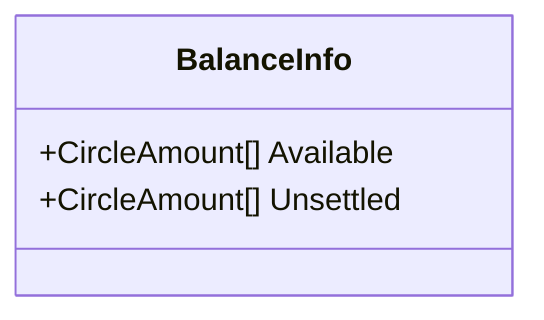

<div id="ConfigurationInfo-class-diagram"></div>

##### `ConfigurationInfo` class diagram

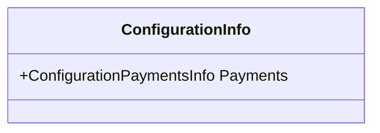

<div id="ConfigurationPaymentsInfo-class-diagram"></div>

##### `ConfigurationPaymentsInfo` class diagram

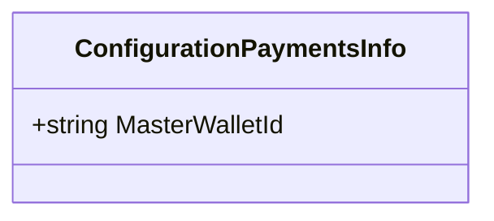

<div id="DepositAddressInfo-class-diagram"></div>

##### `DepositAddressInfo` class diagram

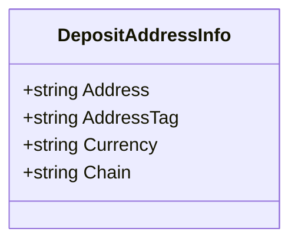

<div id="DepositDestination-class-diagram"></div>

##### `DepositDestination` class diagram

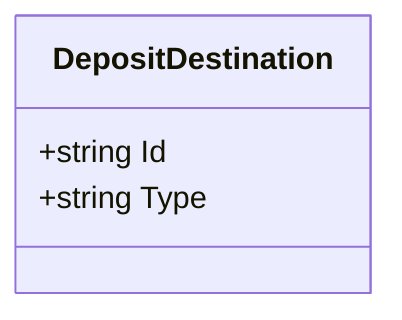

<div id="DepositInfo-class-diagram"></div>

##### `DepositInfo` class diagram

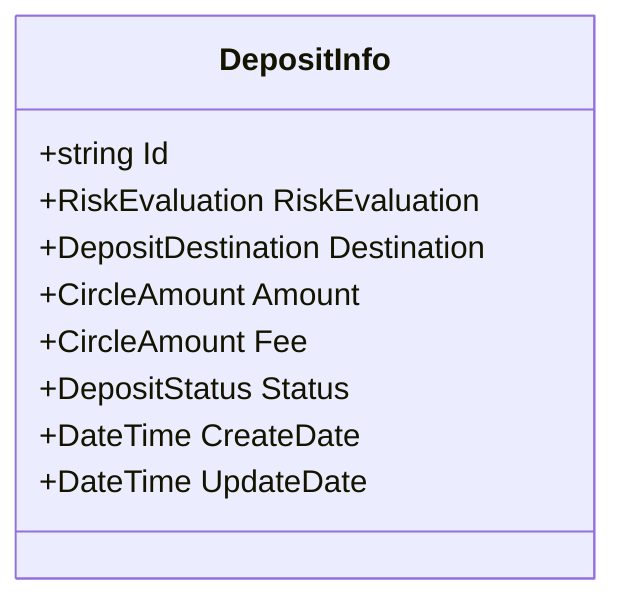

<div id="DepositStatus-class-diagram"></div>

##### `DepositStatus` class diagram

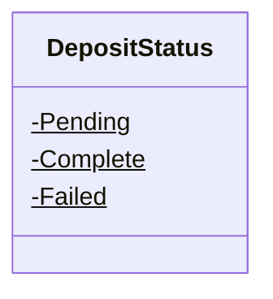

<div id="RecipientAddressInfo-class-diagram"></div>

##### `RecipientAddressInfo` class diagram

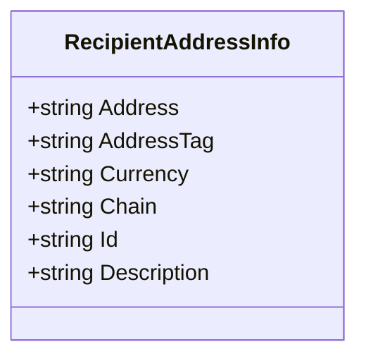

<div id="TransferDestination-class-diagram"></div>

##### `TransferDestination` class diagram

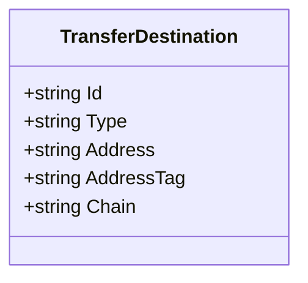

<div id="TransferInfo-class-diagram"></div>

##### `TransferInfo` class diagram

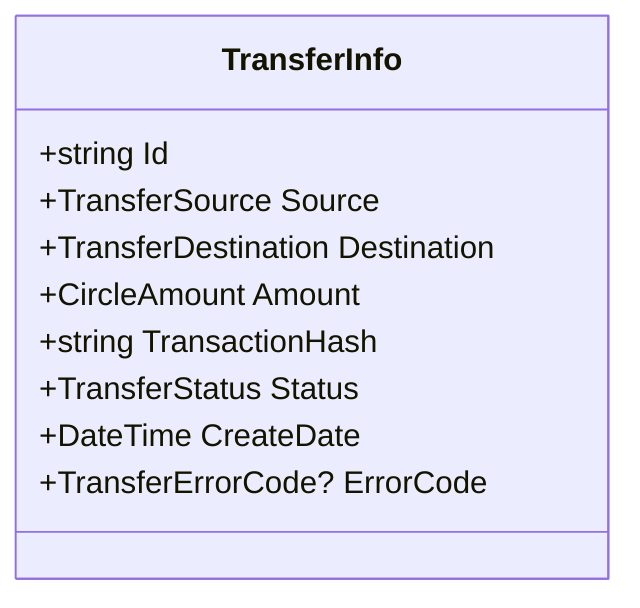

<div id="TransferSource-class-diagram"></div>

##### `TransferSource` class diagram

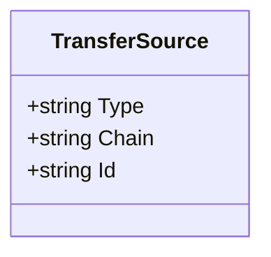

<div id="CardBillingDetails-class-diagram"></div>

##### `CardBillingDetails` class diagram

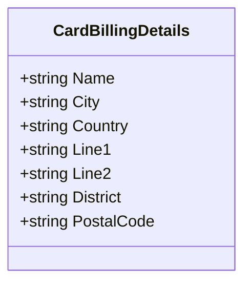

<div id="CardFundingType-class-diagram"></div>

##### `CardFundingType` class diagram

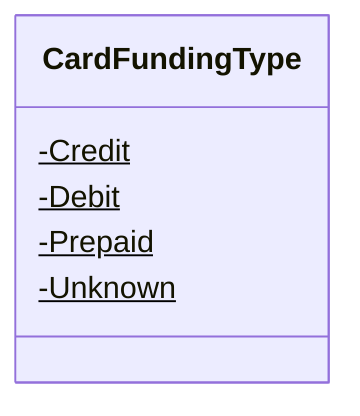

<div id="CardInfo-class-diagram"></div>

##### `CardInfo` class diagram

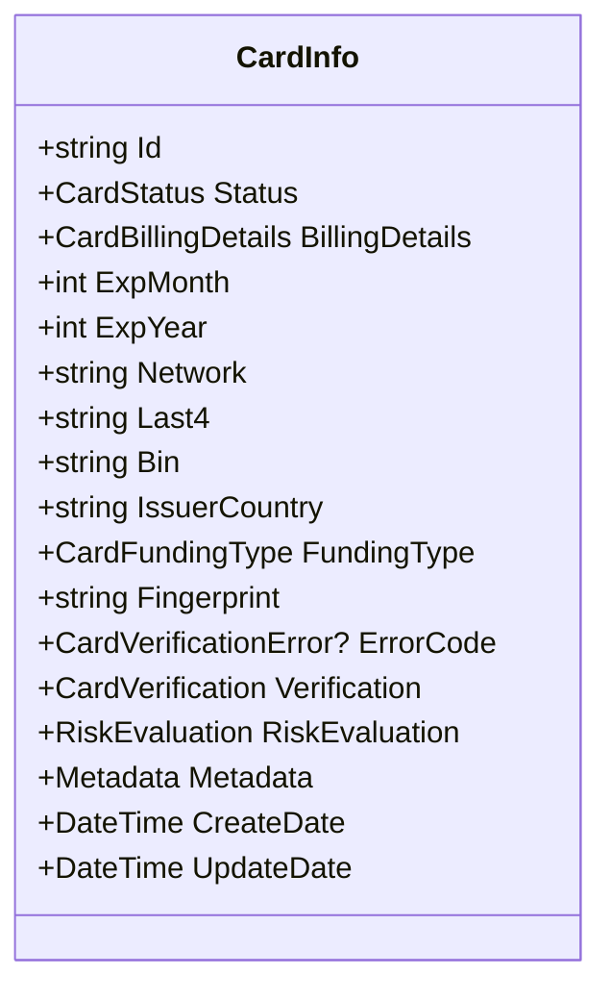

<div id="CardStatus-class-diagram"></div>

##### `CardStatus` class diagram

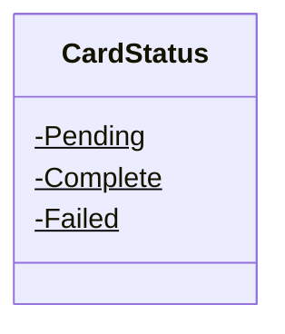

<div id="CardVerification-class-diagram"></div>

##### `CardVerification` class diagram

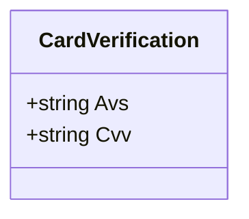

<div id="CardVerificationError-class-diagram"></div>

##### `CardVerificationError` class diagram

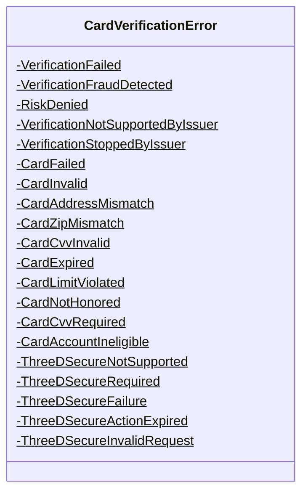

<div id="CreateCardRequest-class-diagram"></div>

##### `CreateCardRequest` class diagram

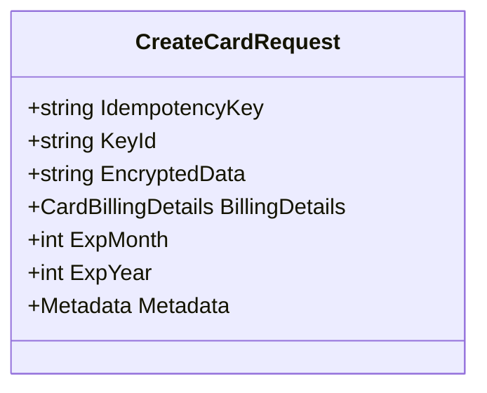

<div id="UpdateCardRequest-class-diagram"></div>

##### `UpdateCardRequest` class diagram

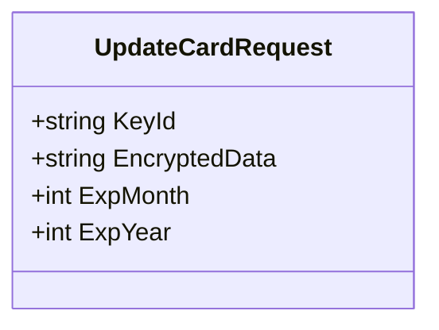

<div id="Chargeback-class-diagram"></div>

##### `Chargeback` class diagram

```mermaid
classDiagram
class Chargeback{
    +string Id
    +string PaymentId
    +string MerchantId
    +ChargebackHistory[] History
    +string ReasonCode
    +ChargeBackCategory Category
}

```

<div id="ChargeBackCategory-class-diagram"></div>

##### `ChargeBackCategory` class diagram

```mermaid
classDiagram
class ChargeBackCategory{
    -CanceledRecurringPayment$
    -CustomerDispute$
    -Fraudulent$
    -General$
    -ProcessingError$
    -NotDefined$
}

```

<div id="ChargebackHistory-class-diagram"></div>

##### `ChargebackHistory` class diagram

```mermaid
classDiagram
class ChargebackHistory{
    +string Type
    +CircleAmount ChargebackAmount
    +CircleAmount Fee
    +string Description
    +string SettlementId
    +DateTime CreateDate
}

```

<div id="CircleClient-class-diagram"></div>

##### `CircleClient` class diagram

```mermaid
classDiagram
ICircleClient <|-- CircleClient : implements
class CircleClient{
    -string MainPublicApi$
    -string TestPublicApi$
    -HttpClient _httpClient
    -DateTime _lastHttpSetupTime
    -HttpClient _lastHttpClient
    -object _gate
    +bool PrintGetApiCalls$
    +bool PrintPostApiCalls$
    +bool PrintPutApiCalls$
    +string EndpointUrl
    +SecureString AccessToken
    +bool ThrowThenErrorResponse
    +GetConfigurationInfoAsync(CancellationToken cancellationToken = null) Task<WebCallResult<ConfigurationInfo>>
    +GetBalanceAsync(CancellationToken cancellationToken = null) Task<WebCallResult<BalanceInfo>>
    +CreateBusinessTransferAsync(string idempotencyKey, string destinationAddressId, string amount, string currency, CancellationToken cancellationToken = null) Task<WebCallResult<TransferInfo>>
    +GetBusinessTransferAsync(string pageAfter, int pageSize, CancellationToken cancellationToken = null) Task<WebCallResult<TransferInfo[]>>
    +CreateBusinessDepositAddressesAsync(string idempotencyKey, string currency, string chain, CancellationToken cancellationToken = null) Task<WebCallResult<DepositAddressInfo>>
    +GetBusinessDepositAddressesAsync(CancellationToken cancellationToken = null) Task<WebCallResult<DepositAddressInfo[]>>
    +GetBusinessDepositsAsync(string pageAfter, int pageSize, CancellationToken cancellationToken = null) Task<WebCallResult<DepositInfo[]>>
    +CreateBusinessRecipientAddressAsync(string idempotencyKey, string currency, string chain, string address, string addressTag, string description, CancellationToken cancellationToken = null) Task<WebCallResult<RecipientAddressInfo>>
    +GetBusinessRecipientAddressesAsync(string pageAfter, int pageSize, CancellationToken cancellationToken = null) Task<WebCallResult<RecipientAddressInfo[]>>
    +CreateCard(string idempotencyKey, string keyId, string encryptedData, string billingName, string billingCity, string billingCountry, string billingLine1, string billingLine2, string billingDistrict, string billingPostalCode, int expMonth, int expYear, string email, string phoneNumber, string sessionId, string ipAddress, CancellationToken cancellationToken = null) WebCallResult<CardInfo>
    +CreateCardAsync(string idempotencyKey, string keyId, string encryptedData, string billingName, string billingCity, string billingCountry, string billingLine1, string billingLine2, string billingDistrict, string billingPostalCode, int expMonth, int expYear, string email, string phoneNumber, string sessionId, string ipAddress, CancellationToken cancellationToken = null) Task<WebCallResult<CardInfo>>
    +GetListOfCards(string pageBefore, string pageAfter, int pageSize, CancellationToken cancellationToken = null) WebCallResult<List<CardInfo>>
    +GetListOfCardsAsync(string pageBefore, string pageAfter, int pageSize, CancellationToken cancellationToken = null) Task<WebCallResult<List<CardInfo>>>
    +GetCard(string id, CancellationToken cancellationToken = null) WebCallResult<CardInfo>
    +GetCardAsync(string id, CancellationToken cancellationToken = null) Task<WebCallResult<CardInfo>>
    +UpdateCard(string id, string keyId, string encryptedData, int expMonth, int expYear, CancellationToken cancellationToken = null) WebCallResult<CardInfo>
    +UpdateCardAsync(string id, string keyId, string encryptedData, int expMonth, int expYear, CancellationToken cancellationToken = null) Task<WebCallResult<CardInfo>>
    +GetChargebacksAsync(string pageAfter, int pageSize, CancellationToken cancellationToken = null) Task<WebCallResult<Chargeback[]>>
    +.ctor(string accessToken, CircleNetwork network = CircleNetwork.Main) CircleClient
    +.ctor(string accessToken, string apiRootUrl) CircleClient
    +SetAccessToken(string accessToken) void
    +GetHttpClient() HttpClient
    +SetupHttpClient() void
    +ConvertToQueryString(Dictionary<string, object> nvc) string
    +GetAsync<T>(string url, CancellationToken cancellationToken = null) Task<WebCallResult<T>>
    +PostAsync<T>(string url, object obj = null, CancellationToken cancellationToken = null) Task<WebCallResult<T>>
    +PutAsync<T>(string url, object obj = null, CancellationToken cancellationToken = null) Task<WebCallResult<T>>
    +DeleteAsync<T>(string url, object obj = null, CancellationToken cancellationToken = null) Task<WebCallResult<T>>
    +EvaluateResponse<T>(HttpResponseMessage response, string content) WebCallResult<T>
    +ThrowErrorExceptionIfEnabled(HttpStatusCode code, string message) void
    +Dispose() void
    +GetConfiguration(CancellationToken cancellationToken = null) WebCallResult<Configuration>
    +GetConfigurationAsync(CancellationToken cancellationToken = null) Task<WebCallResult<Configuration>>
    +GenerateAddress(string id, string idempotencyKey, string currency, string chain, CancellationToken cancellationToken = null) WebCallResult<BlockchainAddress>
    +GenerateAddressAsync(string id, string idempotencyKey, string currency, string chain, CancellationToken cancellationToken = null) Task<WebCallResult<BlockchainAddress>>
    +GetTransfer(string id, CancellationToken cancellationToken = null) WebCallResult<PaymentInfo>
    +GetTransferAsync(string id, CancellationToken cancellationToken = null) Task<WebCallResult<PaymentInfo>>
    +CreateTransfer(string idempotencyKey, string sourceId, string sourceType, string dstType, string dstAddress, string dstAddressTag, string dstChain, string amount, string currency, CancellationToken cancellationToken = null) WebCallResult<PaymentInfo>
    +CreateTransferAsync(string idempotencyKey, string sourceId, string sourceType, string dstType, string dstAddress, string dstAddressTag, string dstChain, string amount, string currency, CancellationToken cancellationToken = null) Task<WebCallResult<PaymentInfo>>
    +CreatePayment(string idempotencyKey, string keyId, string email, string phoneNumber, string sessionId, string ipAddress, string amount, string currency, string verification, string sourceId, string sourceType, string description, string encryptedData, string verificationUrlSuccess, string verificationUrlFailure, CancellationToken cancellationToken = null) WebCallResult<PaymentInfo>
    +CreatePaymentAsync(string idempotencyKey, string keyId, string email, string phoneNumber, string sessionId, string ipAddress, string amount, string currency, string verification, string sourceId, string sourceType, string description, string encryptedData, string verificationUrlSuccess, string verificationUrlFailure, CancellationToken cancellationToken = null) Task<WebCallResult<PaymentInfo>>
    +GetPayment(string id, CancellationToken cancellationToken = null) WebCallResult<PaymentInfo>
    +GetPaymentAsync(string id, CancellationToken cancellationToken = null) Task<WebCallResult<PaymentInfo>>
    +CreatePayoutAsync(string idempotencyKey, string amount, string currency, string sourceId, string destinationId, string destinationType, string beneficiaryEmail, CancellationToken cancellationToken = null) Task<WebCallResult<PayoutInfo>>
    +GetPayout(string id, CancellationToken cancellationToken = null) WebCallResult<PayoutInfo>
    +GetPayoutAsync(string id, CancellationToken cancellationToken = null) Task<WebCallResult<PayoutInfo>>
    +GetPayoutsAsync(string pageAfter, int pageSize, CancellationToken cancellationToken = null) Task<WebCallResult<PayoutInfo[]>>
    +GetPublicKey(CancellationToken cancellationToken = null) WebCallResult<PublicKey>
    +GetPublicKeyAsync(CancellationToken cancellationToken = null) Task<WebCallResult<PublicKey>>
    +GetListOfSubscriptions(CancellationToken cancellationToken = null) WebCallResult<List<Subscription>>
    +GetListOfSubscriptionsAsync(CancellationToken cancellationToken = null) Task<WebCallResult<List<Subscription>>>
    +CreateSubscription(string endpoint, CancellationToken cancellationToken = null) WebCallResult<Subscription>
    +CreateSubscriptionAsync(string endpoint, CancellationToken cancellationToken = null) Task<WebCallResult<Subscription>>
    +RemoveSubscription(string id, CancellationToken cancellationToken = null) WebCallResult<string>
    +RemoveSubscriptionAsync(string id, CancellationToken cancellationToken = null) Task<WebCallResult<string>>
    +CreateTransferV2Async(string idempotencyKey, string amount, string currency, string sourceId, string address, string addressTag, string destinationChain, CancellationToken cancellationToken = null) Task<WebCallResult<TransferInfo>>
    +GetTransferV2Async(string id, CancellationToken cancellationToken = null) Task<WebCallResult<TransferInfo>>
    +GetTransfersV2Async(string pageAfter, int pageSize, CancellationToken cancellationToken = null) Task<WebCallResult<TransferInfo[]>>
    +CreateWalletAsync(string idempotencyKey, string description, CancellationToken cancellationToken = null) Task<WebCallResult<WalletInfo>>
    +GetWalletAsync(string id, CancellationToken cancellationToken = null) Task<WebCallResult<WalletInfo>>
    +GetWalletsAsync(string pageAfter, int pageSize, CancellationToken cancellationToken = null) Task<WebCallResult<WalletInfo[]>>
    +CreateBankAccountUsSwiftAsync(string idempotencyKey, string accountNumber, string routingNumber, BillingDetails billingDetails, BankAddress bankAddress, CancellationToken cancellationToken = null) Task<WebCallResult<BankAccountInfo>>
    +CreateBankAccountSepaAsync(string idempotencyKey, string iban, BillingDetails billingDetails, BankAddress bankAddress, CancellationToken cancellationToken = null) Task<WebCallResult<BankAccountInfo>>
    +ObtainBankWireTransferDetailsAsync(string bankAccountId, CancellationToken cancellationToken = null) Task<WebCallResult<BankWireTransferDetail>>
}

```

<div id="CircleException-class-diagram"></div>

##### `CircleException` class diagram

```mermaid
classDiagram
class CircleException{
    +HttpStatusCode Code
    +string ErrorMessage
    +.ctor(HttpStatusCode code, string errorMessage) CircleException
}

```

<div id="CircleNetwork-class-diagram"></div>

##### `CircleNetwork` class diagram

```mermaid
classDiagram
class CircleNetwork{
    -Main$
    -Test$
}

```

<div id="Extensions-class-diagram"></div>

##### `Extensions` class diagram

```mermaid
classDiagram
class Extensions{
    +ConvertValueToString(object value)$ string
    +SecureStringToString(SecureString secureString)$ string
    +StringToSecureString(string str)$ SecureString
}

```

<div id="ICircleClient-class-diagram"></div>

##### `ICircleClient` class diagram

```mermaid
classDiagram
class ICircleClient{
    +GetPublicKey(CancellationToken cancellationToken = null)* WebCallResult<PublicKey>
    +GetPublicKeyAsync(CancellationToken cancellationToken = null)* Task<WebCallResult<PublicKey>>
    +CreateCard(string idempotencyKey, string keyId, string encryptedData, string billingName, string billingCity, string billingCountry, string billingLine1, string billingLine2, string billingDistrict, string billingPostalCode, int expMonth, int expYear, string email, string phoneNumber, string sessionId, string ipAddress, CancellationToken cancellationToken = null)* WebCallResult<CardInfo>
    +CreateCardAsync(string idempotencyKey, string keyId, string encryptedData, string billingName, string billingCity, string billingCountry, string billingLine1, string billingLine2, string billingDistrict, string billingPostalCode, int expMonth, int expYear, string email, string phoneNumber, string sessionId, string ipAddress, CancellationToken cancellationToken = null)* Task<WebCallResult<CardInfo>>
    +GetListOfCards(string pageBefore = null, string pageAfter = null, int pageSize = 50, CancellationToken cancellationToken = null)* WebCallResult<List<CardInfo>>
    +GetListOfCardsAsync(string pageBefore = null, string pageAfter = null, int pageSize = 50, CancellationToken cancellationToken = null)* Task<WebCallResult<List<CardInfo>>>
    +GetCard(string id, CancellationToken cancellationToken = null)* WebCallResult<CardInfo>
    +GetCardAsync(string id, CancellationToken cancellationToken = null)* Task<WebCallResult<CardInfo>>
    +UpdateCard(string id, string keyId, string encryptedData, int expMonth, int expYear, CancellationToken cancellationToken = null)* WebCallResult<CardInfo>
    +UpdateCardAsync(string id, string keyId, string encryptedData, int expMonth, int expYear, CancellationToken cancellationToken = null)* Task<WebCallResult<CardInfo>>
    +GetListOfSubscriptions(CancellationToken cancellationToken = null)* WebCallResult<List<Subscription>>
    +GetListOfSubscriptionsAsync(CancellationToken cancellationToken = null)* Task<WebCallResult<List<Subscription>>>
    +CreateSubscription(string endpoint, CancellationToken cancellationToken = null)* WebCallResult<Subscription>
    +CreateSubscriptionAsync(string endpoint, CancellationToken cancellationToken = null)* Task<WebCallResult<Subscription>>
    +RemoveSubscription(string id, CancellationToken cancellationToken = null)* WebCallResult<string>
    +RemoveSubscriptionAsync(string id, CancellationToken cancellationToken = null)* Task<WebCallResult<string>>
    +CreatePayment(string idempotencyKey, string keyId, string email, string phoneNumber, string sessionId, string ipAddress, string amount, string currency, string verification, string sourceId, string sourceType, string description, string encryptedData, string verificationUrlSuccess, string verificationUrlFailure, CancellationToken cancellationToken = null)* WebCallResult<PaymentInfo>
    +CreatePaymentAsync(string idempotencyKey, string keyId, string email, string phoneNumber, string sessionId, string ipAddress, string amount, string currency, string verification, string sourceId, string sourceType, string description, string encryptedData, string verificationUrlSuccess, string verificationUrlFailure, CancellationToken cancellationToken = null)* Task<WebCallResult<PaymentInfo>>
    +GetPayment(string id, CancellationToken cancellationToken = null)* WebCallResult<PaymentInfo>
    +GetPaymentAsync(string id, CancellationToken cancellationToken = null)* Task<WebCallResult<PaymentInfo>>
    +CreateBankAccountSepaAsync(string idempotencyKey, string iban, BillingDetails billingDetails, BankAddress bankAddress, CancellationToken cancellationToken = null)* Task<WebCallResult<BankAccountInfo>>
    +CreateBankAccountUsSwiftAsync(string idempotencyKey, string accountNumber, string routingNumber, BillingDetails billingDetails, BankAddress bankAddress, CancellationToken cancellationToken = null)* Task<WebCallResult<BankAccountInfo>>
    +ObtainBankWireTransferDetailsAsync(string bankAccountId, CancellationToken cancellationToken = null)* Task<WebCallResult<BankWireTransferDetail>>
    +CreatePayoutAsync(string idempotencyKey, string amount, string currency, string sourceId, string destinationId, string destinationType, string email, CancellationToken cancellationToken = null)* Task<WebCallResult<PayoutInfo>>
    +GetPayoutAsync(string id, CancellationToken cancellationToken = null)* Task<WebCallResult<PayoutInfo>>
    +GetPayoutsAsync(string pageAfter, int pageSize, CancellationToken cancellationToken = null)* Task<WebCallResult<PayoutInfo[]>>
    +CreateWalletAsync(string idempotencyKey, string description, CancellationToken cancellationToken = null)* Task<WebCallResult<WalletInfo>>
    +GetWalletAsync(string id, CancellationToken cancellationToken = null)* Task<WebCallResult<WalletInfo>>
    +GetWalletsAsync(string pageAfter, int pageSize, CancellationToken cancellationToken = null)* Task<WebCallResult<WalletInfo[]>>
    +CreateTransferV2Async(string idempotencyKey, string amount, string currency, string sourceId, string address, string addressTag, string destinationChain, CancellationToken cancellationToken = null)* Task<WebCallResult<TransferInfo>>
    +GetTransferV2Async(string id, CancellationToken cancellationToken = null)* Task<WebCallResult<TransferInfo>>
    +GetTransfersV2Async(string pageAfter, int pageSize, CancellationToken cancellationToken = null)* Task<WebCallResult<TransferInfo[]>>
    +GetConfigurationInfoAsync(CancellationToken cancellationToken = null)* Task<WebCallResult<ConfigurationInfo>>
    +GetBalanceAsync(CancellationToken cancellationToken = null)* Task<WebCallResult<BalanceInfo>>
    +CreateBusinessTransferAsync(string idempotencyKey, string destinationAddressId, string amount, string currency, CancellationToken cancellationToken = null)* Task<WebCallResult<TransferInfo>>
    +GetBusinessTransferAsync(string pageAfter, int pageSize, CancellationToken cancellationToken = null)* Task<WebCallResult<TransferInfo[]>>
    +CreateBusinessDepositAddressesAsync(string idempotencyKey, string currency, string chain, CancellationToken cancellationToken = null)* Task<WebCallResult<DepositAddressInfo>>
    +GetBusinessDepositAddressesAsync(CancellationToken cancellationToken = null)* Task<WebCallResult<DepositAddressInfo[]>>
    +GetBusinessDepositsAsync(string pageAfter, int pageSize, CancellationToken cancellationToken = null)* Task<WebCallResult<DepositInfo[]>>
    +CreateBusinessRecipientAddressAsync(string idempotencyKey, string currency, string chain, string address, string addressTag, string description, CancellationToken cancellationToken = null)* Task<WebCallResult<RecipientAddressInfo>>
    +GetBusinessRecipientAddressesAsync(string pageAfter, int pageSize, CancellationToken cancellationToken = null)* Task<WebCallResult<RecipientAddressInfo[]>>
    +GetChargebacksAsync(string pageAfter, int pageSize, CancellationToken cancellationToken = null)* Task<WebCallResult<Chargeback[]>>
    +GetConfiguration(CancellationToken cancellationToken = null)* WebCallResult<Configuration>
    +GetConfigurationAsync(CancellationToken cancellationToken = null)* Task<WebCallResult<Configuration>>
    +GenerateAddress(string id, string idempotencyKey, string currency, string chain, CancellationToken cancellationToken = null)* WebCallResult<BlockchainAddress>
    +GenerateAddressAsync(string id, string idempotencyKey, string currency, string chain, CancellationToken cancellationToken = null)* Task<WebCallResult<BlockchainAddress>>
    +GetTransfer(string id, CancellationToken cancellationToken = null)* WebCallResult<PaymentInfo>
    +GetTransferAsync(string id, CancellationToken cancellationToken = null)* Task<WebCallResult<PaymentInfo>>
    +CreateTransfer(string idempotencyKey, string sourceId, string sourceType, string dstType, string dstAddress, string dstAddressTag, string dstChain, string amount, string currency, CancellationToken cancellationToken = null)* WebCallResult<PaymentInfo>
    +CreateTransferAsync(string idempotencyKey, string sourceId, string sourceType, string dstType, string dstAddress, string dstAddressTag, string dstChain, string amount, string currency, CancellationToken cancellationToken = null)* Task<WebCallResult<PaymentInfo>>
}

```

<div id="CardFundingTypeConverter-class-diagram"></div>

##### `CardFundingTypeConverter` class diagram

```mermaid
classDiagram
class CardFundingTypeConverter{
    +List<KeyValuePair<CardFundingType, string>> Mapping
    +.ctor() CardFundingTypeConverter
    +.ctor(bool quotes) CardFundingTypeConverter
}

```

<div id="CardStatusConverter-class-diagram"></div>

##### `CardStatusConverter` class diagram

```mermaid
classDiagram
class CardStatusConverter{
    +List<KeyValuePair<CardStatus, string>> Mapping
    +.ctor() CardStatusConverter
    +.ctor(bool quotes) CardStatusConverter
}

```

<div id="CardVerificationErrorConverter-class-diagram"></div>

##### `CardVerificationErrorConverter` class diagram

```mermaid
classDiagram
class CardVerificationErrorConverter{
    +List<KeyValuePair<CardVerificationError, string>> Mapping
    +.ctor() CardVerificationErrorConverter
    +.ctor(bool quotes) CardVerificationErrorConverter
}

```

<div id="ChargeBackCategoryConverter-class-diagram"></div>

##### `ChargeBackCategoryConverter` class diagram

```mermaid
classDiagram
class ChargeBackCategoryConverter{
    +List<KeyValuePair<ChargeBackCategory, string>> Mapping
    +.ctor() ChargeBackCategoryConverter
    +.ctor(bool quotes) ChargeBackCategoryConverter
}

```

<div id="DepositStatusConverter-class-diagram"></div>

##### `DepositStatusConverter` class diagram

```mermaid
classDiagram
class DepositStatusConverter{
    +List<KeyValuePair<DepositStatus, string>> Mapping
    +.ctor() DepositStatusConverter
    +.ctor(bool quotes) DepositStatusConverter
}

```

<div id="IdentityTypeConverter-class-diagram"></div>

##### `IdentityTypeConverter` class diagram

```mermaid
classDiagram
class IdentityTypeConverter{
    +List<KeyValuePair<IdentityType, string>> Mapping
    +.ctor() IdentityTypeConverter
    +.ctor(bool quotes) IdentityTypeConverter
}

```

<div id="PaymentErrorCodeConverter-class-diagram"></div>

##### `PaymentErrorCodeConverter` class diagram

```mermaid
classDiagram
class PaymentErrorCodeConverter{
    +List<KeyValuePair<PaymentErrorCode, string>> Mapping
    +.ctor() PaymentErrorCodeConverter
    +.ctor(bool quotes) PaymentErrorCodeConverter
}

```

<div id="PaymentStatusConverter-class-diagram"></div>

##### `PaymentStatusConverter` class diagram

```mermaid
classDiagram
class PaymentStatusConverter{
    +List<KeyValuePair<PaymentStatus, string>> Mapping
    +.ctor() PaymentStatusConverter
    +.ctor(bool quotes) PaymentStatusConverter
}

```

<div id="PayoutErrorCodeConverter-class-diagram"></div>

##### `PayoutErrorCodeConverter` class diagram

```mermaid
classDiagram
class PayoutErrorCodeConverter{
    +List<KeyValuePair<PayoutErrorCode, string>> Mapping
    +.ctor() PayoutErrorCodeConverter
    +.ctor(bool quotes) PayoutErrorCodeConverter
}

```

<div id="PayoutStatusConverter-class-diagram"></div>

##### `PayoutStatusConverter` class diagram

```mermaid
classDiagram
class PayoutStatusConverter{
    +List<KeyValuePair<PayoutStatus, string>> Mapping
    +.ctor() PayoutStatusConverter
    +.ctor(bool quotes) PayoutStatusConverter
}

```

<div id="RiskEvaluationTypeConverter-class-diagram"></div>

##### `RiskEvaluationTypeConverter` class diagram

```mermaid
classDiagram
class RiskEvaluationTypeConverter{
    +List<KeyValuePair<RiskEvaluationType, string>> Mapping
    +.ctor() RiskEvaluationTypeConverter
    +.ctor(bool quotes) RiskEvaluationTypeConverter
}

```

<div id="TransferErrorCodeConverter-class-diagram"></div>

##### `TransferErrorCodeConverter` class diagram

```mermaid
classDiagram
class TransferErrorCodeConverter{
    +List<KeyValuePair<TransferErrorCode, string>> Mapping
    +.ctor() TransferErrorCodeConverter
    +.ctor(bool quotes) TransferErrorCodeConverter
}

```

<div id="TransferStatusConverter-class-diagram"></div>

##### `TransferStatusConverter` class diagram

```mermaid
classDiagram
class TransferStatusConverter{
    +List<KeyValuePair<TransferStatus, string>> Mapping
    +.ctor() TransferStatusConverter
    +.ctor(bool quotes) TransferStatusConverter
}

```

<div id="CallResult&lt;T&gt;-class-diagram"></div>

##### `CallResult<T>` class diagram

```mermaid
classDiagram
class CallResult<T>{
    +T Data
    +int Code
    +string Message
    +bool Success
    +esult(T data, int code, string message) void
}

```

<div id="Metadata-class-diagram"></div>

##### `Metadata` class diagram

```mermaid
classDiagram
class Metadata{
    +string Email
    +string PhoneNumber
    +string SessionId
    +string IpAddress
}

```

<div id="PublicKey-class-diagram"></div>

##### `PublicKey` class diagram

```mermaid
classDiagram
class PublicKey{
    +string KeyId
    +string RsaPublicKey
}

```

<div id="RiskEvaluation-class-diagram"></div>

##### `RiskEvaluation` class diagram

```mermaid
classDiagram
class RiskEvaluation{
    +RiskEvaluationType Decision
    +string Reason
}

```

<div id="RiskEvaluationType-class-diagram"></div>

##### `RiskEvaluationType` class diagram

```mermaid
classDiagram
class RiskEvaluationType{
    -Approved$
    -Denied$
    -Review$
}

```

<div id="WebCallResult&lt;T&gt;-class-diagram"></div>

##### `WebCallResult<T>` class diagram

```mermaid
classDiagram
class WebCallResult<T>{
    +HttpStatusCode? ResponseStatusCode
    +Dictionary<string, string> ResponseHeaders
    +llResult(HttpResponseMessage response, T data, HttpStatusCode code, string message) void
    +llResult(HttpResponseMessage response, CallResult<T> result) void
    +CreateErrorResult(HttpStatusCode code, string message)$ WebCallResult<T>
    +CreateErrorResult(HttpResponseMessage response, HttpStatusCode code, string message)$ WebCallResult<T>
}

```

<div id="BlockchainAddress-class-diagram"></div>

##### `BlockchainAddress` class diagram

```mermaid
classDiagram
class BlockchainAddress{
    +string Address
    +string AddressTag
    +string Currency
    +string Chain
}

```

<div id="Configuration-class-diagram"></div>

##### `Configuration` class diagram

```mermaid
classDiagram
class Configuration{
    +PaymentsConfiguration PaymentsConfiguration
}

```

<div id="PaymentsConfiguration-class-diagram"></div>

##### `PaymentsConfiguration` class diagram

```mermaid
classDiagram
class PaymentsConfiguration{
    +string MasterWalletId
}

```

<div id="CreateBusinessRecipientAddressRequest-class-diagram"></div>

##### `CreateBusinessRecipientAddressRequest` class diagram

```mermaid
classDiagram
class CreateBusinessRecipientAddressRequest{
    +string IdempotencyKey
    +string Currency
    +string Chain
    +string Address
    +string AddressTag
    +string Description
}

```

<div id="CreateDepositAddressRequest-class-diagram"></div>

##### `CreateDepositAddressRequest` class diagram

```mermaid
classDiagram
class CreateDepositAddressRequest{
    +string IdempotencyKey
    +string Currency
    +string Chain
}

```

<div id="CreatePaymentRequest-class-diagram"></div>

##### `CreatePaymentRequest` class diagram

```mermaid
classDiagram
class CreatePaymentRequest{
    +string IdempotencyKey
    +string KeyId
    +Metadata Metadata
    +CircleAmount Amount
    +bool AutoCapture
    +string Verification
    +string VerificationSuccessUrl
    +string VerificationFailureUrl
    +PaymentSource Source
    +string Description
    +string EncryptedData
}

```

<div id="CreateTransferDestination-class-diagram"></div>

##### `CreateTransferDestination` class diagram

```mermaid
classDiagram
class CreateTransferDestination{
    +string Type
    +string AddressId
}

```

<div id="CreateTransferRequest-class-diagram"></div>

##### `CreateTransferRequest` class diagram

```mermaid
classDiagram
class CreateTransferRequest{
    +string IdempotencyKey
    +CircleAmount Amount
    +CreateTransferDestination Destination
}

```

<div id="PaymentDestination-class-diagram"></div>

##### `PaymentDestination` class diagram

```mermaid
classDiagram
class PaymentDestination{
    +string Type
    +string Address
    +string AddressTag
    +string Chain
}

```

<div id="PaymentErrorCode-class-diagram"></div>

##### `PaymentErrorCode` class diagram

```mermaid
classDiagram
class PaymentErrorCode{
    -PaymentFailed$
    -PaymentFraudDetected$
    -PaymentDenied$
    -PaymentNotSupportedByIssuer$
    -PaymentNotFunded$
    -PaymentUnprocessable$
    -PaymentStoppedByIssuer$
    -PaymentCanceled$
    -PaymentReturned$
    -PaymentFailedBalanceCheck$
    -CardFailed$
    -CardInvalid$
    -CardAddressMismatch$
    -CardZipMismatch$
    -CardCvvInvalid$
    -CardExpired$
    -CardLimitViolated$
    -CardNotHonored$
    -CardCvvRequired$
    -CardAccountIneligible$
    -UnauthorizedTransaction$
    -BankAccountIneligible$
    -BankTransactionError$
    -InvalidAccountNumber$
    -InvalidWireRtn$
    -InvalidAchRtn$
    -RefIdInvalid$
    -AccountNameMismatch$
    -AccountNumberMismatch$
    -AccountIneligible$
    -WalletAddressMismatch$
    -CustomerNameMismatch$
    -InstitutionNameMismatch$
    -VerificationFailed$
    -VerificationFraudDetected$
    -VerificationNotSupportedByIssuer$
    -VerificationStoppedByIssuer$
    -ThreeDSecureNotSupported$
    -ThreeDSecureRequired$
    -ThreeDSecureFailure$
    -ThreeDSecureActionExpired$
    -ThreeDSecureInvalidRequest$
    -CardRestricted$
}

```

<div id="PaymentInfo-class-diagram"></div>

##### `PaymentInfo` class diagram

```mermaid
classDiagram
class PaymentInfo{
    +string Id
    +string Type
    +string MerchantId
    +string MerchantWalletId
    +CircleAmount Amount
    +PaymentSource Source
    +string Description
    +PaymentStatus Status
    +bool Captured
    +CircleAmount CaptureAmount
    +string CaptureDate
    +CircleAmount Fees
    +string TrackingRef
    +PaymentErrorCode? ErrorCode
    +Metadata Metadata
    +RiskEvaluation RiskEvaluation
    +string CreateDate
    +string UpdateDate
    +string TransactionHash
    +PaymentDestination Destination
    +RequiredAction RequiredAction
}

```

<div id="PaymentSource-class-diagram"></div>

##### `PaymentSource` class diagram

```mermaid
classDiagram
class PaymentSource{
    +string Id
    +string Type
    +string Chain
}

```

<div id="PaymentStatus-class-diagram"></div>

##### `PaymentStatus` class diagram

```mermaid
classDiagram
class PaymentStatus{
    -Pending$
    -Confirmed$
    -Complete$
    -Paid$
    -Failed$
    -ActionRequired$
}

```

<div id="RequiredAction-class-diagram"></div>

##### `RequiredAction` class diagram

```mermaid
classDiagram
class RequiredAction{
    +string Type
    +string RedirectUrl
}

```

<div id="CircleAmount-class-diagram"></div>

##### `CircleAmount` class diagram

```mermaid
classDiagram
class CircleAmount{
    +string Amount
    +string Currency
}

```

<div id="CreatePayoutRequest-class-diagram"></div>

##### `CreatePayoutRequest` class diagram

```mermaid
classDiagram
class CreatePayoutRequest{
    +string IdempotencyKey
    +PayoutMetadata Metadata
    +CircleAmount Amount
    +PayoutSource Source
    +PayoutDestination Destination
}

```

<div id="PayoutAdjustments-class-diagram"></div>

##### `PayoutAdjustments` class diagram

```mermaid
classDiagram
class PayoutAdjustments{
    +CircleAmount FxCredit
    +CircleAmount FxDebit
}

```

<div id="PayoutDestination-class-diagram"></div>

##### `PayoutDestination` class diagram

```mermaid
classDiagram
class PayoutDestination{
    +string Type
    +string Id
}

```

<div id="PayoutErrorCode-class-diagram"></div>

##### `PayoutErrorCode` class diagram

```mermaid
classDiagram
class PayoutErrorCode{
    -InsufficientFunds$
    -TransactionDenied$
    -TransactionFailed$
    -TransactionReturned$
    -BankTransactionError$
    -FiatAccountLimitExceeded$
    -InvalidBankAccountNumber$
    -InvalidAchRtn$
    -InvalidWireRtn$
    -VendorInactive$
}

```

<div id="PayoutInfo-class-diagram"></div>

##### `PayoutInfo` class diagram

```mermaid
classDiagram
class PayoutInfo{
    +string Id
    +string SourceWalletId
    +DateTime CreateDate
    +DateTime UpdateDate
    +PayoutDestination Destination
    +CircleAmount Amount
    +PayoutStatus Status
    +string TrackingRef
    +PayoutErrorCode? Error
    +RiskEvaluation RiskEvaluation
    +PayoutAdjustments Adjustments
    +CircleAmount Fees
    +string ExternalRef
}

```

<div id="PayoutMetadata-class-diagram"></div>

##### `PayoutMetadata` class diagram

```mermaid
classDiagram
class PayoutMetadata{
    +string BeneficiaryEmail
}

```

<div id="PayoutSource-class-diagram"></div>

##### `PayoutSource` class diagram

```mermaid
classDiagram
class PayoutSource{
    +string Id
    +string Type
}

```

<div id="PayoutStatus-class-diagram"></div>

##### `PayoutStatus` class diagram

```mermaid
classDiagram
class PayoutStatus{
    -Pending$
    -Complete$
    -Failed$
}

```

<div id="Subscription-class-diagram"></div>

##### `Subscription` class diagram

```mermaid
classDiagram
class Subscription{
    +string Id
    +string Endpoint
    +SubscriptionDetails[] Details
}

```

<div id="SubscriptionDetails-class-diagram"></div>

##### `SubscriptionDetails` class diagram

```mermaid
classDiagram
class SubscriptionDetails{
    +string Url
    +string Status
}

```

<div id="Address-class-diagram"></div>

##### `Address` class diagram

```mermaid
classDiagram
class Address{
    +string Line1
    +string Line2
    +string City
    +string District
    +string Country
    +string PostalCode
}

```

<div id="CreateTransferRequest-class-diagram"></div>

##### `CreateTransferRequest` class diagram

```mermaid
classDiagram
class CreateTransferRequest{
    +string IdempotencyKey
    +TransferSource Source
    +TransferDestination Destination
    +CircleAmount Amount
}

```

<div id="IdentityType-class-diagram"></div>

##### `IdentityType` class diagram

```mermaid
classDiagram
class IdentityType{
    -Individual$
    -Business$
}

```

<div id="TransferDestination-class-diagram"></div>

##### `TransferDestination` class diagram

```mermaid
classDiagram
class TransferDestination{
    +string Id
    +string Type
    +string Address
    +string AddressTag
    +string Chain
}

```

<div id="TransferErrorCode-class-diagram"></div>

##### `TransferErrorCode` class diagram

```mermaid
classDiagram
class TransferErrorCode{
    -InsufficientFunds$
    -BlockchainError$
    -TransferDenied$
    -TransferFailed$
}

```

<div id="TransferIdentity-class-diagram"></div>

##### `TransferIdentity` class diagram

```mermaid
classDiagram
class TransferIdentity{
    +IdentityType Type
    +string Name
    +Address[] Addresses
}

```

<div id="TransferInfo-class-diagram"></div>

##### `TransferInfo` class diagram

```mermaid
classDiagram
class TransferInfo{
    +string Id
    +TransferSource Source
    +TransferDestination Destination
    +CircleAmount Amount
    +string TransactionHash
    +TransferStatus Status
    +DateTime CreateDate
    +TransferErrorCode? errorCode
}

```

<div id="TransferSource-class-diagram"></div>

##### `TransferSource` class diagram

```mermaid
classDiagram
class TransferSource{
    +TransferIdentity[] Identities
    +string Type
    +string Chain
    +string Id
}

```

<div id="TransferStatus-class-diagram"></div>

##### `TransferStatus` class diagram

```mermaid
classDiagram
class TransferStatus{
    -Pending$
    -Complete$
    -Failed$
}

```

<div id="CreateWalletRequest-class-diagram"></div>

##### `CreateWalletRequest` class diagram

```mermaid
classDiagram
class CreateWalletRequest{
    +string IdempotencyKey
    +string Description
}

```

<div id="WalletInfo-class-diagram"></div>

##### `WalletInfo` class diagram

```mermaid
classDiagram
class WalletInfo{
    +string WalletId
    +string EntityId
    +string Type
    +CircleAmount[] Balances
}

```

<div id="BankAccountInfo-class-diagram"></div>

##### `BankAccountInfo` class diagram

```mermaid
classDiagram
class BankAccountInfo{
    +string Id
    +BankAccountStatus Status
    +string Description
    +string TrackingRef
    +string Fingerprint
    +BillingDetails BillingDetails
    +BankAddress BankAddress
    +DateTimeOffset CreateDate
    +DateTimeOffset UpdateDate
}

```

<div id="BankAccountStatus-class-diagram"></div>

##### `BankAccountStatus` class diagram

```mermaid
classDiagram
class BankAccountStatus{
    -Pending$
    -Complete$
    -Failed$
}

```

<div id="BankAddress-class-diagram"></div>

##### `BankAddress` class diagram

```mermaid
classDiagram
class BankAddress{
    +string BankName
    +string City
    +string Country
    +string Line1
    +string Line2
    +string District
}

```

<div id="BankWireTransferDetail-class-diagram"></div>

##### `BankWireTransferDetail` class diagram

```mermaid
classDiagram
class BankWireTransferDetail{
    +string TrackingRef
    +BankWireTransferDetailBeneficiary Beneficiary
    +BankWireTransferDetailBeneficiaryBank BeneficiaryBank
}

```

<div id="BankWireTransferDetailBeneficiary-class-diagram"></div>

##### `BankWireTransferDetailBeneficiary` class diagram

```mermaid
classDiagram
class BankWireTransferDetailBeneficiary{
    +string Name
    +string Address1
    +string Address2
}

```

<div id="BankWireTransferDetailBeneficiaryBank-class-diagram"></div>

##### `BankWireTransferDetailBeneficiaryBank` class diagram

```mermaid
classDiagram
class BankWireTransferDetailBeneficiaryBank{
    +string Name
    +string SwiftCode
    +string RoutingNumber
    +string AccountNumber
    +string Address
    +string City
    +string PostalCode
    +string Country
}

```

<div id="BillingDetails-class-diagram"></div>

##### `BillingDetails` class diagram

```mermaid
classDiagram
class BillingDetails{
    +string Name
    +string City
    +string Country
    +string Line1
    +string Line2
    +string District
    +string PostalCode
}

```

<div id="CreateBankAccountSepa-class-diagram"></div>

##### `CreateBankAccountSepa` class diagram

```mermaid
classDiagram
class CreateBankAccountSepa{
    +string IdempotencyKey
    +string Iban
    +BillingDetails BillingDetails
    +BankAddress BankAddress
}

```

<div id="CreateBankAccountUsSwift-class-diagram"></div>

##### `CreateBankAccountUsSwift` class diagram

```mermaid
classDiagram
class CreateBankAccountUsSwift{
    +string IdempotencyKey
    +string AccountNumber
    +string RoutingNumber
    +BillingDetails BillingDetails
    +BankAddress BankAddress
}

```

<div id="Program-class-diagram"></div>

##### `Program` class diagram

```mermaid
classDiagram
class Program{
    -string _accessToken$
    -ICircleClient _client$
    +Main(string[] args)$ Task
    +TestPublicKey()$ Task
    +TestCards()$ Task
    +TestBankAccounts()$ Task
    +TestPayouts()$ Task
}

```

*This file is maintained by a bot.*

<!-- markdownlint-restore -->
